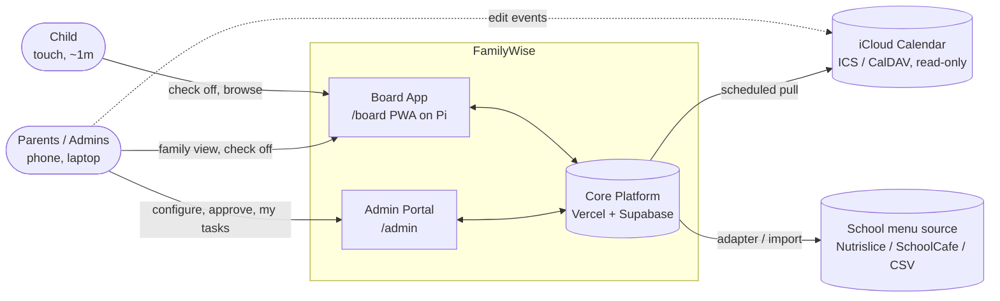
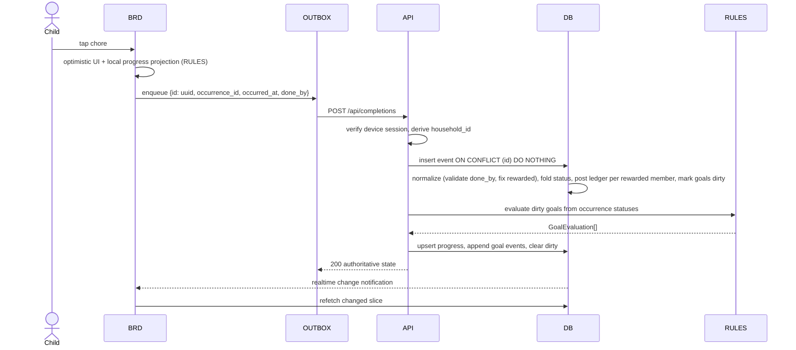
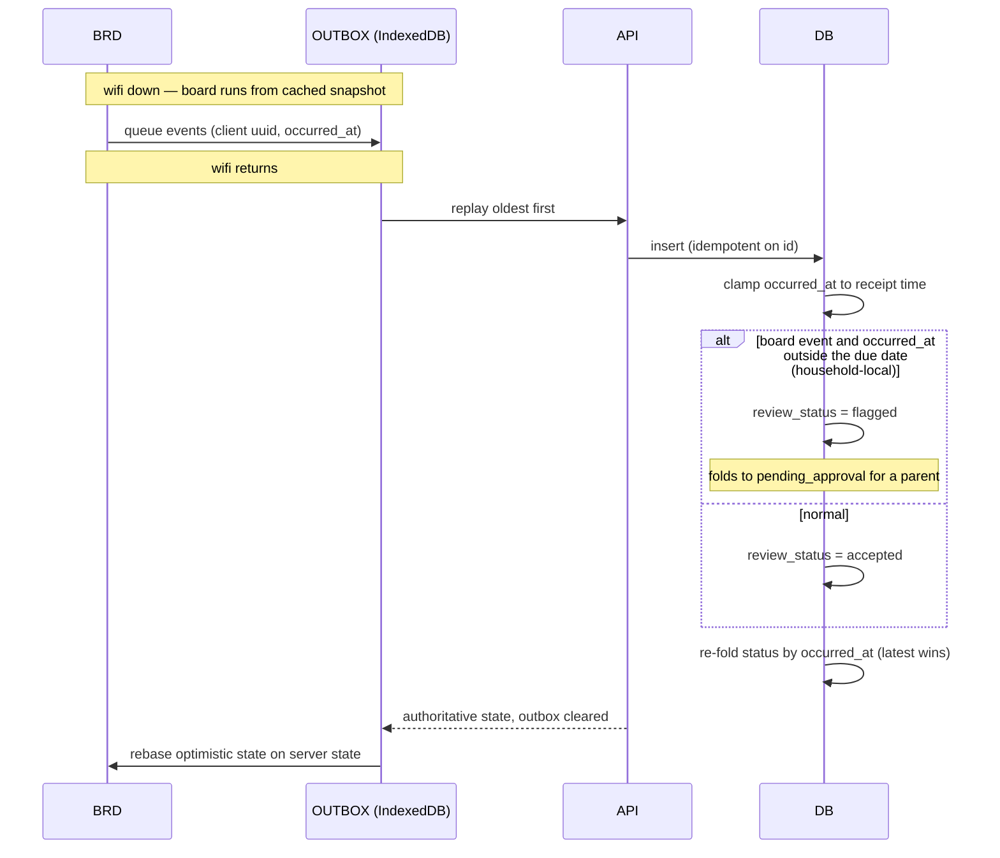
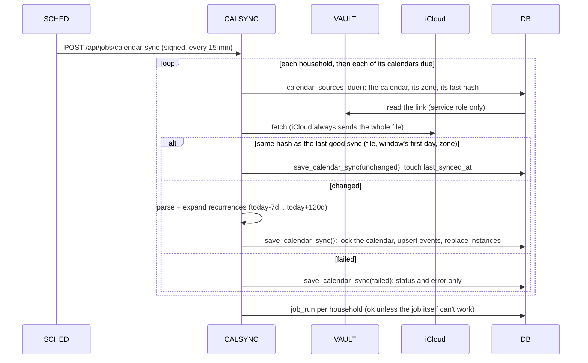
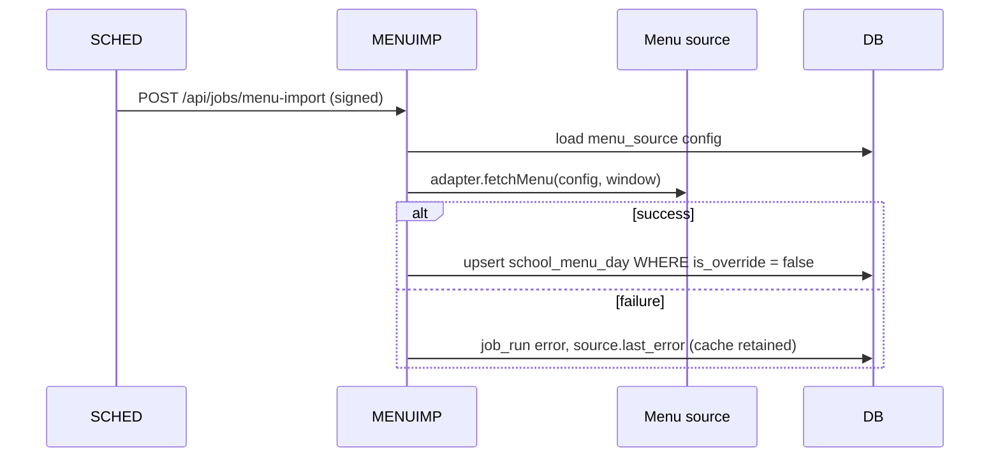
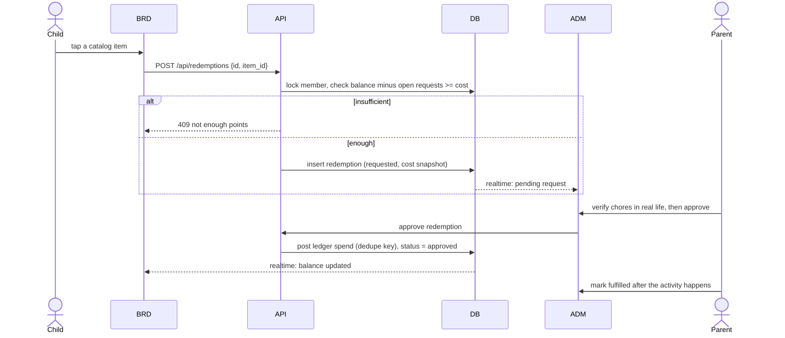
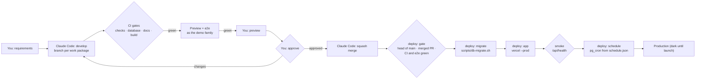

# 01 — Technical Architecture

> Version 0.8 · Status: build baseline · Maintained by Claude Code
> v0.8.35: calendar sync as built (WP-22, D-63): one call every 15 minutes syncs each household's calendars due; saving a link syncs it at once; a broken link is the calendar's own state, not a failing job (§5.4, §5.6, §6.4).
> v0.8.34: e2e reliability: each spec retires the board it paired when it ends, so no board outlives its spec (§9.5).
> v0.8.33: production's jobs leave the demo family alone (`household.is_demo`, D-62, §5.6, §9.5).
> v0.8.32: a parent links their own sign-in to themselves from Reminders, My tasks or their page on Members (`link_my_member()`, D-61, §6.2).
> v0.8.31: goal progress on the board is the server's while it is connected; projecting it offline is WP-44, a fallback only (D-60, §7).
> v0.8.30: the board's shop, requests and goals (WP-20, D-59): a child asks for a reward from their shop and calls a waiting one off; what they can spend, their requests, goal meters, nudges and a once-only celebration (`POST /api/goals/celebrated`); the shop, requests and goals in Realtime (§5.7, §7).
> v0.8.29: reminders as built (WP-40, D-58): the `reminders` job plans and claims in the database and sends by web push; the Reminders page, the bell in My tasks and an item's lead time; the vapid-keys workflow (§5.6, §5.9, §9.8).
> v0.8.28: bonus rules and the wishlist (WP-30, D-57): day close applies a parent's bonus rules to the stored history and posts each bonus once; `POST /api/wishes` for the board; the board's wish card (§5.6, §5.7, §5.8, §7).
> v0.8.27: goals (WP-19, D-56): the progress pipeline as built: the rules engine evaluates goals in `progress_reconcile` (every 5 minutes, minutes 1, 6, 11 …), right after a check-off where the job's key is present, and on the Goals page before it reads; each status change is applied once (§5.2, §5.6).
> v0.8.26: streak history and insights (WP-17, D-55): day close stores each member's days and runs from the rules engine, the Insights page, and the board's streak flame (§5.8, §7).
> v0.8.25: the board through an outage (WP-13, D-54): its outbox, last snapshot and check-offs in IndexedDB; the service worker keeps its page and build files; offline and stale lines; provisional points (§5.3, §7).
> v0.8.24: the rewards shop (WP-18, D-53): `POST /api/redemptions` and `/api/redemptions/cancel` for the board; a parent decides in the admin app; photos in a private Storage bucket per household (§5.7).
> v0.8.23: a parent's day (WP-12, D-52): the admin app records a parent's completions, unchecks, skips, approvals and rejections through `record_completions()`, with event ids from the form's request id; a batch is put back by `undo_uncheck_batch()` (§5.2).
> v0.8.22: the rules engine as built (WP-15, D-51): `evaluateGoal` and `evaluateHistory` in `packages/rules-engine`, pure and property-tested (§4, `02` §5).
> v0.8.21: the board's Today (WP-11, D-50): the board checks items off through an in-memory outbox and shows them at once; the snapshot carries today's items and the undo window, and `chore_occurrence` and `chore` are in Realtime (§5.2, §7).
> v0.8.20: the points ledger (WP-16, D-49): earns and reversals by trigger, a parent's adjustments, each member's points on the board's snapshot and in Realtime, and the status check covers points too (§5.6, §7).
> v0.8.19: everyone does their own (WP-43, D-47): an item with several people is planned one occurrence per person, or one shared (§3, §5.6).
> v0.8.18: the repository is public (D-48): what a public run page or artifact may hold, fork previews, and e2e on this repository's own commits only (§9.5, §9.8, §9.10).
> v0.8.17: completion events (WP-10, D-46): `POST /api/completions` records a batch as the caller, each event answered on its own; the `day_close` and `status_check` jobs (§5.2, §5.6).
> v0.8.16: occurrences (WP-09, D-45): planned in the database two weeks ahead; edits re-plan at once by trigger, and the hourly `occurrence_gen` job fills the window (§3, §5.6). Vercel no longer skips previews of commits that change no app code (§9.5).
> v0.8.15: school years (WP-21, D-44): day types worked out in the database, each member's school year with the default as fallback (§6.3).
> v0.8.14: the family list (WP-08, D-43): private items in RLS as built, and only an item's creator changes who sees it (§6.3). The migration runner's additive check ignores function bodies (§9.5).
> v0.8.13: WP-42 System Health (D-42): errors kept per household, usage read daily by the usage workflow (§4, §9.8, §9.10).
> v0.8.12: SPIKE-02 (ICS part): what iCloud publishes and how the sync reads it (§5.4).
> v0.8.11: Supabase's own sign-up is off (Y-9 done, §5.10).
> v0.8.10: WP-06 board shell (D-41): `board_snapshot` is the board's one read; the board keeps it live itself (notify, then read the snapshot from the browser), catches up on reconnect, and follows the household's time or an admin's theme hold (§7).
> v0.8.9: WP-05 and SPIKE-01 (D-40): boards pair in the database with an 8-digit code, keep a credential to sign in again unattended, and are disconnected for good; Realtime under RLS confirmed (§4, §5.1, §6.1).
> v0.8.8: WP-04 members: an adult member links only to an admin of the same household, enforced by the database (§6.2).
> v0.8.7: WP-03 admin sign-in and onboarding (D-39): no public sign-up; setup codes and invite links; accounts created by the server; demo sign-ins on previews; audit by triggers (§4, §5.10, §6.1, §6.2, §9.4, §9.5, §9.7, §9.8, §9.10).
> v0.8.6: WP-07 job framework: schedules as code synced by the deploy, `private.call_job`, `POST /api/jobs/[job]`, `job_health()`, the job-secret and job-run workflows, structured logs and `private.app_error` (§3, §5.6, §9.6, §9.8, §9.10).
> v0.8.5: migrations run through `scripts/db-migrate.sh` in the deploy, e2e and CI: one database means it can hold an open pull request's migration that `main` lacks, which `supabase db push` refuses (§9.4–9.6).
> v0.8.4: SPIKE-05 measured job calls on Vercel Hobby: the invocation pattern, the limits and the monthly budget are in §5.6; the job secret comes from a workflow (§9.8, D-38).
> v0.8.3: the deploy gate is `scripts/deploy-gate.sh`, and a test in `ci / checks` drives it through every refusal (§9.3, §9.6).
> v0.8.2: WP-37 brand system: `UI` builds its assets from `brand/` (§4); `ci / build` also runs the brand checks (§9.3).
> v0.8: one database (D-37): previews run as the demo family in the production project; the delivery loop includes your preview and approval (§9.1–9.5, §9.7–9.10, §11).
> v0.7.2: GitHub Free limits (D-36): the deploy workflow enforces the pull request gates (§9.2, §9.3, §9.6); all GitHub secrets are repository secrets (§9.8); GitHub Free constraints in §9.10.
> v0.7: reminders (D-35): `NOTIFY` component, `reminders` job, flow §5.9, VAPID secrets (§9.8), failure mode and alternative.
> v0.6: one family list (D-30..D-34): every member's chores and tasks in one model; one shared occurrence per due date with who-did-it credit; routines get missed, tasks carry over; Family view on the board and My tasks in admin; private items enforced by RLS (§4, §5.2, §5.6, §5.8, §6, §7, §11).
> v0.5.2: `ci / docs` gate: the interactive docs pages build without broken links and pass a layout check on 13 device profiles (§9.3).
> v0.5.1: Supabase publishable/secret API keys (§9.8); SPIKE-04 result: Nutrislice public menu API (§5.5).
> v0.5: free plans only (D-29): one shared Supabase preview project instead of per-PR branches, keepalive against inactivity pausing, migrations over the session pooler, own nightly backups, email limits (§9.10).
> v0.4: event-time ordering for completion events (D-20), today-only board with parent-only late credit (D-21), magic link + password sign-in (D-25), `UI` and `CICD` components, delivery pipeline without Docker or staging (§9, D-26).
> Companions: `00-README.md` · `02-data-model.md` · `03-user-stories.md` · `04-requirements-traceability.md` · `05-backlog.md` · `06-brand-and-style-guide.md`
> Component IDs (e.g. `BRD`, `API`) are used in the traceability matrix. Requirement IDs (e.g. `CHR-04`) are defined in `04`.

---

## 1. Architectural principles

1. **View + input layer, not a system of record for events.** Apple Calendar owns events (read-only here). This system owns chores, rewards, meals, school-year config.
2. **Events are the truth; status is a projection.** Completions are immutable, append-only events. Each occurrence carries a persisted `status` (including `missed`) produced by one SQL fold function, so history, streaks, and points are queryable, auditable, and rebuildable.
3. **A device is not a person.** The kitchen board authenticates as a scoped, revocable device principal, never as a parent.
4. **Reads direct, writes through the API.** The board reads (and subscribes) straight from Postgres under RLS; every write goes through validated API routes.
5. **Degrade, don't blank.** Any dependency failure (wifi, iCloud, school menu feed, Supabase) must leave the board showing the last good data with a quiet staleness indicator.
6. **Pure core.** Reward logic is a pure TypeScript package with no I/O, shared by server and board.
7. **Boring tech, multi-tenant-ready schema.** `household_id` on every table, RLS everywhere, even though v1 serves one family.

---

## 2. System context



---

## 3. Container view


---

## 4. Components

| ID | Component | Responsibility | Tech | Primary requirements |
|---|---|---|---|---|
| `BRD` | Board App | Family-facing UI: Today per member and a Family view of everyone's day, Calendar, Goals, Meals. Optimistic check-off with a who-did-it picker for shared items, notify-then-refetch realtime, idle auto-return, offline cache. Never shows private items. | Next.js route group `(board)`, PWA (Serwist), Dexie (IndexedDB), Tailwind | BRD-*, DEV-04..08, CHR-04, RWD-07/08, CAL-04, MEAL-06 |
| `ADM` | Admin App | Responsive parent portal: members (incl. the earns-rewards switch), devices, the family list of chores and tasks with tags and visibility, My tasks on the phone, goals, calendars, school year, meal plan, menu, audit. | Next.js route group `(admin)`, server actions, shadcn/ui | ACC-*, DEV-03, CHR-01/05/06, RWD-01/09/10, CAL-05/06, SCH-*, MEAL-*, MENU-* |
| `API` | API layer | Validated writes (zod), derives `household_id` from the verified session (never from the body), passes `done_by` for check-offs (the database validates it and fixes `rewarded`), invokes `RULES`, uses service role only for derived tables. Owns the redemption workflow (request, approve, deny, fulfill). | Next.js route handlers | CHR-04, RWD-04, DEV-06, PTS-04 |
| `AUTH` | Pairing + device auth | Pairing codes; `redeem_pairing_code` creates the board's own sign-in in the database; the board's credential cookie and unattended sign-in; disconnecting (D-40, §5.1). | Database functions, server actions, `/board/resume` | DEV-01/02/03 |
| `RULES` | Rules engine | Pure functions over per-member facts (`covered` is neutral; tags by id): evaluate goals (COUNT, STREAK, DAILY_ALL_DONE, POINTS), AND/OR composition, grace days; computes streak history (good and bad segments, routines only) and daily summaries. Isomorphic (runs on server and board). Built in WP-15 (`02` §5 as built, D-51). | `packages/rules-engine`, TypeScript, Vitest, fast-check | RWD-02..06, RWD-10, RWD-11, NFR-12 |
| `OCCGEN` | Occurrence generator + day close | Materializes one `chore_occurrence` per item per due date for a rolling window, with a snapshot of its assignees, from schedules + day types; re-plans rows nothing has happened to when something changes, never the past (D-45). Day close finalizes unresolved past-due routines as `missed` (tasks carry over), writes daily summaries for every member, and rebuilds streak segments. | Database functions and triggers; route handler jobs | CHR-02/03/07, SCH-03, RWD-11 |
| `CALSYNC` | Calendar sync | Fetch ICS/CalDAV, parse, expand recurrences into a window, upsert events/instances, record health. | `ical.js`, `tsdav` | CAL-01..03, CAL-06..08 |
| `MENUIMP` | Menu import | Adapter interface + implementations + CSV/manual; never overwrites manual overrides. | Route handler job | MENU-01..05 |
| `NOTIFY` | Reminders | Sends web push reminders and the optional daily digest to admins who turned them on, switchable per person, per device and per item (D-35); at most once per item and person and never after it is done; holds reminders during quiet hours; hides private titles on the lock screen; prunes expired subscriptions. | Route handler job, `web-push` (VAPID), admin service worker | CHR-15, CHR-16, CHR-17 |
| `OUTBOX` | Offline outbox | Service worker caches app shell; IndexedDB stores board snapshot + queued completion events; replays with idempotency keys. | Service worker (own, D-54), Dexie | DEV-06, NFR-01 |
| `SCHED` | Scheduler | Time-based triggers into signed job endpoints. | `pg_cron` + `pg_net` | CAL-02, CHR-03, MENU-05 |
| `DB` | Database | Postgres, RLS (incl. `can_see_chore` for private items), functions and triggers (the `audit_row` audit triggers, `create_household` and the invite functions (`02` §4.8), `fold_occurrence_status`, status / ledger / dirty-goal triggers, `close_past_due`, `resolve_day_type`, `board_snapshot`), views `v_points_balance`, `v_member_occurrence`. | Supabase Postgres 15+ | all |
| `RT` | Realtime | Change notifications to board, filtered by RLS. | Supabase Realtime | DEV-05 |
| `VAULT` | Secrets | Calendar URLs/credentials, job signing secret. | Supabase Vault | CAL-01/08, NFR-04 |
| `SAUTH` | Admin identity | Email magic link and email + password (required); Sign in with Apple and passkeys once the production domain exists; device principals live here too. No public sign-up: the server creates accounts, confirmed, for a setup code or an invite (D-39, §5.10). | Supabase Auth | ACC-02, ACC-06, DEV-02 |
| `PI` | Kiosk host | Raspberry Pi OS, Chromium kiosk, watchdog, screen power. | systemd, Chromium | DEV-04/07, NFR-02 |
| `OBS` | Observability | Structured JSON logs without PII (`lib/log.ts`). Server errors and failed jobs are kept 30 days in `private.app_error` (`onRequestError`), each with the household it happened for. `job_run` and `job_health()`. Usage: the database size, read live, and the Vercel account's usage, read daily by the usage workflow. All shown on System Health, where each household sees only its own jobs and errors (WP-42, D-42). | Vercel runtime logs, Postgres, GitHub Actions | NFR-07, NFR-08, CAL-06 |
| `UI` | Design system | FamilyWise tokens (Day and Evening), self-hosted fonts, typed icon set, avatars and brand components (`ChoreTile`, `PointsChip`, `GoalMeter`, `Banner`, `Button`, `Logo`, `BootSplash`) shared by board and admin. `brand/` is the source of truth: `packages/ui/scripts/brand.mjs` generates the typed icons and theme colors (committed, checked in CI) and, before every dev run and build, copies fonts, logos, avatars and app icons into `apps/web/public` and writes the two manifests and the font-precaching service worker. | `packages/ui`, `brand/` | NFR-13, NFR-11 |
| `CICD` | Delivery pipeline | Pull-request gates, preview environments, ordered production deploys (migrations, then app), docs traceability. No Docker, no staging. | GitHub Actions, Vercel, Supabase CLI, `psql`/`pg_dump` | NFR-14, NFR-12, NFR-08, NFR-10 |

---

## 5. Runtime flows

### 5.1 Device pairing (DEV-01, DEV-02, DEV-03, D-40)

```mermaid
sequenceDiagram
  actor A as Admin
  participant ADM as ADM (Boards)
  participant BRD as Board (Pi)
  participant DB
  participant SAUTH

  A->>ADM: Add a board, named Kitchen
  ADM->>DB: create_pairing_code: 8 digits, hash stored, 10 minutes
  ADM-->>A: 1234 5678
  A->>BRD: types it on the board's keypad (/board/pair)
  BRD->>DB: redeem_pairing_code (browser-safe key)
  Note over DB: wrong code: counted; 20 in 10 minutes pauses pairing
  DB->>DB: auth user (role=device, household, device), email identity, device row active, code consumed
  DB-->>BRD: the board's credential (once)
  BRD->>SAUTH: sign in with it; keep it in an httpOnly cookie
  BRD->>DB: reads through RLS (device_household_id); Realtime under RLS
  Note over BRD,SAUTH: session lapses (lost refresh, cleared cookies): /board/resume signs in again
  A->>ADM: Disconnect Kitchen
  ADM->>DB: revoke_device: status revoked (RLS stops reads now), sign-in banned
  BRD->>DB: next read: nothing; resume refused; back to the pairing screen
```

- **The board is a sign-in of its own,** created by `redeem_pairing_code` in the database, not by Supabase's admin API, so pairing needs only the browser-safe key and previews pair the same way as production (D-37, D-40). `app_metadata` says `role=device` with its household and device; what it may read is decided by `device.status` through `private.device_household_id()` on every query.
- **Codes are 8 digits**, one use, 10 minutes, stored as a hash, typed on the board's own keypad (the kiosk has no keyboard). Wrong codes are counted across all households: after 20 in 10 minutes pairing pauses until the window passes, which caps an attacker at about 3 in 10 million chances per window. An attacker can pause pairing for everyone for 10 minutes; that is the accepted cost (R-34).
- **Sessions (SPIKE-01).** Supabase Free has no session time-box or inactivity timeout (Pro features), so a board's refresh token does not expire; its access token lasts an hour and is refreshed by `proxy.ts` on every page. The real risk to a kiosk is refresh-token reuse detection: a refresh whose response is lost on flaky wifi, retried after the reuse window, revokes the whole session. The board therefore keeps its credential in an httpOnly cookie (path `/board`, 400 days) and `/board/resume` signs it in again unattended; e2e clears the session cookies and checks the board recovers on its own.
- **Realtime under RLS (SPIKE-01).** `postgres_changes` delivers a change only if the board's session can read the row, so a board hears its own household and nothing else, and hears nothing once disconnected. e2e checks both: a rename reaches the board live, and after disconnecting the board hears no event at all (it counts what it hears). The first change after a quiet spell can take several seconds while Realtime starts its replication, so the board refetches once whenever its channel (re)connects; WP-06 measures the steady-state budget (DEV-05).
- **Disconnecting is final.** `revoke_device` sets `device.status = 'revoked'`, so the next query and every Realtime check see nothing, and bans the board's sign-in, so it cannot sign in or refresh again. A disconnected board returns to the pairing screen; it is paired again as a new board. Admins can rename a board but never change its status directly (column grants).
- **Admin routes are closed to boards.** `proxy.ts` answers 403 when a board session asks for `/admin`; admin pages and actions also treat it as signed out.
- **Last seen.** The board calls `device_heartbeat` when it loads (written at most once a minute, and not audited); the Boards page shows it.

### 5.2 Check-off online (CHR-04, RWD-04)



**As built (WP-10, D-46).** `POST /api/completions` takes `{events: [...]}` (at most 100; JSON only, so no form on another site can post with the caller's cookies), checks the shape (`lib/completions.ts`) and calls `record_completions()` as the caller under RLS. Each event is answered on its own, with the occurrence as the caller now sees it: `recorded`, `duplicate` (a replay; nothing new), `gone` (a parent's edit removed its occurrence, D-45), `refused` (with a reason such as `undo_window_passed` or `not_allowed`) or `invalid`. The database works out who recorded it from the session, the credit date, the flag and who is rewarded. Points (WP-16) and goal evaluation (WP-19) join this path when they are built.

If `RULES` evaluation fails after the insert, the completion still stands and the goal stays `dirty`; `progress_reconcile` (5.6) repairs it within minutes.

**As built (WP-19, D-56).** A trigger marks each goal an occurrence may count for when its status, credit or points change, and every open goal of the household when occurrences are planned or removed or an item's tags change. After a batch is recorded, `POST /api/completions` evaluates the goals of the households it touched, after the response (`after()`), with the service-role client; where there is none (previews, D-37) it does nothing and the Goals page and `progress_reconcile` do it. Each goal is evaluated by `lib/goals.ts`: `goal_facts()` reads the goal, its rules and rules version, the household's today and first day of the week, and its facts (the member's, or everyone's for a family goal, inside its dates up to today, every item whatever its visibility); `evaluateGoal` (02 §5) works out the progress and the status changes; `save_goal_evaluation()` stores the progress (a row that didn't change is left as it was) and applies the changes in order, logging each in `reward_goal_event`. It refuses an evaluation that read the goal before its status or rules changed, and the goal is read again, so two at once never both achieve it; the dirty mark clears unless it was made after the read. A failure leaves the goal dirty for the next run.

On a member's own screen `done_by` is that member; on the Family view the picker lists the item's assignees first and allows anyone in the family, or several people (D-30). Only members who earn rewards get points, approval and celebrations (D-32).

**As built (WP-12, D-52).** A parent's actions in the admin app (Today and My tasks) are server actions that call `record_completions()` as the parent, so the same rules and points apply as for a board. Each event's id is a hash of the form's request id (one per page view), the occurrence and the event type, so a form sent twice records once. "Not actually done" sends one `admin_uncomplete` per ticked item with the request id as `batch_id`. `undo_uncheck_batch()` (security invoker) puts back, in one transaction, each item whose status still comes from the batch's event, as an `admin_complete` by whoever had done it.

**As built (WP-11, D-50).** A tap lays the check-off over the snapshot at once (`lib/today.ts` works out what the database will make of it: done, or waiting for a parent), and hands the event to the board's outbox (`lib/outbox.ts`). The outbox sends events in order, at most 100 at a time; events queued while a batch is out go together in the next one. A failed send is retried with the same ids after 1, 2, 5, 10, then every 30 seconds, so a resend counts once. A request the API refuses outright (400) is answered as invalid rather than retried. Each answer replaces the board's guess with the database's state; `gone`, `refused` and `invalid` take the guess back and say why in the board's voice. The board's guess stops applying once a snapshot read after the database answered shows the change. Undo posts an `undo` event. WP-13 keeps the outbox in IndexedDB, so a reload or an outage drops nothing (§5.3).

The fold always takes the event with the latest `occurred_at` (D-20), so an event that arrives late but happened earlier never overrides a later decision. `status_event_id` records the event the status was folded from, not the event that was just inserted.

### 5.3 Offline replay and conflicts (DEV-06, NFR-01, D-20, D-21)



**Conflict rule (D-20).** Every event carries the time it happened (`occurred_at`), online or offline. The fold orders an occurrence's events by `occurred_at`, then `recorded_at`, then `id`, and the latest wins. Example: the child taps *Make bed* offline at 7:00; a parent unchecks it on the phone at 7:30; the tap replays at 8:00. The 7:30 uncheck is later by event time, so the chore stays open. The database clamps `occurred_at` to the time the event was received, so a device clock running fast cannot win future conflicts.

**As built (WP-13, D-54).** The outbox keeps each event in IndexedDB (`lib/board-store.ts`, Dexie) from the tap until the database answers it. When the board starts, what waited goes first, oldest first, ahead of anything new, with the ids it was made with; when the network returns (the browser's `online`), it sends at once rather than at the next retry. The check-offs the board shows ahead of its snapshot are kept too, so after a reload it looks as it did. The store belongs to the paired board: paired again as another device, it starts empty. The answer to a replayed event carries the occurrence as the database now has it, so a parent's later decision (the 7:30 uncheck above) replaces the board's guess.

**Today only (D-21).** The board shows today's chores only. Late credit for a past day is parent-only (`admin_complete`). A board event whose `occurred_at` falls outside the occurrence's due date is kept but flagged for a parent, which covers an offline board that missed midnight.

### 5.4 Calendar sync (CAL-02, CAL-06, CAL-07)



On failure the last good instances remain; only `last_error` and the board's stale indicator change.

**As built (WP-22, D-63).** `lib/calendar/sync.ts` and `lib/calendar/ics.ts`; the database side is `20261010100000_calendar_sync.sql` (`02` §3.4).

- **Connecting.** Calendars (`/admin/calendars`) takes a name, the public link (`webcal://` or `https://`, a named host), a color, optionally whose calendar it is, and whether boards show it. `save_calendar_source()` writes the link to Vault (`familywise_calendar_<id>`) and keeps only its id; the portal never shows it again, and typing a new one replaces it. Removing a calendar deletes its events and, by trigger, its Vault secret (also when its household goes).
- **Synced at once.** Saving a link syncs it straight away with the link just typed, as the admin (`save_calendar_sync()` accepts a household's admins as well as the job), so they see what's coming up or what's wrong now. Previews, which hold no secret key, do the same.
- **The job.** `calendar_sync` every 15 minutes (minutes 3, 18, 33, 48): for each household, `calendar_sources_due()` (service role only) lists the calendars not tried for their interval less 3 minutes, least recently tried first, each with its link from Vault. Each is fetched (15 s at most, 5 MB at most), hashed with the window's first day and the household's zone, and skipped when the hash matches the last good sync; otherwise expanded and stored. `save_calendar_sync()` locks the calendar's row, upserts its events by (uid, recurrence id), deletes those no longer sent, replaces its instances, and refuses an instance whose event wasn't sent or more than 5,000 (nothing changes).
- **What is kept.** Titles, times, all-day and which series or moved instance each instance belongs to; never places, notes, people, links or alarms (NFR-05). Timed instances are instants; all-day ones are household-local dates, and each instance carries its household-local first and last day. A series is expanded by its own times, so an instance moved months ahead doesn't end it early.
- **When it fails.** The calendar records its error in words that say what to do ("The link answered 404 (Not Found): the calendar may no longer be public. Share it publicly again in Apple Calendar and replace the link.", "Couldn’t reach the link…", "…took more than 15 seconds…"), and keeps its last good events. Calendars shows it with the last good sync; System Health names each calendar that can't sync. The job's run stays `ok`: it fails only when it can't list or store, so a broken link isn't a server error every 15 minutes.
- **Tests.** Unit (`ics.test.ts`, `sync.test.ts` on the made-up `family-sync.ics`: a weekly series over the November change with a moved, a far-moved, a deleted and a cancelled instance, a monthly rule, all-day with and without an end, a cancelled event, a UTC flight, personal fields, an old event), pgTAP `260_calendar_sync` (56), the UI suite on `/dev/calendars`, and e2e: Alex adds a calendar on the preview, then the job's own code runs on the e2e runner against a made-up calendar built around today (`calendar.spec.ts`).

**What iCloud publishes (SPIKE-02, ICS part).** Measured on a real published family calendar with the `spike-02` workflow, which reports counts and checks only:

- **Fetch.** A `webcal://` link is fetched over https from a `pNN-caldav.icloud.com` host, with no redirect, as `text/calendar; charset=UTF-8`. About 57 KB for a decade of events: 0.3–0.5 s the first time, about 0.1 s after.
- **No conditional requests.** iCloud sends an `ETag`, stable while the calendar is unchanged and new when it changes. It ignores `If-None-Match` (a full 200 again) and sends no `Last-Modified`, `Cache-Control` or `X-PUBLISHED-TTL`. So every sync downloads the file, and compares a hash of it with the last good sync's to skip parsing and writing (`02` §3.4 `calendar_source.content_hash`; the ETag is kept for reference, D-63).
- **The whole history.** Every event ever is in the file (12 years), with no `X-WR-TIMEZONE`. The sync parses it all and expands only its window; with ical.js that took 0.16 s for 101 events.
- **Zones.** A `VTIMEZONE` comes for every zone used; a few events are in UTC; none are floating. The file's zones are registered before expanding (`lib/calendar/ics.ts`).
- **Recurrence.**
  - Rules use `FREQ`, `INTERVAL`, `BYDAY` with ordinals (`2MO`) and `BYSETPOS`.
  - A moved instance is its own `VEVENT` with `RECURRENCE-ID`.
  - All expand correctly, and a weekly series keeps its local time across the November clock change.
  - Deleted instances (`EXDATE`, per RFC 5545) were not in the calendar, so they are covered by made-up fixtures (`synthetic.ics`, and WP-22's `family-sync.ics`).
- **Personal fields.** Events carry `DESCRIPTION`, `LOCATION`, `URL`, `ORGANIZER`, `X-APPLE-STRUCTURED-LOCATION` and `X-APPLE-TRAVEL-START` (map coordinates).
  - The sync keeps only what the board shows: title, times, all-day, and the series identity (NFR-05).
  - Test fixtures are never made from a real calendar. `icloud-shape.ics` has iCloud's properties and rule kinds with made-up events.
- **CalDAV.** The CalDAV part of SPIKE-02 (a secondary read-only Apple ID) runs before WP-29.

### 5.5 School menu import (MENU-02..05)



**SPIKE-04 result (Nutrislice).** The district's menus are on Nutrislice, which serves a public, unauthenticated JSON API:

- `https://{district}.api.nutrislice.com/menu/api/schools/` lists the district's schools with their slugs and active menu types (`breakfast`, `lunch`), so the admin portal can offer a picker instead of asking for identifiers.
- `https://{district}.api.nutrislice.com/menu/api/weeks/school/{school}/menu-type/{type}/{yyyy}/{mm}/{dd}/` returns one Sunday-to-Saturday week: `days[].menu_items[]`, where section titles (`is_section_title`) group entrées and sides, `food.name` is the item, and `is_holiday` marks closures. A week is about 250 KB, mostly nutrition data the adapter discards; a 28-day refresh is four requests.
- `menu_source.config` for this adapter is `{district, school, menu_type}`. The household's actual identifiers are entered in the admin portal and are kept out of the repo and fixtures (NFR-05).

### 5.6 Background jobs

| Job | Cadence | Target | Notes |
|---|---|---|---|
| `heartbeat` | hourly (minute 17) | `/api/jobs/heartbeat` | sample job (WP-07): counts members, reports how late the call arrived; reads only |
| `purge_history` | daily 03:43 UTC (SQL, no call) | — | deletes cron run history after 7 days, `job_run` after 90, `private.app_error` after 30 |
| `calendar_sync` | every 15 min (minutes 3, 18, 33, 48) | `/api/jobs/calendar-sync` | each household's calendars due, one at a time (`calendar_sources_due()`); storing locks the calendar's row; a calendar whose link fails keeps its last good events and its own error, and the run stays `ok` (D-63, §5.4) |
| `menu_import` | daily | `/api/jobs/menu-import` | window 28 days ahead; skips override rows |
| `occurrence_gen` | hourly (minute 23); edits re-plan at once in the database | `/api/jobs/occurrence-gen` | calls `generate_household_occurrences()`: tomorrow to 14 days ahead, one occurrence per item per due date, or per person for an item where everyone does their own (D-47) (`UNIQUE NULLS NOT DISTINCT (chore_id, due_date, member_id)` + `ON CONFLICT DO NOTHING`) with its `chore_occurrence_assignee` snapshot; idempotent. Triggers re-plan on edits (D-45): an item, its assignees or a member from today, in place; a school year, closure or school profile from tomorrow (D-24) |
| `day_close` | hourly (minute 4; acts once a household's local day has ended) | `/api/jobs/day-close` | `close_household_day()` → `close_past_due()` marks unresolved routines `missed` and stamps `finalized_at` (tasks stay open, D-31); catches up every earlier day; idempotent (WP-10). Writing `member_daily_summary` and rebuilding `streak_segment` join it with WP-17; then the household's bonus rules are applied (`apply_points_rules()`, WP-30, D-57) |
| `status_check` | daily 09:38 UTC | `/api/jobs/status-check` | `occurrence_status_drift()`: re-folds the past 14 days and the planned 14 ahead, and checks that each member holds exactly the points each of those occurrences owes them (WP-16), report-only; any drift fails the run, so System Health shows it (NFR-06, WP-10) |
| `reminders` | every 5 min (minutes 0, 5, 10 …) | `/api/jobs/reminders` | household-local schedule; skips done items and people, items or devices with reminders off; inserts `reminder_delivery` (dedupe key) before sending; holds during quiet hours; daily digest at each person's chosen time. As built (WP-40, D-58): `plan_reminders()`, `claim_reminders()`, web push, `finish_reminder()` |
| `progress_reconcile` | every 5 min (minutes 1, 6, 11 …) | `/api/jobs/progress-reconcile` | recompute dirty goals; apply time-based transitions (scheduled→active, active→expired at household-local midnight); post goal payouts and points bonus rules idempotently; nightly full recompute. **As built (WP-19):** evaluates each goal that is dirty, never computed, computed by another engine or for older rules, due to start or end, or (an open goal) not yet evaluated today, which is the nightly recompute; a goal that fails stays dirty and fails the run. Payouts join with WP-39, bonus rules with WP-30 |

No two job calls are scheduled in the same minute: each schedule has its own minute (and the hourly and daily jobs avoid the 5-minute ones), so calls reach Vercel one at a time.

#### Invocation pattern (SPIKE-05, built in WP-07)

1. **Schedules are code.** `apps/web/lib/jobs/schedule.json` lists every job: its name, `http` or `sql`, a UTC cron expression and its cadence. After each production deploy's smoke check, `scripts/job-schedules.mjs` turns it into pg_cron jobs named `familywise-<name>` (created, updated, and removed when no longer listed) and into `private.job_schedule` rows. A test refuses two HTTP jobs that share a minute.
2. **pg_cron** runs an HTTP job's command, `select private.call_job('<name>')`. `call_job` reads `job_signing_secret` and `job_base_url` from Vault and queues one `net.http_post` to `<base>/api/jobs/<name in kebab-case>` with `Authorization: Bearer <secret>`, `{scheduled_at}` and a 30 s timeout. Until both Vault secrets exist it does nothing, so jobs stay off until the job-secret workflow has run. An SQL job (`purge_history`) runs inside the database and makes no call.
3. **pg_net** sends the call after the command commits. pg_cron records the run as `succeeded` as soon as the call is queued, whatever the endpoint answers, so cron's history only says the job was started. `purge_history` deletes cron's run history after 7 days, `job_run` after 90 and `private.app_error` after 30.
4. **The endpoint** `POST /api/jobs/[job]` (`handleJob`, `lib/jobs/run.ts`) checks the bearer (`jobAuthError`: constant-time compare, 503 where the secret is not set, 401 otherwise), writes one `running` `job_run` row per household (every household but the demo family, D-62), **answers 202 at once**, and does the work after the response with Next.js `after()`, inside the same invocation: household by household, each told when it last succeeded (`since`) so it can catch up, within a 60 s budget (households left over are `skipped` and the next call catches up). Each row ends `ok`, `skipped` or `error`; a failure in one household does not stop the others, and is also kept in `private.app_error`.
5. **Health** comes from `job_run`, never from cron: `public.job_health(household)` gives each HTTP job's state (`ok`, `running`, `stale` when nothing succeeded within twice its cadence, `failing` when the last run errored or ran 5 minutes without a result, `never`). The System Health page shows it (WP-42). Every job is idempotent, so a missed or repeated call is harmless.
6. **The job secret** is generated by the `job-secret` workflow (`scripts/job-secret.sh`): written to Vercel's production environment, production redeployed and checked to accept it, then written to Vault with the app's address, then a heartbeat run through pg_cron's own path. Nobody sees or pastes it, and rotating it is the same workflow. Previews never hold it (D-37), so every job call to a preview answers 503.
7. **Running a job by hand**: the `job-run` workflow calls `private.call_job` for a named job, optionally with `force_failure` (the run fails on purpose, to check it shows as failing), then prints the runs and the job's health.

Answering at once matters because pg_net works through its queue in batches and starts the next batch only when every call in the current one has finished (measured below): a job that kept its call open for a minute would hold every other job call, and anything else using pg_net, for that minute.

#### Measured on Vercel Hobby (SPIKE-05, 8 October 2026)

Production database (pg_cron 1.6.4, pg_net 0.20.4) calling a preview of the app in `iad1` through pg_net, run by `scripts/spike-05.sh` (workflow `spike-05`, run by hand to measure again).

| What | Measured | Means |
|---|---|---|
| Longest call | 290 s answered 200; 310 s answered **504 `FUNCTION_INVOCATION_TIMEOUT`** | Hobby stops a function at 300 s (Fluid compute default and maximum; `maxDuration = 300`) |
| pg_net queue | 10 calls queued 0.1 s after five long calls (30 to 310 s) were **started only 300.6 s later**, when the last long call ended | A slow call holds the whole queue, hence answer at once |
| pg_net timeout | 330 000 ms accepted; no call timed out | The timeout is ours to choose; 30 s leaves room for a cold start |
| Cold start | 11 cold starts used **301 to 442 ms of CPU** to boot (median 402 ms) | Counts against Active CPU |
| Warm call | 1 to 4 ms of CPU for a call with no work | Nearly free |
| Waiting | 3 to 5 ms of process CPU per second spent waiting (139 ms over 30 s, 1 015 ms over 290 s) | Waits are cheap but not free; keep them short |
| Concurrent calls | 10 at once ran on **10 instances**, 7 of them cold | Calls that start together each pay a cold start, hence one minute per schedule |
| Idle gap | after 300 s with no calls, the next call ran warm on an existing instance | 5-minute jobs should mostly find a warm instance (one sample) |
| pg_cron | a `20 seconds` schedule ran 30 times, 20.0 s apart on average, every run `succeeded`, while its 30 calls to a missing endpoint answered 404 | Sub-minute schedules work; cron's status is not the job's outcome |

#### Hobby budget

Hobby includes, per month: 1 000 000 invocations, 4 hours of Active CPU (billed only while code runs, not while waiting) and 360 GB-hours of provisioned memory (2 GB instances, billed from a request's start until the last request in flight ends; nothing between requests). Sustained use past them can pause the project, and a paused project resumes only by hand.

| Resource | Jobs in the table above | Share of Hobby |
|---|---|---|
| Invocations | about 22 400 a month (8 640 each for `reminders` and `progress_reconcile`, 2 880 for `calendar_sync` however many calendars, 720 each hourly, 30 daily) | 2 % |
| Active CPU | about 4 minutes a month if calls find a warm instance; 2.5 hours if every call started cold | 2 % warm, 63 % all cold |
| Provisioned memory | 12 to 25 GB-hours a month at 1 to 2 s per call | 3 to 7 % |

Cold starts are the only way jobs could matter: each 1 % of calls that start cold costs about 1.5 minutes of Active CPU a month. One minute per schedule, answering at once, and short work keep calls warm and sequential. The board and the admin app share the same allowances; launch check L-11 measures the whole app's use.

### 5.7 Reward redemption (PTS-03, PTS-04)



**As built (WP-18, D-53).** `POST /api/redemptions` takes `{id, member_id, item_id}` (JSON only) and calls `request_redemption()` as the caller. It answers 200 with the request (asking again with the same id answers the same), 409 with the reason when the shop's rules refuse it (`not_enough_points`, `out_of_stock`, `weekly_limit`, `not_earning`), 403 or 404 otherwise. `POST /api/redemptions/cancel` cancels a request still waiting. A parent approves, says not this time, marks given or cancels (refunding) on the Rewards page, through `decide_redemption()`, `fulfil_redemption()` and `cancel_redemption()`. Reward photos live in Supabase Storage (`rewards` bucket, private, one folder per household under its RLS). The admin app uploads them as the parent and shows them through signed links. Two requests at once are tested with real concurrent sessions (`scripts/redemption-race.sh`, run by `db:test`).

**Wishlist (WP-30, D-57).** `POST /api/wishes` takes `{member_id, item_id}` (JSON only; `item_id` null takes the wish off) and calls `pin_wish()` as the board: 200 with the pin, 409 `not_earning` for someone who doesn't earn rewards, 404 `not_in_shop` for a reward not offered now, 403 or 400 otherwise. Pinning the same again changes nothing. It is not queued in the outbox: choosing a wish needs the network, and the board says so while offline.

**The board's shop (WP-20, D-59).** On a child's own screen, "Shop" opens their shop: each reward with its cost and how many are left, "Ask for this" where it can be asked for, and otherwise why not ("23 more points to go", "All gone for now", "Asked for this week", "Asking needs the internet"). "Ask for this" asks once more in the card ("Yes, ask" / "Not now"); the wish card's "Ask for it" opens the shop on that question. The board sends `POST /api/redemptions` with an id it makes for the ask, shows the request at once ("Sending…", then "Waiting for a grown-up") and holds its cost from what the child can spend until the snapshot has it; a refusal takes it back and says why. A waiting request can be called off from the "Asked for" card (`POST /api/redemptions/cancel`). A parent's yes, "not this time" or "given" reaches the board through Realtime (`redemption` is published), as does a reward added or changed (`reward_catalog_item`). Asking is not queued in the outbox: offline, the shop says it needs the internet.

Approval (when switched on) is the control point: parents verify chores **before** points are spent. If a completion is unchecked after points were already spent, the reversal still posts (truth wins), the balance may go below zero, and it is shown as points to earn back. Goal achievement and payouts are likewise derived and reversible: if a reversal drops a goal below its target, the goal returns to `active` and any points payout is reversed (see `02` §5). A cancelled approved redemption posts a `refund`.

### 5.8 Day close (CHR-07, RWD-11)

```mermaid
sequenceDiagram
  participant S as SCHED
  participant O as OCCGEN
  participant D as DB
  participant R as RULES

  S->>O: POST /api/jobs/day-close (signed, hourly)
  O->>D: households whose local day has ended
  loop each household
    O->>D: close_past_due(): routines scheduled/rejected -> missed, stamp finalized_at; tasks stay open
    O->>D: load v_member_occurrence for affected members
    O->>R: evaluateHistory(per member, per scope)
    R-->>O: streak segments + daily summaries
    O->>D: upsert member_daily_summary, streak_segment
    O->>D: mark affected goals dirty
  end
```

**As built (WP-17, D-55).** A trigger on `chore_occurrence` marks every member an occurrence concerns (its assignees and whoever did it) when its status, credit or finalization changes, so a late credit or an uncheck of a closed day marks them too. After `close_household_day()`, the job lists the marked members (`history_dirty_members()`, also any whose rows an older `ENGINE_VERSION` made) and for each runs `lib/history.ts`: `member_history_facts()` reads all their facts through yesterday (every item, private ones included), `evaluateHistory` makes the days and runs through yesterday, judged as of today (so a miss yesterday is a bad day, not an open one), and `save_member_history()` replaces what was stored, leaving a row that didn't change as it was and clearing the mark unless it was made after the read. A parent's Insights page does the same for a marked member before it reads (`member_history_stale()`), so it is never behind, and so a preview, which holds no job secret, shows it too. Goals are WP-19's.

**Bonus rules (WP-30, D-57).** After the histories, the job calls `apply_points_rules()` for the household: each active rule is applied to the stored history of every member who earns rewards. A streak bonus pays for each good run (`streak_segment`) that reached its length on or after the rule's counts-from date, keyed by the run's first day; a perfect-day bonus pays for each good day (`member_daily_summary`) on or after it, keyed by the day. Each goes through `private.post_points_rule_bonus()` to the ledger's one writer with the dedupe key `rule:{rule}:{member}:{key}`, so a rerun, a replay or a parent's "Pay bonuses now" (which first rebuilds any stale history, as day close does) posts nothing twice. A bonus paid is never taken back.

### 5.9 Reminders (CHR-15, CHR-16, CHR-17)

```mermaid
sequenceDiagram
  participant S as SCHED
  participant N as NOTIFY
  participant D as DB
  participant P as Push service
  actor A as Parent (iPhone)

  S->>N: POST /api/jobs/reminders (signed, every 5 min)
  N->>D: reminders due now: open occurrences; person, item and device switched on; outside quiet hours
  loop each person and item
    N->>D: insert reminder_delivery (dedupe key) ON CONFLICT DO NOTHING
    alt inserted
      N->>P: web push (VAPID); private items without their title
      P-->>A: notification; tapping opens the item in My tasks
      N->>D: mark sent, or delete the subscription on 404/410
    end
  end
```

A reminder is due at the item's due time minus its lead time, or at the person's morning time on the due date when the item has no due time. Quiet hours move it to the end of the quiet period. The dedupe key (`due:{occurrence}:{member}`) makes each reminder at most once, and an item completed before its reminder is skipped. On an iPhone, web push needs the admin app added to the Home Screen (iOS 16.4 or later); the permission prompt appears only after the person taps "Turn on reminders".

**As built (WP-40, D-58).** For each household the job (`lib/reminders.ts`) calls `plan_reminders(household, now)`: one `reminder_delivery` per open item (`scheduled` or `rejected`) and assignee whose reminder time came in the last two hours, with the person's reminders on and the item's bell on (`chore_assignee.remind`, else their `default_on`), and each digest whose time came, with something open today or an overdue task; each `held` until any quiet hours end, and pruned after 90 days. Then `claim_reminders(household, now)` takes each held one now due: still wanted (reminders on, item open and its bell on, a device switched on, not over two hours late), it is marked `sent` and returned with its payload `{title, body, url, tag}` and the person's devices; otherwise `skipped` with why. The job sends each with `web-push` (VAPID, aes128gcm; four-hour TTL, high urgency) and `finish_reminder()` records each device's answer: success resets its failures, 404 or 410 deletes the subscription, anything else counts a failure; with no success the delivery is `failed`. A private item's payload reads "Private task" while the person hides private titles. The service worker shows it (one per tag) and a tap opens `/admin/my#item-{occurrence}`. Without the VAPID keys nothing is claimed, and reminders waiting fail the run. The Reminders page (`/admin/reminders`) turns reminders on (the browser asks only after that tap; on an iPhone it says to add FamilyWise to the Home Screen first), lists, tests, switches and removes devices, and saves the settings; My tasks has a bell on each open item (`set_my_reminder()`); the item editor sets `chore.remind_lead_minutes`.

### 5.10 Admin sign-in and onboarding (ACC-01, ACC-02, ACC-03, ACC-05, D-39)

```mermaid
sequenceDiagram
  actor O as Owner
  actor P as Second admin
  participant W as setup-code workflow
  participant A as ADM (server actions)
  participant S as SAUTH
  participant D as DB

  W->>D: store the hash of a one-time code (24 h)
  W-->>O: the code, on the run's summary page only
  O->>A: /setup: code, email, password, household name, timezone, week start
  A->>D: setup_code_usable(code), as the service role
  A->>S: admin.createUser(email, password, confirmed)
  A->>S: signInWithPassword
  A->>D: create_household(code, ...) as the owner
  Note over D: household, settings, owner link; code used; audit rows
  O->>A: invite their email
  A->>D: create_invite: random token, hash stored, 7 days
  A-->>O: /invite#token, to copy or share
  O-->>P: the link (Messages, AirDrop)
  P->>A: opens it; the browser reads the token after #
  A->>D: invite_preview(token)
  P->>A: chooses a password (or signs in, if they have an account)
  A->>S: admin.createUser(the invited email, confirmed); sign in
  A->>D: accept_invite(token): that email only, once
```

- **No public sign-up.** Accounts are created by the server, only for a valid setup code or invite, and only in production, where the secret key lives. They are created confirmed, because the built-in mailer reaches only the Supabase team (§9.10); a password works from the first sign-in. Magic links never create an account (`shouldCreateUser: false`), and Supabase's own sign-up is switched off (Y-9, done).
- **Signing in.** Email and password, or a magic link to an existing account; a forgotten password is reset by link. Links land on `/auth/callback`, which trades the one-time code for a session (PKCE, so a link works only in the browser that asked for it) and goes on to a path on this site only. The pages never say whether an account exists.
- **Sessions.** `@supabase/ssr` keeps the session in cookies. `proxy.ts` refreshes it on every page and sends a signed-out visitor from `/admin` to sign in; that is the quick check only. Each admin page and action verifies the user again on the server (`getClaims()`), and RLS decides every row. A board session (`app_metadata.role = device`, WP-05) is never treated as an admin.
- **Invites.** The token is 24 random bytes, stored as its SHA-256. It travels after `#`, which browsers never send to a server, so it is in no request log or Referer; the invite page keeps it in the browser while the invitee signs in. An invite works once, for 7 days, and only for an account with the email it names; a new invite to the same email replaces the open one, and an admin can cancel one. Anyone who has the link and can sign in as that email joins, so the page tells the inviter to share it only with that person (R-32).
- **Audit (ACC-05).** Triggers on `household`, `household_settings`, `household_user`, `member`, `invite`, `device` and `device_pairing` write `audit_log` on every insert, update (changed columns only, from and to) and delete, with the actor: the signed-in admin, a device, or the system (jobs, migrations, the seed). Hashes and timestamps are never copied. Later tables add the same trigger. The viewer is WP-32.
- **Previews.** The demo family has four made-up sign-ins: Alex (owner), Sam (admin), and Jordan and Riley with no household yet, for invites and setup. `scripts/preview-db.sh` sets each password to HMAC-SHA256(`familywise demo sign-in <email>`) keyed with the preview-protection bypass secret, and a preview derives the same password in a one-tap server action, on `VERCEL_ENV=preview` only. Previews still hold no key that bypasses RLS, and demo admins see only the demo family. Account creation is off on previews (no secret key); e2e covers setup and invites with Jordan and Riley, and production account creation is unit-tested and checked at launch (L-12).

---

## 6. Security architecture

### 6.1 Principals

| Principal | AuthN | Reads | Writes |
|---|---|---|---|
| Admin | Supabase Auth: email magic link or email + password (ACC-02); Sign in with Apple or passkey later (ACC-06). Accounts only from a setup code or an invite (D-39) | all rows of own household, except another admin's private items (D-34) | config tables via server actions under the user's session (RLS enforced) |
| Board device | Its own Supabase Auth user (`app_metadata.role=device`), created by `redeem_pairing_code`; signs itself in again with the credential it keeps (D-40) | family-visible board tables of own household while `device.status='active'` | none direct; `POST /api/completions` (with `done_by`), `POST /api/redemptions` and `POST /api/wishes` only |
| Jobs | Signed bearer secret + service role | all | derived tables, instances, menu rows |
| Child | not a principal | n/a | acts only through the device |

### 6.2 Rules that must hold

- `household_id` is **always** derived server-side from the verified session. Never trust it from a request body or query string.
- The service-role key exists only in server-side environment variables and is never bundled to the client.
- Nobody signs up: the server creates an account only for a valid setup code or invite (§5.10).
- A member's sign-in link (`member.user_id`) points only to an admin of the same household, enforced by a trigger, because "who am I" (My tasks, reminders, private items, D-34) is read from it. A parent links their own where it is missing, in one tap: Reminders and My tasks ask "Which one is you?", and an adult's page on Members offers "This is me". `link_my_member()` links only the caller's own sign-in, to an adult of their household, and moves it off an archived or duplicate record (D-61).
- Device sessions cannot call admin endpoints (route-level role check **and** RLS).
- Kiosk lockdown (6.5) is defense in depth, not the security boundary.

### 6.3 RLS strategy

- Helper functions in a `private` schema, `SECURITY DEFINER`, `search_path = ''`:
  - `private.admin_household_ids()` → households where `auth.uid()` is in `household_user`.
  - `private.device_household_id()` → the household of `auth.uid()` iff a `device` row exists with `status='active'`.
- Admin policies: full CRUD where `household_id` in `admin_household_ids()`.
- Device policies: `SELECT` only, on board tables, where `household_id = device_household_id()`.
- Derived, instance, and event tables have **no** insert/update/delete policy for end users; only the service role writes them.
- Private items (D-34): `private.can_see_chore(chore_id)` admits family items to everyone in the household and private items only to their creator and assignees who sign in. The item, its occurrences, assignee snapshots, events and audit rows all use it, so the board and the other admin never receive a private row. The `chore` policy applies the same rule to the row's own columns (`visibility`, `created_by`, and `private.is_chore_assignee(id)`) so a private item is readable by its creator in the statement that inserts it. A trigger lets only the creator change `visibility` (D-43).
- School years, terms, days off and school profiles: admins manage them and the board reads them. The day-type functions (`resolve_day_type`, `household_day_types`, `school_year_days`) are security invoker, so each caller sees only its own household (WP-21).
- Views use `security_invoker = true` so RLS applies through them.
- pgTAP suite proves: cross-household isolation, revoked-device denial, device cannot write, admin cannot read other households, and private items are invisible to the board and to the other admin.

### 6.4 Secrets and calendar credentials

- Calendar URLs/credentials live in `VAULT`; tables store only the secret ID. As built (WP-22, D-63): an admin's `save_calendar_source()` writes a link to Vault, only the job's `calendar_sources_due()` (service role) reads it back, and it goes with its calendar or household (trigger). The admin portal never shows it again, and no table, audit row or log holds it.
- **Default (MVP): published ICS link.** The URL is a bearer secret, so treat it like a password and store it in Vault.
- **Web push (D-35):** a VAPID key pair; the public key ships to browsers and the private key is a server-only Vercel secret. Push subscriptions are stored per device, readable only by their owner and by the reminders job.
- **Later (CAL-08): CalDAV.** An Apple app-specific password is **not scoped to one calendar**; it exposes the whole Apple ID's CalDAV data. Use a secondary Apple ID that is shared read-only on just the calendars the board needs, and generate the app-specific password on that account.

### 6.5 Child data and kiosk lockdown

- Store the minimum: first name or nickname, avatar, optional birth year. No photos of children, no analytics trackers, no third-party scripts on `/board`.
- Kiosk: Chromium `--kiosk`, no address bar, `/board` is the only reachable route group, strict CSP, edge/context menus disabled.

---

## 7. Realtime and offline design

**Notify-then-refetch (D-41).** Realtime events only say "something changed in table X for household H". The board then reads its whole snapshot again with `board_snapshot(from, to)`. This avoids trusting partial payloads for derived data and keeps the client logic simple.

- **Who reads.** The server draws the first snapshot (`/board`, one RPC alongside the heartbeat). After that the board reads it from the browser, straight from Supabase with its own session. No Vercel invocation is spent per change, and the snapshot lives in the browser, where check-off (WP-11) and the offline cache (WP-13) need it.
- **What it listens to.** Every table in the `supabase_realtime` publication (`household`, `household_settings`, `member`, `device`, `points_ledger`, `chore_occurrence`, `chore`), each filtered to the board's household or to the board itself (`apps/web/lib/live.ts`). A pgTAP test pins the publication, so a work package that publishes a new table adds it to the listener too.
- **Bursts.** Reads are coalesced: a change heard while a read is in flight costs one more read after it, so a burst means at most two reads, and the last read always starts after the last change.
- **Catch-up.** The board reads again each time its channel is (re)joined and when the browser reports the network is back (US-204). The first join after a quiet spell can take seconds while Realtime starts (SPIKE-01), and this read covers it.
- **Losing access.** A null snapshot (disconnected) or a sign-out (its refresh refused) sends the board to `/board`, where the server resumes it with its credential or shows the pairing screen (§5.1). RLS applies to both reads and Realtime, so a disconnected board hears nothing and reads nothing from that moment.
- **Budget.** DEV-05's p95 under 3 s is measured by e2e on every pull request: 20 renames in the admin app, each timed from pressing Save to the name showing on a paired board.
- **A new day.** Nothing in the database changes at midnight, so the board checks each minute whether the household's date has moved past its snapshot's `today`, and reads again when it has (WP-11).
- **Theme.** The board follows household-local time (Day 06:30–19:00) unless an admin holds it on Day or Evening (`device.board_config.theme`, set in Boards), and switches when the snapshot changes.

**Board snapshot** (single RPC, RLS-invoker): day type, every member's family-visible occurrences for today plus open overdue tasks (with assignees, due time, status and who did it), goals + progress, points balance + active catalog + open redemption requests and streak summary for each member who earns rewards, calendar instances (today-1 .. today+14) **limited to the calendars selected for that device**, meal plan (7 days), school menu for buy days. It is the unit cached in IndexedDB.

**Offline rules**

- App shell cached by the service worker; snapshot cached per fetch with a `fetched_at`.
- Check-offs are applied optimistically, queued with a client-generated UUID (idempotency key) and `occurred_at`, and replayed oldest-first.
- Undo is a compensating event, never a delete.
- Points shown offline are projected locally (balance + pending earns); the server ledger is authoritative on rebase.
- `RULES` is isomorphic, so the board can work out goal progress itself, but it does so only offline (D-60): while connected, its meters show the server's progress; while offline (WP-44), they show the last server progress plus this board's own unsaved check-offs, marked as not saved, never celebrated, and replaced by the next snapshot once it is back.
- **Streak flame (WP-17, D-55):** the snapshot carries each earner's run as of the last closed day (`streak_segment`); the board adds today with `evaluateHistory` over today's items once today is good (`lib/streak.ts`). `streak_segment` is in Realtime, so the flame follows day close.
- **Wish (WP-30, D-57):** the snapshot carries the shop (active rewards: id, title, icon, cost) and each earner's `wish` (a pinned reward still in the shop, else null); the meter is the board's balance (provisional points included) against its cost. The board lays its own pick over the snapshot until the snapshot shows it, and puts it back if the server refuses. `wishlist_pin` is in Realtime.
- **Shop, requests and goals (WP-20, D-59):** the snapshot carries each earner's `available` (balance less waiting requests), `requests` and `limited`, each reward's `left` and `photo`, and the household's `goals` in play with each rule's progress. The board does **not** project goal progress (an offline-only fallback is WP-44, D-60): the snapshot has no goal facts, so a meter moves when the server next evaluates the goal (straight after a check-off where the job's key exists, else within five minutes). A nudge names a goal one thing, one day or a few points away, or 90% there (`lib/board-goals.ts`). A reached goal is celebrated full-screen once (`celebrate` in the snapshot); the board posts `POST /api/goals/celebrated {goal_id, n}` (`mark_goal_celebrated()`) as it shows it, keeps it up until tapped or 10 seconds pass, and says so again with each later snapshot if that didn't reach the server. Photos are read with the board's own session as signed links (an hour, renewed ten minutes before); offline, icons. `redemption`, `reward_catalog_item`, `reward_goal`, `reward_goal_progress` and `reward_rule_progress` are in Realtime.
- Stale indicator: subtle icon when `now - fetched_at > 5 min` or realtime is disconnected; calendar-specific stale badge when the source's last success is older than 3 sync intervals.

**As built (WP-13, D-54).**
- **Service worker** (generated into `public/sw.js` from `packages/ui/scripts/sw.template.js`; the project's own, not Serwist): fonts precached; `/_next/static/*` cache first as the board loads it (content-hashed, the newest 400 kept); brand files and icons stale-while-revalidate; the board's page network first, kept, and served from the cache only when there is no network. A redirect (to pairing, or to sign in again) is always followed and never kept. Nothing else is cached.
- **Snapshot:** each one the board reads is saved; when it starts, a saved snapshot later than the page's wins (the page may be the worker's copy). The board reads again every four minutes with nothing heard, so a quiet household's snapshot stays fresh and a change Realtime missed is picked up.
- **Lines in the bar** (06 §7.2), neither a second live region: "Offline: your check-offs are saved" while the browser is offline or the outbox cannot send; "Updated 12 minutes ago" once the snapshot is over five minutes old; "Today's list may be out of date" when `occurrence_gen` or `day_close` is `stale` or `failing` for the household (`job_health()`, which the board may read through job_run's RLS; a job that never ran is not behind). Realtime's own state stays in the live status ("Reconnecting…").
- **Provisional points:** while the outbox cannot send, a balance that counts check-offs the database hasn't answered has a dashed ring and wifi-off ("Not saved yet").
- **The 24 hours (NFR-01):** CI runs a day offline with Playwright's clock (every timer in the UI suite; the board opened after a day on the preview). The real 24-hour soak runs on the Pi (WP-24).

**Time:** all instants are `timestamptz` (UTC). Business dates (`due_date`, `credit_date`, `plan_date`) are `date` in the **household timezone**. The household timezone is stored, never inferred from the device.

---

## 8. Kiosk host (PI)

- Raspberry Pi 5 (8 GB), **NVMe or SSD boot** (SD cards corrupt under power loss), official 27 W PSU, active cooler.
- Raspberry Pi OS (64-bit), autologin, systemd unit launching Chromium in kiosk mode with the board URL and flags to disable error dialogs, pinch zoom, overscroll navigation, and update prompts (verify flags against the current Chromium and Pi OS release).
- Watchdog: systemd `Restart=always`, hardware watchdog, optional nightly reboot at low-traffic hour.
- Display: touch calibration verified, screen blanking/dim schedule controlled by quiet hours (DEV-07) and burn-in mitigation (slow pixel drift / dim idle layout).
- **4K target (32" 3840×2160):** the Pi 5 can drive 4Kp60 over HDMI. Lay the UI out at 1920×1080 logical pixels and run Chromium with device scale factor 2, so assets stay crisp and touch targets keep a predictable physical size (about 0.37 mm per logical pixel on a 32" panel). Animation performance at 4K on the Pi GPU is the main risk: budget it in SPIKE-03 and keep a 1080p output fallback.
- No local secrets beyond the paired device session. Remote support: optional Tailscale/SSH on the Pi for maintenance only; not required by the app.

---

## 9. Environments and delivery (NFR-14, NFR-12, NFR-08, D-26)

No Docker anywhere, no staging, and free plans only (D-29): Supabase Free, Vercel Hobby, GitHub Free. Each PR gets a preview deployment; production stays dark until launch (D-19).

### 9.1 Environments

| Env | Web | Database | Used for |
|---|---|---|---|
| Workspace | `next dev` | DB tests: native Postgres + Supabase compatibility bootstrap (`scripts/db-test.sh`). App: the production project as the demo family, browser-safe key only | writing code, fast feedback |
| CI | `next build` | native Postgres 17 on the GitHub runner + pgTAP | gates on every push and PR |
| Preview (one per PR) | Vercel preview deployment | the production project, as the **demo family** (a separate household); the PR's new migrations applied before its e2e run unless one removes or renames something (§9.5) | your review, Playwright e2e |
| Production | Vercel production (`family-wise-topaz.vercel.app`) | Supabase project `jpzwmibrsvsxcimbxtmb` (Free), the one database | the family board; dark until launch |

### 9.2 Workflow

Your part is the requirements, the preview and the approval; Claude Code does the rest.



Claude Code opens the pull request as soon as a work package is built and its checks pass, and sends you the preview link. Approval is your word to Claude Code, here or as a comment on the pull request: GitHub does not let you formally approve a pull request opened under your own account. Claude Code merges only after it, and only with every check green.

### 9.3 Pull request gates

| Check | What runs | Required |
|---|---|---|
| `ci / checks` | frozen-lockfile install, ESLint, Prettier check, typecheck, Vitest (rules engine ≥ 90% coverage), deploy gate refusals (`scripts/deploy-gate.test.mjs`), migration lint, `check_traceability.py` | yes |
| `ci / database` | `scripts/db-test.sh`: throwaway database on native Postgres, compatibility bootstrap, all migrations through the deploy's runner, pgTAP via `pg_prove`; `scripts/db-migrate.test.sh`: the runner itself | yes |
| `ci / docs` | `pnpm docs:build --check` (no broken cross-link or unknown ID in the five docs pages), then `pnpm docs:layout`: each page on 13 device profiles from a 320 px phone to a 4K monitor, failing on sideways scroll, content off screen, touch targets under 44 px, or script errors | yes |
| `ci / build` | `next build` for `apps/web`, then the brand checks against `next start` (`pnpm test:ui`): computed-style snapshots of every tile state in Day and Evening, axe contrast on the board, admin and brand pages, both manifests, self-hosted fonts and the service-worker precache | yes |
| `e2e / preview` | Once Vercel reports a successful preview: apply the PR's new migrations unless one removes or renames something, reset the demo family, then Playwright against the preview URL. Runs are serialized | yes |

GitHub Free does not enforce branch protection on a private repository (D-36), so the five checks are required in two places:

- **Before merge:** a pull request is merged only when every check on its head is green. Claude Code checks this before each merge. The repository allows squash merges only.
- **Before deploy:** the deploy gate (§9.6) refuses to ship a commit unless it came from a merged pull request, all four CI checks passed on it, and e2e passed on its pull request's preview. A commit pushed to `main` directly, or merged with a red check, never reaches production: its deploy run fails, and GitHub emails the owner.

Each PR updates the affected docs (`01`–`05`) and logs the change in `04` §I.

### 9.4 Database tests without Docker

- `supabase/tests/bootstrap/` recreates what the hosted platform provides: the `anon`, `authenticated`, `service_role` and `authenticator` roles; an `auth` schema with `auth.users`, `auth.identities`, `auth.uid()`, `auth.jwt()` and `auth.role()` reading `request.jwt.claims`; the `extensions` schema; and the `supabase_realtime` publication. `pg_cron`, `pg_net` and Vault exist only on hosted Supabase: the scheduler migration enables the two extensions only where they are available, and the job path is measured and tested on the real project (SPIKE-05, then e2e in WP-07).
- `scripts/db-test.sh` creates a throwaway database, applies the bootstrap and then every migration through `scripts/db-migrate.sh` (the deploy's runner), runs `pg_prove` over `supabase/tests/*.test.sql`, and drops the database.
- Tests act as a principal with `set local role authenticated` plus `set local request.jwt.claims`, exactly as PostgREST does.
- The bootstrap is never deployed. Migrations must not depend on it beyond what Supabase itself provides.
- Fidelity: the e2e workflow applies a pull request's new migrations to the real Supabase project before its preview is tested, so a migration that only works against the bootstrap fails before merge. A migration that removes or renames something is first applied by the deploy, where a failure stops the deploy before the app ships (R-16).

### 9.5 Previews on the one database (D-37)

- Vercel builds every PR branch as a preview. Previews use the production Supabase project with the browser-safe keys only (URL and publishable key), so every query goes through RLS. They hold no secret key and no job signing secret; scheduled jobs call production only.
- Previews and e2e run as the **demo family**: a separate household with made-up members, defined in `supabase/seed.sql` under a fixed id. RLS keeps it apart from your household exactly as it keeps any two households apart (the pgTAP isolation suite), so nothing done in a preview reaches your family's data, and your family never sees the demo family. Re-running the seed resets the demo family and touches no other household (pgTAP, `012_demo_family`).
- Production's jobs leave the demo family alone (D-62): the seed marks it (`household.is_demo`), and the job endpoint lists every household but it, so no job lands in the middle of a test. Its tests run what the jobs do themselves. Between e2e runs its days aren't closed and its plan doesn't roll forward; each run reseeds it.
- Each spec that pairs a board retires it when it ends (`e2e/support/board.ts`): the board's browser closes and its device is removed. Files run one after another in one browser, so a board left open stays live for the rest of the run, and any board of the household may take a goal's celebration (D-59) or replay a queued check-off. A test that checks money (the bonus ledger) reads the ledger before what the page says, and a flaky test says on failure what it saw rather than only that it failed.
- When Vercel reports a successful preview, the e2e workflow (`scripts/preview-db.sh`) applies the PR's new migrations (`scripts/db-migrate.sh --additive-only`), resets the demo family, and runs Playwright against the preview. Runs are serialized.
- New migrations that only add (tables, columns, functions, policies) are applied before approval; the running app ignores them by design (§9.6). If any new migration drops, renames, retypes, truncates or deletes when it is applied, none of the PR's migrations are applied before approval: they ship with the deploy, and the preview runs on the current schema. Function bodies are not counted, since they run when called (a function that deletes rows ships to the preview); a `DO` block runs at once, so it is (WP-08). So the database can hold a migration that `main` does not have yet: an open pull request's, applied at its preview. The migration runner reports such migrations on every deploy and carries on (`supabase db push` refuses to run then, which stopped the deploy of PR #5 while PR #6 was open). If you reject a change whose additions were applied, a follow-up migration removes them and its history row stays as a record.
- Nothing in the pipeline wipes the database, so nothing depends on remembering a switch at launch.
- The demo family's four sign-ins (`supabase/seed.sql`) get their passwords from `scripts/preview-db.sh`, in the same transaction as the reset: each is derived from the bypass secret, which never leaves the runner, and stored as a bcrypt hash. The preview's sign-in page offers them as one-tap buttons (§5.10, D-39). Households that e2e sets up with a demo sign-in are removed at the next reset.
- Vercel's "skip deployments of unaffected projects" is off for this project. With it on, Vercel cancelled the preview of a commit that changed only docs or e2e, so no e2e ran and the deploy gate refused the merge (PR #21).
- Previews sit behind Vercel Authentication: sign in to Vercel once on each device you preview from. The e2e workflow uses the automation bypass secret. The production domain is public, so the kiosk and the smoke check reach it without a Vercel login.

### 9.6 Production deploy (ordered)

`deploy.yml` runs when `ci` finishes on `main`, or by hand from `main`:

1. **gate**: deploys only the current head of `main`, so production never moves backwards (an older commit is skipped). The commit must have passed `ci / checks`, `ci / database`, `ci / docs` and `ci / build`, it must have come from a merged pull request, and that pull request's head must have passed `e2e / preview`. Anything else fails the run. A missing secret from §9.8 fails here too, with its name, and so does a `VERCEL_TOKEN` that cannot open the project, before anything touches the database. The gate is `scripts/deploy-gate.sh`; `scripts/deploy-gate.test.mjs` runs it against recorded GitHub responses for each refusal, in `ci / checks`.
2. **migrate**: `scripts/db-migrate.sh` over the Supabase session pooler (IPv4; the Free plan's direct connection is IPv6-only). It applies the commit's pending migrations in filename order, each in its own transaction together with its row in `supabase_migrations.schema_migrations`, so a failed migration leaves nothing behind, and reports migrations in the database that the commit lacks (an open pull request's preview applied them, §9.5). It refuses a migration file that commits part of itself (`BEGIN`/`COMMIT`). A failure stops the deploy. Tested in `ci / database` (`scripts/db-migrate.test.sh`).
3. **app**: `vercel pull`, `vercel build --prod`, `vercel deploy --prebuilt --prod`.
4. **smoke**: `GET /api/health` on production returns 200.
5. **schedule**: `scripts/job-schedules.mjs` syncs the pg_cron jobs and `private.job_schedule` with `schedule.json` (§5.6), after the smoke check so no schedule calls an app that cannot answer it.

Vercel's automatic production deploy from Git is turned off (`vercel.json`), so the app never ships ahead of its schema. Migrations are forward-only and compatible with the previously deployed app; a breaking change is split into expand and contract PRs.

### 9.7 Launch

- Production is deployed continuously but dark: no board paired and no family data.
- Launch happens once every milestone is done and the launch acceptance checklist (`04` §E) passes: tag `v1.0.0`, delete any trial households you made while previewing (the demo family stays, for previews), issue a setup code (setup-code workflow) and create your household at `/setup`, invite the second admin, pair the Pi. Nothing is wiped.
- After launch the same pipeline applies; a migration that rewrites data is preceded by a confirmed backup.

### 9.8 Secrets and configuration

No secret is committed or pasted into chat. The database URL is the **session pooler** URI from the Supabase project's Connect dialog (port 5432, user `postgres.<project-ref>`).

Every GitHub secret below is a repository secret, which any workflow run in the repository can read. Only the owner and Claude Code push, and a change to a workflow is reviewed in the pull request diff like any other code (R-25). The repository is public (D-48): a fork's workflow runs get no secrets, a fork's preview needs the owner's authorization in Vercel, and e2e checks that the commit it is about to run is on one of this repository's branches before it touches the database credential. Run pages and artifacts are public, so no workflow writes a secret, a setup code or a trace to either (R-35).

| Name | Kind | Stored in | Used by |
|---|---|---|---|
| `SUPABASE_DB_URL` | secret | GitHub repository | migrate, e2e (new migrations, demo family reset), keepalive, backup |
| `VERCEL_TOKEN` | secret | GitHub repository (a Vercel token scoped to the project's team, with an expiry) | app deploy; the usage workflow reads the account's usage with it (D-42) |
| `VERCEL_ORG_ID` = `team_A8TfHlLyTc2toipq0WsMVKvK`, `VERCEL_PROJECT_ID` = `prj_DnYxdFgs03cQOWsKZklobWGCTYqe` | variables | GitHub repository | app deploy |
| `VERCEL_AUTOMATION_BYPASS_SECRET` | secret | GitHub repository (value from Vercel → Deployment Protection); Vercel also gives it to every deployment as a system variable | e2e on protected previews; the demo sign-ins' passwords (`scripts/preview-db.sh`, and the preview's one-tap sign-in, D-39) |
| `PRODUCTION_URL` = `https://family-wise-topaz.vercel.app` | variable | GitHub repository | smoke check |
| `DEPLOY_ENABLED` = `true` | variable | GitHub repository | turns on production deploys (set last, in WP-41) |
| `BACKUP_PASSPHRASE` | secret | GitHub repository | nightly backup encryption (WP-24) |
| `NEXT_PUBLIC_SUPABASE_URL`, `NEXT_PUBLIC_SUPABASE_PUBLISHABLE_KEY` (`sb_publishable_…`) | env | Vercel: Production and Preview, the same values | app (browser-safe; RLS applies) |
| `SUPABASE_SECRET_KEY` (`sb_secret_…`, marked Sensitive) | env, server only | Vercel: Production only; previews never hold it (D-37) | jobs, derived tables (bypasses RLS; never `NEXT_PUBLIC_`) |
| `NEXT_PUBLIC_VAPID_PUBLIC_KEY` | env (browser-safe) | Vercel: Production and Preview; generated and written by the vapid-keys workflow, never by hand (WP-40, D-58) | admin app subscribes to push (WP-40) |
| `VAPID_PRIVATE_KEY` (Sensitive), `VAPID_SUBJECT` (the production URL as the contact) | env, server only | Vercel: Production only; written by the vapid-keys workflow, which refuses to replace existing keys (every device would stop getting reminders) | reminders job, a device's test (WP-40) |
| `JOB_SIGNING_SECRET` | env | Vercel Production only, and Supabase Vault (`job_signing_secret`); generated and written by the job-secret workflow, never by hand (WP-07, D-38) | `pg_net` → job endpoints |
| `job_base_url` = `PRODUCTION_URL` | Vault secret | Supabase Vault; written by the job-secret workflow | `private.call_job`: where job calls go |

### 9.9 Cost ceiling (NFR-08)

| Item | Plan | Monthly cost |
|---|---|---|
| Supabase | Free: one project for production and previews (D-37); the plan's second free project stays unused | 0 |
| Vercel | Hobby (personal, non-commercial) | 0 |
| GitHub | Free, private repository: no branch protection or environment secrets (D-36); Actions minutes are capped per month (§9.10) | 0 |
| Domain | optional until ACC-06 or custom email (OQ-06b) | about 1–2 if bought |
| Web Push | Apple, Google and Mozilla push services | 0 |
| Apple Developer Program | only for Sign in with Apple (ACC-06) | about 8 if joined |

**Ceiling: USD 0 per month recurring** during the build, plus the domain and Apple Developer fees only if you choose them. Moving to a paid plan is a deliberate decision, never automatic. System Health shows usage against the Free limits (US-909).

### 9.10 Running on the Free plan

| Free-plan constraint | What we do |
|---|---|
| Projects pause after about a week of low database activity | `keepalive.yml` writes a heartbeat to the project four times a day (`private.heartbeat`). A failed run (usually a paused project) emails you; the runbook restores it from the dashboard. The board keeps working from its offline cache meanwhile (§7). After launch, pg_cron jobs and the board add activity too. |
| No usable automatic backups | Nightly `backup.yml` (WP-24): `pg_dump` over the session pooler, compressed, encrypted with `BACKUP_PASSPHRASE`, kept 30 days somewhere private (not a workflow artifact, which is public while the repository is, D-48). Restore drill: decrypt and load into a throwaway Postgres on the CI runner (§9.4). Storage files (catalog and goal images) are not in the dump; they are re-uploadable. |
| Direct database connection is IPv6-only | All CI access uses the session pooler URI (IPv4). |
| GitHub Free: a monthly cap on Actions minutes for a private repository (2,000 at the time of writing) | The repository is public, where Actions is free (D-48). The private allowance ran out on Oct 9 after about 870 minutes in two days. |
| Public repository: run pages and artifacts are public | No workflow writes a secret, a setup code or a trace to them (D-48, R-35); the deploy gate still enforces the pull request gates (§9.6). |
| No per-PR database branches | Previews run as the demo family in the one database (§9.5, D-37). |
| Built-in auth email reaches only Supabase team members, about 2 per hour | Nothing depends on it: the server creates accounts already confirmed, a password works from the first sign-in, and invites are links the inviter shares (D-39). Magic links and password resets reach the Supabase team (the owner) until custom SMTP (a free-tier email provider, which needs a domain, Y-8) is configured; the second admin uses a password until then. |
| Vercel Hobby keeps runtime logs for one hour | Logs are structured JSON (`lib/log.ts`: no PII, emails and tokens scrubbed); every server error and failed job is also kept 30 days in `private.app_error` (`onRequestError` in `instrumentation.ts`), for System Health. |
| Usage caps (database size, storage, egress, realtime connections) | Our expected use is a small fraction: one household, a few devices, small JSON snapshots. System Health (WP-42) shows the database size, read live, and the Vercel account's function calls, Active CPU, provisioned memory, transfer and CDN requests over the last 30 days. The `usage` workflow reads those daily with the deploy token. Vercel's limits are shared by every project on the account, so the page shows the account's total and FamilyWise's share, and warns at 80 %. Supabase egress, storage and realtime connections need the management API and a personal token, so they are not shown; check them on Supabase's usage page. |

---

## 10. Failure modes and degradation

| Failure | User-visible effect | Behavior |
|---|---|---|
| Home wifi down | none for ≥24 h of cached days; stale icon | cached snapshot, outbox queues check-offs |
| Vercel outage | admin unavailable; board reads still work if Supabase up | board keeps reading DB directly; writes queue |
| Supabase paused/outage | board shows cache + stale icon | outbox queues; replay on recovery; keepalive failure alerts you; restore a paused Free project from the dashboard (runbook) |
| iCloud sync failing | calendar shows last good data + stale badge | admin sees error and last success time |
| Menu feed broken | buy days show "menu unavailable" | manual/CSV override always possible; planning never blocked |
| Rules evaluation fails | meter lags briefly | goal `dirty`; reconcile fixes within ~5 min |
| Day-close job skipped | history views lag | the job catches up all past dates on its next run; `fold_occurrence_status` also reports `missed` for any past-due unresolved occurrence on the next touch |
| Device token revoked | board returns to pairing screen | by design |
| Push service rejects a device, or a subscription expired | that device stops getting reminders | 404/410 deletes the subscription; the Reminders page shows when each device was last reached and has a test button; My tasks and the board still list everything |
| Pi power loss | reboot to board in <2 min | SSD boot, auto-launch |

---

## 11. Alternatives considered

| Decision | Chosen | Rejected | Why |
|---|---|---|---|
| Backend | Supabase | Neon + Clerk + Pusher/Ably | One vendor covers DB, auth, realtime, RLS, cron, vault |
| Device identity | Device as a Supabase Auth user with scoped `app_metadata` | Custom-minted JWT signed by app | Fewer moving parts; native refresh and ban; revocation via RLS device check |
| Occurrence status | Persisted `status` projected from immutable events by one SQL fold function | Derived-only view; status edited in place | Reporting, streak history, and board reads are simple and indexed; events stay the truth, so status is rebuildable and every change is auditable |
| Missed chores | Explicit `missed` status finalized by a day-close job (`finalized_at`) | Computed on read only | Missed days are first-class history (good and bad streaks, completion rates); the fold function still reports `missed` if the job lags |
| Occurrences | Materialized rows | Computed on the fly | Stable denominators for streaks; edits can't rewrite history |
| Realtime payloads | Notify-then-refetch | Apply row deltas client-side | Derived data stays server-authoritative |
| Calendar writes | None (Apple Calendar only) | Two-way sync | Write-back is where sync bugs live |
| Calendar selection | Per-device selection table | Global show/hide flag | Different boards can show different calendars |
| Points | Append-only ledger; balance derived | Mutable balance column | Clawbacks, redemptions, and audits stay exact |
| Family list | One model for every member's chores and tasks; behavior follows the person (earns-rewards switch) | Separate kid and parent lists | One code path for scheduling, history and check-off; the board shows the whole family's day (D-30, D-32) |
| Ownership | Member references (assignees) | Tags such as kid, mom, dad | Reward eligibility, per-person views and reports need a real relationship; tags stay for categories (D-33) |
| Shared items | One occurrence per due date with who-did-it credit | One copy per assignee | Shared work appears once and credit goes to whoever did it (D-30) |
| Late to-dos | Tasks carry over as overdue; routines get missed | Everything missed at day-close | A to-do should not vanish at midnight; routines still build honest history (D-31) |
| Tags | Household tag list referenced by id | Free-text tags | Goals measure by tag; a rename must never break a running goal (D-33) |
| Hosting | Vercel + Supabase | Pi-hosted backend | Admin from anywhere; Pi is a thin, replaceable client |
| Event conflicts | Latest `occurred_at` wins, clamped to receipt time | Arrival order | A later parent decision is never overwritten by an earlier offline tap (D-20) |
| Database tests | Native Postgres + compatibility bootstrap; pgTAP | `supabase start` (Docker) | No Docker in the workflow (D-26) |
| Pre-production | Per-PR previews on the one database as the demo family, approved by you before merge; production dark until launch | A second Supabase project for previews; a throwaway Supabase in CI; persistent staging; per-PR Supabase branches | Keeps the second free project unused; CI Supabase needs Docker; no staging; branches need a paid plan (D-29, D-37) |
| Supabase plan | Free, with keepalive and our own encrypted backups | Pro | Cost ceiling of zero (D-29) |
| Reminders | Web push to the admin app, switchable per person, device and item | Email or SMS | Free, and works for Home Screen apps on iPhone; Supabase's built-in email is limited and SMS costs money (D-29, D-35) |
| Production deploy order | GitHub Actions: migrations, then app | Vercel auto-deploy on merge | The app never runs ahead of its schema |
