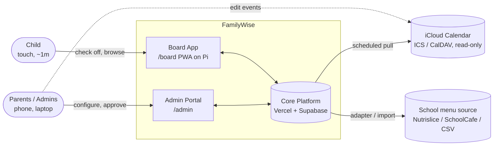
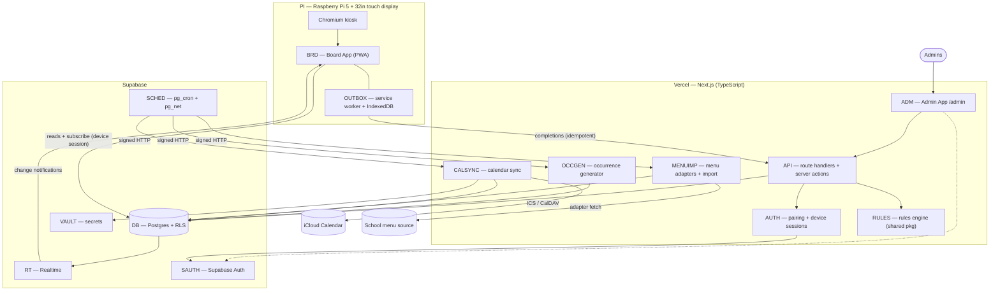
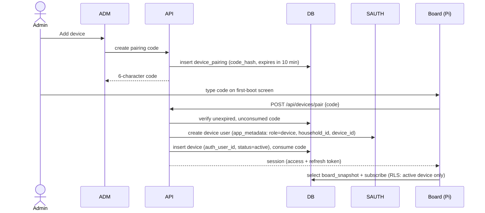
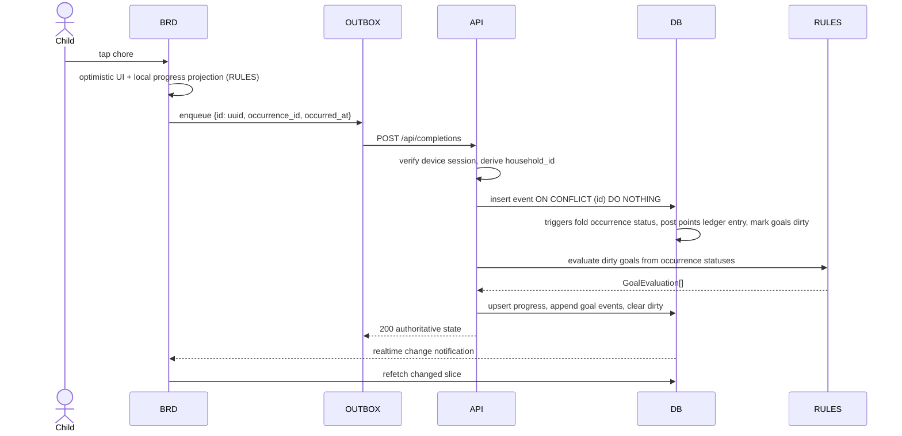
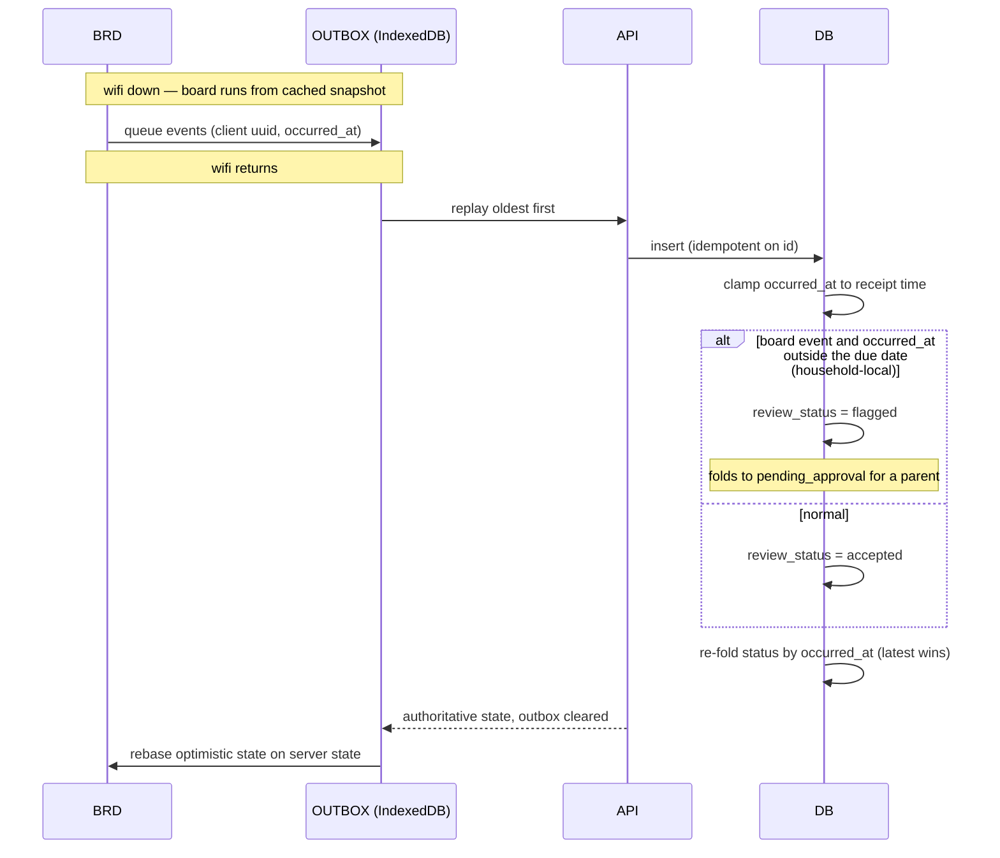
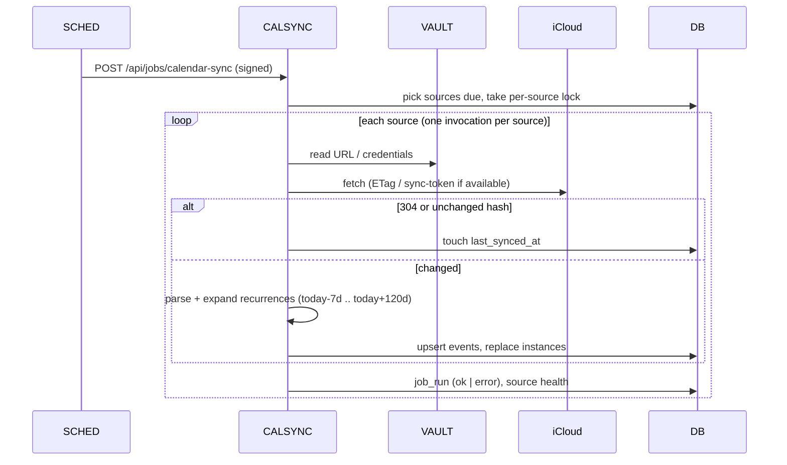
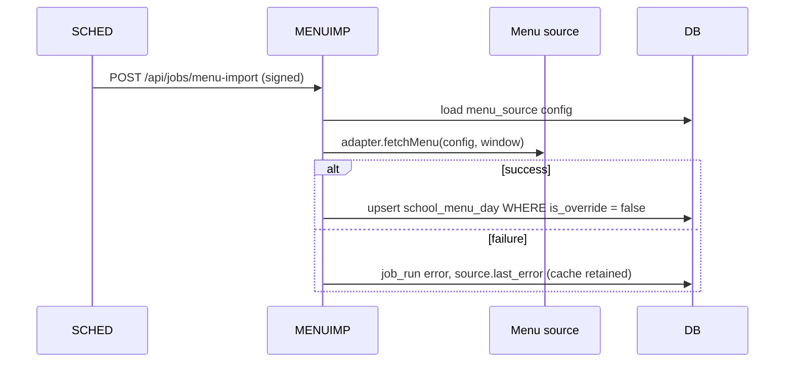
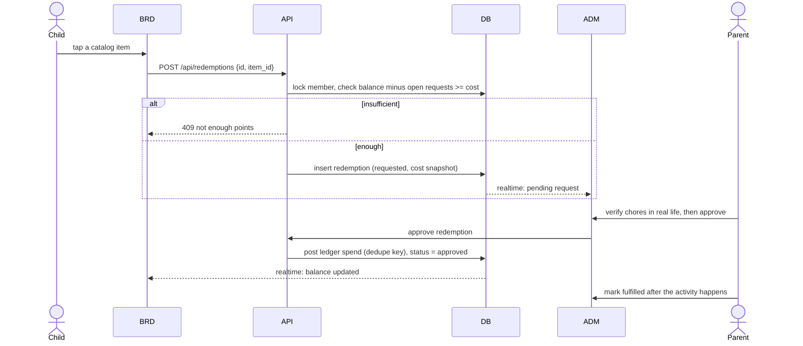
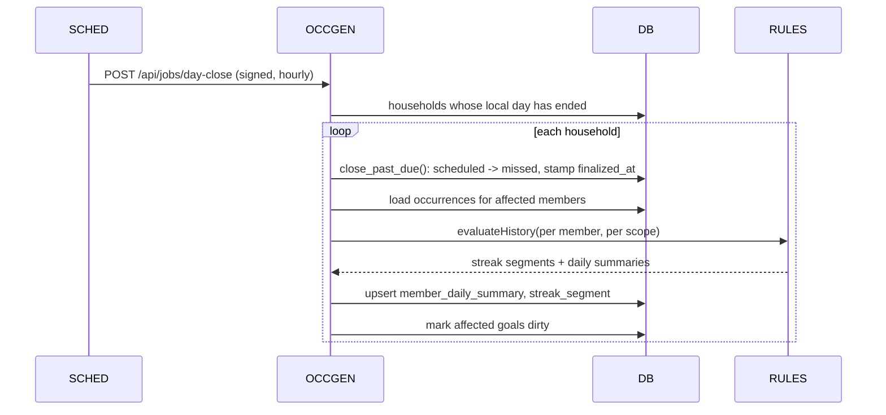
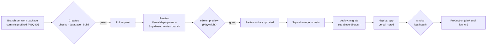

# 01 — Technical Architecture

> Version 0.4 · Status: build baseline · Maintained by Claude Code
> v0.4: event-time ordering for completion events (D-20), today-only board with parent-only late credit (D-21), magic link + password sign-in (D-25), `UI` and `CICD` components, delivery pipeline without Docker or staging (§9, D-26).
> Companions: `00-README.md` · `02-data-model.md` · `03-user-stories.md` · `04-requirements-traceability.md` · `05-backlog.md` · `06-brand-and-style-guide.md`
> Component IDs (e.g. `BRD`, `API`) are used in the traceability matrix. Requirement IDs (e.g. `CHR-04`) are defined in `04`.

---

## 1. Architectural principles

1. **View + input layer, not a system of record for events.** Apple Calendar owns events (read-only here). This system owns chores, rewards, meals, school-year config.
2. **Events are the truth; status is a projection.** Completions are immutable, append-only events. Each occurrence carries a persisted `status` (including `missed`) produced by one SQL fold function, so history, streaks, and points are queryable, auditable, and rebuildable.
3. **A device is not a person.** The kitchen board authenticates as a scoped, revocable device principal, never as a parent.
4. **Reads direct, writes through the API.** The board reads (and subscribes) straight from Postgres under RLS; every write goes through validated API routes.
5. **Degrade, don't blank.** Any dependency failure (wifi, iCloud, school menu feed, Supabase) must leave the board showing the last good data with a quiet staleness indicator.
6. **Pure core.** Reward logic is a pure TypeScript package with no I/O, shared by server and board.
7. **Boring tech, multi-tenant-ready schema.** `household_id` on every table, RLS everywhere, even though v1 serves one family.

---

## 2. System context

---

## 3. Container view

---

## 4. Components

| ID | Component | Responsibility | Tech | Primary requirements |
|---|---|---|---|---|
| `BRD` | Board App | Kid-facing UI: Today, Calendar, Goals, Meals. Optimistic check-off, notify-then-refetch realtime, idle auto-return, offline cache. | Next.js route group `(board)`, PWA (Serwist), Dexie (IndexedDB), Tailwind | BRD-*, DEV-04..08, CHR-04, RWD-07/08, CAL-04, MEAL-06 |
| `ADM` | Admin App | Responsive parent portal: members, devices, chores, goals, calendars, school year, meal plan, menu, audit. | Next.js route group `(admin)`, server actions, shadcn/ui | ACC-*, DEV-03, CHR-01/05/06, RWD-01/09/10, CAL-05/06, SCH-*, MEAL-*, MENU-* |
| `API` | API layer | Validated writes (zod), derives `household_id` from the verified session (never from the body), invokes `RULES`, uses service role only for derived tables. Owns the redemption workflow (request, approve, deny, fulfill). | Next.js route handlers | CHR-04, RWD-04, DEV-06, PTS-04 |
| `AUTH` | Pairing + device auth | Pairing codes, creates device principals, issues/revokes device sessions. | Route handlers + Supabase Admin API | DEV-01/02/03 |
| `RULES` | Rules engine | Pure functions: evaluate goals (COUNT, STREAK, DAILY_ALL_DONE, POINTS), AND/OR composition, grace days; computes streak history (good and bad segments) and daily summaries. Isomorphic (runs on server and board). | `packages/rules-engine`, TypeScript, Vitest | RWD-02..06, RWD-10, RWD-11, NFR-12 |
| `OCCGEN` | Occurrence generator + day close | Materializes `chore_occurrence` rows for a rolling window from chore schedules + day types; regenerates future rows on chore edits. Day close finalizes unresolved past-due occurrences as `missed`, writes daily summaries, and rebuilds streak segments. | Route handler jobs | CHR-02/03/07, SCH-03, RWD-11 |
| `CALSYNC` | Calendar sync | Fetch ICS/CalDAV, parse, expand recurrences into a window, upsert events/instances, record health. | `ical.js`, `tsdav` | CAL-01..03, CAL-06..08 |
| `MENUIMP` | Menu import | Adapter interface + implementations + CSV/manual; never overwrites manual overrides. | Route handler job | MENU-01..05 |
| `OUTBOX` | Offline outbox | Service worker caches app shell; IndexedDB stores board snapshot + queued completion events; replays with idempotency keys. | Serwist, Dexie | DEV-06, NFR-01 |
| `SCHED` | Scheduler | Time-based triggers into signed job endpoints. | `pg_cron` + `pg_net` | CAL-02, CHR-03, MENU-05 |
| `DB` | Database | Postgres, RLS, functions and triggers (`fold_occurrence_status`, status / ledger / dirty-goal triggers, `close_past_due`, `resolve_day_type`, `board_snapshot`), view `v_points_balance`. | Supabase Postgres 15+ | all |
| `RT` | Realtime | Change notifications to board, filtered by RLS. | Supabase Realtime | DEV-05 |
| `VAULT` | Secrets | Calendar URLs/credentials, job signing secret. | Supabase Vault | CAL-01/08, NFR-04 |
| `SAUTH` | Admin identity | Email magic link and email + password (required); Sign in with Apple and passkeys once the production domain exists; device principals live here too. | Supabase Auth | ACC-02, ACC-06, DEV-02 |
| `PI` | Kiosk host | Raspberry Pi OS, Chromium kiosk, watchdog, screen power. | systemd, Chromium | DEV-04/07, NFR-02 |
| `OBS` | Observability | Structured logs, error tracking, `job_run` table surfaced in admin. | Vercel logs, Sentry (optional) | NFR-07, CAL-06 |
| `UI` | Design system | FamilyWise tokens (Day and Evening), self-hosted fonts, typed icon set, avatars and brand components (`ChoreTile`, `PointsChip`, `GoalMeter`, `Banner`, `Button`) shared by board and admin. | `packages/ui`, `brand/` | NFR-13, NFR-11 |
| `CICD` | Delivery pipeline | Pull-request gates, preview environments, ordered production deploys (migrations, then app), docs traceability. No Docker, no staging. | GitHub Actions, Vercel, Supabase branching, Supabase CLI | NFR-14, NFR-12, NFR-08 |

---

## 5. Runtime flows

### 5.1 Device pairing (DEV-01, DEV-02)

Revocation: admin sets `device.status = 'revoked'`. The RLS helper checks device status on every query, so access ends immediately even though the access token has not expired. The auth user is also banned.

### 5.2 Check-off online (CHR-04, RWD-04)

If `RULES` evaluation fails after the insert, the completion still stands and the goal stays `dirty`; `progress_reconcile` (5.6) repairs it within minutes.

The fold always takes the event with the latest `occurred_at` (D-20), so an event that arrives late but happened earlier never overrides a later decision. `status_event_id` records the event the status was folded from, not the event that was just inserted.

### 5.3 Offline replay and conflicts (DEV-06, NFR-01, D-20, D-21)

**Conflict rule (D-20).** Every event carries the time it happened (`occurred_at`), online or offline. The fold orders an occurrence's events by `occurred_at`, then `recorded_at`, then `id`, and the latest wins. Example: the child taps *Make bed* offline at 7:00; a parent unchecks it on the phone at 7:30; the tap replays at 8:00. The 7:30 uncheck is later by event time, so the chore stays open. The database clamps `occurred_at` to the time the event was received, so a device clock running fast cannot win future conflicts.

**Today only (D-21).** The board shows today's chores only. Late credit for a past day is parent-only (`admin_complete`). A board event whose `occurred_at` falls outside the occurrence's due date is kept but flagged for a parent, which covers an offline board that missed midnight.

### 5.4 Calendar sync (CAL-02, CAL-06, CAL-07)

On failure the last good instances remain; only `last_error` and the board's stale indicator change.

### 5.5 School menu import (MENU-02..05)

### 5.6 Background jobs

| Job | Cadence | Target | Notes |
|---|---|---|---|
| `calendar_sync` | every 15 min | `/api/jobs/calendar-sync` | one source per invocation; advisory lock per source |
| `menu_import` | daily | `/api/jobs/menu-import` | window 28 days ahead; skips override rows |
| `occurrence_gen` | hourly + on chore edit | `/api/jobs/occurrence-gen` | `UNIQUE (chore_id, member_id, due_date)` + `ON CONFLICT DO NOTHING`; rolling 14 days |
| `day_close` | hourly (acts once a household's local day has ended) | `/api/jobs/day-close` | `close_past_due()` marks unresolved occurrences `missed` and stamps `finalized_at`; writes `member_daily_summary`; rebuilds `streak_segment` for affected members; idempotent |
| `progress_reconcile` | every 5 min | `/api/jobs/progress-reconcile` | recompute dirty goals; apply time-based transitions (scheduled→active, active→expired at household-local midnight); post goal payouts and points bonus rules idempotently; nightly full recompute |

All job endpoints verify a bearer secret (constant-time compare) held in `VAULT` and sent by `pg_net`. Keep each invocation short (one source, one household) and verify current Vercel function duration and cron limits for your plan before relying on them.

### 5.7 Reward redemption (PTS-03, PTS-04)

Approval (when switched on) is the control point: parents verify chores **before** points are spent. If a completion is unchecked after points were already spent, the reversal still posts (truth wins), the balance may go below zero, and it is shown as points to earn back. Goal achievement and payouts are likewise derived and reversible: if a reversal drops a goal below its target, the goal returns to `active` and any points payout is reversed (see `02` §5). A cancelled approved redemption posts a `refund`.

### 5.8 Day close (CHR-07, RWD-11)

---

## 6. Security architecture

### 6.1 Principals

| Principal | AuthN | Reads | Writes |
|---|---|---|---|
| Admin | Supabase Auth: email magic link or email + password (ACC-02); Sign in with Apple or passkey later (ACC-06) | all rows of own household | config tables via server actions under the user's session (RLS enforced) |
| Board device | Device auth user, `app_metadata.role=device` | board tables of own household while `device.status='active'` | none direct; `POST /api/completions` and `POST /api/redemptions` only |
| Jobs | Signed bearer secret + service role | all | derived tables, instances, menu rows |
| Child | not a principal | n/a | acts only through the device |

### 6.2 Rules that must hold

- `household_id` is **always** derived server-side from the verified session. Never trust it from a request body or query string.
- The service-role key exists only in server-side environment variables and is never bundled to the client.
- Device sessions cannot call admin endpoints (route-level role check **and** RLS).
- Kiosk lockdown (6.5) is defense in depth, not the security boundary.

### 6.3 RLS strategy

- Helper functions in a `private` schema, `SECURITY DEFINER`, `search_path = ''`:
  - `private.admin_household_ids()` → households where `auth.uid()` is in `household_user`.
  - `private.device_household_id()` → the household of `auth.uid()` iff a `device` row exists with `status='active'`.
- Admin policies: full CRUD where `household_id` in `admin_household_ids()`.
- Device policies: `SELECT` only, on board tables, where `household_id = device_household_id()`.
- Derived, instance, and event tables have **no** insert/update/delete policy for end users; only the service role writes them.
- Views use `security_invoker = true` so RLS applies through them.
- pgTAP suite proves: cross-household isolation, revoked-device denial, device cannot write, admin cannot read other households.

### 6.4 Secrets and calendar credentials

- Calendar URLs/credentials live in `VAULT`; tables store only the secret ID.
- **Default (MVP): published ICS link.** The URL is a bearer secret, so treat it like a password and store it in Vault.
- **Later (CAL-08): CalDAV.** An Apple app-specific password is **not scoped to one calendar**; it exposes the whole Apple ID's CalDAV data. Use a secondary Apple ID that is shared read-only on just the calendars the board needs, and generate the app-specific password on that account.

### 6.5 Child data and kiosk lockdown

- Store the minimum: first name or nickname, avatar, optional birth year. No photos of children, no analytics trackers, no third-party scripts on `/board`.
- Kiosk: Chromium `--kiosk`, no address bar, `/board` is the only reachable route group, strict CSP, edge/context menus disabled.

---

## 7. Realtime and offline design

**Notify-then-refetch.** Realtime events only say "something changed in table X for household H". The board refetches the affected slice via `board_snapshot(from, to)`. This avoids trusting partial payloads for derived data and keeps the client logic simple.

**Board snapshot** (single RPC, RLS-invoker): day type, occurrences + status for the window, goals + progress, points balance + active catalog + the member's open redemption requests, streak summary, calendar instances (today-1 .. today+14) **limited to the calendars selected for that device**, meal plan (7 days), school menu for buy days. It is the unit cached in IndexedDB.

**Offline rules**

- App shell cached by the service worker; snapshot cached per fetch with a `fetched_at`.
- Check-offs are applied optimistically, queued with a client-generated UUID (idempotency key) and `occurred_at`, and replayed oldest-first.
- Undo is a compensating event, never a delete.
- Points shown offline are projected locally (balance + pending earns); the server ledger is authoritative on rebase.
- `RULES` is isomorphic: the board projects goal progress locally so the meter moves instantly even offline; the server result is authoritative on rebase.
- Stale indicator: subtle icon when `now - fetched_at > 5 min` or realtime is disconnected; calendar-specific stale badge when the source's last success is older than 3 sync intervals.

**Time:** all instants are `timestamptz` (UTC). Business dates (`due_date`, `credit_date`, `plan_date`) are `date` in the **household timezone**. The household timezone is stored, never inferred from the device.

---

## 8. Kiosk host (PI)

- Raspberry Pi 5 (8 GB), **NVMe or SSD boot** (SD cards corrupt under power loss), official 27 W PSU, active cooler.
- Raspberry Pi OS (64-bit), autologin, systemd unit launching Chromium in kiosk mode with the board URL and flags to disable error dialogs, pinch zoom, overscroll navigation, and update prompts (verify flags against the current Chromium and Pi OS release).
- Watchdog: systemd `Restart=always`, hardware watchdog, optional nightly reboot at low-traffic hour.
- Display: touch calibration verified, screen blanking/dim schedule controlled by quiet hours (DEV-07) and burn-in mitigation (slow pixel drift / dim idle layout).
- **4K target (32" 3840×2160):** the Pi 5 can drive 4Kp60 over HDMI. Lay the UI out at 1920×1080 logical pixels and run Chromium with device scale factor 2, so assets stay crisp and touch targets keep a predictable physical size (about 0.37 mm per logical pixel on a 32" panel). Animation performance at 4K on the Pi GPU is the main risk: budget it in SPIKE-03 and keep a 1080p output fallback.
- No local secrets beyond the paired device session. Remote support: optional Tailscale/SSH on the Pi for maintenance only; not required by the app.

---

## 9. Environments and delivery (NFR-14, NFR-12, NFR-08, D-26)

No Docker anywhere, and no staging. Isolation comes from per-PR preview environments; production stays dark until launch (D-19).

### 9.1 Environments

| Env | Web | Database | Used for |
|---|---|---|---|
| Workspace | `next dev` | DB tests: native Postgres + Supabase compatibility bootstrap (`scripts/db-test.sh`). App: points at the PR's Supabase preview branch | writing code, fast feedback |
| CI | `next build` | native Postgres 17 on the GitHub runner + pgTAP | gates on every push and PR |
| Preview (one per PR) | Vercel preview deployment | Supabase preview branch for that PR (migrations + `supabase/seed.sql`) | review, Playwright e2e |
| Production | Vercel production | Supabase project `jpzwmibrsvsxcimbxtmb` (Pro) | the family board; dark until launch |

### 9.2 Workflow

### 9.3 Pull request gates

| Check | What runs | Blocks merge |
|---|---|---|
| `ci / checks` | frozen-lockfile install, ESLint, Prettier check, typecheck, Vitest (rules engine ≥ 90% coverage), migration lint, `check_traceability.py` | yes |
| `ci / database` | `scripts/db-test.sh`: throwaway database on native Postgres, compatibility bootstrap, all migrations in order, pgTAP via `pg_prove` | yes |
| `ci / build` | `next build` for `apps/web` | yes |
| `e2e / preview` | Playwright against the PR's Vercel preview once Vercel reports a successful deployment | yes |

`main` is protected: pull request required, the four checks required, squash merge only, no force pushes. Each PR updates the affected docs (`01`–`05`) and logs the change in `04` §I.

### 9.4 Database tests without Docker

- `supabase/tests/bootstrap/` recreates what the hosted platform provides: the `anon`, `authenticated`, `service_role` and `authenticator` roles; an `auth` schema with `auth.users`, `auth.uid()`, `auth.jwt()` and `auth.role()` reading `request.jwt.claims`; the `extensions` schema; and stand-ins for `vault`, `pg_cron`, `pg_net` and the `supabase_realtime` publication.
- `scripts/db-test.sh` creates a throwaway database, applies the bootstrap and then every migration in filename order, runs `pg_prove` over `supabase/tests/*.test.sql`, and drops the database.
- Tests act as a principal with `set local role authenticated` plus `set local request.jwt.claims`, exactly as PostgREST does.
- The bootstrap is never deployed. Migrations must not depend on it beyond what Supabase itself provides.
- Fidelity: once preview branches are enabled, the e2e workflow also runs the pgTAP suite against the PR's preview branch, so any drift between the bootstrap and real Supabase shows up before merge.

### 9.5 Preview environments

- Vercel's Git integration builds every PR branch as a preview deployment.
- Supabase branching (GitHub integration) creates a preview branch per PR, applies `supabase/migrations` and `supabase/seed.sql`, and Supabase's Vercel integration writes that branch's URL and keys into the preview deployment.
- Previews sit behind Vercel deployment protection; the e2e workflow uses the automation bypass secret.
- Preview branches are deleted when the PR closes; their compute is billed only while open.

### 9.6 Production deploy (ordered)

`deploy.yml` runs on every push to `main`:

1. **migrate** (GitHub environment `production`): `supabase link` then `supabase db push`. A failure stops the deploy.
2. **app**: `vercel pull`, `vercel build --prod`, `vercel deploy --prebuilt --prod`.
3. **smoke**: `GET /api/health` on production returns 200.

Vercel's automatic production deploy from Git is turned off (`vercel.json`), and Supabase's GitHub integration must not deploy migrations to production, so the app never ships ahead of its schema. Migrations are forward-only and compatible with the previously deployed app; a breaking change is split into expand and contract PRs.

### 9.7 Launch

- Production is deployed continuously but dark: no board paired and no family data.
- Launch happens once every milestone is done and the launch acceptance checklist (`04` §E) passes: tag `v1.0.0`, reset production data with the launch runbook (schema kept, household data truncated), create the household, invite the second admin, pair the Pi.
- After launch the same pipeline applies; a migration that rewrites data is preceded by a confirmed backup.

### 9.8 Secrets and configuration

No secret is committed or pasted into chat.

| Name | Stored in | Used by |
|---|---|---|
| `SUPABASE_ACCESS_TOKEN`, `SUPABASE_DB_PASSWORD` | GitHub Actions secrets (environment `production`) | migrate |
| `SUPABASE_PROJECT_ID` (`jpzwmibrsvsxcimbxtmb`) | GitHub Actions variable | migrate |
| `VERCEL_TOKEN` | GitHub Actions secret (environment `production`) | app deploy |
| `VERCEL_ORG_ID`, `VERCEL_PROJECT_ID` | GitHub Actions variables | app deploy |
| `VERCEL_AUTOMATION_BYPASS_SECRET` | GitHub Actions secret | e2e on protected previews |
| `PRODUCTION_URL` | GitHub Actions variable | smoke check |
| `NEXT_PUBLIC_SUPABASE_URL`, `NEXT_PUBLIC_SUPABASE_ANON_KEY` | Vercel env (production); set per preview by the Supabase integration | app |
| `SUPABASE_SERVICE_ROLE_KEY` | Vercel env, server only | jobs, derived tables |
| `JOB_SIGNING_SECRET` | Vercel env and Supabase Vault | `pg_net` → job endpoints |

### 9.9 Cost ceiling (NFR-08)

| Item | Plan | Why |
|---|---|---|
| Supabase | Pro | no inactivity pausing, daily backups, preview branches |
| Supabase preview branches | hourly compute while a PR is open | per-PR isolation instead of staging |
| Vercel | Hobby (personal, non-commercial); Pro only if limits require | hosting, previews |
| Domain | annual | production URL, passkeys, email sender (OQ-06b) |
| Apple Developer Program | annual | Sign in with Apple (ACC-06) |

**Ceiling: USD 60 per month** all-in during the build, reviewed at each milestone. Check current list prices when the accounts are set up; System Health shows a warning as usage approaches plan limits (US-909).

---

## 10. Failure modes and degradation

| Failure | User-visible effect | Behavior |
|---|---|---|
| Home wifi down | none for ≥24 h of cached days; stale icon | cached snapshot, outbox queues check-offs |
| Vercel outage | admin unavailable; board reads still work if Supabase up | board keeps reading DB directly; writes queue |
| Supabase paused/outage | board shows cache + stale icon | outbox queues; replay on recovery |
| iCloud sync failing | calendar shows last good data + stale badge | admin sees error and last success time |
| Menu feed broken | buy days show "menu unavailable" | manual/CSV override always possible; planning never blocked |
| Rules evaluation fails | meter lags briefly | goal `dirty`; reconcile fixes within ~5 min |
| Day-close job skipped | history views lag | the job catches up all past dates on its next run; `fold_occurrence_status` also reports `missed` for any past-due unresolved occurrence on the next touch |
| Device token revoked | board returns to pairing screen | by design |
| Pi power loss | reboot to board in <2 min | SSD boot, auto-launch |

---

## 11. Alternatives considered

| Decision | Chosen | Rejected | Why |
|---|---|---|---|
| Backend | Supabase | Neon + Clerk + Pusher/Ably | One vendor covers DB, auth, realtime, RLS, cron, vault |
| Device identity | Device as a Supabase Auth user with scoped `app_metadata` | Custom-minted JWT signed by app | Fewer moving parts; native refresh and ban; revocation via RLS device check |
| Occurrence status | Persisted `status` projected from immutable events by one SQL fold function | Derived-only view; status edited in place | Reporting, streak history, and board reads are simple and indexed; events stay the truth, so status is rebuildable and every change is auditable |
| Missed chores | Explicit `missed` status finalized by a day-close job (`finalized_at`) | Computed on read only | Missed days are first-class history (good and bad streaks, completion rates); the fold function still reports `missed` if the job lags |
| Occurrences | Materialized rows | Computed on the fly | Stable denominators for streaks; edits can't rewrite history |
| Realtime payloads | Notify-then-refetch | Apply row deltas client-side | Derived data stays server-authoritative |
| Calendar writes | None (Apple Calendar only) | Two-way sync | Write-back is where sync bugs live |
| Calendar selection | Per-device selection table | Global show/hide flag | Different boards can show different calendars |
| Points | Append-only ledger; balance derived | Mutable balance column | Clawbacks, redemptions, and audits stay exact |
| Hosting | Vercel + Supabase | Pi-hosted backend | Admin from anywhere; Pi is a thin, replaceable client |
| Event conflicts | Latest `occurred_at` wins, clamped to receipt time | Arrival order | A later parent decision is never overwritten by an earlier offline tap (D-20) |
| Database tests | Native Postgres + compatibility bootstrap; pgTAP | `supabase start` (Docker) | No Docker in the workflow (D-26) |
| Pre-production | Per-PR preview environments; production dark until launch | Persistent staging project | No staging; each change is isolated |
| Production deploy order | GitHub Actions: migrations, then app | Vercel auto-deploy on merge | The app never runs ahead of its schema |
