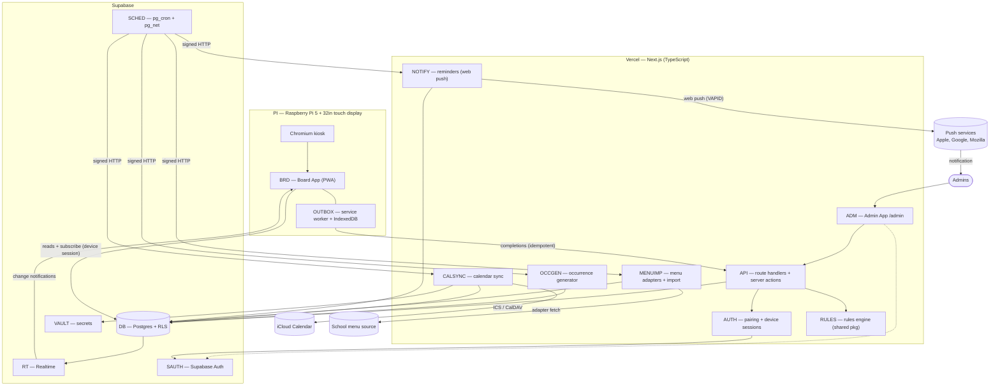
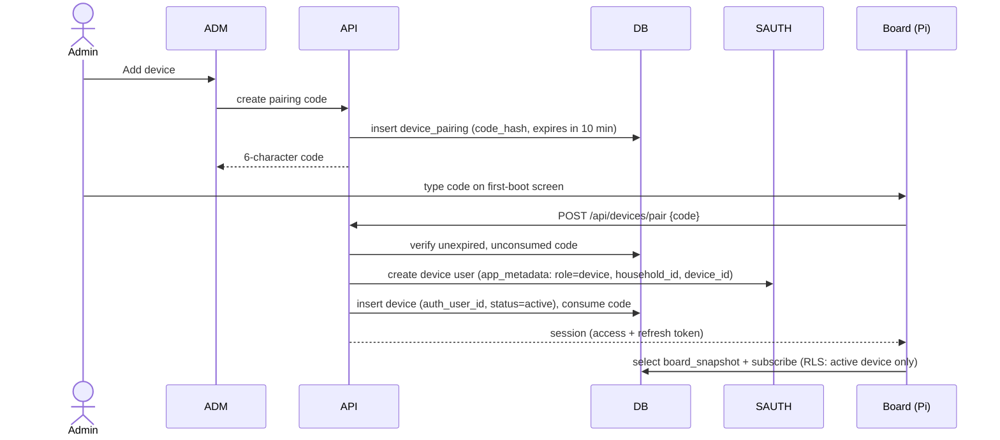
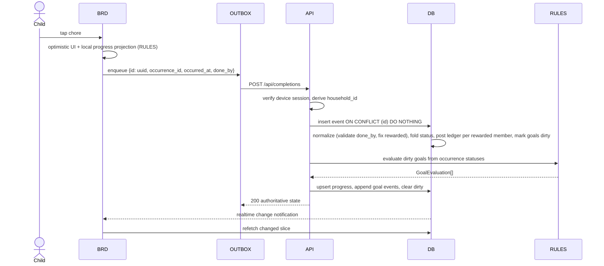
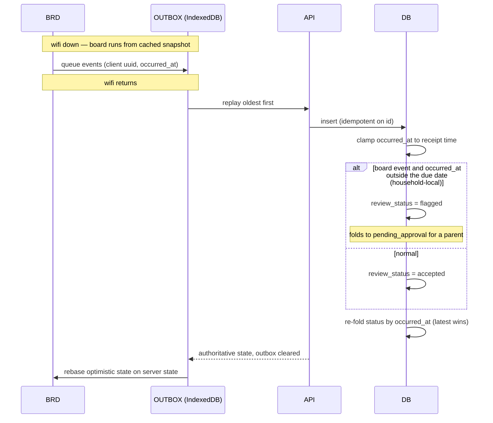
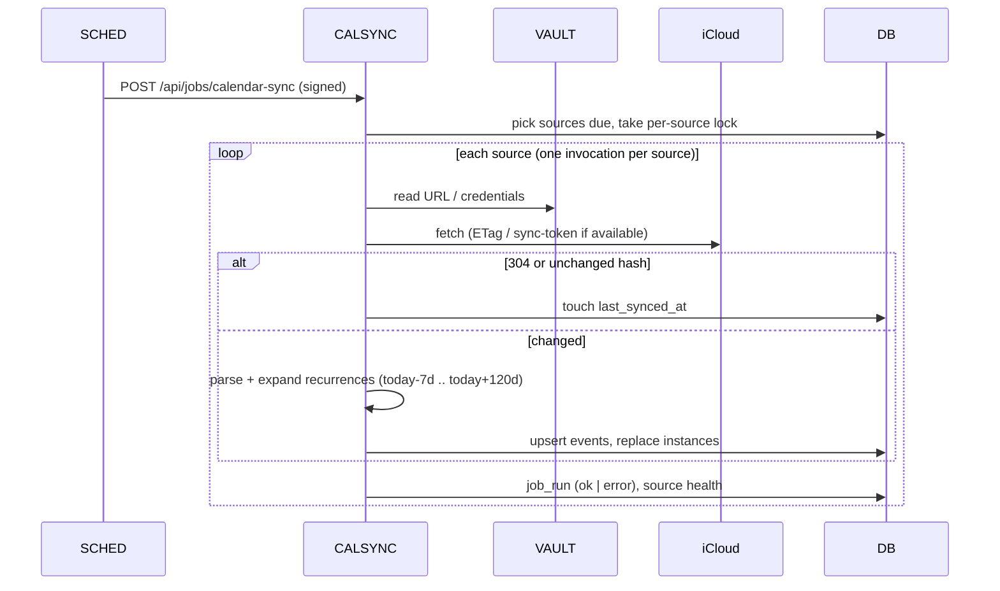
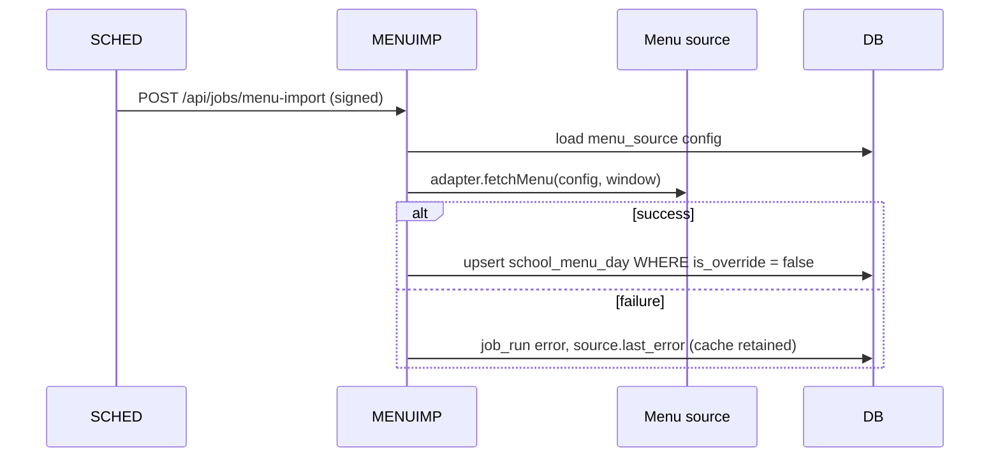
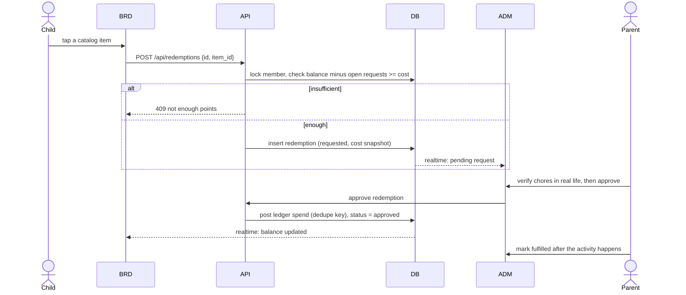
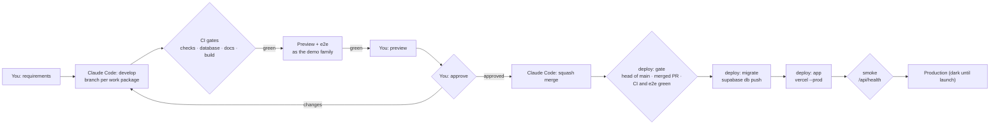

# 01 — Technical Architecture

> Version 0.8 · Status: build baseline · Maintained by Claude Code
> v0.8.2: WP-37 brand system: `UI` builds its assets from `brand/` (§4); `ci / build` also runs the brand checks (§9.3).
> v0.8: one database (D-37): previews run as the demo family in the production project; the delivery loop includes your preview and approval (§9.1–9.5, §9.7–9.10, §11).
> v0.7.2: GitHub Free limits (D-36): the deploy workflow enforces the pull request gates (§9.2, §9.3, §9.6); all GitHub secrets are repository secrets (§9.8); GitHub Free constraints in §9.10.
> v0.7: reminders (D-35): `NOTIFY` component, `reminders` job, flow §5.9, VAPID secrets (§9.8), failure mode and alternative.
> v0.6: one family list (D-30..D-34): every member's chores and tasks in one model; one shared occurrence per due date with who-did-it credit; routines get missed, tasks carry over; Family view on the board and My tasks in admin; private items enforced by RLS (§4, §5.2, §5.6, §5.8, §6, §7, §11).
> v0.5.2: `ci / docs` gate: the interactive docs pages build without broken links and pass a layout check on 13 device profiles (§9.3).
> v0.5.1: Supabase publishable/secret API keys (§9.8); SPIKE-04 result: Nutrislice public menu API (§5.5).
> v0.5: free plans only (D-29): one shared Supabase preview project instead of per-PR branches, keepalive against inactivity pausing, migrations over the session pooler, own nightly backups, email limits (§9.10).
> v0.4: event-time ordering for completion events (D-20), today-only board with parent-only late credit (D-21), magic link + password sign-in (D-25), `UI` and `CICD` components, delivery pipeline without Docker or staging (§9, D-26).
> Companions: `00-README.md` · `02-data-model.md` · `03-user-stories.md` · `04-requirements-traceability.md` · `05-backlog.md` · `06-brand-and-style-guide.md`
> Component IDs (e.g. `BRD`, `API`) are used in the traceability matrix. Requirement IDs (e.g. `CHR-04`) are defined in `04`.

---

## 1. Architectural principles

1. **View + input layer, not a system of record for events.** Apple Calendar owns events (read-only here). This system owns chores, rewards, meals, school-year config.
2. **Events are the truth; status is a projection.** Completions are immutable, append-only events. Each occurrence carries a persisted `status` (including `missed`) produced by one SQL fold function, so history, streaks, and points are queryable, auditable, and rebuildable.
3. **A device is not a person.** The kitchen board authenticates as a scoped, revocable device principal, never as a parent.
4. **Reads direct, writes through the API.** The board reads (and subscribes) straight from Postgres under RLS; every write goes through validated API routes.
5. **Degrade, don't blank.** Any dependency failure (wifi, iCloud, school menu feed, Supabase) must leave the board showing the last good data with a quiet staleness indicator.
6. **Pure core.** Reward logic is a pure TypeScript package with no I/O, shared by server and board.
7. **Boring tech, multi-tenant-ready schema.** `household_id` on every table, RLS everywhere, even though v1 serves one family.

---

## 2. System context


---

## 3. Container view



---

## 4. Components

| ID | Component | Responsibility | Tech | Primary requirements |
|---|---|---|---|---|
| `BRD` | Board App | Family-facing UI: Today per member and a Family view of everyone's day, Calendar, Goals, Meals. Optimistic check-off with a who-did-it picker for shared items, notify-then-refetch realtime, idle auto-return, offline cache. Never shows private items. | Next.js route group `(board)`, PWA (Serwist), Dexie (IndexedDB), Tailwind | BRD-*, DEV-04..08, CHR-04, RWD-07/08, CAL-04, MEAL-06 |
| `ADM` | Admin App | Responsive parent portal: members (incl. the earns-rewards switch), devices, the family list of chores and tasks with tags and visibility, My tasks on the phone, goals, calendars, school year, meal plan, menu, audit. | Next.js route group `(admin)`, server actions, shadcn/ui | ACC-*, DEV-03, CHR-01/05/06, RWD-01/09/10, CAL-05/06, SCH-*, MEAL-*, MENU-* |
| `API` | API layer | Validated writes (zod), derives `household_id` from the verified session (never from the body), passes `done_by` for check-offs (the database validates it and fixes `rewarded`), invokes `RULES`, uses service role only for derived tables. Owns the redemption workflow (request, approve, deny, fulfill). | Next.js route handlers | CHR-04, RWD-04, DEV-06, PTS-04 |
| `AUTH` | Pairing + device auth | Pairing codes, creates device principals, issues/revokes device sessions. | Route handlers + Supabase Admin API | DEV-01/02/03 |
| `RULES` | Rules engine | Pure functions over per-member facts (`covered` is neutral; tags by id): evaluate goals (COUNT, STREAK, DAILY_ALL_DONE, POINTS), AND/OR composition, grace days; computes streak history (good and bad segments, routines only) and daily summaries. Isomorphic (runs on server and board). | `packages/rules-engine`, TypeScript, Vitest | RWD-02..06, RWD-10, RWD-11, NFR-12 |
| `OCCGEN` | Occurrence generator + day close | Materializes one `chore_occurrence` per item per due date for a rolling window, with a snapshot of its assignees, from schedules + day types; regenerates future rows on edits. Day close finalizes unresolved past-due routines as `missed` (tasks carry over), writes daily summaries for every member, and rebuilds streak segments. | Route handler jobs | CHR-02/03/07, SCH-03, RWD-11 |
| `CALSYNC` | Calendar sync | Fetch ICS/CalDAV, parse, expand recurrences into a window, upsert events/instances, record health. | `ical.js`, `tsdav` | CAL-01..03, CAL-06..08 |
| `MENUIMP` | Menu import | Adapter interface + implementations + CSV/manual; never overwrites manual overrides. | Route handler job | MENU-01..05 |
| `NOTIFY` | Reminders | Sends web push reminders and the optional daily digest to admins who turned them on, switchable per person, per device and per item (D-35); at most once per item and person and never after it is done; holds reminders during quiet hours; hides private titles on the lock screen; prunes expired subscriptions. | Route handler job, `web-push` (VAPID), admin service worker | CHR-15, CHR-16, CHR-17 |
| `OUTBOX` | Offline outbox | Service worker caches app shell; IndexedDB stores board snapshot + queued completion events; replays with idempotency keys. | Serwist, Dexie | DEV-06, NFR-01 |
| `SCHED` | Scheduler | Time-based triggers into signed job endpoints. | `pg_cron` + `pg_net` | CAL-02, CHR-03, MENU-05 |
| `DB` | Database | Postgres, RLS (incl. `can_see_chore` for private items), functions and triggers (`fold_occurrence_status`, status / ledger / dirty-goal triggers, `close_past_due`, `resolve_day_type`, `board_snapshot`), views `v_points_balance`, `v_member_occurrence`. | Supabase Postgres 15+ | all |
| `RT` | Realtime | Change notifications to board, filtered by RLS. | Supabase Realtime | DEV-05 |
| `VAULT` | Secrets | Calendar URLs/credentials, job signing secret. | Supabase Vault | CAL-01/08, NFR-04 |
| `SAUTH` | Admin identity | Email magic link and email + password (required); Sign in with Apple and passkeys once the production domain exists; device principals live here too. | Supabase Auth | ACC-02, ACC-06, DEV-02 |
| `PI` | Kiosk host | Raspberry Pi OS, Chromium kiosk, watchdog, screen power. | systemd, Chromium | DEV-04/07, NFR-02 |
| `OBS` | Observability | Structured logs, error tracking, `job_run` table surfaced in admin. | Vercel logs, Sentry (optional) | NFR-07, CAL-06 |
| `UI` | Design system | FamilyWise tokens (Day and Evening), self-hosted fonts, typed icon set, avatars and brand components (`ChoreTile`, `PointsChip`, `GoalMeter`, `Banner`, `Button`, `Logo`, `BootSplash`) shared by board and admin. `brand/` is the source of truth: `packages/ui/scripts/brand.mjs` generates the typed icons and theme colors (committed, checked in CI) and, before every dev run and build, copies fonts, logos, avatars and app icons into `apps/web/public` and writes the two manifests and the font-precaching service worker. | `packages/ui`, `brand/` | NFR-13, NFR-11 |
| `CICD` | Delivery pipeline | Pull-request gates, preview environments, ordered production deploys (migrations, then app), docs traceability. No Docker, no staging. | GitHub Actions, Vercel, Supabase CLI, `psql`/`pg_dump` | NFR-14, NFR-12, NFR-08, NFR-10 |

---

## 5. Runtime flows

### 5.1 Device pairing (DEV-01, DEV-02)



Revocation: admin sets `device.status = 'revoked'`. The RLS helper checks device status on every query, so access ends immediately even though the access token has not expired. The auth user is also banned.

### 5.2 Check-off online (CHR-04, RWD-04)



If `RULES` evaluation fails after the insert, the completion still stands and the goal stays `dirty`; `progress_reconcile` (5.6) repairs it within minutes.

On a member's own screen `done_by` is that member; on the Family view the picker lists the item's assignees first and allows anyone in the family, or several people (D-30). Only members who earn rewards get points, approval and celebrations (D-32).

The fold always takes the event with the latest `occurred_at` (D-20), so an event that arrives late but happened earlier never overrides a later decision. `status_event_id` records the event the status was folded from, not the event that was just inserted.

### 5.3 Offline replay and conflicts (DEV-06, NFR-01, D-20, D-21)



**Conflict rule (D-20).** Every event carries the time it happened (`occurred_at`), online or offline. The fold orders an occurrence's events by `occurred_at`, then `recorded_at`, then `id`, and the latest wins. Example: the child taps *Make bed* offline at 7:00; a parent unchecks it on the phone at 7:30; the tap replays at 8:00. The 7:30 uncheck is later by event time, so the chore stays open. The database clamps `occurred_at` to the time the event was received, so a device clock running fast cannot win future conflicts.

**Today only (D-21).** The board shows today's chores only. Late credit for a past day is parent-only (`admin_complete`). A board event whose `occurred_at` falls outside the occurrence's due date is kept but flagged for a parent, which covers an offline board that missed midnight.

### 5.4 Calendar sync (CAL-02, CAL-06, CAL-07)



On failure the last good instances remain; only `last_error` and the board's stale indicator change.

### 5.5 School menu import (MENU-02..05)



**SPIKE-04 result (Nutrislice).** The district's menus are on Nutrislice, which serves a public, unauthenticated JSON API:

- `https://{district}.api.nutrislice.com/menu/api/schools/` lists the district's schools with their slugs and active menu types (`breakfast`, `lunch`), so the admin portal can offer a picker instead of asking for identifiers.
- `https://{district}.api.nutrislice.com/menu/api/weeks/school/{school}/menu-type/{type}/{yyyy}/{mm}/{dd}/` returns one Sunday-to-Saturday week: `days[].menu_items[]`, where section titles (`is_section_title`) group entrées and sides, `food.name` is the item, and `is_holiday` marks closures. A week is about 250 KB, mostly nutrition data the adapter discards; a 28-day refresh is four requests.
- `menu_source.config` for this adapter is `{district, school, menu_type}`. The household's actual identifiers are entered in the admin portal and are kept out of the repo and fixtures (NFR-05).

### 5.6 Background jobs

| Job | Cadence | Target | Notes |
|---|---|---|---|
| `calendar_sync` | every 15 min | `/api/jobs/calendar-sync` | one source per invocation; advisory lock per source |
| `menu_import` | daily | `/api/jobs/menu-import` | window 28 days ahead; skips override rows |
| `occurrence_gen` | hourly + on chore edit | `/api/jobs/occurrence-gen` | one occurrence per item per due date, `UNIQUE (chore_id, due_date)` + `ON CONFLICT DO NOTHING`, with its `chore_occurrence_assignee` snapshot; rolling 14 days |
| `day_close` | hourly (acts once a household's local day has ended) | `/api/jobs/day-close` | `close_past_due()` marks unresolved routines `missed` and stamps `finalized_at` (tasks stay open, D-31); writes `member_daily_summary` for every member; rebuilds `streak_segment` for affected members; idempotent |
| `reminders` | every 5 min | `/api/jobs/reminders` | household-local schedule; skips done items and people, items or devices with reminders off; inserts `reminder_delivery` (dedupe key) before sending; holds during quiet hours; daily digest at each person's chosen time |
| `progress_reconcile` | every 5 min | `/api/jobs/progress-reconcile` | recompute dirty goals; apply time-based transitions (scheduled→active, active→expired at household-local midnight); post goal payouts and points bonus rules idempotently; nightly full recompute |

All job endpoints verify a bearer secret (constant-time compare) held in `VAULT` and sent by `pg_net`. Keep each invocation short (one source, one household) and verify current Vercel function duration and cron limits for your plan before relying on them.

### 5.7 Reward redemption (PTS-03, PTS-04)



Approval (when switched on) is the control point: parents verify chores **before** points are spent. If a completion is unchecked after points were already spent, the reversal still posts (truth wins), the balance may go below zero, and it is shown as points to earn back. Goal achievement and payouts are likewise derived and reversible: if a reversal drops a goal below its target, the goal returns to `active` and any points payout is reversed (see `02` §5). A cancelled approved redemption posts a `refund`.

### 5.8 Day close (CHR-07, RWD-11)

```mermaid
sequenceDiagram
  participant S as SCHED
  participant O as OCCGEN
  participant D as DB
  participant R as RULES

  S->>O: POST /api/jobs/day-close (signed, hourly)
  O->>D: households whose local day has ended
  loop each household
    O->>D: close_past_due(): routines scheduled/rejected -> missed, stamp finalized_at; tasks stay open
    O->>D: load v_member_occurrence for affected members
    O->>R: evaluateHistory(per member, per scope)
    R-->>O: streak segments + daily summaries
    O->>D: upsert member_daily_summary, streak_segment
    O->>D: mark affected goals dirty
  end
```

### 5.9 Reminders (CHR-15, CHR-16, CHR-17)

```mermaid
sequenceDiagram
  participant S as SCHED
  participant N as NOTIFY
  participant D as DB
  participant P as Push service
  actor A as Parent (iPhone)

  S->>N: POST /api/jobs/reminders (signed, every 5 min)
  N->>D: reminders due now: open occurrences; person, item and device switched on; outside quiet hours
  loop each person and item
    N->>D: insert reminder_delivery (dedupe key) ON CONFLICT DO NOTHING
    alt inserted
      N->>P: web push (VAPID); private items without their title
      P-->>A: notification; tapping opens the item in My tasks
      N->>D: mark sent, or delete the subscription on 404/410
    end
  end
```

A reminder is due at the item's due time minus its lead time, or at the person's morning time on the due date when the item has no due time. Quiet hours move it to the end of the quiet period. The dedupe key (`due:{occurrence}:{member}`) makes each reminder at most once, and an item completed before its reminder is skipped. On an iPhone, web push needs the admin app added to the Home Screen (iOS 16.4 or later); the permission prompt appears only after the person taps "Turn on reminders".

---

## 6. Security architecture

### 6.1 Principals

| Principal | AuthN | Reads | Writes |
|---|---|---|---|
| Admin | Supabase Auth: email magic link or email + password (ACC-02); Sign in with Apple or passkey later (ACC-06) | all rows of own household, except another admin's private items (D-34) | config tables via server actions under the user's session (RLS enforced) |
| Board device | Device auth user, `app_metadata.role=device` | family-visible board tables of own household while `device.status='active'` | none direct; `POST /api/completions` (with `done_by`) and `POST /api/redemptions` only |
| Jobs | Signed bearer secret + service role | all | derived tables, instances, menu rows |
| Child | not a principal | n/a | acts only through the device |

### 6.2 Rules that must hold

- `household_id` is **always** derived server-side from the verified session. Never trust it from a request body or query string.
- The service-role key exists only in server-side environment variables and is never bundled to the client.
- Device sessions cannot call admin endpoints (route-level role check **and** RLS).
- Kiosk lockdown (6.5) is defense in depth, not the security boundary.

### 6.3 RLS strategy

- Helper functions in a `private` schema, `SECURITY DEFINER`, `search_path = ''`:
  - `private.admin_household_ids()` → households where `auth.uid()` is in `household_user`.
  - `private.device_household_id()` → the household of `auth.uid()` iff a `device` row exists with `status='active'`.
- Admin policies: full CRUD where `household_id` in `admin_household_ids()`.
- Device policies: `SELECT` only, on board tables, where `household_id = device_household_id()`.
- Derived, instance, and event tables have **no** insert/update/delete policy for end users; only the service role writes them.
- Private items (D-34): `private.can_see_chore(chore_id)` admits family items to everyone in the household and private items only to their creator and assignees who sign in. The item, its occurrences, assignee snapshots, events and audit rows all use it, so the board and the other admin never receive a private row.
- Views use `security_invoker = true` so RLS applies through them.
- pgTAP suite proves: cross-household isolation, revoked-device denial, device cannot write, admin cannot read other households, and private items are invisible to the board and to the other admin.

### 6.4 Secrets and calendar credentials

- Calendar URLs/credentials live in `VAULT`; tables store only the secret ID.
- **Default (MVP): published ICS link.** The URL is a bearer secret, so treat it like a password and store it in Vault.
- **Web push (D-35):** a VAPID key pair; the public key ships to browsers and the private key is a server-only Vercel secret. Push subscriptions are stored per device, readable only by their owner and by the reminders job.
- **Later (CAL-08): CalDAV.** An Apple app-specific password is **not scoped to one calendar**; it exposes the whole Apple ID's CalDAV data. Use a secondary Apple ID that is shared read-only on just the calendars the board needs, and generate the app-specific password on that account.

### 6.5 Child data and kiosk lockdown

- Store the minimum: first name or nickname, avatar, optional birth year. No photos of children, no analytics trackers, no third-party scripts on `/board`.
- Kiosk: Chromium `--kiosk`, no address bar, `/board` is the only reachable route group, strict CSP, edge/context menus disabled.

---

## 7. Realtime and offline design

**Notify-then-refetch.** Realtime events only say "something changed in table X for household H". The board refetches the affected slice via `board_snapshot(from, to)`. This avoids trusting partial payloads for derived data and keeps the client logic simple.

**Board snapshot** (single RPC, RLS-invoker): day type, every member's family-visible occurrences for today plus open overdue tasks (with assignees, due time, status and who did it), goals + progress, points balance + active catalog + open redemption requests and streak summary for each member who earns rewards, calendar instances (today-1 .. today+14) **limited to the calendars selected for that device**, meal plan (7 days), school menu for buy days. It is the unit cached in IndexedDB.

**Offline rules**

- App shell cached by the service worker; snapshot cached per fetch with a `fetched_at`.
- Check-offs are applied optimistically, queued with a client-generated UUID (idempotency key) and `occurred_at`, and replayed oldest-first.
- Undo is a compensating event, never a delete.
- Points shown offline are projected locally (balance + pending earns); the server ledger is authoritative on rebase.
- `RULES` is isomorphic: the board projects goal progress locally so the meter moves instantly even offline; the server result is authoritative on rebase.
- Stale indicator: subtle icon when `now - fetched_at > 5 min` or realtime is disconnected; calendar-specific stale badge when the source's last success is older than 3 sync intervals.

**Time:** all instants are `timestamptz` (UTC). Business dates (`due_date`, `credit_date`, `plan_date`) are `date` in the **household timezone**. The household timezone is stored, never inferred from the device.

---

## 8. Kiosk host (PI)

- Raspberry Pi 5 (8 GB), **NVMe or SSD boot** (SD cards corrupt under power loss), official 27 W PSU, active cooler.
- Raspberry Pi OS (64-bit), autologin, systemd unit launching Chromium in kiosk mode with the board URL and flags to disable error dialogs, pinch zoom, overscroll navigation, and update prompts (verify flags against the current Chromium and Pi OS release).
- Watchdog: systemd `Restart=always`, hardware watchdog, optional nightly reboot at low-traffic hour.
- Display: touch calibration verified, screen blanking/dim schedule controlled by quiet hours (DEV-07) and burn-in mitigation (slow pixel drift / dim idle layout).
- **4K target (32" 3840×2160):** the Pi 5 can drive 4Kp60 over HDMI. Lay the UI out at 1920×1080 logical pixels and run Chromium with device scale factor 2, so assets stay crisp and touch targets keep a predictable physical size (about 0.37 mm per logical pixel on a 32" panel). Animation performance at 4K on the Pi GPU is the main risk: budget it in SPIKE-03 and keep a 1080p output fallback.
- No local secrets beyond the paired device session. Remote support: optional Tailscale/SSH on the Pi for maintenance only; not required by the app.

---

## 9. Environments and delivery (NFR-14, NFR-12, NFR-08, D-26)

No Docker anywhere, no staging, and free plans only (D-29): Supabase Free, Vercel Hobby, GitHub Free. Each PR gets a preview deployment; production stays dark until launch (D-19).

### 9.1 Environments

| Env | Web | Database | Used for |
|---|---|---|---|
| Workspace | `next dev` | DB tests: native Postgres + Supabase compatibility bootstrap (`scripts/db-test.sh`). App: the production project as the demo family, browser-safe key only | writing code, fast feedback |
| CI | `next build` | native Postgres 17 on the GitHub runner + pgTAP | gates on every push and PR |
| Preview (one per PR) | Vercel preview deployment | the production project, as the **demo family** (a separate household); the PR's new migrations applied before its e2e run unless one removes or renames something (§9.5) | your review, Playwright e2e |
| Production | Vercel production (`family-wise-topaz.vercel.app`) | Supabase project `jpzwmibrsvsxcimbxtmb` (Free), the one database | the family board; dark until launch |

### 9.2 Workflow

Your part is the requirements, the preview and the approval; Claude Code does the rest.



Approval is your word to Claude Code, here or as a comment on the pull request: GitHub does not let you formally approve a pull request opened under your own account. Claude Code merges only after it, and only with every check green.

### 9.3 Pull request gates

| Check | What runs | Required |
|---|---|---|
| `ci / checks` | frozen-lockfile install, ESLint, Prettier check, typecheck, Vitest (rules engine ≥ 90% coverage), migration lint, `check_traceability.py` | yes |
| `ci / database` | `scripts/db-test.sh`: throwaway database on native Postgres, compatibility bootstrap, all migrations in order, pgTAP via `pg_prove` | yes |
| `ci / docs` | `pnpm docs:build --check` (no broken cross-link or unknown ID in the five docs pages), then `pnpm docs:layout`: each page on 13 device profiles from a 320 px phone to a 4K monitor, failing on sideways scroll, content off screen, touch targets under 44 px, or script errors | yes |
| `ci / build` | `next build` for `apps/web`, then the brand checks against `next start` (`pnpm test:ui`): computed-style snapshots of every tile state in Day and Evening, axe contrast on the board, admin and brand pages, both manifests, self-hosted fonts and the service-worker precache | yes |
| `e2e / preview` | Once Vercel reports a successful preview: apply the PR's new migrations unless one removes or renames something, reset the demo family, then Playwright against the preview URL. Runs are serialized | yes |

GitHub Free does not enforce branch protection on a private repository (D-36), so the five checks are required in two places:

- **Before merge:** a pull request is merged only when every check on its head is green. Claude Code checks this before each merge. The repository allows squash merges only.
- **Before deploy:** the deploy gate (§9.6) refuses to ship a commit unless it came from a merged pull request, all four CI checks passed on it, and e2e passed on its pull request's preview. A commit pushed to `main` directly, or merged with a red check, never reaches production: its deploy run fails, and GitHub emails the owner.

Each PR updates the affected docs (`01`–`05`) and logs the change in `04` §I.

### 9.4 Database tests without Docker

- `supabase/tests/bootstrap/` recreates what the hosted platform provides: the `anon`, `authenticated`, `service_role` and `authenticator` roles; an `auth` schema with `auth.users`, `auth.uid()`, `auth.jwt()` and `auth.role()` reading `request.jwt.claims`; the `extensions` schema; and stand-ins for `vault`, `pg_cron`, `pg_net` and the `supabase_realtime` publication.
- `scripts/db-test.sh` creates a throwaway database, applies the bootstrap and then every migration in filename order, runs `pg_prove` over `supabase/tests/*.test.sql`, and drops the database.
- Tests act as a principal with `set local role authenticated` plus `set local request.jwt.claims`, exactly as PostgREST does.
- The bootstrap is never deployed. Migrations must not depend on it beyond what Supabase itself provides.
- Fidelity: the e2e workflow applies a pull request's new migrations to the real Supabase project before its preview is tested, so a migration that only works against the bootstrap fails before merge. A migration that removes or renames something is first applied by the deploy, where a failure stops the deploy before the app ships (R-16).

### 9.5 Previews on the one database (D-37)

- Vercel builds every PR branch as a preview. Previews use the production Supabase project with the browser-safe keys only (URL and publishable key), so every query goes through RLS. They hold no secret key and no job signing secret; scheduled jobs call production only.
- Previews and e2e run as the **demo family**: a separate household with made-up members, defined in `supabase/seed.sql` under a fixed id. RLS keeps it apart from your household exactly as it keeps any two households apart (the pgTAP isolation suite), so nothing done in a preview reaches your family's data, and your family never sees the demo family. Re-running the seed resets the demo family and touches no other household (pgTAP, `012_demo_family`).
- When Vercel reports a successful preview, the e2e workflow (`scripts/preview-db.sh`) applies the PR's new migrations, resets the demo family, and runs Playwright against the preview. Runs are serialized.
- New migrations that only add (tables, columns, functions, policies) are applied before approval; the running app ignores them by design (§9.6). If any new migration drops, renames, retypes, truncates or deletes, none of the PR's migrations are applied before approval: they ship with the deploy, and the preview runs on the current schema. If you reject a change whose additions were applied, a follow-up migration removes them.
- Nothing in the pipeline wipes the database, so nothing depends on remembering a switch at launch.
- Previews sit behind Vercel Authentication: sign in to Vercel once on each device you preview from. The e2e workflow uses the automation bypass secret. The production domain is public, so the kiosk and the smoke check reach it without a Vercel login.

### 9.6 Production deploy (ordered)

`deploy.yml` runs when `ci` finishes on `main`, or by hand from `main`:

1. **gate**: deploys only the current head of `main`, so production never moves backwards (an older commit is skipped). The commit must have passed `ci / checks`, `ci / database`, `ci / docs` and `ci / build`, it must have come from a merged pull request, and that pull request's head must have passed `e2e / preview`. Anything else fails the run. A missing secret from §9.8 fails here too, with its name.
2. **migrate**: `supabase db push --db-url` over the Supabase session pooler (IPv4; the Free plan's direct connection is IPv6-only). A failure stops the deploy.
3. **app**: `vercel pull`, `vercel build --prod`, `vercel deploy --prebuilt --prod`.
4. **smoke**: `GET /api/health` on production returns 200.

Vercel's automatic production deploy from Git is turned off (`vercel.json`), so the app never ships ahead of its schema. Migrations are forward-only and compatible with the previously deployed app; a breaking change is split into expand and contract PRs.

### 9.7 Launch

- Production is deployed continuously but dark: no board paired and no family data.
- Launch happens once every milestone is done and the launch acceptance checklist (`04` §E) passes: tag `v1.0.0`, delete any trial households you made while previewing (the demo family stays, for previews), create your household, invite the second admin, pair the Pi. Nothing is wiped.
- After launch the same pipeline applies; a migration that rewrites data is preceded by a confirmed backup.

### 9.8 Secrets and configuration

No secret is committed or pasted into chat. The database URL is the **session pooler** URI from the Supabase project's Connect dialog (port 5432, user `postgres.<project-ref>`).

GitHub Free keeps environment secrets to public repositories (D-36), so every GitHub secret below is a repository secret, which any workflow run in the repository can read. Only the owner and Claude Code push, and a change to a workflow is reviewed in the pull request diff like any other code (R-25).

| Name | Kind | Stored in | Used by |
|---|---|---|---|
| `SUPABASE_DB_URL` | secret | GitHub repository | migrate, e2e (new migrations, demo family reset), keepalive, backup |
| `VERCEL_TOKEN` | secret | GitHub repository (a Vercel token scoped to the project's team, with an expiry) | app deploy |
| `VERCEL_ORG_ID` = `team_A8TfHlLyTc2toipq0WsMVKvK`, `VERCEL_PROJECT_ID` = `prj_DnYxdFgs03cQOWsKZklobWGCTYqe` | variables | GitHub repository | app deploy |
| `VERCEL_AUTOMATION_BYPASS_SECRET` | secret | GitHub repository (value from Vercel → Deployment Protection) | e2e on protected previews |
| `PRODUCTION_URL` = `https://family-wise-topaz.vercel.app` | variable | GitHub repository | smoke check |
| `DEPLOY_ENABLED` = `true` | variable | GitHub repository | turns on production deploys (set last, in WP-41) |
| `BACKUP_PASSPHRASE` | secret | GitHub repository | nightly backup encryption (WP-24) |
| `NEXT_PUBLIC_SUPABASE_URL`, `NEXT_PUBLIC_SUPABASE_PUBLISHABLE_KEY` (`sb_publishable_…`) | env | Vercel: Production and Preview, the same values | app (browser-safe; RLS applies) |
| `SUPABASE_SECRET_KEY` (`sb_secret_…`, marked Sensitive) | env, server only | Vercel: Production only; previews never hold it (D-37) | jobs, derived tables (bypasses RLS; never `NEXT_PUBLIC_`) |
| `NEXT_PUBLIC_VAPID_PUBLIC_KEY` | env (browser-safe) | Vercel: Production and Preview | admin app subscribes to push (WP-40) |
| `VAPID_PRIVATE_KEY` (Sensitive), `VAPID_SUBJECT` (`mailto:` contact) | env, server only | Vercel: Production only | reminders job (WP-40) |
| `JOB_SIGNING_SECRET` | env | Vercel Production only, and Supabase Vault | `pg_net` → job endpoints |

### 9.9 Cost ceiling (NFR-08)

| Item | Plan | Monthly cost |
|---|---|---|
| Supabase | Free: one project for production and previews (D-37); the plan's second free project stays unused | 0 |
| Vercel | Hobby (personal, non-commercial) | 0 |
| GitHub | Free, private repository: no branch protection or environment secrets (D-36); Actions minutes are capped per month (§9.10) | 0 |
| Domain | optional until ACC-06 or custom email (OQ-06b) | about 1–2 if bought |
| Web Push | Apple, Google and Mozilla push services | 0 |
| Apple Developer Program | only for Sign in with Apple (ACC-06) | about 8 if joined |

**Ceiling: USD 0 per month recurring** during the build, plus the domain and Apple Developer fees only if you choose them. Moving to a paid plan is a deliberate decision, never automatic. System Health shows usage against the Free limits (US-909).

### 9.10 Running on the Free plan

| Free-plan constraint | What we do |
|---|---|
| Projects pause after about a week of low database activity | `keepalive.yml` writes a heartbeat to the project four times a day (`private.heartbeat`). A failed run (usually a paused project) emails you; the runbook restores it from the dashboard. The board keeps working from its offline cache meanwhile (§7). After launch, pg_cron jobs and the board add activity too. |
| No usable automatic backups | Nightly `backup.yml` (WP-24): `pg_dump` over the session pooler, compressed, encrypted with `BACKUP_PASSPHRASE`, kept as a private workflow artifact for 30 days. Restore drill: decrypt and load into a throwaway Postgres on the CI runner (§9.4). Storage files (catalog and goal images) are not in the dump; they are re-uploadable. |
| Direct database connection is IPv6-only | All CI access uses the session pooler URI (IPv4). |
| GitHub Free: no branch protection, environment secrets or required reviewers on a private repository | The deploy gate enforces the pull request gates (§9.6); every secret is a repository secret (§9.8); squash-only merges (D-36). |
| GitHub Free: a monthly cap on Actions minutes for a private repository (2,000 at the time of writing), each job rounded up to the minute | A CI run is four parallel jobs of about a minute each, and a newer push cancels the older run on the same branch. If a busy month nears the cap, GitHub → Settings → Billing shows usage. |
| No per-PR database branches | Previews run as the demo family in the one database (§9.5, D-37). |
| Built-in auth email reaches only Supabase team members, about 2 per hour | Password sign-in needs no email. Invites are shareable links (WP-03), so they do not depend on email. Magic links and password resets reach anyone added to the Supabase organization's team until custom SMTP (a free-tier email provider, which needs a domain) is configured. |
| Usage caps (database size, storage, egress, realtime connections) | Our expected use is a small fraction: one household, a few devices, small JSON snapshots. System Health tracks usage; check current limits on Supabase's pricing page. |

---

## 10. Failure modes and degradation

| Failure | User-visible effect | Behavior |
|---|---|---|
| Home wifi down | none for ≥24 h of cached days; stale icon | cached snapshot, outbox queues check-offs |
| Vercel outage | admin unavailable; board reads still work if Supabase up | board keeps reading DB directly; writes queue |
| Supabase paused/outage | board shows cache + stale icon | outbox queues; replay on recovery; keepalive failure alerts you; restore a paused Free project from the dashboard (runbook) |
| iCloud sync failing | calendar shows last good data + stale badge | admin sees error and last success time |
| Menu feed broken | buy days show "menu unavailable" | manual/CSV override always possible; planning never blocked |
| Rules evaluation fails | meter lags briefly | goal `dirty`; reconcile fixes within ~5 min |
| Day-close job skipped | history views lag | the job catches up all past dates on its next run; `fold_occurrence_status` also reports `missed` for any past-due unresolved occurrence on the next touch |
| Device token revoked | board returns to pairing screen | by design |
| Push service rejects a device, or a subscription expired | that device stops getting reminders | 404/410 deletes the subscription; Settings shows each device's last delivery and a test button; My tasks and the board still list everything |
| Pi power loss | reboot to board in <2 min | SSD boot, auto-launch |

---

## 11. Alternatives considered

| Decision | Chosen | Rejected | Why |
|---|---|---|---|
| Backend | Supabase | Neon + Clerk + Pusher/Ably | One vendor covers DB, auth, realtime, RLS, cron, vault |
| Device identity | Device as a Supabase Auth user with scoped `app_metadata` | Custom-minted JWT signed by app | Fewer moving parts; native refresh and ban; revocation via RLS device check |
| Occurrence status | Persisted `status` projected from immutable events by one SQL fold function | Derived-only view; status edited in place | Reporting, streak history, and board reads are simple and indexed; events stay the truth, so status is rebuildable and every change is auditable |
| Missed chores | Explicit `missed` status finalized by a day-close job (`finalized_at`) | Computed on read only | Missed days are first-class history (good and bad streaks, completion rates); the fold function still reports `missed` if the job lags |
| Occurrences | Materialized rows | Computed on the fly | Stable denominators for streaks; edits can't rewrite history |
| Realtime payloads | Notify-then-refetch | Apply row deltas client-side | Derived data stays server-authoritative |
| Calendar writes | None (Apple Calendar only) | Two-way sync | Write-back is where sync bugs live |
| Calendar selection | Per-device selection table | Global show/hide flag | Different boards can show different calendars |
| Points | Append-only ledger; balance derived | Mutable balance column | Clawbacks, redemptions, and audits stay exact |
| Family list | One model for every member's chores and tasks; behavior follows the person (earns-rewards switch) | Separate kid and parent lists | One code path for scheduling, history and check-off; the board shows the whole family's day (D-30, D-32) |
| Ownership | Member references (assignees) | Tags such as kid, mom, dad | Reward eligibility, per-person views and reports need a real relationship; tags stay for categories (D-33) |
| Shared items | One occurrence per due date with who-did-it credit | One copy per assignee | Shared work appears once and credit goes to whoever did it (D-30) |
| Late to-dos | Tasks carry over as overdue; routines get missed | Everything missed at day-close | A to-do should not vanish at midnight; routines still build honest history (D-31) |
| Tags | Household tag list referenced by id | Free-text tags | Goals measure by tag; a rename must never break a running goal (D-33) |
| Hosting | Vercel + Supabase | Pi-hosted backend | Admin from anywhere; Pi is a thin, replaceable client |
| Event conflicts | Latest `occurred_at` wins, clamped to receipt time | Arrival order | A later parent decision is never overwritten by an earlier offline tap (D-20) |
| Database tests | Native Postgres + compatibility bootstrap; pgTAP | `supabase start` (Docker) | No Docker in the workflow (D-26) |
| Pre-production | Per-PR previews on the one database as the demo family, approved by you before merge; production dark until launch | A second Supabase project for previews; a throwaway Supabase in CI; persistent staging; per-PR Supabase branches | Keeps the second free project unused; CI Supabase needs Docker; no staging; branches need a paid plan (D-29, D-37) |
| Supabase plan | Free, with keepalive and our own encrypted backups | Pro | Cost ceiling of zero (D-29) |
| Reminders | Web push to the admin app, switchable per person, device and item | Email or SMS | Free, and works for Home Screen apps on iPhone; Supabase's built-in email is limited and SMS costs money (D-29, D-35) |
| Production deploy order | GitHub Actions: migrations, then app | Vercel auto-deploy on merge | The app never runs ahead of its schema |
