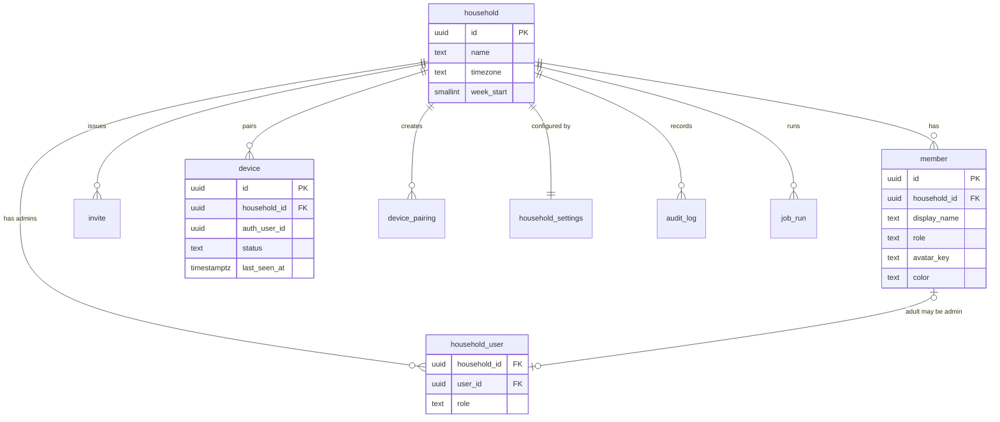
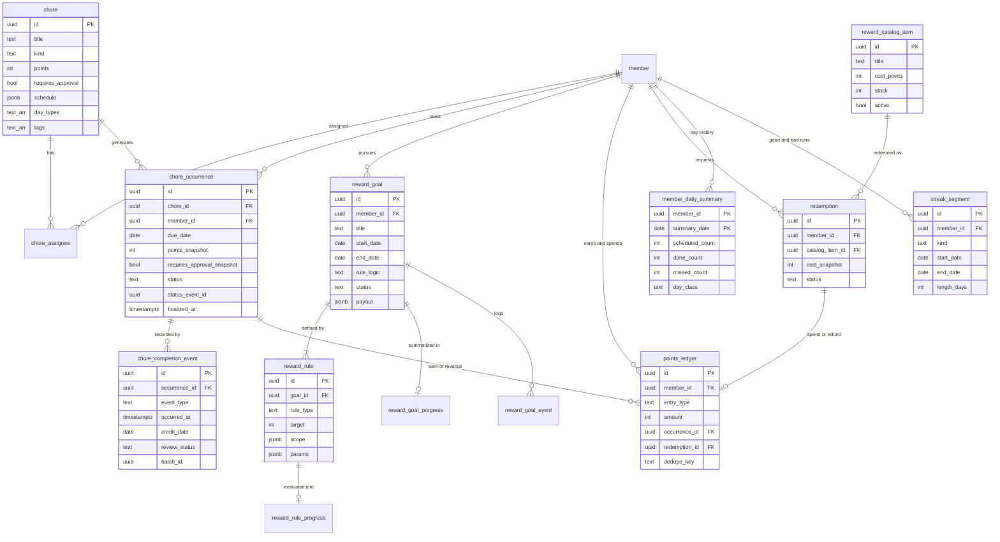
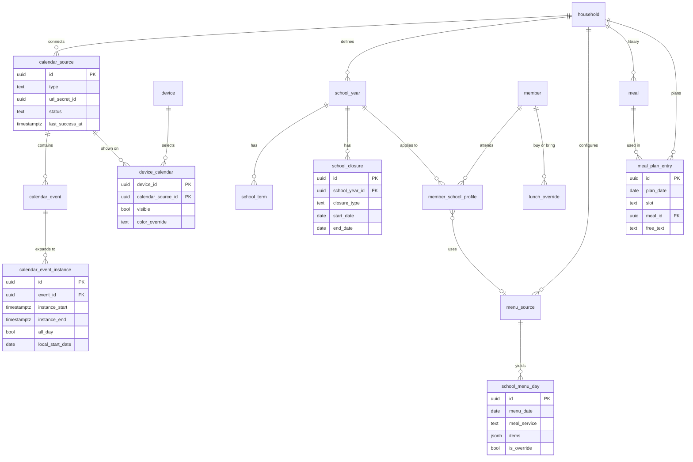

# 02 — Data Model

> Version 0.4 · Status: build baseline · Database: Supabase Postgres 15+ · Maintained by Claude Code
> v0.4: events fold in `occurred_at` order with a receipt-time clamp (D-20); board events outside the due date are flagged (D-21); the approval switch re-resolves `scheduled` occurrences only (D-22); day-close turns `rejected` into `missed` (D-23); closures regenerate dates after today only (D-24); ledger writes only through definer functions (D-28); rebuild is report-only unless applied.
> Companions: `01-technical-architecture.md` · `03-user-stories.md` · `04-requirements-traceability.md` · `05-backlog.md`

---

## 1. Conventions

- Primary keys are `uuid` (`gen_random_uuid()`), except `chore_completion_event.id`, which is **client-generated** (idempotency key).
- **Every table has `household_id uuid not null`** (FK to `household`), `created_at timestamptz default now()`, and `updated_at` where rows are mutable. (NFR-09)
- Instants are `timestamptz` (UTC). Business dates are `date` interpreted in `household.timezone`.
- Enumerations are `text` with `CHECK` constraints (easier to migrate than Postgres enums).
- Config entities are archived (`archived_at`), not deleted. Events and ledger rows are never updated or deleted.
- **Truth vs projection (v0.2):** `chore_completion_event` and `points_ledger` are append-only truth. `chore_occurrence.status`, `member_daily_summary`, `streak_segment` and all `*_progress` tables are **persisted projections** that can be rebuilt from truth at any time (§4.2).
- RLS enabled on **every** table in `public`; policies per `01-technical-architecture.md` §6.3. `supabase/tests/001_schema_lint.test.sql` fails CI if a public table lacks RLS or a non-null `household_id`, or if `anon` can execute a `private` function.
- Naming: snake_case, singular table names.

---

## 2. Entity-relationship diagrams

### 2.1 Tenancy, access, devices



### 2.2 Chores and rewards



### 2.3 Calendar, school year, meals, menu



---

## 3. Table catalog

### 3.1 Tenancy and access

| Table | Key columns | Notes |
|---|---|---|
| `household` | `name`, `timezone` (IANA), `week_start` (0–6), `locale` | `timezone` is authoritative for all business dates; an unknown zone is rejected by trigger (`private.check_timezone`). Its `id` is the tenant key, so it is the one table without a `household_id` column. |
| `household_user` | `household_id`, `user_id → auth.users`, `role` (`owner`/`admin`) | PK `(household_id, user_id)`. Defines admins. |
| `member` | `display_name`, `role` (`child`/`adult`), `avatar_key` (one of the 8 brand avatars), `color` (brand token key `member-1`..`member-6`, never hex, D-18), `birth_year?`, `user_id?`, `archived_at` | Children have no `user_id` (enforced by check). Supports multiple children. |
| `invite` | `email`, `token_hash`, `role`, `expires_at`, `accepted_at` | Token stored hashed. |
| `device` | `name`, `auth_user_id → auth.users`, `status` (`active`/`revoked`), `last_seen_at`, `app_version`, `board_config jsonb`, `revoked_at` | One auth user per device. |
| `device_pairing` | `code_hash`, `expires_at`, `consumed_at`, `device_id?`, `created_by` | Single-use; TTL capped at 10 minutes by check. |
| `household_settings` | `quiet_hours`, `celebration`, `streak_defaults`, `approval_mode` (`off`/`on`; household switch, changeable at any time), `undo_window_seconds`, `board_layout`, `points_settings` (all `jsonb`, zod-validated) | 1:1 with `household`. |
| `audit_log` | `actor_type`, `actor_id`, `action`, `entity_type`, `entity_id`, `diff jsonb`, `at` | Written by API for admin and device actions. |
| `job_run` | `job_type`, `target_id`, `started_at`, `finished_at`, `status` (`running`/`ok`/`error`/`skipped`), `stats jsonb`, `error` | One row per job per household. Feeds sync-health UI and stale indicators; written by jobs as service role, read by admins and the board. |
| `private.heartbeat` | `source` (PK), `beat_at`, `beats` | Infrastructure only: the keepalive target that stops Supabase Free from pausing the project (`01` §9.10). Not exposed through the API; not tenant data. |

### 3.2 Chores

| Table | Key columns | Notes |
|---|---|---|
| `chore` | `title`, `description`, `icon`, `kind` (`chore`/`task`), `points`, `approval` (`inherit`/`required`/`none`), `schedule jsonb`, `day_types text[]`, `tags text[]`, `start_date`, `end_date`, `archived_at` | `kind='task'` with a one-off schedule covers to-dos. |
| `chore_assignee` | `chore_id`, `member_id` | One occurrence is generated per assignee. |
| `chore_occurrence` | `chore_id`, `member_id`, `due_date`, `day_type`, `points_snapshot`, `requires_approval_snapshot` (resolved from the chore override and `approval_mode` at generation and whenever either changes, for `scheduled` occurrences only; check-offs already `pending_approval` stay in the queue, D-22), `status`, `status_event_id`, `status_changed_at`, `finalized_at` | `UNIQUE (chore_id, member_id, due_date)`. **`status` is a persisted projection** of the event log, maintained by trigger and by the day-close job (§4.2). `status_event_id` has no FK (avoids a cycle). Index `(household_id, member_id, due_date, status)`. Snapshots protect history from later chore edits. |
| `chore_completion_event` | see DDL §4.1 | **Append-only.** `batch_id` groups a bulk uncheck so it can be reviewed or reversed as one action (CHR-08). |

`chore_occurrence.status` values:

| Status | Meaning | Counts as done | Notes |
|---|---|---|---|
| `scheduled` | Open, due today or later | no | Initial value. |
| `completed` | Checked off, no approval needed | **yes** | Earns points. |
| `pending_approval` | Checked off, awaiting parent | no | Only when approval is required or flagged. |
| `approved` | Parent approved or admin-completed | **yes** | Earns points. |
| `rejected` | Parent rejected | no | Returns to open for the kid. Becomes `missed` at day-close if not redone (D-23). |
| `skipped` | Parent skipped | neutral | Excluded from numerator and denominator. |
| `missed` | Past due and never done | no (bad) | Set by the day-close job from `scheduled` or `rejected`; `finalized_at` is set at the same time. Shown only on past days, never on the board's today list. |

`schedule jsonb` shape (validated by zod):

```json
{ "freq": "daily|weekly|monthly|once",
  "interval": 1,
  "by_weekday": [1,2,3,4,5],
  "by_month_day": [1],
  "on_date": "2026-11-02" }
```

`day_types` is the allow-list of day types on which the chore applies (default: all). Example: homework chore = `{school_day}`.

### 3.3 Rewards

| Table | Key columns | Notes |
|---|---|---|
| `reward_goal` | `member_id?` (null = family goal), `title`, `description`, `image_path`, `reward_kind` (`item`/`experience`/`privilege`/`other`), `payout jsonb` (`{type:'custom'}` \| `{type:'points', amount}` \| `{type:'catalog_item', item_id}`), `start_date`, `end_date`, `rule_logic` (`all`/`any`), `status`, `achieved_at`, `redeemed_at`, `redeemed_by`, `celebrated_at`, `rules_version`, `archived_at` | `status`: `draft`, `scheduled`, `active`, `achieved`, `redeemed`, `expired`, `cancelled`. |
| `reward_rule` | `goal_id`, `rule_type` (`COUNT`/`STREAK`/`DAILY_ALL_DONE`/`POINTS`), `target`, `scope jsonb`, `params jsonb`, `sort_order` | `scope`: `{ "all": true }` or `{ "chore_ids": [...], "tags": [...] }`. |
| `reward_rule_progress` | `rule_id` PK, `goal_id`, `current_value`, `target_value`, `current_streak`, `best_streak`, `last_qualifying_date`, `is_met`, `computed_at`, `engine_version` | **Derived.** Rebuildable. |
| `reward_goal_progress` | `goal_id` PK, `pct`, `is_achieved`, `dirty`, `computed_at`, `engine_version` | **Derived.** `dirty` set by trigger. |
| `reward_goal_event` | `goal_id`, `type` (`created`, `activated`, `rules_changed`, `achieved`, `unachieved`, `payout_reversed`, `needs_review`, `redeemed`, `expired`, `cancelled`, `recomputed`), `actor`, `payload jsonb`, `at` | Lifecycle log; drives celebrations and history. |

### 3.3b Points economy and streak history

| Table | Key columns | Notes |
|---|---|---|
| `points_ledger` | `member_id`, `entry_type` (`earn`/`reversal`/`bonus`/`spend`/`refund`/`adjustment`), `amount` (signed), `occurrence_id?`, `redemption_id?`, `goal_id?`, `reason`, `dedupe_key` (unique), `created_by_type`, `created_by`, `created_at` | **Append-only.** Balance is a sum. A reversal after a spend may take the balance negative; the board shows it as a debt (R-12). |
| `reward_catalog_item` | `title`, `description`, `image_path`, `cost_points`, `stock?`, `weekly_limit?`, `active`, `sort_order`, `archived_at` | Admin-defined reward and activity inventory (arcade-style prizes). |
| `redemption` | `id` (client uuid), `member_id`, `catalog_item_id`, `cost_snapshot`, `status` (`requested`/`approved`/`denied`/`fulfilled`/`cancelled`), `requested_at`, `decided_at`, `decided_by`, `fulfilled_at`, `note` | Approval posts the `spend` entry. A request is accepted only if balance minus open requests is at least the cost. |
| `points_rule` | `rule_type` (`streak_bonus`/`all_done_bonus`), `params jsonb`, `bonus_points`, `active` | P2 bonus automation (PTS-05). |
| `member_daily_summary` | PK `(member_id, summary_date)`, `scheduled_count`, `done_count`, `missed_count`, `skipped_count`, `points_earned`, `day_class` (`good`/`bad`/`neutral`), `finalized_at` | One row per day, written by day-close. Feeds heatmaps and insights (RWD-11/12). Rebuildable. |
| `streak_segment` | `member_id`, `kind` (`good`/`bad`), `start_date`, `end_date?` (null = ongoing), `length_days`, `engine_version` | Raw runs of consecutive good or bad days, **no grace applied**. Goal streaks (with grace) are computed separately by the rules engine. Rebuildable. |

### 3.4 Calendar

| Table | Key columns | Notes |
|---|---|---|
| `calendar_source` | `name`, `type` (`ics`/`caldav`), `url_secret_id`, `username_secret_id?`, `color`, `member_id?`, `show_on_board`, `sync_interval_minutes` (default 15), `status` (`ok`/`error`/`disabled`), `last_synced_at`, `last_success_at`, `last_error`, `etag?`, `sync_token?` | Secrets only by Vault ID. |
| `calendar_event` | `source_id`, `ical_uid`, `recurrence_id?`, `title`, `location`, `start_at`, `end_at`, `all_day`, `tz`, `rrule?`, `is_cancelled`, `content_hash` | `UNIQUE (source_id, ical_uid, recurrence_id)`. Event descriptions/notes and attendees are **not stored**. |
| `device_calendar` | PK `(device_id, calendar_source_id)`, `visible`, `color_override?` | Which calendars each board shows (CAL-05). `calendar_source.show_on_board` is the default for new devices. |
| `calendar_event_instance` | `event_id`, `source_id`, `instance_start`, `instance_end`, `all_day`, `local_start_date`, `local_end_date`, `title`, `location` | Expanded window (today−7d .. today+120d). Board queries only this table. |

### 3.5 School year and day context

| Table | Key columns | Notes |
|---|---|---|
| `school_year` | `name`, `school_name?`, `start_date`, `end_date`, `is_default` | Multiple years allowed; one default per household. |
| `school_term` | `school_year_id`, `name`, `start_date`, `end_date` | Informational and available as reward-window presets. |
| `school_closure` | `school_year_id`, `name`, `start_date`, `end_date`, `closure_type` (`break`/`holiday`/`teacher_day`/`snow_day`/`other`) | `break` → day type `break`; others → `no_school`. |
| `member_school_profile` | `member_id`, `school_year_id`, `lunch_defaults jsonb` (`{"mon":"buy","tue":"bring",...}`), `menu_source_id?` | Per child, per year. Drives buyer/bringer defaults. |

**Day-type resolution** (`resolve_day_type`), precedence top to bottom:

| # | Condition | Day type |
|---|---|---|
| 1 | Saturday or Sunday | `weekend` |
| 2 | Inside a `break` closure | `break` |
| 3 | Inside any other closure | `no_school` |
| 4 | Inside the member's school year | `school_day` |
| 5 | Otherwise | `summer` |

The result is computed, never stored per day (the occurrence stores a snapshot of the type it was generated under).

When a closure or school year changes, the generator re-resolves and regenerates `scheduled` occurrences for dates **after today** only. Today's occurrences and the past are never touched (D-24).

### 3.6 Meals and school menu

| Table | Key columns | Notes |
|---|---|---|
| `meal` | `name`, `description`, `meal_types text[]`, `tags text[]`, `recipe_url`, `ingredients jsonb default '[]'`, `image_path`, `archived_at` | `ingredients` is carried now so a grocery list (MEAL-07) is additive later. |
| `meal_plan_entry` | `plan_date`, `slot` (`breakfast`/`snack`/`lunch`/`dinner`), `sort_order`, `member_id?` (null = whole household), `meal_id?`, `free_text?`, `notes` | Check: `meal_id IS NOT NULL OR free_text IS NOT NULL`. Multiple rows per slot allowed (snacks). |
| `lunch_override` | `member_id`, `date`, `mode` (`buy`/`bring`), `menu_item_ref?` | `UNIQUE (member_id, date)`. |
| `menu_source` | `name`, `adapter` (`nutrislice`/`schoolcafe`/`linq`/`csv`/`manual`), `config jsonb`, `status`, `last_fetch_at`, `last_success_at`, `last_error`, `fetch_window_days` (28) | Adapter is selected by `adapter`; config is adapter-specific. |
| `school_menu_day` | `menu_source_id`, `menu_date`, `meal_service` (`breakfast`/`lunch`), `items jsonb`, `no_service bool`, `origin` (`adapter`/`csv`/`manual`), `is_override`, `fetched_at`, `content_hash` | `UNIQUE (menu_source_id, menu_date, meal_service)`. Adapter refresh **never** overwrites `is_override = true`. |

**Effective lunch mode** for member *m* on date *d*:

```
if resolve_day_type(m, d) <> 'school_day'  -> none
else coalesce(lunch_override(m, d).mode,
              member_school_profile.lunch_defaults[weekday(d)])
```

If the effective mode is `buy`, the board shows `school_menu_day` for `(menu_source, d, 'lunch')`; if `bring`, it shows the planned `meal_plan_entry` for the lunch slot.

---

## 4. Key DDL

### 4.1 Append-only completion events

```sql
create table chore_completion_event (
  id            uuid primary key,                 -- client-generated idempotency key
  household_id  uuid not null references household(id),
  occurrence_id uuid not null references chore_occurrence(id),
  member_id     uuid not null references member(id),
  event_type    text not null check (event_type in
                  ('complete','undo','approve','reject',
                   'admin_complete','admin_uncomplete','skip')),
  actor_type    text not null check (actor_type in ('device','admin','system')),
  actor_id      uuid,
  occurred_at   timestamptz not null,             -- client-claimed time
  recorded_at   timestamptz not null default now(),
  credit_date   date not null,                    -- always the occurrence due_date
  points_delta  int  not null default 0,
  review_status text not null default 'accepted'
                  check (review_status in ('accepted','flagged')),
  batch_id      uuid,                             -- groups a bulk uncheck (CHR-08)
  note          text
);
create index on chore_completion_event (household_id, member_id, credit_date);
create index on chore_completion_event (occurrence_id, occurred_at desc, recorded_at desc, id desc);

-- Server-side normalization (never trust the caller): household, member and credit date come
-- from the occurrence; occurred_at is clamped to receipt time (D-20); a board event outside the
-- occurrence's due date is flagged for a parent (D-21).
create function private.normalize_completion_event() returns trigger
language plpgsql security definer set search_path = '' as $$
declare o record;
begin
  select occ.household_id, occ.member_id, occ.due_date, h.timezone
    into strict o
    from public.chore_occurrence occ
    join public.household h on h.id = occ.household_id
   where occ.id = new.occurrence_id;
  new.household_id := o.household_id;
  new.member_id    := o.member_id;
  new.credit_date  := o.due_date;
  new.recorded_at  := now();
  new.occurred_at  := least(new.occurred_at, new.recorded_at);
  if new.actor_type = 'device'
     and (new.occurred_at at time zone o.timezone)::date <> o.due_date then
    new.review_status := 'flagged';
  end if;
  return new;
end $$;

create trigger trg_cce_normalize before insert on chore_completion_event
  for each row execute function private.normalize_completion_event();

create function private.prevent_mutation() returns trigger
language plpgsql as $$ begin raise exception 'append-only table'; end $$;

create trigger trg_cce_immutable
  before update or delete on chore_completion_event
  for each row execute function private.prevent_mutation();
revoke truncate on chore_completion_event from public, anon, authenticated;
```

### 4.2 Occurrence status projection (events are truth, status is persisted)

`chore_occurrence.status` is written only by the three functions below. It can always be rebuilt from `chore_completion_event`.

```sql
alter table chore_occurrence
  add column status            text not null default 'scheduled'
    check (status in ('scheduled','completed','pending_approval','approved',
                      'rejected','skipped','missed')),
  add column status_event_id   uuid,              -- last event folded in; no FK on purpose
  add column status_changed_at timestamptz,
  add column finalized_at      timestamptz;       -- set by day-close; null while the day is open
create index on chore_occurrence (household_id, member_id, due_date, status);

-- Single source of folding logic (used by the trigger and by rebuild).
-- The latest event by event time wins (D-20); ties break on recorded_at, then id.
create type private.folded_status as (status text, event_id uuid);

create function private.fold_occurrence_status(p_occ uuid) returns private.folded_status
language sql stable set search_path = '' as $$
  select row(
           case
             when e.event_type is null then
               case when o.finalized_at is not null then 'missed' else 'scheduled' end
             when e.event_type = 'complete' then
               case when o.requires_approval_snapshot or e.review_status = 'flagged'
                    then 'pending_approval' else 'completed' end
             when e.event_type in ('approve', 'admin_complete') then 'approved'
             when e.event_type = 'skip' then 'skipped'
             -- reject, undo and admin_uncomplete reopen the chore; once the day is closed it is missed (D-23)
             when o.finalized_at is not null then 'missed'
             when e.event_type = 'reject' then 'rejected'
             else 'scheduled'
           end,
           e.id)::private.folded_status
  from public.chore_occurrence o
  left join lateral (
    select ev.id, ev.event_type, ev.review_status
    from public.chore_completion_event ev
    where ev.occurrence_id = o.id
    order by ev.occurred_at desc, ev.recorded_at desc, ev.id desc
    limit 1
  ) e on true
  where o.id = p_occ
$$;

-- Keep status current on every event (same transaction as the insert).
-- status_event_id is the event the status was folded from, which may not be the event just inserted.
create function private.apply_completion_event() returns trigger
language plpgsql security definer set search_path = '' as $$
begin
  update public.chore_occurrence o
     set status            = f.status,
         status_event_id   = f.event_id,
         status_changed_at = case when o.status is distinct from f.status
                                  then now() else o.status_changed_at end
    from private.fold_occurrence_status(new.occurrence_id) f
   where o.id = new.occurrence_id;
  return new;
end $$;

create trigger trg_cce_apply after insert on chore_completion_event
  for each row execute function private.apply_completion_event();

-- Day close: runs hourly (cheap, idempotent). Closes any household whose local day has ended.
create function private.close_past_due(p_household uuid default null) returns int
language plpgsql security definer set search_path = '' as $$
declare n int;
begin
  with closing as (
    select o.id
    from public.chore_occurrence o
    join public.household h on h.id = o.household_id
    where o.finalized_at is null
      and o.due_date < (now() at time zone h.timezone)::date
      and (p_household is null or o.household_id = p_household)
    for update of o skip locked
  )
  update public.chore_occurrence o
     set finalized_at      = now(),
         status            = case when o.status in ('scheduled', 'rejected') then 'missed'
                                  else o.status end,
         status_changed_at = case when o.status in ('scheduled', 'rejected') then now()
                                  else o.status_changed_at end
    from closing c
   where o.id = c.id;
  get diagnostics n = row_count;
  -- the job then upserts member_daily_summary and streak_segment for the closed dates
  -- (rules-engine evaluateHistory) and writes a job_run row
  return n;
end $$;

-- Rebuild (admin tool and nightly check): re-fold every occurrence in range and report drift.
-- Report-only by default; p_apply => true writes the corrections (which may post ledger corrections
-- through trg_occ_points).
create function private.rebuild_occurrence_status(
  p_household uuid, p_from date, p_to date, p_apply boolean default false)
returns table (occurrence_id uuid, was text, now_is text)
language sql security definer set search_path = '' as $$
  with drift as (
    select o.id, o.status as was, f.status as now_is, f.event_id
    from public.chore_occurrence o
    cross join lateral private.fold_occurrence_status(o.id) f
    where o.household_id = p_household
      and o.due_date between p_from and p_to
      and (o.status is distinct from f.status or o.status_event_id is distinct from f.event_id)
  ), applied as (
    update public.chore_occurrence o
       set status = d.now_is, status_event_id = d.event_id, status_changed_at = now()
      from drift d
     where p_apply and o.id = d.id
    returning o.id
  )
  select d.id, d.was, d.now_is from drift d
$$;
```

Rules:

- Late credit after day-close is a parent action (`admin_complete`, D-21). It folds normally; `credit_date` stays the due date, and history tables are re-derived for that date. A board event outside the due date is stored `flagged` and folds to `pending_approval`.
- `missed` is therefore a status, not a tombstone: an undo of a late completion returns the occurrence to `missed`.
- Conflicts resolve by event time (D-20): an event that arrives late but happened earlier than the current folded event does not change the status.
- Counted-as-done: `completed`, `approved`. Neutral (excluded from numerator and denominator): `skipped`. Bad: `missed`. Not counted: `scheduled`, `pending_approval`, `rejected`.
- A nightly job runs `rebuild_occurrence_status` (report-only) for the last 14 days and alerts on drift (NFR-06); applying the fix is an explicit admin action.

### 4.2b Points ledger

```sql
create table points_ledger (
  id            uuid primary key default gen_random_uuid(),
  household_id  uuid not null references household(id),
  member_id     uuid not null references member(id),
  entry_type    text not null check (entry_type in
                  ('earn','reversal','bonus','spend','refund','adjustment')),
  amount        int  not null,                    -- signed
  occurrence_id uuid references chore_occurrence(id),
  redemption_id uuid,
  goal_id       uuid,
  reason        text,
  dedupe_key    text not null unique,
  created_by_type text not null check (created_by_type in ('system','admin','device')),
  created_by    uuid,
  created_at    timestamptz not null default now()
);
create index on points_ledger (household_id, member_id, created_at);
create trigger trg_pl_immutable before update or delete on points_ledger
  for each row execute function private.prevent_mutation();

-- Earn on entering a done status; reverse on leaving it.
create function private.post_points() returns trigger
language plpgsql security definer set search_path = '' as $$
declare was_done bool := old.status in ('completed','approved');
        is_done  bool := new.status in ('completed','approved');
begin
  if new.points_snapshot = 0 or was_done = is_done then return new; end if;
  insert into public.points_ledger
    (household_id, member_id, entry_type, amount, occurrence_id, dedupe_key, created_by_type)
  values
    (new.household_id, new.member_id,
     case when is_done then 'earn' else 'reversal' end,
     case when is_done then new.points_snapshot else -new.points_snapshot end,
     new.id,
     'occ:' || new.id || case when is_done then ':earn:' else ':rev:' end || new.status_event_id,
     'system')
  on conflict (dedupe_key) do nothing;
  return new;
end $$;

create trigger trg_occ_points after update of status on chore_occurrence
  for each row execute function private.post_points();

create view v_points_balance with (security_invoker = true) as
select member_id,
       sum(amount)::int                                   as balance,
       coalesce(sum(amount) filter (where amount > 0 and entry_type in ('earn','bonus')), 0)::int
                                                          as earned_total
from points_ledger group by member_id;
```

**Ledger write functions (D-28).** Application code never inserts into `points_ledger`. Earn and reversal come from `trg_occ_points`; every other entry goes through one `SECURITY DEFINER` function, `private.post_ledger(...)` (insert `on conflict (dedupe_key) do nothing`), called by these entry points:

| Entry point | Caller | Entry | Dedupe key |
|---|---|---|---|
| `public.adjust_points(member, amount, reason, request_id)` | admin (RLS-checked inside) | `adjustment` | `adj:{request_id}` |
| `public.decide_redemption(redemption, 'approve' \| 'deny')` | admin | `spend` on approve | `red:{id}:spend` |
| `public.cancel_redemption(redemption)` | admin, or device while `requested` | `refund` if it was approved | `red:{id}:refund` |
| `private.post_goal_payout(goal, n)` / `private.reverse_goal_payout(goal, n)` | reconcile job | `bonus` / `reversal` | `goal:{id}:payout:{n}` / `goal:{id}:payout_rev:{n}` |
| `private.post_points_rule_bonus(rule, member, key)` | reconcile job | `bonus` | `rule:{id}:{member}:{key}` |

Redemption flow: `requested` (`public.request_redemption` checks `balance − sum(open requests) ≥ cost` under a member lock) → admin `approved` (spend posted) or `denied`; `cancelled` before approval; after approval a cancel posts a `refund`. `fulfilled` is bookkeeping only.

### 4.3 Dirty-marking trigger

```sql
create function private.mark_goals_dirty() returns trigger
language plpgsql security definer set search_path = '' as $$
begin
  update public.reward_goal_progress p
     set dirty = true
    from public.reward_goal g
   where p.goal_id = g.id
     and g.household_id = new.household_id
     and g.status in ('active','achieved')
     and (g.member_id is null or g.member_id = new.member_id)
     and g.start_date <= new.credit_date
     and (g.end_date is null or g.end_date >= new.credit_date);
  return new;
end $$;

create trigger trg_cce_dirty after insert on chore_completion_event
  for each row execute function private.mark_goals_dirty();
```

### 4.4 Day type

```sql
create function public.resolve_day_type(p_member uuid, p_date date)
returns text language sql stable as $$
  with sy as (
    select y.id, y.start_date, y.end_date
    from member_school_profile sp
    join school_year y on y.id = sp.school_year_id
    where sp.member_id = p_member
      and p_date between y.start_date and y.end_date
    limit 1
  )
  select case
    when extract(isodow from p_date) in (6,7) then 'weekend'
    when exists (select 1 from school_closure c join sy on sy.id = c.school_year_id
                 where c.closure_type = 'break'
                   and p_date between c.start_date and c.end_date) then 'break'
    when exists (select 1 from school_closure c join sy on sy.id = c.school_year_id
                 where p_date between c.start_date and c.end_date) then 'no_school'
    when exists (select 1 from sy) then 'school_day'
    else 'summer'
  end
$$;
```

### 4.5 RLS helpers (pattern)

```sql
create function private.admin_household_ids() returns setof uuid
language sql stable security definer set search_path = '' as $$
  select household_id from public.household_user where user_id = (select auth.uid())
$$;

create function private.device_household_id() returns uuid
language sql stable security definer set search_path = '' as $$
  select household_id from public.device
  where auth_user_id = (select auth.uid()) and status = 'active'
$$;

-- example policies on a board-readable table
create policy chore_admin_all on public.chore for all to authenticated
  using (household_id in (select private.admin_household_ids()))
  with check (household_id in (select private.admin_household_ids()));
create policy chore_device_read on public.chore for select to authenticated
  using (household_id = private.device_household_id());
```

### 4.6 Board snapshot contract

`board_snapshot(p_from date, p_to date) returns jsonb` (SECURITY INVOKER, so RLS applies). Resolves the household from the caller, then returns:

```
{ fetched_at, household: {timezone, week_start},
  members: [...], day_types: {member_id: {date: type}},
  occurrences: [... chore_occurrence incl. status ...],
  points: { balance, earned_total, open_requests, recent_ledger },
  catalog: [ reward_catalog_item rows (active) ], redemptions: [ open and recent ],
  streaks: { current_good, best_good, current_bad, heatmap: [ member_daily_summary rows ] },
  goals: [ {goal, rules, progress} ],
  calendar: [ calendar_event_instance rows for this device's device_calendar selection ],
  meals: [ meal_plan_entry + meal ], lunch: [ effective mode per child per day ],
  school_menu: [ school_menu_day rows for buy days ] }
```

---

## 5. Rules-engine contract (`packages/rules-engine`)

Pure functions, no I/O, no `Date.now()` (the clock is an input).

```ts
type RuleType = 'COUNT' | 'STREAK' | 'DAILY_ALL_DONE' | 'POINTS';
type OccurrenceStatus = 'scheduled'|'completed'|'pending_approval'|'approved'
                      | 'rejected'|'skipped'|'missed';
interface RuleScope { all?: boolean; chore_ids?: string[]; tags?: string[] }
interface StreakParams {
  grace_per_week: number;                       // goal streaks only; misses forgiven per household week (default 1)
  qualify: { mode: 'all_scheduled' | 'min_count' | 'min_pct'; value?: number };
}
interface Rule { id: string; type: RuleType; target: number; scope: RuleScope;
                 params: Record<string, unknown> }
interface OccurrenceFact {                      // straight from chore_occurrence
  id: string; chore_id: string; member_id: string; tags: string[];
  due_date: string; status: OccurrenceStatus; points: number }
interface GoalInput { goal: { id: string; member_id: string|null; start_date: string;
                              end_date: string|null; rule_logic: 'all'|'any'; status: string };
                      rules: Rule[]; occurrences: OccurrenceFact[];
                      asOf: string /* household-local date */; weekStart: number }
interface GoalEvaluation { goal_id: string; pct: number; is_achieved: boolean;
                           rules: RuleProgress[]; transitions: GoalTransition[] }

function evaluateGoal(input: GoalInput): GoalEvaluation;   // deterministic, side-effect free

// History (RWD-11): raw good and bad runs, no grace, used for insights and the heatmap
interface HistoryInput { memberId: string; occurrences: OccurrenceFact[]; asOf: string }
interface DailySummary { date: string; scheduled: number; done: number; missed: number;
                         skipped: number; points: number; dayClass: 'good'|'bad'|'neutral'|'open' }
interface StreakSegment { kind: 'good'|'bad'; start: string; end: string|null; length: number }
function evaluateHistory(input: HistoryInput):
  { days: DailySummary[]; segments: StreakSegment[];
    current: { kind: 'good'|'bad'|null; length: number }; bestGood: number; worstBad: number };
```

`missed` is now an input status, not something the engine infers. The engine never reads a clock; "today" is `asOf`.

### Rule semantics

| Rule | Counts | Edge cases |
|---|---|---|
| `COUNT` | in-scope occurrences in `completed`/`approved` with `due_date` in `[start, end]` | `pending_approval`, `rejected`, `missed` do not count; `undo` removes the count |
| `POINTS` | sum of `points` for the same set | uses `points_snapshot`, so later chore edits don't change history |
| `DAILY_ALL_DONE` | number of days where **every** in-scope scheduled occurrence is done | days with zero scheduled (or all skipped) are not counted and not penalized |
| `STREAK` | consecutive qualifying days | see below |

**Day classes (history and streaks)**

| Class | Definition |
|---|---|
| `neutral` | No in-scope occurrences, or all `skipped`. Does not extend or break a run. |
| `open` | Today (`asOf`) or any day with a `scheduled` occurrence not yet finalized. Never counted as bad. |
| `good` | Finalized day where the qualify mode is satisfied (default: every non-skipped occurrence done). |
| `bad` | Finalized day with at least one `missed` and the qualify mode not satisfied. |

**Raw history** (`evaluateHistory`): a good streak is consecutive `good` days; a bad streak is consecutive `bad` days; `neutral` days are transparent. No grace. This is what the board's "current streak" flame, the heatmap, and the parent insights show.

**Goal streaks** (`STREAK` rule)

- Same day classes, plus up to `grace_per_week` bad days per household week are forgiven (they neither extend nor reset). A further bad day resets `current_streak` to 0.
- **Today never counts as a miss** until the household-local day has been finalized.
- `best_streak` is always reported alongside `current_streak`.
- A goal is achieved when `rule_logic = 'all'` → every rule met; `'any'` → at least one rule met. `pct` = mean of rule completion (`all`) or max (`any`), capped at 100.
- **Achievement is derived and reversible.** A goal is achieved only while its rules are met by occurrences that are currently in a done status. If a completion is later reversed (uncheck, bulk uncheck, rejection) and the rules are no longer met, the goal returns from `achieved` to `active`, `achieved_at` and `celebrated_at` are cleared, and an `unachieved` event is logged.
- **Payouts follow achievement.** On achievement the `payout` executes once per achievement (custom: celebration only; points: a `bonus` ledger entry with dedupe `goal:{id}:payout:{n}`; catalog_item: an auto-approved `redemption`), where `n` counts achievements of that goal. On `unachieved`, a points payout is cancelled by a `reversal` entry (dedupe `goal:{id}:payout_rev:{n}`) and an unfulfilled catalog redemption is cancelled. If the reward was already `fulfilled` or the goal already `redeemed`, the status is left alone, a `needs_review` event is logged, and the admin sees a flag. The points reversal still posts.
- Re-achieving after a fix starts a new achievement (`n+1`) and celebrates and pays out again.

### Recompute guarantees

- Given identical inputs, output is identical (property-tested).
- Changing a goal's rules triggers `recomputed` on the next evaluation, replayed against full history in `[start, end]`. The admin UI shows a **preview** of the new result before saving (RWD-10).
- `engine_version` is stored on derived rows; bumping it forces a full recompute in the nightly job. `member_daily_summary` and `streak_segment` are rebuilt the same way.

---

## 6. Indexing, retention, lifecycle

| Concern | Decision |
|---|---|
| Hot read paths | `chore_occurrence (household_id, member_id, due_date, status)`, `points_ledger (household_id, member_id, created_at)`, `member_daily_summary (member_id, summary_date)`, `calendar_event_instance (household_id, local_start_date)`, `meal_plan_entry (household_id, plan_date, slot)` |
| Retention | Events and goal history kept indefinitely (tiny volume). `calendar_event_instance` pruned to window. `job_run` pruned at 90 days. `points_ledger`, `member_daily_summary`, `streak_segment` kept indefinitely. `audit_log` kept 2 years. |
| Export | `/admin/settings/export` returns a JSON/CSV bundle of all household data (NFR-05). |
| Delete | Household deletion cascades via a documented procedure (not raw FK cascade on append-only tables); child profile deletion removes `member` PII and anonymizes events. |
| Migration order | tenancy → devices → chores/occurrences/events + status projection → points ledger + catalog + redemptions → history tables + `close_past_due` → rewards (+ triggers) → school year + `resolve_day_type` → calendar (+ `device_calendar`) → meals/menu → `board_snapshot` → RLS pgTAP suite |
| Seed data | one household, 2 admins, 1 child, 6 chores, 14 days of mixed good/missed history, 5 catalog items with a points balance, 2 goals (count + streak, one with a points payout), 1 ICS fixture, 1 school year with breaks, 1 week of meals |

---

## 7. Entity → requirement map

| Entity | Requirements |
|---|---|
| `household`, `household_settings`, `household_user`, `invite`, `member` | ACC-01..04, NFR-09 |
| `device`, `device_pairing` | DEV-01..03, NFR-04 |
| `audit_log` | ACC-05 |
| `job_run` | DEV-08, CAL-06, MENU-04, NFR-07 |
| `chore`, `chore_assignee`, `chore_occurrence` (incl. `status`) | CHR-01..03, CHR-07, SCH-03 |
| `chore_completion_event` | CHR-04..08, DEV-06, NFR-06 |
| `points_ledger`, `v_points_balance`, `reward_catalog_item`, `redemption`, `points_rule` | PTS-01..06 |
| `member_daily_summary`, `streak_segment` | RWD-11, RWD-12 |
| `reward_goal`, `reward_rule`, `reward_rule_progress`, `reward_goal_progress`, `reward_goal_event` | RWD-01..10, RWD-13 |
| `calendar_source`, `calendar_event`, `calendar_event_instance` | CAL-01..08 |
| `device_calendar` | CAL-05 |
| `school_year`, `school_term`, `school_closure`, `member_school_profile` | SCH-01..04, MEAL-04 |
| `meal`, `meal_plan_entry`, `lunch_override` | MEAL-01..08 |
| `menu_source`, `school_menu_day` | MENU-01..05, MEAL-05 |
