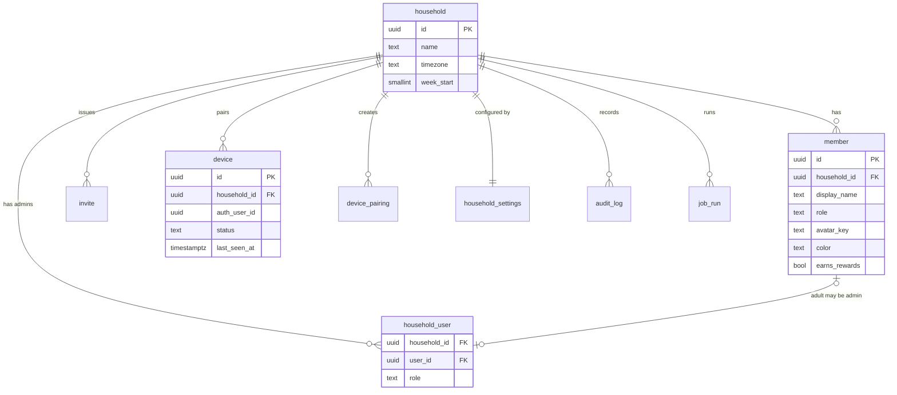
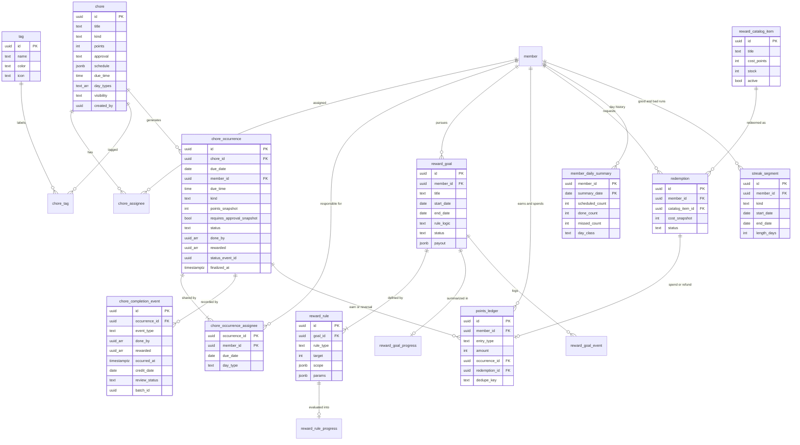
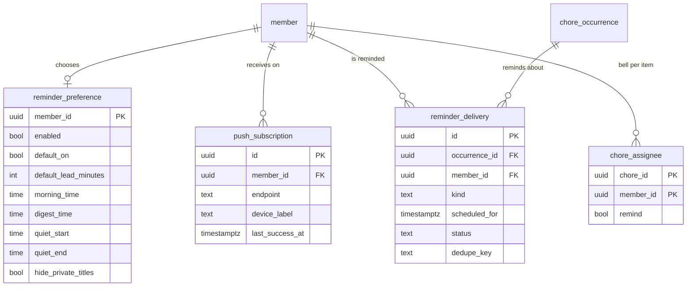

# 02 — Data Model

> Version 0.8 · Status: build baseline · Database: Supabase Postgres 15+ · Maintained by Claude Code
> v0.8.16: a parent's day (WP-12, D-52): `undo_uncheck_batch()` puts back a "Not actually done" batch (§4.7).
> v0.8.14: the board's Today (WP-11, D-50): the snapshot's `occurrences` and `household.undo_window_seconds` as built; `chore_occurrence` and `chore` join the Realtime publication (§4.6).
> v0.8.13: the points ledger (WP-16, D-49): `points_ledger` and `v_points_balance` as built; earn and reversal reconcile each occurrence's points; `adjust_points()`; the snapshot's points; the ledger drift check (§3.3b, §4.2b, §4.6, §4.7).
> v0.8.12: everyone does their own (WP-43, D-47): `chore.assignment` (`each` or `shared`) and `chore_occurrence.member_id`, one occurrence per item, day and person (§3.2).
> v0.8.11: completion events (WP-10, D-46): `chore_completion_event` as built, with who recorded it taken from the session; the fold, day close, rebuild and drift check; `record_completions()` (§4.1, §4.2, §4.5, §4.7).
> v0.8.10: occurrences (WP-09, D-45): `chore_occurrence` and `chore_occurrence_assignee` as built, with each assignee's day type in the snapshot; the generator, re-planning triggers and `v_member_occurrence` (§3.2, §4.2, §4.5, §4.7).
> v0.8.9: school years (WP-21, D-44): `school_year`, `school_term`, `school_closure` and `member_school_profile` as built; `resolve_day_type` and the day-type functions (§3.5, §4.4, §4.8).
> v0.8.8: the family list (WP-08, D-43): `chore`, `chore_assignee`, `tag` and `chore_tag` as built, `save_chore()`, private items in RLS and in `audit_log` (§3.2, §4.5, §4.8).
> v0.8.7: System Health (WP-42, D-42): `private.app_error.household_id`, `private.usage_sample`, `household_errors()`, `system_usage()` and the 7-argument `record_app_error()` (§3.1, §4.7, §6).
> v0.8.6: `calendar_source.content_hash` and how the sync uses `etag` (SPIKE-02, §3.1).
> v0.8.5: board snapshot (WP-06, D-41): `public.board_snapshot` as built (members slice, defaults, who gets null) and `device.board_config.theme` (§3.1, §4.6, §4.8).
> v0.8.4: boards (WP-05, D-40): `device_pairing.device_name`, `private.pairing_failure`, and the pairing, revoke and heartbeat functions (§3.1, §4.8); a board's status changes only through `revoke_device` (§3.1); retention (§6).
> v0.8.3: members (WP-04): `member.user_id` links only to an admin of the same household and is cleared when that admin leaves (§3.1, §4.8).
> v0.8.2: admin access (WP-03, D-39): `audit_log` written by triggers, `private.household_setup_code`, and the onboarding and invite functions (§3.1, §4.8).
> v0.8.1: job framework (WP-07): `private.job_schedule`, `private.app_error`, `public.job_health()`, `public.record_app_error()`, `private.call_job()` (§3.1, §4.7); retention for job history and errors (§6).
> v0.8: seed data is the demo family (`supabase/seed.sql`, D-37), the household previews and e2e run as in the one database.
> v0.7: reminders (D-35): `reminder_preference`, `push_subscription`, `reminder_delivery` (§2.4, §3.7); `chore_assignee.remind`, `chore.remind_lead_minutes`.
> v0.6: one family list (D-30..D-34): one shared occurrence per due date with an assignee snapshot (`chore_occurrence_assignee`) and `done_by`/`rewarded` credit on events; per-member status view with `covered`; routines get missed, tasks carry over; `due_time`; household `tag` list referenced by id; private visibility in RLS; `member.earns_rewards`; ledger posts per rewarded member.
> v0.4: events fold in `occurred_at` order with a receipt-time clamp (D-20); board events outside the due date are flagged (D-21); the approval switch re-resolves `scheduled` occurrences only (D-22); day-close turns `rejected` into `missed` (D-23); closures regenerate dates after today only (D-24); ledger writes only through definer functions (D-28); rebuild is report-only unless applied.
> Companions: `01-technical-architecture.md` · `03-user-stories.md` · `04-requirements-traceability.md` · `05-backlog.md`

---

## 1. Conventions

- Primary keys are `uuid` (`gen_random_uuid()`), except `chore_completion_event.id`, which is **client-generated** (idempotency key).
- **Every table has `household_id uuid not null`** (FK to `household`), `created_at timestamptz default now()`, and `updated_at` where rows are mutable. (NFR-09)
- Instants are `timestamptz` (UTC). Business dates are `date` interpreted in `household.timezone`.
- Enumerations are `text` with `CHECK` constraints (easier to migrate than Postgres enums).
- Config entities are archived (`archived_at`), not deleted. Events and ledger rows are never updated or deleted.
- **Truth vs projection (v0.2):** `chore_completion_event` and `points_ledger` are append-only truth. `chore_occurrence.status`, `member_daily_summary`, `streak_segment` and all `*_progress` tables are **persisted projections** that can be rebuilt from truth at any time (§4.2).
- RLS enabled on **every** table in `public`; policies per `01-technical-architecture.md` §6.3. `supabase/tests/001_schema_lint.test.sql` fails CI if a public table lacks RLS or a non-null `household_id`, or if `anon` can execute a `private` function.
- **Ownership is a member reference, never a tag** (D-30): `chore_assignee` links items to members of any role; tags are household categories (`tag`) referenced by id (D-33).
- **Visibility** (D-34): an item is `family` (board and every admin) or `private` (its creator and assignees who sign in). Every table derived from an item (occurrences, assignee snapshots, events, audit rows) applies the same rule through `private.can_see_chore`.
- Naming: snake_case, singular table names.

---

## 2. Entity-relationship diagrams

### 2.1 Tenancy, access, devices



### 2.2 Chores and rewards



### 2.3 Calendar, school year, meals, menu


### 2.4 Reminders



---

## 3. Table catalog

### 3.1 Tenancy and access

| Table | Key columns | Notes |
|---|---|---|
| `household` | `name`, `timezone` (IANA), `week_start` (0–6), `locale` | `timezone` is authoritative for all business dates; an unknown zone is rejected by trigger (`private.check_timezone`). Its `id` is the tenant key, so it is the one table without a `household_id` column. |
| `household_user` | `household_id`, `user_id → auth.users`, `role` (`owner`/`admin`) | PK `(household_id, user_id)`. Defines admins. |
| `member` | `display_name`, `role` (`child`/`adult`), `avatar_key` (one of the 8 brand avatars), `color` (brand token key `member-1`..`member-6`, never hex, D-18), `birth_year?`, `user_id?`, `earns_rewards`, `archived_at` | Children have no `user_id` (enforced by check). An adult's `user_id` must be an admin of the same household (`trg_member_user`), and is cleared when that admin leaves it (WP-04). Archived, never deleted, from the admin app. Supports multiple children. `earns_rewards` is set from the role on insert (on for a child, off for an adult) and can be changed per person (D-32). |
| `invite` | `email`, `token_hash`, `role`, `invited_by`, `expires_at`, `accepted_at`, `accepted_by`, `revoked_at` | Token stored only as its SHA-256 (D-39). One use, 7 days, accepted only by an account with its email; a new invite to the same email revokes the open one; admins can cancel. |
| `device` | `name`, `auth_user_id → auth.users`, `status` (`active`/`revoked`), `last_seen_at`, `app_version`, `board_config jsonb`, `revoked_at` | One auth user per device, created by `redeem_pairing_code` (D-40). Admins update only `name` and `board_config` (column grants); `status` changes only through `revoke_device`, and a revoked board is never reactivated (trigger). `last_seen_at` and `app_version` are left out of the audit. `board_config.theme` is `auto` (or absent), `day` or `evening` (check constraint; an admin's hold, WP-06). |
| `device_pairing` | `code_hash`, `device_name`, `expires_at`, `consumed_at`, `device_id?`, `created_by` | 8 digits, stored as the SHA-256 of the digits; single use; TTL capped at 10 minutes by check. |
| `private.pairing_failure` | `at` | One row per wrong code, across all households; 20 within 10 minutes pause pairing. Pruned after a day. |
| `household_settings` | `quiet_hours`, `celebration`, `streak_defaults`, `approval_mode` (`off`/`on`; household switch, changeable at any time), `undo_window_seconds`, `board_layout`, `points_settings` (all `jsonb`, zod-validated) | 1:1 with `household`. |
| `audit_log` | `actor_type` (`admin`/`device`/`system`), `actor_id`, `action` (`insert`/`update`/`delete`), `entity_type`, `entity_id`, `chore_id?`, `diff jsonb`, `at` | Written only by the `trg_audit` triggers (`private.audit_row()`, §4.8) on every household table, so no route can skip it (D-39): inserts and deletes keep the row, updates keep the changed columns as `{from, to}`; hashes and timestamps are never copied. Admins of the household read it; nobody writes it directly. Rows about an item carry its `chore_id`, so a private item's history is visible only to those who can see the item (D-34). |
| `private.household_setup_code` | `code_hash` (PK), `created_at`, `expires_at`, `used_at`, `used_by`, `household_id` | One-time codes for creating a household (D-39), issued by the setup-code workflow for 24 hours. Only the SHA-256 of the code (upper-cased, separators removed) is stored. Not exposed through the API. |
| `job_run` | `job_type`, `target_id`, `started_at`, `finished_at`, `status` (`running`/`ok`/`error`/`skipped`), `stats jsonb`, `error` | One row per job per household per call, written by the job endpoint as service role (`running` before it answers, then the outcome); read by admins and the board, and summarized by `job_health()` (§4.7). `skipped` means nothing to do yet, or out of time with the rest left for the next call. |
| `private.heartbeat` | `source` (PK), `beat_at`, `beats` | Infrastructure only: the keepalive target that stops Supabase Free from pausing the project (`01` §9.10). Not exposed through the API; not tenant data. |
| `private.job_schedule` | `job_type` (PK), `cron`, `kind` (`http`/`sql`), `every_minutes`, `updated_at` | Infrastructure: mirrors `apps/web/lib/jobs/schedule.json`, written by the deploy with the pg_cron jobs (`01` §5.6); gives `job_health()` each job's cadence. Readable by signed-in users (schedules only, no data). |
| `private.app_error` | `occurred_at`, `request_id`, `method`, `route`, `kind` (`render`/`route`/`action`/`proxy`/`job`), `message` (scrubbed, at most 1000 characters), `digest`, `household_id?` | Infrastructure: server errors from Next.js `onRequestError` and failed jobs, kept longer than Vercel Hobby's one hour of logs, for System Health (WP-42). `household_id` is the household the error happened for (the job's, or the request's board or admin; D-42); errors on signed-out pages have none and appear on no household's page. No request body, no PII (NFR-05). Written only through `record_app_error()` by the service role; read only through `household_errors()`. |
| `private.usage_sample` | `taken_at`, `source` (`vercel`), `period_start`, `service`, `unit`, `account_quantity`, `project_quantity` | Infrastructure: the Vercel account's usage over the last 30 days for the services with Hobby limits, written daily by the usage workflow (`scripts/usage-sample.sh`), the account's total and this project's share. Read only through `system_usage()`; kept 90 days. |

### 3.2 Chores

| Table | Key columns | Notes |
|---|---|---|
| `chore` | `title`, `description`, `icon`, `kind` (`chore` routine / `task` to-do), `points`, `approval` (`inherit`/`required`/`none`), `schedule jsonb`, `due_time?` (household-local), `day_types text[]`, `visibility` (`family`/`private`), `created_by → auth.users`, `remind_lead_minutes?`, `start_date`, `end_date`, `archived_at` | One model for the whole family's list (D-30). A routine not done on its day becomes `missed`; a task, one-off or repeating, stays open and shows as overdue until done or cancelled (D-31). `due_time` orders and groups the day; it never changes scoring. |
| `chore_assignee` | `chore_id`, `member_id`, `remind?` | Any member, child or adult; several per item. All assignees share one occurrence per due date. |
| `tag` | `name` (unique per household, case-insensitive), `color` (brand token key), `icon` (brand icon key), `sort_order`, `archived_at` | Household-defined (D-33). Rules, filters and insights reference the id, so renaming or archiving never breaks a goal. |
| `chore_tag` | PK `(chore_id, tag_id)` | Tags on an item. |
| `chore_occurrence` | `chore_id`, `due_date`, `due_time?`, `kind`, `points_snapshot`, `requires_approval_snapshot` (resolved from the chore override and `approval_mode` at generation and whenever either changes, for `scheduled` occurrences only; check-offs already `pending_approval` stay in the queue, D-22), `status`, `done_by uuid[]`, `rewarded uuid[]`, `status_event_id`, `status_changed_at`, `finalized_at` | `UNIQUE (chore_id, due_date)`: one occurrence per item per due date, shared by its assignees. `done_by` and `rewarded` come from the folded event (who did it, and which of them earn rewards). **`status` is a persisted projection** of the event log, maintained by trigger and by the day-close job (§4.2). `status_event_id` has no FK (avoids a cycle). Index `(household_id, due_date, status)`. Snapshots protect history from later chore edits. |
| `chore_occurrence_assignee` | PK `(occurrence_id, member_id)`, `due_date`, `day_type` | Snapshot of who was responsible on that date, and each one's day type then, written by the generator; later assignee changes affect only occurrences nothing has happened to (D-45). Index `(household_id, member_id, due_date)`. |
| `v_member_occurrence` (view) | one row per occurrence and member: each assignee, plus anyone in `done_by` who was not assigned | `member_status` is the occurrence status, except `covered` when someone else did it; `credited` is true for members in `done_by`. Security invoker. Feeds the rules engine, daily summaries and My tasks. |
| `chore_completion_event` | see DDL §4.1 | **Append-only.** `done_by` records who did it; `rewarded` is computed on insert from each member's earns-rewards switch, so later switch changes never rewrite history. `batch_id` groups a bulk uncheck so it can be reviewed or reversed as one action (CHR-08). |

`chore_occurrence.status` values:

| Status | Meaning | Counts as done | Notes |
|---|---|---|---|
| `scheduled` | Open, due today or later | no | Initial value. |
| `completed` | Checked off, no approval needed | **yes** | Earns points. |
| `pending_approval` | Checked off, awaiting parent | no | Only when approval is required or flagged. |
| `approved` | Parent approved or admin-completed | **yes** | Earns points. |
| `rejected` | Parent rejected | no | Returns to open for the kid. Becomes `missed` at day-close if not redone (D-23). |
| `skipped` | Parent skipped | neutral | Excluded from numerator and denominator. |
| `missed` | Past due and never done | no (bad) | Routines only: set by the day-close job from `scheduled` or `rejected`; `finalized_at` is set at the same time. Shown only on past days, never on the board's today list. A task is never missed (D-31). |

Per member (`v_member_occurrence`), a done or pending occurrence is `covered` for an assignee who is not in `done_by`: neutral, like `skipped`. An open task whose due date (or due time today) has passed is shown as **overdue**; that is a display state of `scheduled`, not a stored status. A task completed after its due date is recorded as late (`credit_date` after `due_date`).

`schedule jsonb` shape (validated by zod):

```json
{ "freq": "daily|weekly|monthly|once",
  "interval": 1,
  "by_weekday": [1,2,3,4,5],
  "by_month_day": [1],
  "on_date": "2026-11-02" }
```

`day_types` is the allow-list of day types on which the chore applies (default: all). Example: homework chore = `{school_day}`.

**As built (WP-08, D-43):**
- `schedule`: `by_weekday` is ISO (1 = Monday … 7 = Sunday, as `resolve_day_type` uses), `by_month_day` 1–31, `interval` 1–52, `on_date` a real calendar date, and only the keys the frequency uses. The app checks it with zod (`lib/chores.ts`) and the database with `private.valid_schedule()`, a check constraint.
- `day_types` defaults to all five (`school_day`, `no_school`, `break`, `weekend`, `summer`); `due_time` is whole minutes; `title` 1–80 characters; `points` 0–1000; `icon` a brand icon name (default `list-check`).
- `created_by` is set from the session on insert (the seed names one) and never changes, except to clear it when that sign-in is deleted. `start_date` defaults to today in the household's time zone. Both by `private.chore_guard()`, which also lets only the creator change `visibility`; an item with no creator is claimed by the admin who changes it.
- `chore_assignee` and `chore_tag` carry `household_id` and reference `chore (household_id, id)`, `member (household_id, id)` and `tag (household_id, id)`, so a link never crosses households.
- `tag.name` is unique per household ignoring case, archived tags included; `color` is one of the six categorical tokens (`member-1`…`member-6`); `icon` is optional.
- An item, its assignees and its tags are saved by `public.save_chore()` (§4.8). Items and tags are archived, never deleted.

**As built (WP-09, D-45):**
- Occurrences are made by the database for today and the next 14 days, household-local (`private.household_today()`). The hourly `occurrence_gen` job calls `generate_household_occurrences()` for tomorrow to 14 days ahead; triggers re-plan at once when an item, its assignees, a member, a school year, a closure or a school profile changes (§4.7).
- An item is due on a date when its schedule falls on it (`private.schedule_matches()`), the date is within `start_date`..`end_date` (a one-off ignores `start_date`), it is not archived, and the day type of at least one active assignee is in its `day_types`. Intervals count from `start_date`; weeks are ISO; a monthly day past the end of a shorter month falls on its last day.
- Each assignee's day type on the date is kept in `chore_occurrence_assignee.day_type`, not one per occurrence, since a child at another school can have another day type on the same date (D-44).
- Re-planning changes only occurrences nothing has happened to (`scheduled`, `status_event_id` null), never a past one. After today they are replaced. Today's follow an item's own edit, or a member archived or restored, in place: same id, new points, time, approval and assignees, or removed if the item is no longer due today. A school-year change starts tomorrow (D-24). An open one-off task follows its date, so one entered after its date is made on that date and shows as overdue.
- Changing the household's approval switch re-resolves `requires_approval_snapshot` on occurrences nothing has happened to (D-22).
- Both tables carry `household_id` and reference `chore (household_id, id)`, `chore_occurrence (household_id, id)` and `member (household_id, id)`. Admins and the board read them under the item's visibility; nobody writes them directly; they are not audited.

**As built (WP-43, D-47):**
- `chore.assignment` is `each` (everyone does their own) or `shared` (any one of them, D-30). The column defaults to `shared`, so items saved before WP-43 keep their behaviour. The item form starts a new chore as `each` and a new task as `shared` and always sends the mode; `save_chore()` given none keeps an item's mode (`shared` for a new one), so the app already in production behaves as before while a preview of this waits for approval (D-37).
- `chore_occurrence.member_id` is the person an `each` occurrence belongs to, and null for a shared one; it references `member (household_id, id)`. The key is `UNIQUE NULLS NOT DISTINCT (chore_id, due_date, member_id)`: one occurrence per item, day and person.
- An `each` item is due for a person on a date when its schedule and dates fall on it and that person's own day type is in its `day_types`, while they are an active assignee (`private.occurrence_due()`); a shared item is due as before (`chore_due_on`, any active assignee's day type). An `each` occurrence's snapshot is its own person.
- Re-planning (D-45) treats an occurrence of the other mode like one no longer due: after a mode change, today's untouched ones are replaced; one someone acted on stays, and the other mode is not added for that day, so it is never counted twice.
- Events, the fold, day close and `v_member_occurrence` are unchanged: an `each` occurrence is simply its person's. When someone else does it (an older sister makes her brother's bed), she is credited and it is `covered` for him.

### 3.3 Rewards

| Table | Key columns | Notes |
|---|---|---|
| `reward_goal` | `member_id?` (null = family goal), `title`, `description`, `image_path`, `reward_kind` (`item`/`experience`/`privilege`/`other`), `payout jsonb` (`{type:'custom'}` \| `{type:'points', amount}` \| `{type:'catalog_item', item_id}`), `start_date`, `end_date`, `rule_logic` (`all`/`any`), `status`, `achieved_at`, `redeemed_at`, `redeemed_by`, `celebrated_at`, `rules_version`, `archived_at` | `status`: `draft`, `scheduled`, `active`, `achieved`, `redeemed`, `expired`, `cancelled`. |
| `reward_rule` | `goal_id`, `rule_type` (`COUNT`/`STREAK`/`DAILY_ALL_DONE`/`POINTS`), `target`, `scope jsonb`, `params jsonb`, `sort_order` | `scope`: `{ "all": true }` or `{ "chore_ids": [...], "tag_ids": [...] }`. Tags by id (D-33). |
| `reward_rule_progress` | `rule_id` PK, `goal_id`, `current_value`, `target_value`, `current_streak`, `best_streak`, `last_qualifying_date`, `is_met`, `computed_at`, `engine_version` | **Derived.** Rebuildable. |
| `reward_goal_progress` | `goal_id` PK, `pct`, `is_achieved`, `dirty`, `computed_at`, `engine_version` | **Derived.** `dirty` set by trigger. |
| `reward_goal_event` | `goal_id`, `type` (`created`, `activated`, `rules_changed`, `achieved`, `unachieved`, `payout_reversed`, `needs_review`, `redeemed`, `expired`, `cancelled`, `recomputed`), `actor`, `payload jsonb`, `at` | Lifecycle log; drives celebrations and history. |

### 3.3b Points economy and streak history

| Table | Key columns | Notes |
|---|---|---|
| `points_ledger` | `member_id`, `entry_type` (`earn`/`reversal`/`bonus`/`spend`/`refund`/`adjustment`), `amount` (signed, never 0), `occurrence_id?`, `redemption_id?`, `goal_id?`, `reason`, `dedupe_key` (unique), `created_by_type`, `created_by`, `created_at` | **Append-only.** Balance is a sum. Each rewarded member holds a done occurrence's points, and nobody holds a not-done one's (D-32, D-49). A reversal after a spend may take the balance negative; the board shows it as points to earn back (R-12). **As built (WP-16):** without `redemption_id` and `goal_id`, which arrive with redemptions (WP-18) and goal payouts (WP-30); `created_at` is the posting time (`clock_timestamp()`), so entries keep their order within a transaction. |
| `reward_catalog_item` | `title`, `description`, `image_path`, `cost_points`, `stock?`, `weekly_limit?`, `active`, `sort_order`, `archived_at` | Admin-defined reward and activity inventory (arcade-style prizes). |
| `redemption` | `id` (client uuid), `member_id`, `catalog_item_id`, `cost_snapshot`, `status` (`requested`/`approved`/`denied`/`fulfilled`/`cancelled`), `requested_at`, `decided_at`, `decided_by`, `fulfilled_at`, `note` | Approval posts the `spend` entry. A request is accepted only if balance minus open requests is at least the cost. |
| `points_rule` | `rule_type` (`streak_bonus`/`all_done_bonus`), `params jsonb`, `bonus_points`, `active` | P2 bonus automation (PTS-05). |
| `member_daily_summary` | PK `(member_id, summary_date)`, `scheduled_count`, `done_count`, `missed_count`, `skipped_count`, `covered_count`, `points_earned`, `day_class` (`good`/`bad`/`neutral`), `finalized_at` | One row per member per day, for every member, written by day-close. Day classes use routines only; tasks count toward `done_count` on their credit date and never make a day bad. Feeds heatmaps and insights (RWD-11/12). Rebuildable. |
| `streak_segment` | `member_id`, `kind` (`good`/`bad`), `start_date`, `end_date?` (null = ongoing), `length_days`, `engine_version` | Raw runs of consecutive good or bad days, **no grace applied**. Goal streaks (with grace) are computed separately by the rules engine. Rebuildable. |

### 3.4 Calendar

| Table | Key columns | Notes |
|---|---|---|
| `calendar_source` | `name`, `type` (`ics`/`caldav`), `url_secret_id`, `username_secret_id?`, `color`, `member_id?`, `show_on_board`, `sync_interval_minutes` (default 15), `status` (`ok`/`error`/`disabled`), `last_synced_at`, `last_success_at`, `last_error`, `etag?`, `content_hash?`, `sync_token?` | Secrets only by Vault ID. iCloud ignores conditional requests, so the sync compares `etag` (or `content_hash` of the body) itself to skip unchanged files (SPIKE-02). |
| `calendar_event` | `source_id`, `ical_uid`, `recurrence_id?`, `title`, `location`, `start_at`, `end_at`, `all_day`, `tz`, `rrule?`, `is_cancelled`, `content_hash` | `UNIQUE (source_id, ical_uid, recurrence_id)`. Event descriptions/notes and attendees are **not stored**. |
| `device_calendar` | PK `(device_id, calendar_source_id)`, `visible`, `color_override?` | Which calendars each board shows (CAL-05). `calendar_source.show_on_board` is the default for new devices. |
| `calendar_event_instance` | `event_id`, `source_id`, `instance_start`, `instance_end`, `all_day`, `local_start_date`, `local_end_date`, `title`, `location` | Expanded window (today−7d .. today+120d). Board queries only this table. |

### 3.5 School year and day context

| Table | Key columns | Notes |
|---|---|---|
| `school_year` | `name`, `school_name?`, `start_date`, `end_date`, `is_default`, `archived_at` | Multiple years allowed. Several may be defaults if their dates don't overlap (D-44). Archived, never deleted. |
| `school_term` | `school_year_id`, `name`, `start_date`, `end_date` | Informational and available as reward-window presets. |
| `school_closure` | `school_year_id`, `name`, `start_date`, `end_date`, `closure_type` (`break`/`holiday`/`teacher_day`/`snow_day`/`other`) | `break` → day type `break`; others → `no_school`. |
| `member_school_profile` | `id`, `member_id`, `school_year_id`, `lunch_defaults jsonb` (`{"mon":"buy","tue":"bring",...}`), `menu_source_id?` | Which school year a member follows instead of the default (any member), per year. Drives buyer/bringer defaults (WP-26); `menu_source_id` arrives with menus (WP-27). |

**Day-type resolution** (`resolve_day_type`), precedence top to bottom:

| # | Condition | Day type |
|---|---|---|
| 1 | Saturday or Sunday | `weekend` |
| 2 | Inside a `break` closure | `break` |
| 3 | Inside any other closure | `no_school` |
| 4 | Inside the member's school year | `school_day` |
| 5 | Otherwise | `summer` |

The result is computed, never stored per day (the occurrence stores a snapshot of the type it was generated under). A member without a school profile, usually an adult, follows the household's default school year, so a parent's "pack lunches on school days" works. A shared item is generated for a date when its day-type filter matches for any assignee.

**As built (WP-21, D-44):**
- A member's school year on a date (`member_school_year`) is the one they are assigned to that covers the date, else the household's default that covers it; none means summer. So a child with a profile for one school follows the default again outside that school's dates, and next year's default applies from its first day.
- Default years may not overlap (`default_year_overlap`); a member follows one school year on any date (`profile_overlap`); terms and closures sit inside their year (`outside_school_year`), and a year's dates can't shrink past them (`year_excludes_dates`). Guards are triggers; errors carry the hint.
- An archived year no longer applies; its members fall back to the default.
- `chore_day_type_matches(chore, date)` is the day-type half of generation: true when any active assignee's day type is in the item's `day_types` (WP-09 counts only active members). The generator (WP-09) adds the schedule and re-plans from tomorrow when a year, closure or profile changes (D-24, §3.2).

When a closure or school year changes, the generator re-resolves and regenerates `scheduled` occurrences for dates **after today** only. Today's occurrences and the past are never touched (D-24).

### 3.6 Meals and school menu

| Table | Key columns | Notes |
|---|---|---|
| `meal` | `name`, `description`, `meal_types text[]`, `tags text[]`, `recipe_url`, `ingredients jsonb default '[]'`, `image_path`, `archived_at` | `ingredients` is carried now so a grocery list (MEAL-07) is additive later. |
| `meal_plan_entry` | `plan_date`, `slot` (`breakfast`/`snack`/`lunch`/`dinner`), `sort_order`, `member_id?` (null = whole household), `meal_id?`, `free_text?`, `notes` | Check: `meal_id IS NOT NULL OR free_text IS NOT NULL`. Multiple rows per slot allowed (snacks). |
| `lunch_override` | `member_id`, `date`, `mode` (`buy`/`bring`), `menu_item_ref?` | `UNIQUE (member_id, date)`. |
| `menu_source` | `name`, `adapter` (`nutrislice`/`schoolcafe`/`linq`/`csv`/`manual`), `config jsonb`, `status`, `last_fetch_at`, `last_success_at`, `last_error`, `fetch_window_days` (28) | Adapter is selected by `adapter`; config is adapter-specific. |
| `school_menu_day` | `menu_source_id`, `menu_date`, `meal_service` (`breakfast`/`lunch`), `items jsonb`, `no_service bool`, `origin` (`adapter`/`csv`/`manual`), `is_override`, `fetched_at`, `content_hash` | `UNIQUE (menu_source_id, menu_date, meal_service)`. Adapter refresh **never** overwrites `is_override = true`. |

**Effective lunch mode** for member *m* on date *d*:

```
if resolve_day_type(m, d) <> 'school_day'  -> none
else coalesce(lunch_override(m, d).mode,
              member_school_profile.lunch_defaults[weekday(d)])
```

If the effective mode is `buy`, the board shows `school_menu_day` for `(menu_source, d, 'lunch')`; if `bring`, it shows the planned `meal_plan_entry` for the lunch slot.

### 3.7 Reminders

| Table | Key columns | Notes |
|---|---|---|
| `reminder_preference` | PK `member_id`, `enabled` (default false), `default_on` (bell on for new items), `default_lead_minutes` (0, 15, 60 or 1440), `morning_time` (default 08:00), `digest_time?` (null = off), `quiet_start?`, `quiet_end?`, `hide_private_titles` (default true) | One row per adult with a login (D-35). Readable and editable only by that person. |
| `push_subscription` | `member_id`, `user_id → auth.users`, `endpoint` (unique), `p256dh`, `auth_secret`, `device_label`, `last_success_at`, `failure_count` | One per device and browser. Readable only by its owner; the reminders job reads it as service role. Deleted when the push service answers 404 or 410. |
| `reminder_delivery` | `occurrence_id?`, `member_id`, `kind` (`due`/`digest`), `scheduled_for`, `sent_at?`, `status` (`held`/`sent`/`skipped`/`failed`), `dedupe_key` (unique) | One row per reminder per person (`due:{occurrence}:{member}` or `digest:{member}:{date}`), inserted before sending so a retry never sends twice. Readable only by that person. Pruned after 90 days. |

Whether and when each assignee is reminded: `chore_assignee.remind` (null follows the person's `default_on`; true or false overrides it) and `chore.remind_lead_minutes` (null uses the person's `default_lead_minutes`). An item without a due time reminds at the person's `morning_time` on its due date. Nothing is sent when the person, the item or every device is switched off, or when the occurrence is already done.

---

## 4. Key DDL

### 4.1 Append-only completion events

```sql
create table chore_completion_event (
  id            uuid primary key,                 -- client-generated idempotency key
  household_id  uuid not null references household(id),
  occurrence_id uuid not null references chore_occurrence(id),
  event_type    text not null check (event_type in
                  ('complete','undo','approve','reject',
                   'admin_complete','admin_uncomplete','skip')),
  done_by       uuid[] not null default '{}',     -- who did it (D-30); set on complete, approve, admin_complete
  rewarded      uuid[] not null default '{}',     -- members in done_by who earn rewards, fixed on insert (D-32)
  actor_type    text not null check (actor_type in ('device','admin','system')),
  actor_id      uuid,
  occurred_at   timestamptz not null,             -- client-claimed time
  recorded_at   timestamptz not null default now(),
  credit_date   date not null,                    -- routine: its due date; task: the day it was done
  review_status text not null default 'accepted'
                  check (review_status in ('accepted','flagged')),
  batch_id      uuid,                             -- groups a bulk uncheck (CHR-08)
  note          text,
  check ((event_type in ('complete','approve','admin_complete')) = (cardinality(done_by) > 0))
);
create index on chore_completion_event (household_id, credit_date);
create index on chore_completion_event using gin (done_by);
create index on chore_completion_event (occurrence_id, occurred_at desc, recorded_at desc, id desc);

-- Server-side normalization (never trust the caller): household and credit date come from the
-- occurrence; occurred_at is clamped to receipt time (D-20); done_by must name household members and
-- rewarded is fixed from their earns-rewards switch (D-32); a board event on a routine outside its
-- due date is flagged for a parent (D-21). Tasks can be done on any day (D-31).
create function private.normalize_completion_event() returns trigger
language plpgsql security definer set search_path = '' as $$
declare o record;
begin
  select occ.household_id, occ.due_date, occ.kind, occ.done_by as current_done_by, h.timezone
    into strict o
    from public.chore_occurrence occ
    join public.household h on h.id = occ.household_id
   where occ.id = new.occurrence_id;
  new.household_id := o.household_id;
  new.recorded_at  := now();
  new.occurred_at  := least(new.occurred_at, new.recorded_at);
  if new.event_type = 'approve' and cardinality(new.done_by) = 0 then
    new.done_by := o.current_done_by;               -- an approval credits whoever the check-off credited
  elsif new.event_type not in ('complete', 'approve', 'admin_complete') then
    new.done_by := '{}';
  end if;
  if exists (select 1 from unnest(new.done_by) d(id)
             where not exists (select 1 from public.member m
                               where m.id = d.id and m.household_id = o.household_id)) then
    raise exception 'done_by must name members of this household' using errcode = '23514';
  end if;
  new.rewarded := array(select m.id from public.member m
                        where m.id = any(new.done_by) and m.earns_rewards order by m.id);
  new.credit_date := case when o.kind = 'chore' then o.due_date
                          else (new.occurred_at at time zone o.timezone)::date end;
  if new.actor_type = 'device' and o.kind = 'chore'
     and (new.occurred_at at time zone o.timezone)::date <> o.due_date then
    new.review_status := 'flagged';
  end if;
  return new;
end $$;

create trigger trg_cce_normalize before insert on chore_completion_event
  for each row execute function private.normalize_completion_event();

create function private.prevent_mutation() returns trigger
language plpgsql as $$ begin raise exception 'append-only table'; end $$;

create trigger trg_cce_immutable
  before update or delete on chore_completion_event
  for each row execute function private.prevent_mutation();
revoke truncate on chore_completion_event from public, anon, authenticated;
```

**As built (WP-10, D-46):**
- `household_id` and `occurrence_id` reference `chore_occurrence (household_id, id)`; `note` is at most 500 characters; an index on `batch_id`.
- `actor_type` and `actor_id` come from the session, never the caller: an active board of that household (`device`, its id), an admin of it (`admin`, their user id), or no session at all (`system`: the seed and jobs). Anyone else is refused.
- A board may record only `complete` and `undo`, and `undo` only when a `complete` on the same occurrence happened within `household_settings.undo_window_seconds` before it (event times, so an offline replay is judged as it happened). A board's `batch_id` is dropped.
- `done_by` is sorted and deduplicated, must name members of the household (`done_by_not_member`), and is required for `complete`, `approve` and `admin_complete` (`done_by_required`; an approval without one credits whoever the check-off credited).
- The occurrence row is locked while an event is normalized, so events on one occurrence are recorded one at a time and each fold sees every earlier one.
- Never updated; deleted only with its household (export and delete, or the demo family's reset), when the household row is already gone. Not copied to `audit_log`: the events are the record.
- `public.record_completions(events jsonb)` records a batch (at most 100) as the caller and answers each event on its own (§4.7).

### 4.2 Occurrence status projection (events are truth, status is persisted)

`chore_occurrence.status` is written only by the three functions below. It can always be rebuilt from `chore_completion_event`.

WP-09 built the status columns and both indexes with the table, and `v_member_occurrence` as below. WP-10 built the fold, the trigger, day close and rebuild as below (`rebuild_occurrence_status` is plpgsql, returning its report). Day close runs per household through `close_household_day()`; the nightly `occurrence_status_drift()` re-folds the past 14 days and the planned 14 ahead, since a task can be done early.

```sql
alter table chore_occurrence
  add column status            text not null default 'scheduled'
    check (status in ('scheduled','completed','pending_approval','approved',
                      'rejected','skipped','missed')),
  add column done_by           uuid[] not null default '{}',  -- from the folded event
  add column rewarded          uuid[] not null default '{}',  -- from the folded event
  add column status_event_id   uuid,              -- last event folded in; no FK on purpose
  add column status_changed_at timestamptz,
  add column finalized_at      timestamptz;       -- set by day-close for routines; null for tasks
create index on chore_occurrence (household_id, due_date, status);
create index on chore_occurrence (household_id, due_date)          -- open tasks, shown as overdue
  where kind = 'task' and status = 'scheduled';

-- Single source of folding logic (used by the trigger and by rebuild).
-- The latest event by event time wins (D-20); ties break on recorded_at, then id.
create type private.folded_status as (status text, event_id uuid, done_by uuid[], rewarded uuid[]);

create function private.fold_occurrence_status(p_occ uuid) returns private.folded_status
language sql stable set search_path = '' as $$
  select row(
           case
             when e.event_type is null then
               case when o.finalized_at is not null then 'missed' else 'scheduled' end
             when e.event_type = 'complete' then
               -- approval applies only when someone credited earns rewards (D-32)
               case when (o.requires_approval_snapshot and cardinality(e.rewarded) > 0)
                         or e.review_status = 'flagged'
                    then 'pending_approval' else 'completed' end
             when e.event_type in ('approve', 'admin_complete') then 'approved'
             when e.event_type = 'skip' then 'skipped'
             -- reject, undo and admin_uncomplete reopen the chore; once the day is closed it is missed (D-23)
             when o.finalized_at is not null then 'missed'
             when e.event_type = 'reject' then 'rejected'
             else 'scheduled'
           end,
           e.id,
           case when e.event_type in ('complete', 'approve', 'admin_complete') then e.done_by
                else '{}'::uuid[] end,
           case when e.event_type in ('complete', 'approve', 'admin_complete') then e.rewarded
                else '{}'::uuid[] end)::private.folded_status
  from public.chore_occurrence o
  left join lateral (
    select ev.id, ev.event_type, ev.review_status, ev.done_by, ev.rewarded
    from public.chore_completion_event ev
    where ev.occurrence_id = o.id
    order by ev.occurred_at desc, ev.recorded_at desc, ev.id desc
    limit 1
  ) e on true
  where o.id = p_occ
$$;

-- Keep status current on every event (same transaction as the insert).
-- status_event_id is the event the status was folded from, which may not be the event just inserted.
create function private.apply_completion_event() returns trigger
language plpgsql security definer set search_path = '' as $$
begin
  update public.chore_occurrence o
     set status            = f.status,
         done_by           = f.done_by,
         rewarded          = f.rewarded,
         status_event_id   = f.event_id,
         status_changed_at = case when o.status is distinct from f.status
                                  then now() else o.status_changed_at end
    from private.fold_occurrence_status(new.occurrence_id) f
   where o.id = new.occurrence_id;
  return new;
end $$;

create trigger trg_cce_apply after insert on chore_completion_event
  for each row execute function private.apply_completion_event();

-- Per-member view of shared occurrences (D-30): every assignee, plus anyone credited who was not
-- assigned. Someone else's check-off is 'covered' for an assignee: neutral, like skipped.
create view v_member_occurrence with (security_invoker = true) as
select o.id as occurrence_id, o.household_id, o.chore_id, o.kind, o.due_date, o.due_time,
       m.member_id,
       m.member_id = any(o.done_by)  as credited,
       m.member_id = any(o.rewarded) as rewarded,
       case when cardinality(o.done_by) > 0 and not m.member_id = any(o.done_by) then 'covered'
            else o.status end        as member_status,
       o.points_snapshot, o.finalized_at
from chore_occurrence o
cross join lateral (
  select a.member_id from chore_occurrence_assignee a where a.occurrence_id = o.id
  union
  select unnest(o.done_by)
) m(member_id);

-- Day close: runs hourly (cheap, idempotent). Closes any household whose local day has ended.
create function private.close_past_due(p_household uuid default null) returns int
language plpgsql security definer set search_path = '' as $$
declare n int;
begin
  with closing as (
    select o.id
    from public.chore_occurrence o
    join public.household h on h.id = o.household_id
    where o.finalized_at is null
      and o.kind = 'chore'                        -- routines only; tasks carry over (D-31)
      and o.due_date < (now() at time zone h.timezone)::date
      and (p_household is null or o.household_id = p_household)
    for update of o skip locked
  )
  update public.chore_occurrence o
     set finalized_at      = now(),
         status            = case when o.status in ('scheduled', 'rejected') then 'missed'
                                  else o.status end,
         status_changed_at = case when o.status in ('scheduled', 'rejected') then now()
                                  else o.status_changed_at end
    from closing c
   where o.id = c.id;
  get diagnostics n = row_count;
  -- the job then upserts member_daily_summary and streak_segment for the closed dates
  -- (rules-engine evaluateHistory) and writes a job_run row
  return n;
end $$;

-- Rebuild (admin tool and nightly check): re-fold every occurrence in range and report drift.
-- Report-only by default; p_apply => true writes the corrections (which may post ledger corrections
-- through trg_occ_points).
create function private.rebuild_occurrence_status(
  p_household uuid, p_from date, p_to date, p_apply boolean default false)
returns table (occurrence_id uuid, was text, now_is text)
language sql security definer set search_path = '' as $$
  with drift as (
    select o.id, o.status as was, f.status as now_is, f.event_id, f.done_by, f.rewarded
    from public.chore_occurrence o
    cross join lateral private.fold_occurrence_status(o.id) f
    where o.household_id = p_household
      and o.due_date between p_from and p_to
      and (o.status is distinct from f.status or o.status_event_id is distinct from f.event_id
           or o.done_by is distinct from f.done_by or o.rewarded is distinct from f.rewarded)
  ), applied as (
    update public.chore_occurrence o
       set status = d.now_is, status_event_id = d.event_id, done_by = d.done_by,
           rewarded = d.rewarded, status_changed_at = now()
      from drift d
     where p_apply and o.id = d.id
    returning o.id
  )
  select d.id, d.was, d.now_is from drift d
$$;
```

Rules:

- Late credit for a routine after day-close is a parent action (`admin_complete`, D-21). It folds normally; `credit_date` stays the due date, and history tables are re-derived for that date. A board event on a routine outside its due date is stored `flagged` and folds to `pending_approval`.
- Tasks are never finalized by day-close, so they never fold to `missed`; they are completed whenever they are done, on the board or a phone, with `credit_date` the day done (late when after `due_date`).
- Shared occurrences (D-30): the folded event's `done_by` is who did it and `rewarded` those of them who earn rewards. Approval applies only when `rewarded` is not empty.
- `missed` is therefore a status, not a tombstone: an undo of a late completion returns the occurrence to `missed`.
- Conflicts resolve by event time (D-20): an event that arrives late but happened earlier than the current folded event does not change the status.
- Counted-as-done: `completed`, `approved` (per member: only when credited). Neutral (excluded from numerator and denominator): `skipped`, and per member `covered`. Bad: `missed`. Not counted: `scheduled`, `pending_approval`, `rejected`.
- A nightly job runs `rebuild_occurrence_status` (report-only) for the last 14 days and alerts on drift (NFR-06); applying the fix is an explicit admin action.

### 4.2b Points ledger

As built (WP-16, `20261009130000_points_ledger.sql`, D-49), in outline:

```sql
create table public.points_ledger (
  id              uuid primary key default gen_random_uuid(),
  household_id    uuid not null references public.household (id) on delete cascade,
  member_id       uuid not null,                     -- (household_id, member_id) → member
  entry_type      text not null check (entry_type in
                    ('earn','reversal','bonus','spend','refund','adjustment')),
  amount          integer not null check (amount <> 0),   -- signed
  occurrence_id   uuid,                              -- (household_id, occurrence_id) → chore_occurrence
  reason          text check (char_length(reason) between 1 and 200),
  dedupe_key      text not null unique,
  created_by_type text not null check (created_by_type in ('system','admin','device')),
  created_by      uuid,
  created_at      timestamptz not null default clock_timestamp(),
  check (entry_type <> 'earn' or (amount > 0 and occurrence_id is not null)),
  check (entry_type <> 'reversal' or amount < 0),
  check (entry_type <> 'adjustment' or (reason is not null and created_by_type = 'admin' and created_by is not null))
);
-- Append-only: no update; no delete while the household exists (trg_pl_immutable).

-- Earn and reversal (D-32, D-49): reconcile, not diff. An occurrence owes points_snapshot to each
-- member of `rewarded` while it is completed or approved, and 0 otherwise. Each change posts the
-- difference between what it owes and what the ledger holds for it, so every path that changes a
-- status (an event, day close, a parent's rebuild) leaves the ledger agreeing, and posting again
-- posts nothing. Postings for one occurrence happen under its row lock, one at a time.
create trigger trg_occ_points after update of status, rewarded, points_snapshot on public.chore_occurrence
  for each row when (old.status is distinct from new.status or old.rewarded is distinct from new.rewarded
                     or old.points_snapshot is distinct from new.points_snapshot)
  execute function private.post_points();   -- calls private.reconcile_occurrence_points(new.id)
-- keys: 'occ:{occurrence}:{member}:{n}', n counting that member's postings on that occurrence

create view public.v_points_balance with (security_invoker = true) as
select household_id, member_id, sum(amount)::int as balance,
       coalesce(sum(amount) filter (where entry_type in ('earn','reversal','bonus')), 0)::int as earned,
       max(created_at) as last_entry_at
  from public.points_ledger group by household_id, member_id;
```

`earned` is what doing things has brought in, net of reversals, before spending and adjustments. RLS: admins and the board read their whole household's ledger, because a balance is a sum; a private item's earn shows only its amount, as the item's title stays behind its own RLS. `insert`, `update`, `delete` and `truncate` are revoked from `anon`, `authenticated` and `service_role`. The ledger is in the `supabase_realtime` publication, so a points change tells the board to read its snapshot again.

**Ledger write functions (D-28).** Application code never inserts into `points_ledger`. Earn and reversal come from `trg_occ_points`; every other entry goes through one `SECURITY DEFINER` function, `private.post_ledger(...)` (insert `on conflict (dedupe_key) do nothing`), called by these entry points:

| Entry point | Caller | Entry | Dedupe key |
|---|---|---|---|
| `public.adjust_points(member, amount, reason, request_id)` | admin (checked inside), built in WP-16 | `adjustment` | `adj:{request_id}` |
| `public.decide_redemption(redemption, 'approve' \| 'deny')` | admin | `spend` on approve | `red:{id}:spend` |
| `public.cancel_redemption(redemption)` | admin, or device while `requested` | `refund` if it was approved | `red:{id}:refund` |
| `private.post_goal_payout(goal, n)` / `private.reverse_goal_payout(goal, n)` | reconcile job | `bonus` / `reversal` | `goal:{id}:payout:{n}` / `goal:{id}:payout_rev:{n}` |
| `private.post_points_rule_bonus(rule, member, key)` | reconcile job | `bonus` | `rule:{id}:{member}:{key}` |

Redemption flow: `requested` (`public.request_redemption` checks `balance − sum(open requests) ≥ cost` under a member lock) → admin `approved` (spend posted) or `denied`; `cancelled` before approval; after approval a cancel posts a `refund`. `fulfilled` is bookkeeping only.

### 4.3 Dirty-marking trigger

```sql
create function private.mark_goals_dirty() returns trigger
language plpgsql security definer set search_path = '' as $$
begin
  update public.reward_goal_progress p
     set dirty = true
    from public.reward_goal g
   where p.goal_id = g.id
     and g.household_id = new.household_id
     and g.status in ('active','achieved')
     and (g.member_id is null
          or exists (select 1 from public.chore_occurrence_assignee a
                     where a.occurrence_id = new.occurrence_id and a.member_id = g.member_id)
          or exists (select 1 from public.chore_completion_event ev   -- anyone ever credited
                     where ev.occurrence_id = new.occurrence_id and g.member_id = any(ev.done_by)))
     and g.start_date <= new.credit_date
     and (g.end_date is null or g.end_date >= new.credit_date);
  return new;
end $$;

create trigger trg_cce_dirty after insert on chore_completion_event
  for each row execute function private.mark_goals_dirty();
```

### 4.4 Day type

```sql
-- The school year a member follows on a date: their own, else the household default for that date.
create function public.member_school_year(p_member uuid, p_date date) returns uuid
language sql stable set search_path = '' as $$
  select coalesce(
    (select y.id from public.member_school_profile p join public.school_year y on y.id = p.school_year_id
      where p.member_id = p_member and y.archived_at is null and p_date between y.start_date and y.end_date
      limit 1),
    (select y.id from public.school_year y join public.member m on m.household_id = y.household_id
      where m.id = p_member and y.is_default and y.archived_at is null
        and p_date between y.start_date and y.end_date
        and not exists (select from public.member_school_profile p
                          join public.school_year own on own.id = p.school_year_id
                         where p.member_id = p_member and own.archived_at is null
                           and p_date between own.start_date and own.end_date)
      limit 1))
$$;

-- A date's type in a school year, by precedence (§3.5).
create function public.school_day_type(p_school_year uuid, p_date date) returns text
language sql stable set search_path = '' as $$
  select case
    when extract(isodow from p_date) in (6, 7) then 'weekend'
    when p_school_year is null then 'summer'
    when exists (select from public.school_closure c where c.school_year_id = p_school_year
                   and c.closure_type = 'break' and p_date between c.start_date and c.end_date) then 'break'
    when exists (select from public.school_closure c where c.school_year_id = p_school_year
                   and p_date between c.start_date and c.end_date) then 'no_school'
    when exists (select from public.school_year y where y.id = p_school_year
                   and p_date between y.start_date and y.end_date) then 'school_day'
    else 'summer'
  end
$$;

create function public.resolve_day_type(p_member uuid, p_date date) returns text
language sql stable set search_path = '' as $$
  select public.school_day_type(public.member_school_year(p_member, p_date), p_date)
$$;
```

All are security invoker (each caller reads through its own access) and callable by signed-in users and the service role, not by anonymous callers.

### 4.5 RLS helpers (pattern)

```sql
create function private.admin_household_ids() returns setof uuid
language sql stable security definer set search_path = '' as $$
  select household_id from public.household_user where user_id = (select auth.uid())
$$;

create function private.device_household_id() returns uuid
language sql stable security definer set search_path = '' as $$
  select household_id from public.device
  where auth_user_id = (select auth.uid()) and status = 'active'
$$;

-- Whether the signed-in admin is an assignee of the item, through their linked member (WP-04).
create function private.is_chore_assignee(p_chore uuid) returns boolean
language sql stable security definer set search_path = '' as $$
  select exists (
    select from public.chore_assignee a
      join public.member m on m.id = a.member_id
     where a.chore_id = p_chore and m.user_id = (select auth.uid()))
$$;

-- Visibility of an item (D-34): family items to everyone in the household; private items only to
-- their creator and to assignees who sign in. Derived tables (assignees, tags, occurrences, events,
-- audit rows with a chore_id) call it with their chore_id. created_by is set from auth.uid() on
-- insert and never changes; only the creator changes visibility (private.chore_guard, D-43).
create function private.can_see_chore(p_chore uuid) returns boolean
language sql stable security definer set search_path = '' as $$
  select exists (
    select from public.chore c
     where c.id = p_chore
       and (c.visibility = 'family'
            or c.created_by = (select auth.uid())
            or private.is_chore_assignee(c.id)))
$$;

-- The item itself: the same rule on the row's own columns. can_see_chore reads the table again, and
-- a statement does not see the row it is inserting, so a private item would be unreadable to its
-- creator at insert. No delete policy: items are archived.
create policy chore_admin_select on public.chore for select to authenticated
  using (household_id in (select private.admin_household_ids())
         and (visibility = 'family' or created_by = (select auth.uid()) or private.is_chore_assignee(id)));
create policy chore_admin_insert on public.chore for insert to authenticated
  with check (household_id in (select private.admin_household_ids()));
create policy chore_admin_update on public.chore for update to authenticated
  using (household_id in (select private.admin_household_ids())
         and (visibility = 'family' or created_by = (select auth.uid()) or private.is_chore_assignee(id)))
  with check (household_id in (select private.admin_household_ids()));
create policy chore_device_select on public.chore for select to authenticated
  using (household_id = (select private.device_household_id()) and visibility = 'family');

-- links follow the item (chore_tag the same)
create policy chore_assignee_admin_all on public.chore_assignee for all to authenticated
  using (household_id in (select private.admin_household_ids()) and private.can_see_chore(chore_id))
  with check (household_id in (select private.admin_household_ids()) and private.can_see_chore(chore_id));
create policy chore_assignee_device_select on public.chore_assignee for select to authenticated
  using (household_id = (select private.device_household_id()) and private.can_see_chore(chore_id));

-- audit rows about an item follow it
alter policy audit_log_admin_select on public.audit_log
  using (household_id in (select private.admin_household_ids())
         and (chore_id is null or private.can_see_chore(chore_id)));

-- derived tables follow the item (the board never sees a private one: the device user is neither
-- its creator nor an assignee)
create policy chore_occurrence_admin_select on public.chore_occurrence for select to authenticated
  using (household_id in (select private.admin_household_ids()) and private.can_see_chore(chore_id));
create policy chore_occurrence_device_select on public.chore_occurrence for select to authenticated
  using (household_id = (select private.device_household_id()) and private.can_see_chore(chore_id));
-- the snapshot follows its occurrence (private.can_see_occurrence); there are no write policies, and
-- insert, update and delete are revoked from anon and authenticated (WP-09)

-- events (WP-10): read by admins and the board under the item's visibility; a board inserts only
-- complete and undo as itself, an admin anything as themselves; no update, delete or truncate
create policy chore_completion_event_device_insert on public.chore_completion_event for insert to authenticated
  with check (household_id = (select private.device_household_id()) and actor_type = 'device'
              and event_type in ('complete', 'undo') and private.can_see_occurrence(occurrence_id));
```

### 4.6 Board snapshot contract

`board_snapshot(p_from date default null, p_to date default null) returns jsonb` (SECURITY INVOKER, so RLS applies; `authenticated` only). It answers only an active board: it finds the caller's own `device` row (RLS shows a board its row while it is active) and returns null for anyone else, and for a board from the moment it is disconnected. `p_from` defaults to yesterday and `p_to` to two weeks ahead, both household-local; a window that ends before it starts or spans more than 32 days is refused (`22023`, hint `bad_range`).

**Built so far (WP-06, WP-16, WP-11, `v: 1`):** `v`, `fetched_at`, `today` (household-local), `range {from, to}`, `household {id, name, timezone, week_start, undo_window_seconds}`, `device {id, name, theme}` (`auto`, `day` or `evening`) and `members` (not archived; children first, then by name: `id, display_name, role, avatar_key, color, earns_rewards, points`). `points` is null for a member who does not earn rewards, else `{balance, recent}`: `recent` is the five latest entries, newest first, each `{id, type, amount, at, label}`, where `label` is the item's title (null for a private item, which the board cannot see) or an adjustment's reason. `occurrences` (WP-11, D-50) holds the occurrences the board can see (family-visible, by RLS) that are due today, plus open overdue tasks (`scheduled`, `rejected` or `pending_approval`) of items not archived (D-21). Each is `{id, chore_id, title, icon, kind, due_date, due_time (HH:MM or null), member_id (whose own, D-47; null when shared), assignees, status, done_by, rewarded, points, requires_approval, checked_at}`, ordered by due date, due time (anytime last), title and member. `checked_at` is when the check-off it shows happened (its status event's `occurred_at` when that event is a `complete`), so the board knows how long it may still undo it; it is null otherwise, including after a parent's `admin_complete`. `undo_window_seconds` is the household's (default 120). `chore_occurrence` and `chore` are in the `supabase_realtime` publication, so a check-off or an edit tells the board to read again. The board reads it through `apps/web/lib/snapshot.ts`, which refuses a shape it does not know. Each later work package adds its slice to the same object and bumps `v` only for a breaking change.

**Full shape**, as the slices arrive:

```
{ fetched_at, household: {timezone, week_start},
  members: [... incl. earns_rewards ...], day_types: {member_id: {date: type}},
  occurrences: [ family-visible occurrences due today plus open overdue tasks, with kind,
                 due_time, assignees, status, done_by ],
  points: { per member who earns rewards: balance, earned_total, open_requests, recent_ledger },
  catalog: [ reward_catalog_item rows (active) ], redemptions: [ open and recent ],
  streaks: { per member who earns rewards: current_good, best_good, current_bad,
             heatmap: [ member_daily_summary rows ] },
  goals: [ {goal, rules, progress} ],
  calendar: [ calendar_event_instance rows for this device's device_calendar selection ],
  meals: [ meal_plan_entry + meal ], lunch: [ effective mode per child per day ],
  school_menu: [ school_menu_day rows for buy days ] }
```

---

### 4.7 Job framework functions (WP-07)

| Function | Who may call it | What it does |
|---|---|---|
| `private.call_job(job, payload)` | the owner only (pg_cron runs as it) | Reads `job_signing_secret` and `job_base_url` from Vault; if either is missing returns null (jobs are off), else queues `net.http_post` to `<base>/api/jobs/<job in kebab-case>` with the bearer secret, `{scheduled_at, …payload}` and a 30 s timeout. Refuses names that are not snake_case. |
| `public.job_health(household_id)` | admins, devices, service role (security invoker, so `job_run`'s RLS applies) | One row per HTTP job in `private.job_schedule`: `state` is `never` (no run), `failing` (last run errored, or ran 5 minutes without a result), `running`, `stale` (no `ok`/`skipped` run within twice its cadence) or `ok`; with `last_ok_at`, `last_run_at` and the error `message`. |
| `public.generate_household_occurrences(household_id)` | service role only (the `occurrence_gen` job) | Adds a household's missing occurrences from tomorrow to 14 days ahead, and late one-off tasks; returns `{added, from, through}`. Idempotent (WP-09, D-45). |
| `private.generate_occurrences()`, `private.replan()` | the job and triggers only | Make occurrences with their snapshots for a range; replace those nothing has happened to after a change (§3.2). Triggers: `trg_chore_replan`, `trg_chore_assignee_added`/`_removed`, `trg_member_replan` (from today), `trg_school_year_replan`, `trg_school_closure_replan`, `trg_member_school_profile_replan` (from tomorrow), `trg_household_settings_approval` (D-22). |
| `public.record_completions(events)` | admins and boards (security invoker, under RLS) | Records up to 100 completion events as the caller, each on its own: `recorded`, `duplicate`, `gone`, `refused` or `invalid`, with a reason and the occurrence as the caller sees it (WP-10, D-46). |
| `public.undo_uncheck_batch(batch_id)` | admins (security invoker: RLS and the event rules apply, so a board or another household is refused or finds nothing) | Puts back a "Not actually done" batch: each occurrence whose status still comes from the batch's `admin_uncomplete` gets an `admin_complete` by whoever had done it (the event the uncheck reversed), so it is approved and earns its points again; one changed since is left alone. Event ids come from the batch and the occurrence, so running it twice does nothing more. Returns `{restored, unchanged}` (WP-12, D-52). |
| `public.close_household_day(household_id)` | service role only (the `day_close` job) | Finalizes the household's past routines (`close_past_due`); returns `{closed, through}`. |
| `public.occurrence_status_drift(household_id)` | service role only (the `status_check` job) | Report-only rebuild of the past 14 days and the planned 14 ahead; returns `{from, through, drift, sample, points_drift, points_sample}`. `points_drift` counts members whose points for one of those occurrences differ from what it owes them (`private.points_drift`, WP-16). |
| `public.adjust_points(member, amount, reason, request_id)` | admins of the member's household (checked inside; `42501` otherwise) | Posts an `adjustment` of 1 to 10,000 points either way with a trimmed reason of up to 200 characters, as the caller. Refused for a member who does not earn rewards (`not_earning`) or is archived (`member_archived`), and for a bad amount (`bad_amount`) or reason (`reason_required`). Keyed `adj:{request_id}`: the same request again posts nothing and answers the same; a request id reused for a different member or amount is refused (`request_reused`). Returns `{id, duplicate, balance}` (WP-16). |
| `private.reconcile_occurrence_points(occurrence)`, `private.post_points()` | the trigger `trg_occ_points`; an operator's fix | Posts the difference between what an occurrence owes each member (its `points_snapshot` to each of `rewarded` while `completed` or `approved`, else 0) and what the ledger holds for them: an `earn` or a `reversal`, keyed `occ:{occurrence}:{member}:{n}` (WP-16). |
| `private.post_ledger(…)`, `private.member_balance(member)`, `private.backfill_points()` | definer functions only | The one writer for entries other than earn and reversal (`on conflict (dedupe_key) do nothing`, returning the new id or null); a member's balance; the migration's one-off earns for check-offs made before the ledger (safe to run again). |
| `private.prevent_ledger_change()` | trigger only | Keeps `points_ledger` append-only: no update, and no delete while its household exists. |
| `private.normalize_completion_event()`, `private.apply_completion_event()`, `private.prevent_event_change()` | triggers only | Normalize each event (§4.1 as built); fold it into the occurrence's status; keep events append-only. |
| `public.record_app_error(…)` | service role only | Inserts into `private.app_error`, trimming each field. The 7-argument form adds the household (WP-42); the 6-argument form stays for code deployed before it. |
| `public.household_errors(household_id, limit)` | that household's admins | Its server errors from the last 30 days, newest first (time, route, kind, message). |
| `public.system_usage()` | any admin | The database size, read live, and the latest Vercel reading from `private.usage_sample` (account total and this project's share, with when it was read). |

### 4.8 Admin access functions (WP-03)

All are `SECURITY DEFINER` with `search_path = ''`, and errors carry a stable code in `HINT` that the app maps to a message: `not_signed_in`, `setup_code_invalid`, `household_exists`, `not_admin`, `bad_email`, `admin_exists`, `invite_unknown`, `invite_used`, `invite_revoked`, `invite_expired`, `invite_other_email`, `other_household`.

| Function | Who may call it | What it does |
|---|---|---|
| `public.create_household(code, name, timezone, week_start)` | signed-in users | Uses a setup code (case and separators do not matter), then creates the household, its settings and the caller's `owner` link. One household per admin. |
| `public.create_invite(household_id, email)` | that household's admins | Returns a new token (shown once) and stores its hash, for 7 days; revokes an open invite to the same email; refuses an email that is already an admin. |
| `public.invite_preview(token)` | anyone | The household's name, the invited email and the state (`valid`, `used`, `revoked`, `expired`); nothing for an unknown token. |
| `public.accept_invite(token)` | signed-in users | Adds the caller as `admin` and marks the invite used. Refuses an unknown, used, revoked or expired invite, an account with another email, and an admin of another household. |
| `public.household_admins(household_id)` | that household's admins | Its admins with their sign-in emails, roles and when they joined. |
| `public.setup_code_usable(code)` | service role only | Whether a code would work, so the server can check it before creating an account. |
| `public.create_pairing_code(household_id, device_name)` | that household's admins | An 8-digit code for a named board, valid 10 minutes; only its hash is kept. |
| `public.redeem_pairing_code(code)` | anyone (the board, signed out) | Creates the board's auth user (`role=device`), its email identity and its `device` row, consumes the code, and returns the board's credential once. A wrong or used code answers `{ok: false, reason: invalid}` and is counted; past 20 in 10 minutes, `{reason: paused}`. |
| `public.revoke_device(device_id)` | that household's admins | Final: `status = revoked`, and the board's sign-in is banned. |
| `public.device_heartbeat(app_version)` | the board itself | Records `last_seen_at` (at most once a minute) and the app version. |
| `public.board_snapshot(from, to)` | the board itself (security invoker) | Everything the board shows, in one read (§4.6); null for anyone but an active board. |
| `private.check_member_user()`, `private.unlink_departed_admin()` | triggers only | Refuse a member linked to anyone but an admin of its household; unlink the member when its admin leaves (WP-04). |
| `public.resolve_day_type(member, date)`, `public.member_school_year(member, date)`, `public.school_day_type(year, date)` | signed-in users, service role (security invoker) | A member's day type on a date, the school year they follow, and a date's type in a year (§4.4, WP-21). |
| `public.household_day_types(household_id, date)` | that household's admins and board (security invoker) | Each active member's day type and school year on a date. |
| `public.school_year_days(year)` | that household's admins and board (security invoker) | Every date of a school year with its day type, for the admin timeline. |
| `public.chore_day_type_matches(chore, date)` | signed-in users, service role (security invoker) | Whether an item applies on a date by day type: any active assignee's day type is in its `day_types` (SCH-03). |
| `private.school_year_guard()`, `private.school_dates_guard()`, `private.school_profile_guard()` | triggers only | Default years don't overlap; terms and closures stay inside their year; a member follows one year on any date (D-44). |
| `public.save_chore(household_id, id, item, assignees, tags)` | admins (security invoker, under their RLS) | Adds (`id` null) or edits an item, replaces its assignees and its active tags, in one transaction (WP-08). Assignees must be active members of the household (at least one, else `chore_needs_assignee`); archived tags already on the item stay. On an edit, a field left out of `item` keeps its value. An item the caller cannot see is `chore_not_found`. |
| `private.chore_guard()` | triggers only | Sets `created_by` and `start_date` on insert; keeps `created_by`; lets only the creator change `visibility` (`visibility_creator_only`, D-43). |
| `private.audit_row()` | triggers only | Writes one `audit_log` row per changed row (§3.1); skips rows whose household is being deleted. Rows about an item (`chore`, `chore_assignee`, `chore_tag`) carry its `chore_id`; its completion events are their own record and are not copied here (D-46); an assignee or tag row names the member or tag as `entity_id`. |

## 5. Rules-engine contract (`packages/rules-engine`)

Pure functions, no I/O, no `Date.now()` (the clock is an input).

```ts
type RuleType = 'COUNT' | 'STREAK' | 'DAILY_ALL_DONE' | 'POINTS';
type OccurrenceStatus = 'scheduled'|'completed'|'pending_approval'|'approved'
                      | 'rejected'|'skipped'|'missed';
type MemberStatus = OccurrenceStatus | 'covered';   // per member: someone else did it (neutral)
interface RuleScope { all?: boolean; chore_ids?: string[]; tag_ids?: string[] }
interface StreakParams {
  grace_per_week: number;                       // goal streaks only; misses forgiven per household week (default 1)
  qualify: { mode: 'all_scheduled' | 'min_count' | 'min_pct'; value?: number };
}
interface Rule { id: string; type: RuleType; target: number; scope: RuleScope;
                 params: Record<string, unknown> }
interface OccurrenceFact {                      // from v_member_occurrence: one per occurrence and member
  id: string; chore_id: string; member_id: string; kind: 'chore'|'task'; tag_ids: string[];
  due_date: string; credit_date: string|null; status: MemberStatus; credited: boolean;
  points: number }
interface GoalInput { goal: { id: string; member_id: string|null; start_date: string;
                              end_date: string|null; rule_logic: 'all'|'any'; status: string };
                      rules: Rule[]; occurrences: OccurrenceFact[];
                      asOf: string /* household-local date */; weekStart: number }
interface GoalEvaluation { goal_id: string; pct: number; is_achieved: boolean;
                           rules: RuleProgress[]; transitions: GoalTransition[] }

function evaluateGoal(input: GoalInput): GoalEvaluation;   // deterministic, side-effect free

// History (RWD-11): raw good and bad runs, no grace, used for insights and the heatmap
interface HistoryInput { memberId: string; occurrences: OccurrenceFact[]; asOf: string }
interface DailySummary { date: string; scheduled: number; done: number; missed: number;
                         skipped: number; points: number; dayClass: 'good'|'bad'|'neutral'|'open' }
interface StreakSegment { kind: 'good'|'bad'; start: string; end: string|null; length: number }
function evaluateHistory(input: HistoryInput):
  { days: DailySummary[]; segments: StreakSegment[];
    current: { kind: 'good'|'bad'|null; length: number }; bestGood: number; worstBad: number };
```

`missed` is now an input status, not something the engine infers. The engine never reads a clock; "today" is `asOf`. Facts are per member (D-30): a goal for a member counts only facts where that member is `credited`; a family goal (`member_id` null) counts each done occurrence once. Tasks count toward `COUNT` and `POINTS` on their `credit_date` and never make a day bad (D-31).

### Rule semantics

| Rule | Counts | Edge cases |
|---|---|---|
| `COUNT` | in-scope occurrences in `completed`/`approved` credited to the member, with `credit_date` in `[start, end]` | `pending_approval`, `rejected`, `missed`, `covered` do not count; `undo` removes the count |
| `POINTS` | sum of `points` for the same set | uses `points_snapshot`, so later chore edits don't change history |
| `DAILY_ALL_DONE` | number of days where **every** in-scope routine is done | tasks are ignored; `covered` and `skipped` are neutral; days with zero routines are not counted and not penalized |
| `STREAK` | consecutive qualifying days | see below |

**Day classes (history and streaks)**

| Class | Definition |
|---|---|
| `neutral` | No in-scope routines, or all `skipped` or `covered`. Does not extend or break a run. |
| `open` | Today (`asOf`) or any day with a `scheduled` occurrence not yet finalized. Never counted as bad. |
| `good` | Finalized day where the qualify mode is satisfied (default: every non-skipped occurrence done). |
| `bad` | Finalized day with at least one `missed` and the qualify mode not satisfied. |

**Raw history** (`evaluateHistory`): a good streak is consecutive `good` days; a bad streak is consecutive `bad` days; `neutral` days are transparent. No grace. This is what the board's "current streak" flame, the heatmap, and the parent insights show.

**Goal streaks** (`STREAK` rule)

- Same day classes, plus up to `grace_per_week` bad days per household week are forgiven (they neither extend nor reset). A further bad day resets `current_streak` to 0.
- **Today never counts as a miss** until the household-local day has been finalized.
- `best_streak` is always reported alongside `current_streak`.
- A goal is achieved when `rule_logic = 'all'` → every rule met; `'any'` → at least one rule met. `pct` = mean of rule completion (`all`) or max (`any`), capped at 100.
- **Achievement is derived and reversible.** A goal is achieved only while its rules are met by occurrences that are currently in a done status. If a completion is later reversed (uncheck, bulk uncheck, rejection) and the rules are no longer met, the goal returns from `achieved` to `active`, `achieved_at` and `celebrated_at` are cleared, and an `unachieved` event is logged.
- **Payouts follow achievement.** On achievement the `payout` executes once per achievement (custom: celebration only; points: a `bonus` ledger entry with dedupe `goal:{id}:payout:{n}`; catalog_item: an auto-approved `redemption`), where `n` counts achievements of that goal. On `unachieved`, a points payout is cancelled by a `reversal` entry (dedupe `goal:{id}:payout_rev:{n}`) and an unfulfilled catalog redemption is cancelled. If the reward was already `fulfilled` or the goal already `redeemed`, the status is left alone, a `needs_review` event is logged, and the admin sees a flag. The points reversal still posts.
- Re-achieving after a fix starts a new achievement (`n+1`) and celebrates and pays out again.

### Recompute guarantees

- Given identical inputs, output is identical (property-tested).
- Changing a goal's rules triggers `recomputed` on the next evaluation, replayed against full history in `[start, end]`. The admin UI shows a **preview** of the new result before saving (RWD-10).
- `engine_version` is stored on derived rows; bumping it forces a full recompute in the nightly job. `member_daily_summary` and `streak_segment` are rebuilt the same way.

---

## 6. Indexing, retention, lifecycle

| Concern | Decision |
|---|---|
| Hot read paths | `chore_occurrence_assignee (household_id, member_id, due_date)`, `chore_occurrence (household_id, due_date, status)`, open tasks (partial index), `chore_completion_event (done_by)` (GIN), `points_ledger (household_id, member_id, created_at)`, `member_daily_summary (member_id, summary_date)`, `calendar_event_instance (household_id, local_start_date)`, `meal_plan_entry (household_id, plan_date, slot)` |
| Retention | Events and goal history kept indefinitely (tiny volume). `calendar_event_instance` pruned to window. `job_run` and `reminder_delivery` pruned at 90 days, `private.app_error` at 30 days, `private.usage_sample` at 90 days (by the usage workflow), pg_cron's run history at 7 days and `private.pairing_failure` after a day (the `purge_history` schedule); `push_subscription` deleted on a 404/410 from the push service. `points_ledger`, `member_daily_summary`, `streak_segment` kept indefinitely. `audit_log` kept 2 years. |
| Export | `/admin/settings/export` returns a JSON/CSV bundle of all household data (NFR-05). |
| Delete | Household deletion cascades via a documented procedure (not raw FK cascade on append-only tables); child profile deletion removes `member` PII and anonymizes events. |
| Migration order | tenancy → devices → tags + chores/occurrences (assignee snapshot, per-member view)/events + status projection → points ledger + catalog + redemptions → history tables + `close_past_due` → rewards (+ triggers) → school year + `resolve_day_type` → calendar (+ `device_calendar`) → meals/menu → `board_snapshot` → RLS pgTAP suite |
| Seed data | the demo family (`supabase/seed.sql`, D-37), a household under a fixed id that previews and e2e run as; re-running the seed resets only it: 2 admins (earns rewards off), 2 children, 4 tags, 6 chores (one shared with a parent), 4 adult tasks (one private, one overdue, one repeating), 14 days of mixed good/missed history, 5 catalog items with a points balance, 2 goals (count + streak, one with a points payout), 1 ICS fixture, 1 school year with breaks, 1 week of meals |

---

## 7. Entity → requirement map

| Entity | Requirements |
|---|---|
| `household`, `household_settings`, `household_user`, `invite`, `member` | ACC-01..04, NFR-09, PTS-07 |
| `device`, `device_pairing` | DEV-01..03, NFR-04 |
| `audit_log` | ACC-05, CHR-13 |
| `private.household_setup_code` | ACC-01 |
| `job_run`, `private.job_schedule`, `private.app_error` | DEV-08, CAL-06, MENU-04, NFR-07 |
| `chore`, `chore_assignee`, `chore_occurrence` (incl. `status`), `chore_occurrence_assignee`, `v_member_occurrence` | CHR-01..03, CHR-07, CHR-09, CHR-11..14, SCH-03 |
| `tag`, `chore_tag` | CHR-10, RWD-02 |
| `reminder_preference`, `push_subscription`, `reminder_delivery` | CHR-15..17 |
| `chore_completion_event` | CHR-04..09, DEV-06, NFR-06 |
| `points_ledger`, `v_points_balance`, `reward_catalog_item`, `redemption`, `points_rule` | PTS-01..06 |
| `member_daily_summary`, `streak_segment` | RWD-11, RWD-12 |
| `reward_goal`, `reward_rule`, `reward_rule_progress`, `reward_goal_progress`, `reward_goal_event` | RWD-01..10, RWD-13 |
| `calendar_source`, `calendar_event`, `calendar_event_instance` | CAL-01..08 |
| `device_calendar` | CAL-05 |
| `school_year`, `school_term`, `school_closure`, `member_school_profile` | SCH-01..04, MEAL-04 |
| `meal`, `meal_plan_entry`, `lunch_override` | MEAL-01..08 |
| `menu_source`, `school_menu_day` | MENU-01..05, MEAL-05 |
