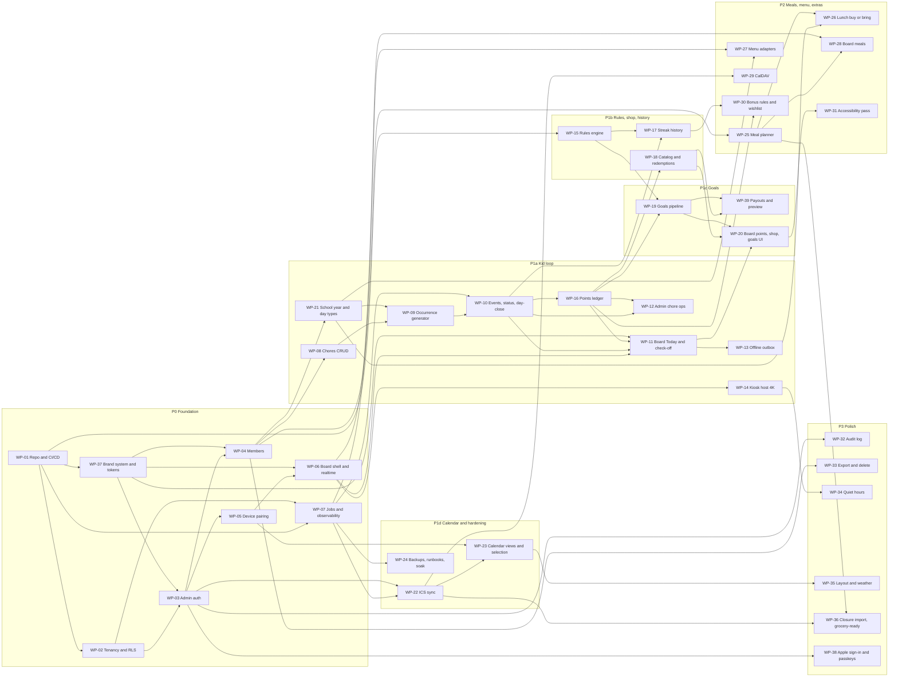

# 05 — Backlog

> Version 0.5 · Status: build baseline · Maintained by Claude Code
> v0.5: free plans (D-29): WP-01 uses a shared preview database and a keepalive; WP-24 backups are our own nightly encrypted dumps; preview-branch references replaced.
> v0.4: renamed from Work Breakdown; status board (§1); spikes are backlog items (§3); sequence changed so no finished work package needs rework (WP-37 before WP-03, WP-21 before WP-09, WP-16 before WP-11 and WP-12); WP-19 split, payouts and preview move to WP-39; WP-38 adds Sign in with Apple and passkeys; WP-01 carries the delivery pipeline (NFR-14); missing dependencies fixed.
> Companions: `01-technical-architecture.md` · `02-data-model.md` · `03-user-stories.md` · `04-requirements-traceability.md`
> Each work package (WP) is one branch and one pull request. Requirement links (`Reqs:`) and `Depends on:` lines are enforced by `check_traceability.py`; the Work packages column in `04` §B is generated from them.

---

## 1. Status board

Statuses: **Done** (merged to `main`) · **In progress** (branch open) · **Ready** (dependencies done) · **Queued** (waiting on dependencies) · **Blocked** (waiting on something outside the repo).

| Item | Title | Milestone | Size | Depends on | Status |
|---|---|---|---|---|---|
| SPIKE-01 | Device sessions + Realtime under RLS | P0 | S | WP-02 | Queued |
| SPIKE-05 | `pg_cron`/`pg_net` → Vercel job limits | P0 | S | WP-01 | Queued (needs Supabase + Vercel secrets, `01` §9.8) |
| SPIKE-02 | iCloud ICS fidelity; CalDAV with a secondary Apple ID | P1d | S | — | Blocked: needs a published iCloud calendar link |
| SPIKE-04 | School menu platform and feed | P2 | S | — | Blocked: needs the menu platform name (OQ-12) |
| SPIKE-03 | Pi 5 + 32" 4K panel: touch, kiosk flags, power, animation budget | P1a | S | — | Blocked: hardware being sourced (OQ-05b) |
| WP-01 | Repo, CI/CD pipeline, environments | P0 | M | — | In progress (`claude/p0-foundation`) |
| WP-37 | Brand system and design tokens | P0 | M | WP-01 | Queued |
| WP-02 | Tenancy schema and RLS | P0 | M | WP-01 | In progress (`claude/p0-foundation`) |
| WP-03 | Admin authentication and onboarding | P0 | M | WP-02, WP-37 | Queued |
| WP-04 | Members UI | P0 | S | WP-03, WP-37 | Queued |
| WP-05 | Device pairing and device auth | P0 | L | WP-03 | Queued |
| WP-06 | Board shell, snapshot, and realtime | P0 | M | WP-05, WP-37 | Queued |
| WP-07 | Job framework and observability | P0 | M | WP-01, WP-02 | Queued |
| WP-08 | Chores CRUD | P1a | M | WP-04 | Queued |
| WP-21 | School year and day types | P1a | M | WP-04 | Queued |
| WP-09 | Occurrence generator | P1a | M | WP-08, WP-21 | Queued |
| WP-10 | Completion events, status projection, day-close | P1a | L | WP-09, WP-07 | Queued |
| WP-16 | Points ledger | P1a | M | WP-10 | Queued |
| WP-11 | Board Today screen and check-off | P1a | L | WP-06, WP-10, WP-16, WP-37 | Queued |
| WP-12 | Admin chore operations | P1a | M | WP-10, WP-16 | Queued |
| WP-13 | Offline outbox and stale indicator | P1a | M | WP-11 | Queued |
| WP-14 | Kiosk host and 4K display | P1a | M | WP-06 | Blocked: SPIKE-03 (hardware) |
| WP-15 | Rules engine package | P1b | L | WP-01 | Queued |
| WP-17 | Streak history and insights | P1b | M | WP-10, WP-15 | Queued |
| WP-18 | Reward catalog and redemptions | P1b | M | WP-16 | Queued |
| WP-19 | Goals admin and progress pipeline | P1c | L | WP-15, WP-16 | Queued |
| WP-39 | Goal payouts, payout reversal, and rule-change preview | P1c | M | WP-18, WP-19 | Queued |
| WP-20 | Board points, shop, and goals UI | P1c | L | WP-11, WP-18, WP-19 | Queued |
| WP-22 | ICS calendar sync | P1d | L | WP-07, WP-03 | Blocked: SPIKE-02 |
| WP-23 | Calendar views and per-device selection | P1d | M | WP-22, WP-05 | Queued |
| WP-24 | Backups, runbooks, and soak | P1d | S | WP-07 | Queued |
| WP-25 | Meal library and weekly planner | P2 | M | WP-04 | Queued |
| WP-26 | Lunch buy or bring | P2 | S | WP-21, WP-25 | Queued |
| WP-27 | School menu adapters and import | P2 | L | WP-21, WP-07 | Blocked: SPIKE-04 |
| WP-28 | Board meals panel | P2 | S | WP-25, WP-06 | Queued |
| WP-29 | CalDAV (secondary account) | P2 | M | WP-22 | Queued |
| WP-30 | Bonus rules and wishlist | P2 | M | WP-16, WP-17 | Queued |
| WP-31 | Accessibility pass | P2 | S | WP-20 | Queued |
| WP-32 | Audit log viewer and coverage | P3 | S | WP-03 | Queued |
| WP-33 | Export and delete | P3 | M | WP-04 | Queued |
| WP-34 | Quiet hours and burn-in mitigation | P3 | S | WP-14 | Blocked: hardware |
| WP-35 | Board layout configuration and weather | P3 | M | WP-23 | Queued |
| WP-36 | Closure import and grocery-ready ingredients | P3 | M | WP-22, WP-25 | Queued |
| WP-38 | Sign in with Apple and passkeys | P3 | M | WP-03 | Blocked: production domain (OQ-06b) and Apple Developer account |

---

## 2. How the work is chunked

- **By vertical slice, not by layer.** Each WP delivers something testable end to end (schema + API + UI + tests), except the foundation WPs.
- **Sizes:** S ≤ 2 days · M 3–5 days · L 1–2 weeks of focused builder time. No WP above L; split it instead.
- **Every WP ends with its tests:** pgTAP for schema, Vitest for pure logic, Playwright for flows. A WP is not done until its `Done when` list passes in CI and on its preview.
- **No rework by sequence.** A WP starts only when everything it renders or writes against exists: the brand system before any screen, real day types before the generator, the ledger before any screen that shows points.
- **Spikes first where they gate work.** SPIKE-01 gates WP-05 and WP-06, SPIKE-05 gates WP-07, SPIKE-02 gates WP-22, SPIKE-04 gates WP-27, SPIKE-03 gates WP-14 and WP-34.
- **Milestones** from `04` §E: P0, P1a … P1d, P2, P3. One launch after P3 (D-19).

### Prompt pattern for a Claude Code session

> Implement WP-nn from `docs/05-backlog.md`. Read the listed requirements in `04`, the related entities in `02`, and the components in `01`. Prefix commits and tests with requirement IDs. Update the affected docs and the status board in the same PR. Do not widen scope; list anything you defer.

---

## 3. Dependency map

**Critical path to the kid loop:** WP-01 → 02 → 03 → 05 → 06 → 11, with 04 → 21/08 → 09 → 10 → 16 feeding 11, and WP-37 ahead of every screen.

**Parallel lanes** (different areas of the repo, low merge risk): WP-37 with WP-02; WP-07 with WP-04/05; WP-15 any time after WP-01; WP-21 with WP-08; WP-22 with WP-18/19; WP-24 any time after WP-07.

---

## 4. Spikes

### SPIKE-01 — Device sessions and Realtime under RLS
**Milestone:** P0 · **Size:** S · **Gates:** WP-05, WP-06 · **Reqs:** DEV-01, DEV-02, DEV-05
- Create a device auth user server-side, issue a session, refresh it unattended, revoke it; confirm Realtime `postgres_changes` honours `device_household_id()` and stops on revocation.
- **Done when:** findings and the chosen session mechanism are recorded in `01` §5.1.

### SPIKE-05 — Job calls within Vercel limits
**Milestone:** P0 · **Size:** S · **Gates:** WP-07 · **Reqs:** NFR-07, CAL-02, CHR-03
- `pg_cron` + `pg_net` call a signed Vercel endpoint; measure duration limits on the chosen Vercel plan for one-source-per-invocation sync.
- **Done when:** limits and the invocation pattern are recorded in `01` §5.6.

### SPIKE-02 — iCloud ICS and CalDAV fidelity
**Milestone:** P1d · **Size:** S · **Gates:** WP-22, WP-29 · **Reqs:** CAL-01, CAL-07, CAL-08
- Run a real published iCloud calendar through `ical.js` (recurrence across DST, all-day, cancelled and moved instances); test CalDAV with a secondary read-only Apple ID.
- **Done when:** fixtures captured in the repo and findings recorded in `01` §5.4.

### SPIKE-04 — School menu platform
**Milestone:** P2 · **Size:** S · **Gates:** WP-27 · **Reqs:** MENU-02
- Identify the school's menu platform and whether it has a stable machine-readable feed.
- **Done when:** the adapter choice is recorded in `01` §5.5.

### SPIKE-03 — Pi 5 and 4K panel
**Milestone:** P1a · **Size:** S · **Gates:** WP-14, WP-34 · **Reqs:** DEV-04, DEV-07, NFR-02, NFR-03
- Touch latency and calibration, Chromium kiosk flags, screen power control, and animation frame rate at 1920×1080 logical / DPR 2 versus a 1080p fallback.
- **Done when:** the frame budget and kiosk configuration are recorded in `01` §8.

---

## 5. Work packages

### Phase P0 — Foundation

### WP-01 — Repo, CI/CD pipeline, and environments
**Phase:** P0 · **Size:** M · **Depends on:** — · **Reqs:** NFR-12, NFR-08, NFR-14
- pnpm monorepo (`apps/web`, `packages/rules-engine`, `packages/ui`, `packages/adapters`, `supabase`, `e2e`, `scripts`, `docs`, `brand`), TypeScript strict, ESLint, Prettier.
- CI without Docker (`01` §9.3–9.4): checks (lint, format, typecheck, Vitest, migration lint, traceability), database (native Postgres + compatibility bootstrap + pgTAP), build.
- Preview pipeline: Vercel previews per PR; one shared Supabase Free preview project rebuilt from the PR's migrations for each serialized e2e run (`scripts/preview-db.sh`); e2e against the preview.
- Production pipeline: migrate (`supabase db push`) → app (`vercel deploy --prod`) → smoke; Vercel auto production deploy off.
- Free-plan operations (`01` §9.10): keepalive heartbeat to both projects; migrations over the session pooler.
- Secrets inventory and cost ceiling written in `01` §9.8–9.9; PR template with the docs checklist.
- **Done when:** a PR runs all gates green without Docker; a preview deploys and e2e passes against the rebuilt preview database; a merge runs migrate → app → smoke against production; keepalive writes to both projects.

### WP-37 — Brand system and design tokens
**Phase:** P0 · **Size:** M · **Depends on:** WP-01 · **Reqs:** NFR-13
- `packages/ui`: import `brand/familywise-tokens.css` and `fonts.css`; typed `Icon` (from `icons/index.json`), `Avatar`, `ChoreTile` (all seven statuses), `PointsChip`, `GoalMeter`, `Banner`, `Button`; Day and Evening theme switching (board by household-local time with manual override; admin by `prefers-color-scheme`).
- App identity: favicon, touch icon, PWA icons, and **two manifests**: board (`/board`, fullscreen, landscape) and admin (`/admin`, standalone, any orientation); head tags; board boot splash; FamilyWise page titles; service-worker precache of fonts.
- Token fixes: Evening `--success` override (Leaf 600 on the Evening surface is 2.89:1) and an OS dark-mode hook for admin.
- Guards: lint or test that fails on raw hex outside the tokens file; Playwright snapshots of tile states in both themes; axe contrast check on shells; unit test that every `OccurrenceStatus` has a tile mapping.
- **Done when:** a `/dev/brand` page renders the specimen from real components, and the contrast and snapshot checks run in CI.

### WP-02 — Tenancy schema and RLS
**Phase:** P0 · **Size:** M · **Depends on:** WP-01 · **Reqs:** ACC-01, NFR-04, NFR-09, NFR-12
- Tables from `02` §3.1 (`household`, `household_user`, `member`, `invite`, `device`, `device_pairing`, `household_settings`, `job_run`) with `household_id` everywhere, RLS enabled, and the helpers in `02` §4.5.
- Migration lint that fails CI if a `public` table lacks RLS or `household_id` (a pgTAP test over the catalog after all migrations, `supabase/tests/001_schema_lint.test.sql`).
- pgTAP: cross-tenant read and write denied for admin and device; revoked device denied immediately.
- **Done when:** the isolation suite is green and the lint blocks a deliberately broken migration.

### WP-03 — Admin authentication and onboarding
**Phase:** P0 · **Size:** M · **Depends on:** WP-02, WP-37 · **Reqs:** ACC-01, ACC-02, ACC-03, ACC-05, NFR-04
- Supabase Auth with email magic link and email + password (sign-up, sign-in, reset); session handling in Next.js with server-side verification.
- Onboarding wizard creates the household (timezone, week start) and the owner link; invite flow for the second admin with hashed single-use tokens, delivered as a link the inviter can copy or share (email sending is optional while Supabase's built-in mailer is limited, `01` §9.10).
- Audit write helper in the API layer from day one (`audit_log` table and `withAudit` wrapper), so later routes never need retrofitting; the viewer stays in WP-32.
- **Done when:** two admins can sign in, one by magic link and one by password, and see the same household; an expired or reused invite is rejected (E2E); invite and household writes produce audit rows.

### WP-04 — Members UI
**Phase:** P0 · **Size:** S · **Depends on:** WP-03, WP-37 · **Reqs:** ACC-04
- CRUD for child and adult members (name, avatar, color), archive instead of delete, multiple children supported by the schema.
- **Done when:** the single child profile exists and an adult profile can be linked to an admin.

### WP-05 — Device pairing and device auth
**Phase:** P0 · **Size:** L · **Depends on:** WP-03 · **Reqs:** DEV-01, DEV-02, DEV-03, NFR-04
- SPIKE-01 first.
- Pairing code issue and redeem (single-use, 10-minute TTL, hashed), creating a Supabase Auth device user with `app_metadata` (`role=device`, `household_id`, `device_id`).
- Device list, rename, revoke, last seen. Revocation takes effect through `device.status` in the RLS helper.
- Device write scope limited to `/api/completions` and `/api/redemptions` (routes added later); reads through RLS.
- **Done when:** a second browser pairs with a code, reads board data, and loses access within seconds of revocation (E2E).

### WP-06 — Board shell, snapshot, and realtime
**Phase:** P0 · **Size:** M · **Depends on:** WP-05, WP-37 · **Reqs:** DEV-05
- `/board` route, PWA scaffolding, `board_snapshot` function (shape from `02` §4.6, initially members only), Realtime subscription with notify-then-refetch.
- Measure admin-change-to-board latency in an E2E budget test (p95 under 3 s).
- **Done when:** renaming a member in the admin portal shows on the paired board within the budget.

### WP-07 — Job framework and observability
**Phase:** P0 · **Size:** M · **Depends on:** WP-01, WP-02 · **Reqs:** NFR-07
- SPIKE-05 first.
- `pg_cron` + `pg_net` calling signed Vercel job endpoints; `job_run` records; idempotent job wrapper with catch-up semantics.
- Structured logs, error tracking, and a health page listing job status.
- **Done when:** a sample hourly job runs against the preview project, a forced failure shows on the health page, and replaying it is harmless.

### Phase P1a — Kid loop

### WP-08 — Chores CRUD
**Phase:** P1a · **Size:** M · **Depends on:** WP-04 · **Reqs:** CHR-01
- `chore` and `chore_assignee` tables; admin UI to create, edit, archive chores and one-off tasks (title, icon, assignees, points, approval flag, tags, schedule, day types).
- Zod validation of `schedule jsonb`.
- **Done when:** a parent can create the six seed chores on a phone in under five minutes.

### WP-21 — School year and day types
**Phase:** P1a · **Size:** M · **Depends on:** WP-04 · **Reqs:** SCH-01, SCH-02, SCH-03
- `school_year`, `school_term`, `school_closure`, `member_school_profile`, `resolve_day_type` (`02` §4.4), admin UI.
- Closure and school-year edits trigger regeneration for dates after today only (D-24).
- **Done when:** pgTAP covers weekend, break, no_school, school_day, summer precedence; a break week produces no school-only chores; a closure added for today leaves today alone.

### WP-09 — Occurrence generator
**Phase:** P1a · **Size:** M · **Depends on:** WP-08, WP-21 · **Reqs:** CHR-02, CHR-03
- `chore_occurrence` (with `status` default `scheduled`), rolling-window generation per assignee using the real `resolve_day_type`, regeneration of only future `scheduled` occurrences on edit, snapshots of points and approval flag.
- **Done when:** property tests show generation is idempotent and edits never touch past occurrences; DST fixtures pass.

### WP-10 — Completion events, status projection, and day-close
**Phase:** P1a · **Size:** L · **Depends on:** WP-09, WP-07 · **Reqs:** CHR-04, CHR-07, NFR-06
- `chore_completion_event` (append-only, client-generated ids, `batch_id`), `normalize_completion_event` (clamp, flag, server-derived household/member/credit date), `fold_occurrence_status` by event time, `apply_completion_event`, `close_past_due` (`scheduled` and `rejected` → `missed`), and report-only `rebuild_occurrence_status` (`02` §4.1–4.2).
- `POST /api/completions` accepting batches, idempotent on `id`.
- `day_close` job (hourly, idempotent, catch-up) writing `missed` and `finalized_at`; nightly drift report.
- **Done when:** pgTAP proves immutability, replay idempotency, event-time ordering (a late-arriving earlier event never overrides a later one), the clamp, the flag rule, and that rebuild equals the stored projection after random event sequences; a closed day has no `scheduled` or `rejected` rows.

### WP-16 — Points ledger
**Phase:** P1a · **Size:** M · **Depends on:** WP-10 · **Reqs:** PTS-01, PTS-02
- `points_ledger`, `post_points` trigger, `private.post_ledger`, `public.adjust_points` with reason and request id, `v_points_balance`, snapshot inclusion of balance and recent activity.
- **Done when:** random complete/undo/approve sequences always leave the ledger balance equal to the sum of done occurrences' points plus adjustments (pgTAP/property test); no application role can insert into `points_ledger` directly.

### WP-11 — Board Today screen and check-off
**Phase:** P1a · **Size:** L · **Depends on:** WP-06, WP-10, WP-16, WP-37 · **Reqs:** BRD-01, BRD-02, BRD-03, CHR-04, NFR-03, PTS-02, RWD-08
- Today screen with the child's chores (today only, D-21), points chip with live balance, tap to check off with optimistic UI (feedback under 100 ms), chore-done celebration (check pop, tint, points count-up; reduced motion honoured), time-boxed undo, child selector.
- Layout reserves the slots that later WPs fill (events, meals, goal meter, streak flame), so adding them is additive.
- Debounce and confirm for destructive actions; icon-first layout on the 1920×1080 logical grid with 56 px minimum targets.
- **Done when:** the Playwright check-off flow passes, including a rapid double tap resulting in one effective completion and the balance updating once.

### WP-12 — Admin chore operations
**Phase:** P1a · **Size:** M · **Depends on:** WP-10, WP-16 · **Reqs:** CHR-05, CHR-06, CHR-08
- Admin day view: complete, uncomplete, skip any occurrence; late credit for past days (`admin_complete`); approval queue (approve, reject, flagged items); household approval on/off switch and per-chore override that re-resolve `scheduled` occurrences only (D-22).
- Multi-select "Not actually done" producing one `batch_id`; undo of a batch.
- **Done when:** a parent unchecks four of five items in one action, the child sees them open again on the board, and exactly four reversals post to the ledger.

### WP-13 — Offline outbox and stale indicator
**Phase:** P1a · **Size:** M · **Depends on:** WP-11 · **Reqs:** DEV-06, DEV-08, NFR-01
- Service worker (Serwist), IndexedDB snapshot and outbox (Dexie), ordered replay with idempotent ids and `occurred_at`, projected points marked as provisional.
- Stale-data indicator driven by snapshot age and `job_run`.
- **Done when:** an E2E test goes offline, checks off three chores, reconnects, and finds exactly three events; a parent action made during the outage wins over an earlier offline tap; a 24-hour offline soak passes on cached data.

### WP-14 — Kiosk host and 4K display
**Phase:** P1a · **Size:** M · **Depends on:** WP-06 · **Reqs:** DEV-04, BRD-06, NFR-02
- SPIKE-03 first (hardware).
- Pi 5 image/provisioning notes: Chromium kiosk flags, route lockdown to `/board`, watchdog restart, SSD boot, screen power control.
- Logical 1920×1080 layout at device scale factor 2 for the 3840×2160 panel; idle-return to Today after 60 seconds (deferred during a celebration).
- Hardware acceptance checklist from `04` §F.
- **Done when:** the Pi boots to the board unattended, survives a power pull, and the animation budget from SPIKE-03 is met or the 1080p fallback is adopted and documented.

### Phase P1b — Rules engine, shop, streak history

### WP-15 — Rules engine package
**Phase:** P1b · **Size:** L · **Depends on:** WP-01 · **Reqs:** RWD-02, RWD-03, RWD-05, RWD-11, NFR-12
- `packages/rules-engine`: `evaluateGoal` and `evaluateHistory` per `02` §5; pure, no clock or I/O.
- Property tests with `fast-check` (event orderings, DST, replay) and at least 90% coverage.
- **Done when:** the coverage gate is green and the documented edge cases in `02` §5 each have a named test.

### WP-17 — Streak history and insights
**Phase:** P1b · **Size:** M · **Depends on:** WP-10, WP-15 · **Reqs:** RWD-11, RWD-12
- `member_daily_summary` and `streak_segment` written by day-close using `evaluateHistory`; late completions re-derive the affected day.
- Admin Insights page: current and best good streak, longest bad streak, completion rate, heatmap, most-missed chores, trust panel (reversal/rejection rate, time to verify); board streak flame.
- **Done when:** after 14 seeded days the insights match a hand-computed table and a rebuild produces identical rows.

### WP-18 — Reward catalog and redemptions
**Phase:** P1b · **Size:** M · **Depends on:** WP-16 · **Reqs:** PTS-03, PTS-04
- `reward_catalog_item`, `redemption`; admin catalog editor; `POST /api/redemptions` → `public.request_redemption` with the available-balance check under a member lock; `public.decide_redemption` (approve posts `spend`, deny), `public.cancel_redemption` (refund if approved), fulfil.
- **Done when:** a redemption flows requested → approved → fulfilled and two concurrent requests cannot overspend (pgTAP/integration).

### Phase P1c — Goals

### WP-19 — Goals admin and progress pipeline
**Phase:** P1c · **Size:** L · **Depends on:** WP-15, WP-16 · **Reqs:** RWD-01, RWD-04, RWD-06, RWD-09
- Goal CRUD with rules, lifecycle jobs (scheduled → active → expired), dirty flag trigger, reconcile within 5 minutes, reversible achievement (achieved ↔ active with `unachieved` events, `celebrated_at` cleared), redeem and redemption history.
- **Done when:** a seeded goal becomes achieved, returns to active when the deciding chore is unchecked, and is achieved again; reconcile heals a deliberately dirtied goal.

### WP-39 — Goal payouts, payout reversal, and rule-change preview
**Phase:** P1c · **Size:** M · **Depends on:** WP-18, WP-19 · **Reqs:** RWD-04, RWD-10, RWD-13
- Payout execution per achievement `n` (custom, points via `private.post_goal_payout`, catalog item as an auto-approved redemption); payout reversal on un-achieve (`private.reverse_goal_payout`, cancel an unfulfilled redemption); `needs_review` flag when the reward was already fulfilled or redeemed.
- Rule-change preview computed from full history before saving; `rules_changed` and `recomputed` events.
- **Done when:** a points payout posts one bonus on achievement even if the job runs twice; unchecking the deciding chore reverses it once; re-achieving pays again as `n+1`; a fulfilled catalog payout raises the review flag.

### WP-20 — Board points, shop, and goals UI
**Phase:** P1c · **Size:** L · **Depends on:** WP-11, WP-18, WP-19 · **Reqs:** RWD-07, RWD-08, PTS-02, PTS-04
- Shop screen, request flow with pending state, recent activity and negative balance wording, goal progress meters and nudges, one-time goal celebration (reduced motion honoured).
- **Done when:** a child can earn points, request a reward, and see it approved, end to end on a preview at 3840×2160 DPR 2.

### Phase P1d — Calendar and hardening

### WP-22 — ICS calendar sync
**Phase:** P1d · **Size:** L · **Depends on:** WP-07, WP-03 · **Reqs:** CAL-01, CAL-02, CAL-03, CAL-06, CAL-07
- SPIKE-02 first.
- Calendar source CRUD with URL in Vault; sync job (one source per invocation, conditional fetch), parse with `ical.js`, expansion window, last-good retention, sync health surface.
- Fixtures for recurrence across DST, all-day, cancelled and moved instances.
- **Done when:** fixture-based sync matches expected instances; a broken URL leaves old data and shows an error.

### WP-23 — Calendar views and per-device selection
**Phase:** P1d · **Size:** M · **Depends on:** WP-22, WP-05 · **Reqs:** CAL-04, CAL-05
- Day, week, month views scrollable by touch; color and member association; `device_calendar` selection UI per board with defaults for new calendars.
- **Done when:** unticking a calendar in the admin portal removes its events from the board within 3 seconds.

### WP-24 — Backups, runbooks, and soak
**Phase:** P1d · **Size:** S · **Depends on:** WP-07 · **Reqs:** NFR-10
- Nightly `backup.yml`: `pg_dump` over the session pooler, compressed and encrypted with `BACKUP_PASSPHRASE`, kept 30 days as a private artifact; a rehearsed restore into the preview project; runbooks (restore a paused Free project, device re-pair, stuck sync, day-close catch-up, launch data reset); 7-day soak checklist.
- **Done when:** a restore drill is completed and recorded.

### Phase P2 — Meals, menu, extras

### WP-25 — Meal library and weekly planner
**Phase:** P2 · **Size:** M · **Depends on:** WP-04 · **Reqs:** MEAL-01, MEAL-02, MEAL-03, MEAL-08
- `meal`, `meal_plan_entry`; weekly grid for breakfast, snack, lunch, dinner; multiple ordered entries per slot; copy last week with skip or overwrite.
- **Done when:** a full week can be planned in the E2E flow, including copy-week with skip and overwrite.

### WP-26 — Lunch buy or bring
**Phase:** P2 · **Size:** S · **Depends on:** WP-21, WP-25 · **Reqs:** MEAL-04
- `lunch_override`, weekday defaults per child, per-date overrides, only on school days.
- **Done when:** the effective mode resolves correctly across a break week (pgTAP).

### WP-27 — School menu adapters and import
**Phase:** P2 · **Size:** L · **Depends on:** WP-21, WP-07 · **Reqs:** MENU-01, MENU-02, MENU-03, MENU-04, MENU-05, MEAL-05
- SPIKE-04 first.
- `menu_source`, `school_menu_day`; adapter interface with CSV and manual first, then the platform the admin selects; overrides never overwritten; 28-day daily refresh; failure surfacing; menu shown on buy days.
- **Done when:** four weeks load via CSV, and a failing adapter leaves cached menus and a visible warning.

### WP-28 — Board meals panel
**Phase:** P2 · **Size:** S · **Depends on:** WP-25, WP-06 · **Reqs:** MEAL-06
- Today's meals and a weekly read-only view on the board.
- **Done when:** the Today screen shows the day's four slots and the lunch mode.

### WP-29 — CalDAV (secondary account)
**Phase:** P2 · **Size:** M · **Depends on:** WP-22 · **Reqs:** CAL-08
- CalDAV with app-specific password in Vault, setup guidance for a secondary read-only Apple ID, ctag/sync-token handling.
- **Done when:** a CalDAV-backed calendar syncs alongside an ICS one.

### WP-30 — Bonus rules and wishlist
**Phase:** P2 · **Size:** M · **Depends on:** WP-16, WP-17 · **Reqs:** PTS-05, PTS-06
- `points_rule` evaluation (streak milestone, perfect day) with dedupe through `private.post_points_rule_bonus`; wishlist pinning and savings meter on the board.
- **Done when:** a 7-day streak posts exactly one bonus and replay posts none.

### WP-31 — Accessibility pass
**Phase:** P2 · **Size:** S · **Depends on:** WP-20 · **Reqs:** NFR-11
- WCAG AA contrast, no color-only cues, reduced motion verified across every screen, celebration and transition built so far (the automated checks from WP-37 already run on each PR).
- **Done when:** an automated contrast check and a manual checklist pass.

### Phase P3 — Polish

### WP-32 — Audit log viewer and coverage
**Phase:** P3 · **Size:** S · **Depends on:** WP-03 · **Reqs:** ACC-05
- Admin viewer with filters over the `audit_log` rows written since WP-03.
- **Done when:** every mutating API route is covered by a test asserting an audit row.

### WP-33 — Export and delete
**Phase:** P3 · **Size:** M · **Depends on:** WP-04 · **Reqs:** NFR-05
- JSON/CSV export of all household data; documented deletion procedure for a child profile and a household, anonymizing events.
- **Done when:** exported data re-imports into the preview project in a smoke test.

### WP-34 — Quiet hours and burn-in mitigation
**Phase:** P3 · **Size:** S · **Depends on:** WP-14 · **Reqs:** DEV-07
- Scheduled dim/sleep, wake on touch, subtle pixel shifting.
- **Done when:** the panel sleeps and wakes on schedule over a 3-day hardware test.

### WP-35 — Board layout configuration and weather
**Phase:** P3 · **Size:** M · **Depends on:** WP-23 · **Reqs:** BRD-04, BRD-05
- Panel on/off and ordering; optional local weather widget.
- **Done when:** reordering panels updates the board within 3 seconds.

### WP-36 — Closure import and grocery-ready ingredients
**Phase:** P3 · **Size:** M · **Depends on:** WP-22, WP-25 · **Reqs:** SCH-04, MEAL-07
- Preview and import no-school days from a tagged calendar; structured ingredients on meals.
- **Done when:** importing a tagged calendar creates closures only after the admin confirms the preview.

### WP-38 — Sign in with Apple and passkeys
**Phase:** P3 · **Size:** M · **Depends on:** WP-03 · **Reqs:** ACC-06
- Needs the production domain (OQ-06b) and an Apple Developer account. Sign in with Apple with account linking (no duplicate users); passkey enrollment and sign-in; magic link and password stay available.
- **Done when:** both methods sign in to an existing admin account on the production domain, and cancelling either falls back cleanly.

---

## 6. Size summary

| Milestone | Items | Notes |
|---|---|---|
| P0 | SPIKE-01, SPIKE-05, WP-01 – WP-07, WP-37 | One L (device auth) |
| P1a | SPIKE-03, WP-08 – WP-14, WP-16, WP-21 | Two L (events/status, board Today) |
| P1b | WP-15, WP-17, WP-18 | Rules engine is the long pole |
| P1c | WP-19, WP-20, WP-39 | Two L |
| P1d | SPIKE-02, WP-22 – WP-24 | ICS sync is the L |
| P2 | SPIKE-04, WP-25 – WP-31 | Menu adapters is the L |
| P3 | WP-32 – WP-36, WP-38 | — |

Sizes are relative effort for a single builder with Claude Code, not commitments; re-estimate at each milestone.
