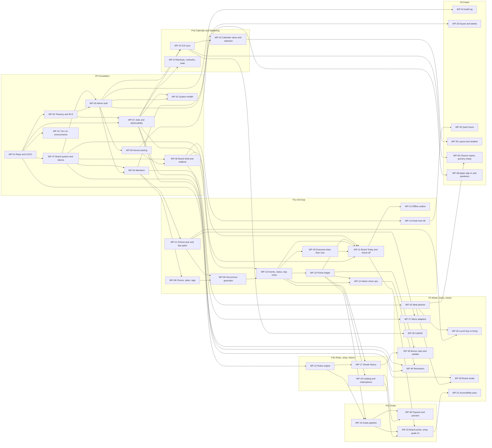

# 05 — Backlog

> Version 0.8 · Status: build baseline · Maintained by Claude Code
> v0.8.42: WP-17 done (PR #33): streak history and insights. WP-30 is ready.
> v0.8.41: WP-17 in review (PR #33): streak history and insights (D-55).
> v0.8.40: WP-13 done (PR #32): the board works through an outage. The real 24-hour soak on the Pi stays with WP-24.
> v0.8.39: WP-13 in review (PR #32): the board works through an outage (D-54).
> v0.8.38: WP-18 done (PR #31): the rewards shop. WP-39 and WP-20 wait on WP-19 too.
> v0.8.37: WP-18 in review (PR #31): the rewards shop (D-53).
> v0.8.36: WP-12 done (PR #30): a parent's day and My tasks. WP-40 is ready.
> v0.8.35: WP-12 in review (PR #30): a parent's day and My tasks (D-52).
> v0.8.34: WP-15 done (PR #29): the rules engine. WP-17 and WP-19 are ready.
> v0.8.33: WP-15 in review (PR #29): the rules engine (D-51). WP-17 follows it.
> v0.8.32: WP-11 done (PR #28): the board's Today and check-off. The owner confirmed D-50: the board never shows why points were taken away. WP-12, WP-13 and WP-18 are ready; WP-12 and WP-18 were ready from WP-16's merge but not marked so.
> v0.8.31: WP-11 in review (PR #28): the board's Today and check-off (D-50).
> v0.8.30: WP-16 done (PR #27): the points ledger. WP-11 is ready.
> v0.8.29: WP-16 in review (PR #27): the points ledger (D-49). WP-11 waits only on it.
> v0.8.28: WP-43 done (PR #25). Y-10 lists four old failure reports: two more came from WP-43's first e2e runs, before its branch carried D-48's change.
> v0.8.27: the repository is public (D-48). Y-10: rotate the deployment-protection bypass secret, and delete two old failure reports and two setup-code runs. WP-24's backups will not be workflow artifacts.
> v0.8.26: WP-43 in review (PR #25): everyone does their own (D-47), ahead of WP-11, which now depends on it.
> v0.8.25: WP-10 done (PR #23), live in production: day close runs hourly and the status check nightly. WP-16 is ready.
> v0.8.24: WP-10 in review (PR #23): completion events, the status they drive, day close and the nightly drift check (D-46).
> v0.8.23: WP-09 done (PR #22), live in production.
> v0.8.22: WP-09 in review (PR #22): occurrences planned two weeks ahead by the database, and re-planned at once on edits without touching history (D-45).
> v0.8.21: WP-21 done (PR #21), live in production. WP-27 is ready.
> v0.8.20: WP-21 in review (PR #21): school years and day types (D-44). Regenerating occurrences when a closure changes moves to WP-09 with occurrences.
> v0.8.19: WP-08 done (PR #19), live in production. WP-21 is next.
> v0.8.18: WP-08 in review (PR #19): the family list, tags and private items (D-43).
> v0.8.17: WP-42 done (PR #17), so P0 is done: every P0 item is merged and its exit criteria pass (`04` §E). Ready now: WP-08, WP-21, WP-22, WP-24, WP-25, WP-32, WP-33.
> v0.8.16: WP-42 in review (PR #17): System Health, with errors kept per household and usage read daily (D-42).
> v0.8.15: SPIKE-02's ICS part done (`01` §5.4), so WP-22 is queued; its CalDAV part runs before WP-29. Y-6's calendar is a real one, so the spike reports counts only and its fixture is made up.
> v0.8.14: Y-6 done, so SPIKE-02 is ready (its iCloud part; the CalDAV part waits for WP-29). Y-8 is not needed before P3.
> v0.8.13: WP-06 done (PR #12), live in production. Y-9 done. The setup code shows on the setup-code run's summary page again (PR #13).
> v0.8.12: WP-05 done (PR #11). WP-06 in review (PR #12): the board keeps its own snapshot live (D-41). Your household can start in production before launch, so Y-9 is due now.
> v0.8.11: SPIKE-01 done and WP-05 in review (PR #11): boards pair in the database and heal themselves (D-40). WP-04 done (PR #10).
> v0.8.10: WP-03 done (PR #9). WP-04 in review (PR #10).
> v0.8.9: WP-07 done. WP-03 in review (PR #9): private by invitation (D-39); Y-5 is no longer a blocker; new Y-9 before launch.
> v0.8.8: WP-07 in review (PR #8): the job framework, error log and job-secret workflow; the System Health page moves to new WP-42, after WP-03 (admin sign-in), so it is built once, behind sign-in.
> v0.8.7: migrations run through `scripts/db-migrate.sh` (PR #7): PR #5's deploy stopped because PR #6's preview had applied a migration `main` did not have yet.
> v0.8.6: SPIKE-05 done: job limits, the invocation pattern and the Hobby budget are in `01` §5.6 (D-38); WP-07 takes the pattern and the job-secret workflow.
> v0.8.5: §0 lists only open owner actions; Y-1 to Y-4 move to a Done table. WP-41 done: PR #4's merge deployed on its own, and the gate's refusals are tested.
> v0.8.4: production is live and dark: the first deploy ran gate, migrate, app and smoke after the token was rescoped; keepalive wrote its first heartbeat. WP-41 closes when its own merge deploys automatically.
> v0.8.3: WP-37 done (PR #3); Y-4 done; WP-41 in progress: the first production deploy reached the app step, and the deploy token needs the project's team as its scope.
> v0.8.2: WP-37 in progress on `claude/wp-37-brand`.
> v0.8.1: Y-3 done (GitHub secrets and variables); SPIKE-01, SPIKE-05 and WP-41 wait only on Y-4.
> v0.8: one database (D-37): previews run as the demo family in the production project; Y-2 dropped (nothing to do); Y-3 and Y-4 shrink; WP-41 and SPIKE-01 wait only on Y-3 and Y-4.
> v0.7.2: branch protection is not enforced on a private repository on GitHub Free, so the deploy workflow enforces the gates (D-36). Y-1 is now the squash-only merge setting; Y-2..Y-4 give the exact steps; all GitHub secrets are repository secrets.
> v0.7.1: PR #1 merged; WP-01 and WP-02 done. WP-01's live-environment checks move to WP-41 (blocked on Y-2..Y-4); Y-1 is now branch protection.
> v0.7: WP-40 reminders (web push, switchable per person, device and item; D-35).
> v0.6: one family list (D-30..D-34): WP-08 becomes chores, tasks, tags and visibility (L); WP-09 generates one shared occurrence per due date and carries tasks over (L); WP-12 adds My tasks (L); WP-02/04 add the earns-rewards switch; WP-10, WP-11, WP-15, WP-16, WP-17, WP-19 and WP-37 take the new rules.
> v0.5.2: §0 Waiting on you lists the owner actions that unblock work; the five build artifacts are also published as interactive pages generated from these files (`pnpm docs:build`).
> v0.5: free plans (D-29): WP-01 uses a shared preview database and a keepalive; WP-24 backups are our own nightly encrypted dumps; preview-branch references replaced.
> v0.4: renamed from Work Breakdown; status board (§1); spikes are backlog items (§3); sequence changed so no finished work package needs rework (WP-37 before WP-03, WP-21 before WP-09, WP-16 before WP-11 and WP-12); WP-19 split, payouts and preview move to WP-39; WP-38 adds Sign in with Apple and passkeys; WP-01 carries the delivery pipeline (NFR-14); missing dependencies fixed.
> Companions: `01-technical-architecture.md` · `02-data-model.md` · `03-user-stories.md` · `04-requirements-traceability.md`
> Each work package (WP) is one branch and one pull request. Requirement links (`Reqs:`) and `Depends on:` lines are enforced by `check_traceability.py`; the Work packages column in `04` §B is generated from them.

---

## 0. Waiting on you

Only the owner can do these. Each row names what it unblocks; everything else on the board is Claude Code's, or waits on one of these. Secrets go straight into GitHub or Vercel settings, never into chat.

| Item | Action | Where | Unblocks |
|---|---|---|---|
| Y-7 | The Pi 5 and the 32" 4K touch panel, with the exact panel model (OQ-05b) | Hardware | SPIKE-03, then WP-14 and WP-34; launch checks L-05 and L-08 |
| Y-10 | The repository is public now (D-48), and three things from before are visible on it. (1) Rotate the deployment-protection bypass secret: Vercel → Settings → Deployment Protection → Protection Bypass for Automation, then put the new value in GitHub → Settings → Secrets → `VERCEL_AUTOMATION_BYPASS_SECRET`. The demo sign-ins' passwords follow it on the next e2e run. (2) Delete the four `playwright-report` artifacts (Actions → the failed e2e runs of Oct 9 whose reports were saved at 10:56, 15:03, 20:20 and 20:28 UTC), which hold the old value. (3) Delete the two `setup-code` runs of Oct 9 (10:54 and 11:03 UTC), whose pages show household codes; they expire 24 hours after issue | GitHub; Vercel | R-35 |
| Y-8 | Not before P3 (nothing earlier waits on it): choose the production domain after a trademark and domain check against "FamilyWize" (OQ-06b); join the Apple Developer Program when ready | Registrar; Apple | WP-38; custom SMTP for magic links beyond the Supabase team (`01` §9.10) |

**Done**

| Item | Outcome |
|---|---|
| Y-1 | Squash-only merges and automatic branch deletion are on. Branch protection is not available for a private repository on GitHub Free, so the deploy gate enforces the checks (D-36). |
| Y-2 | Dropped: previews use the one database as the demo family (D-37). |
| Y-3 | GitHub repository secrets and variables are in place, including `DEPLOY_ENABLED`; the deploy token is scoped to the project's team. |
| Y-4 | Vercel keys are in place: publishable key for Production and Preview, secret key and job signing secret for Production only. |
| Y-5 | Dropped as a blocker: the second admin joins by invite link and signs in with a password, so nobody needs to join the Supabase team. Adding them later is optional, for magic links before custom email (Y-8). |
| Y-6 | A real family calendar is published from iCloud, and its link is the repository secret `ICS_SPIKE_URL`. Because it is real, the `spike-02` workflow reports counts and checks only, and test fixtures are made up. |
| Y-9 | Supabase Auth points at production (Site URL `https://family-wise-topaz.vercel.app`, redirects `https://family-wise-topaz.vercel.app/**`), and "Allow new users to sign up" is off, so nobody can sign up through Supabase directly. Launch check L-12 confirms it end to end. |

---

## 1. Status board

Statuses: **Done** (merged to `main`) · **In progress** (branch open) · **Ready** (dependencies done) · **Queued** (waiting on dependencies) · **Blocked** (waiting on something outside the repo).

| Item | Title | Milestone | Size | Depends on | Status |
|---|---|---|---|---|---|
| SPIKE-01 | Device sessions + Realtime under RLS | P0 | S | WP-02 | Done (PR #11, `01` §5.1) |
| SPIKE-05 | `pg_cron`/`pg_net` → Vercel job limits | P0 | S | WP-01 | Done (PR #6) |
| SPIKE-02 | iCloud ICS fidelity; CalDAV with a secondary Apple ID | P1d | S | — | ICS part done (`01` §5.4); CalDAV part before WP-29 |
| SPIKE-04 | School menu platform and feed | P2 | S | — | Done: Nutrislice public JSON API (`01` §5.5) |
| SPIKE-03 | Pi 5 + 32" 4K panel: touch, kiosk flags, power, animation budget | P1a | S | — | Blocked: hardware being sourced (OQ-05b) |
| WP-01 | Repo, CI/CD pipeline, environments | P0 | M | — | Done (PR #1) |
| WP-41 | Turn on previews, production deploys, and keepalive | P0 | S | WP-01 | Done (PR #4, #5) |
| WP-37 | Brand system and design tokens | P0 | M | WP-01 | Done (PR #3) |
| WP-02 | Tenancy schema and RLS | P0 | M | WP-01 | Done (PR #1) |
| WP-03 | Admin authentication and onboarding | P0 | M | WP-02, WP-37 | Done (PR #9) |
| WP-04 | Members UI | P0 | S | WP-03, WP-37 | Done (PR #10) |
| WP-05 | Device pairing and device auth | P0 | L | WP-03 | Done (PR #11) |
| WP-06 | Board shell, snapshot, and realtime | P0 | M | WP-05, WP-37 | Done (PR #12) |
| WP-07 | Job framework and observability | P0 | M | WP-01, WP-02 | Done (PR #8) |
| WP-42 | System Health page | P0 | S | WP-03, WP-07 | Done (PR #17) |
| WP-08 | Chores, tasks, tags, and visibility | P1a | L | WP-04 | Done (PR #19) |
| WP-21 | School year and day types | P1a | M | WP-04 | Done (PR #21) |
| WP-09 | Occurrence generator | P1a | L | WP-08, WP-21 | Done (PR #22) |
| WP-10 | Completion events, status projection, day-close | P1a | L | WP-09, WP-07 | Done (PR #23) |
| WP-43 | Everyone does their own | P1a | M | WP-10 | Done (PR #25) |
| WP-16 | Points ledger | P1a | M | WP-10 | Done (PR #27) |
| WP-11 | Board Today screen and check-off | P1a | L | WP-06, WP-10, WP-16, WP-37, WP-43 | Done (PR #28) |
| WP-12 | Admin chore operations and My tasks | P1a | L | WP-10, WP-16 | Done (PR #30) |
| WP-13 | Offline outbox and stale indicator | P1a | M | WP-11 | Done (PR #32) |
| WP-14 | Kiosk host and 4K display | P1a | M | WP-06 | Blocked: SPIKE-03 (hardware) |
| WP-15 | Rules engine package | P1b | L | WP-01 | Done (PR #29) |
| WP-17 | Streak history and insights | P1b | M | WP-10, WP-15 | Done (PR #33) |
| WP-18 | Reward catalog and redemptions | P1b | M | WP-16 | Done (PR #31) |
| WP-19 | Goals admin and progress pipeline | P1c | L | WP-15, WP-16 | Ready |
| WP-39 | Goal payouts, payout reversal, and rule-change preview | P1c | M | WP-18, WP-19 | Queued |
| WP-20 | Board points, shop, and goals UI | P1c | L | WP-11, WP-18, WP-19 | Queued |
| WP-22 | ICS calendar sync | P1d | L | WP-07, WP-03 | Ready |
| WP-23 | Calendar views and per-device selection | P1d | M | WP-22, WP-05 | Queued |
| WP-24 | Backups, runbooks, and soak | P1d | S | WP-07 | Ready |
| WP-25 | Meal library and weekly planner | P2 | M | WP-04 | Ready |
| WP-26 | Lunch buy or bring | P2 | S | WP-21, WP-25 | Queued |
| WP-27 | School menu adapters and import | P2 | L | WP-21, WP-07 | Ready |
| WP-28 | Board meals panel | P2 | S | WP-25, WP-06 | Queued |
| WP-29 | CalDAV (secondary account) | P2 | M | WP-22 | Queued |
| WP-30 | Bonus rules and wishlist | P2 | M | WP-16, WP-17 | Ready |
| WP-31 | Accessibility pass | P2 | S | WP-20 | Queued |
| WP-40 | Reminders (web push) | P2 | M | WP-07, WP-12, WP-37 | Ready |
| WP-32 | Audit log viewer and coverage | P3 | S | WP-03 | Ready |
| WP-33 | Export and delete | P3 | M | WP-04 | Ready |
| WP-34 | Quiet hours and burn-in mitigation | P3 | S | WP-14 | Blocked: hardware |
| WP-35 | Board layout configuration and weather | P3 | M | WP-23 | Queued |
| WP-36 | Closure import and grocery-ready ingredients | P3 | M | WP-22, WP-25 | Queued |
| WP-38 | Sign in with Apple and passkeys | P3 | M | WP-03 | Blocked: production domain (OQ-06b) and Apple Developer account |

---

## 2. How the work is chunked

- **By vertical slice, not by layer.** Each WP delivers something testable end to end (schema + API + UI + tests), except the foundation WPs.
- **Sizes:** S ≤ 2 days · M 3–5 days · L 1–2 weeks of focused builder time. No WP above L; split it instead.
- **Every WP ends with its tests:** pgTAP for schema, Vitest for pure logic, Playwright for flows. A WP is not done until its `Done when` list passes in CI and on its preview.
- **No rework by sequence.** A WP starts only when everything it renders or writes against exists: the brand system before any screen, real day types before the generator, the ledger before any screen that shows points.
- **Spikes first where they gate work.** SPIKE-01 gates WP-05 and WP-06, SPIKE-05 gates WP-07, SPIKE-02 gates WP-22, SPIKE-04 gates WP-27, SPIKE-03 gates WP-14 and WP-34.
- **Milestones** from `04` §E: P0, P1a … P1d, P2, P3. One launch after P3 (D-19).

### Prompt pattern for a Claude Code session

> Implement WP-nn from `docs/05-backlog.md`. Read the listed requirements in `04`, the related entities in `02`, and the components in `01`. Prefix commits and tests with requirement IDs. Update the affected docs and the status board in the same PR. Do not widen scope; list anything you defer.

---

## 3. Dependency map

**Critical path to the kid loop:** WP-01 → 02 → 03 → 05 → 06 → 11, with 04 → 21/08 → 09 → 10 → 16 feeding 11, and WP-37 ahead of every screen.

**Parallel lanes** (different areas of the repo, low merge risk): WP-37 with WP-02; WP-07 with WP-04/05; WP-15 any time after WP-01; WP-21 with WP-08; WP-22 with WP-18/19; WP-24 any time after WP-07.

---

## 4. Spikes

### SPIKE-01 — Device sessions and Realtime under RLS
**Milestone:** P0 · **Size:** S · **Gates:** WP-05, WP-06 · **Reqs:** DEV-01, DEV-02, DEV-05
- Create a device auth user server-side, issue a session, refresh it unattended, revoke it; confirm Realtime `postgres_changes` honours `device_household_id()` and stops on revocation.
- **Done when:** findings and the chosen session mechanism are recorded in `01` §5.1.

### SPIKE-05 — Job calls within Vercel limits
**Milestone:** P0 · **Size:** S · **Gates:** WP-07 · **Reqs:** NFR-07, CAL-02, CHR-03
- `pg_cron` + `pg_net` call a signed Vercel endpoint; measure duration limits on the chosen Vercel plan for one-source-per-invocation sync.
- **Done when:** limits and the invocation pattern are recorded in `01` §5.6.
- **Outcome:** measured from the production database through pg_net (`scripts/spike-05.sh`): Hobby stops a call at 300 s; pg_net holds queued calls until its slowest call ends; a cold start costs about 0.4 s of CPU, a warm call a few ms; concurrent calls each get an instance; cron reports `succeeded` whatever the endpoint answers. Pattern: answer at once and work after the response, one minute per schedule, health from `job_run`, job secret from a workflow (D-38). Jobs fit in under 10 % of each Hobby allowance.

### SPIKE-02 — iCloud ICS and CalDAV fidelity
**Milestone:** P1d · **Size:** S · **Gates:** WP-22, WP-29 · **Reqs:** CAL-01, CAL-07, CAL-08
- Run a real published iCloud calendar through `ical.js` (recurrence across DST, all-day, cancelled and moved instances); test CalDAV with a secondary read-only Apple ID.
- ICS part done: the `spike-02` workflow reads the calendar from Y-6 (`ICS_SPIKE_URL`) and reports counts and checks only; findings are in `01` §5.4. `lib/calendar/ics.ts` (expand and scrub) is WP-22's starting point, tested on a synthetic calendar and on `icloud-shape.ics` (iCloud's shape, made-up events). The CalDAV part runs before WP-29, when a secondary Apple ID becomes an owner item.
- **Done when:** fixtures captured in the repo and findings recorded in `01` §5.4.

### SPIKE-04 — School menu platform
**Milestone:** P2 · **Size:** S · **Gates:** WP-27 · **Reqs:** MENU-02
- Identify the school's menu platform and whether it has a stable machine-readable feed.
- **Done when:** the adapter choice is recorded in `01` §5.5.

### SPIKE-03 — Pi 5 and 4K panel
**Milestone:** P1a · **Size:** S · **Gates:** WP-14, WP-34 · **Reqs:** DEV-04, DEV-07, NFR-02, NFR-03
- Touch latency and calibration, Chromium kiosk flags, screen power control, and animation frame rate at 1920×1080 logical / DPR 2 versus a 1080p fallback.
- **Done when:** the frame budget and kiosk configuration are recorded in `01` §8.

---

## 5. Work packages

### Phase P0 — Foundation

### WP-01 — Repo, CI/CD pipeline, and environments
**Phase:** P0 · **Size:** M · **Depends on:** — · **Reqs:** NFR-12, NFR-08, NFR-14
- pnpm monorepo (`apps/web`, `packages/rules-engine`, `packages/ui`, `packages/adapters`, `supabase`, `e2e`, `scripts`, `docs`, `brand`), TypeScript strict, ESLint, Prettier.
- CI without Docker (`01` §9.3–9.4): checks (lint, format, typecheck, Vitest, migration lint, traceability), database (native Postgres + compatibility bootstrap + pgTAP), build.
- Preview pipeline: Vercel previews per PR on the one database as the demo family (D-37); each serialized e2e run applies the PR's additive migrations and resets the demo family (`scripts/preview-db.sh`); e2e against the preview.
- Production pipeline: gate (head of `main`, from a merged PR, every CI check and e2e green; D-36) → migrate (`supabase db push`) → app (`vercel deploy --prod`) → smoke; Vercel auto production deploy off.
- Free-plan operations (`01` §9.10): keepalive heartbeat; migrations over the session pooler.
- Secrets inventory and cost ceiling written in `01` §9.8–9.9; PR template with the docs checklist.
- **Done when:** a PR runs all CI gates green without Docker, and the e2e, deploy and keepalive workflows exist and stop at a clear configuration check until their secrets exist. Running them live is WP-41.

### WP-41 — Turn on previews, production deploys, and keepalive
**Phase:** P0 · **Size:** S · **Depends on:** WP-01 · **Reqs:** NFR-14, NFR-08
- Starts once the owner has done Y-3 (GitHub secrets and variables) and Y-4 (Vercel environment variables).
- First live runs of the WP-01 workflows: apply the migrations, seed the demo family and run e2e on a preview; set `DEPLOY_ENABLED` and run migrate, then app, then smoke against production; keepalive writing to the project. The gate needs e2e green on the merged pull request, so the first production deploy comes from a pull request opened after Y-3 and Y-4.
- **Done when:** e2e passes on a preview as the demo family; a merge runs gate, then migrate, then app, then smoke against production; the gate refuses a commit that did not come through a merged pull request with every check green; keepalive writes to the project.
- **Outcome:** e2e passed on the previews of PRs #2 to #4; PR #4's merge ran gate, migrate, app and smoke on its own; keepalive wrote its heartbeat; the gate is `scripts/deploy-gate.sh`, and `ci / checks` tests every refusal (missing configuration, a token that cannot open the project, a manual run off `main`, a failed or missing check, no merged pull request, e2e not green on the preview).

### WP-37 — Brand system and design tokens
**Phase:** P0 · **Size:** M · **Depends on:** WP-01 · **Reqs:** NFR-13
- `packages/ui`: import `brand/familywise-tokens.css` and `fonts.css`; typed `Icon` (from `icons/index.json`), `Avatar`, `ChoreTile` (all seven statuses, plus the display states Overdue, Past its time, Covered by another member, Done by, and a private badge for admin views), `PointsChip`, `GoalMeter`, `Banner`, `Button`; Day and Evening theme switching (board by household-local time with manual override; admin by `prefers-color-scheme`).
- App identity: favicon, touch icon, PWA icons, and **two manifests**: board (`/board`, fullscreen, landscape) and admin (`/admin`, standalone, any orientation); head tags; board boot splash; FamilyWise page titles; service-worker precache of fonts.
- Token fixes: Evening `--success` override (Leaf 600 on the Evening surface is 2.89:1) and an OS dark-mode hook for admin.
- Guards: lint or test that fails on raw hex outside the tokens file; Playwright snapshots of tile states in both themes (computed styles: icon, word, colors and borders, so they match on every machine); axe contrast check on shells; unit test that every `OccurrenceStatus` has a tile mapping; a contrast test over every role pair the components use in both themes.
- **Done when:** a `/dev/brand` page renders the specimen from real components, and the contrast and snapshot checks run in CI.

### WP-02 — Tenancy schema and RLS
**Phase:** P0 · **Size:** M · **Depends on:** WP-01 · **Reqs:** ACC-01, NFR-04, NFR-09, NFR-12, PTS-07
- Tables from `02` §3.1 (`household`, `household_user`, `member`, `invite`, `device`, `device_pairing`, `household_settings`, `job_run`) with `household_id` everywhere, RLS enabled, and the helpers in `02` §4.5.
- Migration lint that fails CI if a `public` table lacks RLS or `household_id` (a pgTAP test over the catalog after all migrations, `supabase/tests/001_schema_lint.test.sql`).
- `member.earns_rewards`, set from the role on insert (on for a child, off for an adult) and changeable per person (D-32).
- pgTAP: cross-tenant read and write denied for admin and device; revoked device denied immediately; earns-rewards defaults.
- **Done when:** the isolation suite is green and the lint blocks a deliberately broken migration.

### WP-03 — Admin authentication and onboarding
**Phase:** P0 · **Size:** M · **Depends on:** WP-02, WP-37 · **Reqs:** ACC-01, ACC-02, ACC-03, ACC-05, NFR-04
- Supabase Auth with email + password and magic links for existing accounts, and reset by link; `@supabase/ssr` sessions, refreshed by `proxy.ts` and verified on the server on every page and action (`01` §5.10).
- No public sign-up (D-39). Setup: a one-time code from the setup-code workflow creates the household (name, timezone, week start) and its owner. Invites: a link the inviter copies or shares, token hashed and carried after `#`, one use, 7 days, the invited email only. The server creates accounts, confirmed, for a valid code or invite (production only).
- On previews only, one-tap sign-in as four demo parents (Alex, Sam, Jordan, Riley), with passwords derived from the bypass secret, so previews still hold no key that bypasses RLS (D-37).
- Audit from day one: `audit_log` written by triggers on every household table (replacing the planned `withAudit` wrapper, which a route could forget); the viewer stays in WP-32.
- **Done when:** on a preview, two demo admins sign in by password and see the same household; Alex invites Jordan, Jordan joins, and the reused link and an expired one are refused; Riley creates a household with a setup code; invite, join and household writes produce audit rows (E2E, pgTAP). The magic link and production account creation are unit-tested and checked in production at launch (L-12).

### WP-04 — Members UI
**Phase:** P0 · **Size:** S · **Depends on:** WP-03, WP-37 · **Reqs:** ACC-04, PTS-07
- CRUD for child and adult members (name, avatar, color), archive instead of delete, multiple children supported by the schema.
- Earns-rewards switch on each member (D-32), defaulting from the role.
- An adult member links to an admin's sign-in, and only to an admin of the same household (database trigger), since later work reads "who am I" from it.
- **Done when:** the single child profile exists, an adult profile can be linked to an admin, and the switch defaults correctly and can be changed.

### WP-05 — Device pairing and device auth
**Phase:** P0 · **Size:** L · **Depends on:** WP-03 · **Reqs:** DEV-01, DEV-02, DEV-03, NFR-04
- SPIKE-01 first.
- Pairing code issue and redeem (8 digits on the board's keypad, single-use, 10-minute TTL, hashed, wrong codes throttled), creating the board's Supabase Auth user in the database with `app_metadata` (`role=device`, `household_id`, `device_id`), so previews pair as production does (D-40).
- The board keeps its credential and signs itself in again when its session lapses.
- Device list, rename, revoke, last seen. Revocation takes effect through `device.status` in the RLS helper.
- Device write scope limited to `/api/completions` and `/api/redemptions` (routes added later); reads through RLS. A board session that calls an admin route or action gets 403 (US-102); admin pages already treat it as signed out (WP-03).
- **Done when:** a second browser pairs with a code, reads board data, and loses access within seconds of revocation (E2E).

### WP-06 — Board shell, snapshot, and realtime
**Phase:** P0 · **Size:** M · **Depends on:** WP-05, WP-37 · **Reqs:** DEV-05
- `/board` route, PWA scaffolding, `board_snapshot` function (shape from `02` §4.6, initially members only), Realtime subscription with notify-then-refetch.
- Measure admin-change-to-board latency in an E2E budget test (p95 under 3 s).
- As built (D-41): the server draws the first snapshot; the board then reads it itself on every Realtime notice (coalesced), on every (re)connect and when the network returns, and goes back to the server when it is signed out or disconnected. The shell shows the household, date and clock in household time, the connection, and the family. The theme follows household time or an admin's hold (Boards). Kiosk viewport (no pinch zoom, bounce or selection), and an error screen that retries every 30 s.
- PWA scaffolding here is the kiosk manifest, the viewport and the font-precaching service worker (WP-37); the offline app shell and the cached snapshot are WP-13.
- **Done when:** renaming a member in the admin portal shows on the paired board within the budget.

### WP-07 — Job framework and observability
**Phase:** P0 · **Size:** M · **Depends on:** WP-01, WP-02 · **Reqs:** NFR-07
- SPIKE-05 first.
- Schedules as code (`apps/web/lib/jobs/schedule.json`), synced to pg_cron and `private.job_schedule` by the deploy; a test refuses two HTTP jobs in the same minute.
- `private.call_job`: the pg_cron command for an HTTP job; reads the job secret and the app's address from Vault; off until both exist.
- `POST /api/jobs/[job]` in the SPIKE-05 pattern (`01` §5.6): `jobAuthError`, one `job_run` row per household, answer 202 at once and work after the response, catch-up from the last success, a 60 s budget per call; idempotent jobs.
- `public.job_health(household)`: each job's state from `job_run` (`ok`, `running`, `stale`, `failing`, `never`), for System Health (WP-42).
- Sample hourly job `heartbeat`; `purge_history` (SQL) keeps cron history 7 days, `job_run` 90, errors 30.
- Job secret workflow: generates the secret, writes it to Vercel production, redeploys, checks production accepts it, writes Vault, then runs a heartbeat through pg_cron's path; rotation is the same workflow. Nobody sees or pastes it (D-38). Job-run workflow: runs a job now, optionally failing on purpose.
- Structured JSON logs without PII; server errors and failed jobs kept in `private.app_error` (Next.js `onRequestError`), past Hobby's one hour of logs.
- The System Health page itself needs admin sign-in, so it is WP-42, after WP-03.
- **Done when:** the hourly `heartbeat` runs in production (dark until launch) on its own schedule; a forced failure (job-run workflow) shows as `failing` in `job_health`; replaying the job is harmless and returns it to `ok`.

### WP-42 — System Health page
**Phase:** P0 · **Size:** S · **Depends on:** WP-03, WP-07 · **Reqs:** NFR-07, NFR-08
- `/admin/health` for signed-in admins: each job's state, last success and message from `job_health()`; recent server errors from `private.app_error` (time, route, message; through an admin-checked database function, never to the browser directly).
- Usage against the Free-plan limits (`01` §9.9, US-909): database size, and Vercel invocations, Active CPU and provisioned memory where the API reports them; a warning when one nears its limit.
- **Done when:** a signed-in admin sees a forced failure (job-run workflow) on the page with its message, sees it clear after a good run, and sees a seeded server error; another household's admin sees none of it (E2E and pgTAP).
- As built (D-42):
  - Errors are kept with their household, and `household_errors()` and `system_usage()` check the caller is an admin, so previews show the page without the secret key.
  - The `usage` workflow reads the Vercel account's last 30 days daily (deploy token), and the page shows the account total and FamilyWise's share.
  - Supabase usage beyond the database size needs the management API, so it is not shown.

### Phase P1a — Kid loop

### WP-08 — Chores, tasks, tags, and visibility
**Phase:** P1a · **Size:** L · **Depends on:** WP-04 · **Reqs:** CHR-01, CHR-09, CHR-10, CHR-11, CHR-13
- `chore` (`kind` chore = routine or task = to-do, optional `due_time`, `visibility`, `created_by`), `chore_assignee` (any member, several per item), `tag` and `chore_tag` (`02` §3.2); admin UI for the combined family list with filters by person, tag, due, status and kind.
- Household tag editor (name, color token, icon; rename and archive keep goals working, D-33).
- Private visibility enforced by RLS on the item and everything derived from it, including audit rows (`private.can_see_chore`, `02` §4.5, D-34).
- Zod validation of `schedule jsonb`.
- **Done when:** a parent can create the seed list (six chores plus adult tasks) on a phone in under five minutes; pgTAP proves a private item is invisible to the board and to the other admin, and visible to an assignee who signs in.
- As built (D-43):
  - `/admin/chores` lists every item the admin can see, filtered by person, tag, kind, time of day (Morning, After school, Evening, Anytime) and active or archived. Filters by an occurrence's status and due date come with occurrences (WP-09, WP-12).
  - The form is built for a phone: the common fields first, approval and day types under "More options", and "Save and add another". e2e times six chores and two adult tasks on a 390 px screen and reports it on the run's summary page.
  - `/admin/tags` adds, renames, recolors and archives tags. Tags use the six categorical colors and always show their name.
  - `save_chore()` saves an item with its assignees and tags in one transaction; only an item's creator changes who sees it.
  - The demo family has six routines, three tasks and four tags; Sam's anniversary gift is private, so Alex and the board never see it.
  - The migration runner's additive check now ignores function bodies (they run when called), so a function that deletes rows ships to previews; a `DO` block that deletes still waits for the deploy.

### WP-21 — School year and day types
**Phase:** P1a · **Size:** M · **Depends on:** WP-04 · **Reqs:** SCH-01, SCH-02, SCH-03
- `school_year`, `school_term`, `school_closure`, `member_school_profile`, `resolve_day_type` (`02` §4.4), admin UI.
- Closure and school-year edits trigger regeneration for dates after today only (D-24).
- Members without a school profile (adults) follow the household's default school year (`02` §3.5).
- **Done when:** pgTAP covers weekend, break, no_school, school_day, summer precedence; a break week produces no school-only chores; a closure added for today leaves today alone.
- As built (D-44):
  - `/admin/school` shows today's day type for each member and the school years; each year's page has a timeline of its days, its breaks and days off, its terms, and who follows it instead of the default.
  - A member follows their own school year for a date, else the default for that date. Several years may be defaults if their dates don't overlap, so next year's calendar starts on its first day.
  - `chore_day_type_matches()` gives the generator the day-type test; pgTAP shows a school-days-only item applies on no day of a break week.
  - Regenerating future occurrences when a year, closure or profile changes, and leaving today alone (D-24), need occurrences, so they are built and tested in WP-09.
  - The demo family has this school year and next, with terms and five days off; dates follow today, so the demo never goes stale.

### WP-09 — Occurrence generator
**Phase:** P1a · **Size:** L · **Depends on:** WP-08, WP-21 · **Reqs:** CHR-02, CHR-03, CHR-09, CHR-11, CHR-12, SCH-03
- `chore_occurrence` (with `status` default `scheduled`) and `chore_occurrence_assignee`: one occurrence per item per due date with a snapshot of its assignees, `kind`, `due_time`, points and approval flag; rolling-window generation using the real `resolve_day_type` (per assignee's school profile, generated if any assignee's day type matches); regeneration of only future `scheduled` occurrences on edit.
- Tasks carry over: open past-due tasks stay `scheduled` and are listed as overdue; a repeating task keeps generating while earlier ones are open (D-31).
- `v_member_occurrence`: one row per occurrence and member with the per-member status (`covered` when someone else did it).
- Regenerates `scheduled` occurrences after today when a school year, closure or school profile changes, leaving today and the past alone (D-24; moved from WP-21, which built the day types).
- **Done when:** property tests show generation is idempotent and edits never touch past occurrences or their assignee snapshots; DST fixtures pass; a shared item yields one occurrence per day; a closure added for today leaves today alone, and one added for next week removes that week's school-only occurrences.
- As built (D-45):
  - The database plans each item for today and the next 14 days. The hourly `occurrence_gen` job (minute 23) fills tomorrow to 14 days ahead; triggers re-plan at once when an item, its assignees, a member, a school year, a closure or a school profile changes. Items saved before this shipped were planned once by the migration.
  - Only occurrences nothing has happened to change, and never a past one. An item's own edit (or a member archived or restored) reaches today's occurrence in place, keeping its id for the board's check-offs: an item archived in the morning leaves today, so it is never marked missed, and someone added at 7 am has it today. A school-year change starts tomorrow (D-24).
  - Each assignee's day type is kept in the snapshot, since a child at another school can have a different one that day. A monthly day past the end of a shorter month falls on its last day. A one-off task entered after its date is open on that date and shows as overdue.
  - `/admin/chores` shows when each item is next due ("Today", "Tomorrow" or the date) and "Overdue since …" for an open task; an item's page lists the next two weeks under "Coming up", with who it is for. Filtering the list by due date and status comes with WP-12.
  - pgTAP `110_occurrences` (41 tests) includes a property test over 40 random edits: the past never changes, today's untouched occurrences always match their items and keep their ids, and generating again adds nothing. Removing the today rule makes six of them fail.
  - Vercel's "skip unaffected projects" setting is off, so a commit that changes only docs or e2e still gets a preview and its e2e run, which the deploy gate needs (`01` §9.5).

### WP-10 — Completion events, status projection, and day-close
**Phase:** P1a · **Size:** L · **Depends on:** WP-09, WP-07 · **Reqs:** CHR-04, CHR-07, CHR-09, CHR-12, NFR-06
- `chore_completion_event` (append-only, client-generated ids, `batch_id`), `normalize_completion_event` (clamp, flag for routines only, server-derived household and credit date, `done_by` validated and `rewarded` computed from the earns-rewards switch), `fold_occurrence_status` by event time, `apply_completion_event`, `close_past_due` (routines only: `scheduled` and `rejected` → `missed`; tasks carry over), and report-only `rebuild_occurrence_status` (`02` §4.1–4.2).
- `POST /api/completions` accepting batches, idempotent on `id`, with `done_by` (defaults to the profile on screen).
- `day_close` job (hourly, idempotent, catch-up) writing `missed` and `finalized_at`; nightly drift report.
- A queued check-off can arrive for an occurrence that a parent's edit removed today (the item was archived, or nobody is left assigned): the API answers that one as gone, without failing the rest of its batch (D-45).
- **Done when:** pgTAP proves immutability, replay idempotency, event-time ordering (a late-arriving earlier event never overrides a later one), the clamp, the flag rule, and that rebuild equals the stored projection after random event sequences; a closed day has no `scheduled` or `rejected` routines while open tasks survive it; a shared item credits only `done_by`.
- As built (D-46):
  - `chore_completion_event` is append-only; who recorded each event comes from the session (the board, an admin of the household, or the database itself), never the request. A board may only check off and undo, and undo only within the household's undo window, judged by event time.
  - `POST /api/completions` records a batch (up to 100) as the caller through `record_completions()`, answering each event on its own: recorded, duplicate (a replay), gone (D-45), refused (with the reason) or invalid, with the occurrence's state for the board to rebase on.
  - The fold, day close and rebuild follow `02` §4.2. `day_close` runs hourly at minute 4 and catches up; `status_check` runs nightly and fails on any drift (System Health shows it). Daily summaries and streaks join day close in WP-17; points in WP-16.
  - An item's page shows its last seven days (who did it, missed, skipped, needs review) and today's check-off under "Coming up". The demo family has a seeded week of history.
  - pgTAP `120_completion_events` (49 tests) includes a property test over 200 random events, checking each stored status against an independent fold; breaking the event-time rule fails it.
  - The migration runner's additive check now ignores grants and revokes, which read as a `truncate` before and would have held back this migration on the preview.

### WP-43 — Everyone does their own
**Phase:** P1a · **Size:** M · **Depends on:** WP-10 · **Reqs:** CHR-18, CHR-09
- `chore.assignment` (`each` or `shared`) and `chore_occurrence.member_id`: an item for several people is either one occurrence per person per day, each with its own status, credit and miss, or one shared occurrence (D-30, D-47).
- The generator and re-planning per mode: each person's own day type decides their day; switching mode follows D-45.
- The item form asks "With several people" once two or more are chosen: "Everyone does their own" (the default for a chore) or "Any one of them" (the default for a task). The list and the item page show each person's own.
- **Done when:** pgTAP shows one occurrence per person per day with that person's day type, each person's own check-off and miss, mode switches that never touch the past or anything acted on and never count a day twice, and the defaults; the random-edit property switches modes; e2e enters a chore for two people and switches it.
- As built (D-47):
  - Items saved before WP-43 stay shared until someone changes them. In the demo family, Make bed and Brush teeth are each child's own, and the seeded week shows each child's own done and missed days.
  - An item's page groups its days: "Coming up" says when each person has their own, and "Last 7 days" has a line per person ("Maya: done", "Leo: missed", "Leo: done by Maya").
  - pgTAP `130_each_person` (19 tests). Breaking the guard against counting a day twice, or ignoring the mode when re-planning today, fails it.
  - The board's Today screen (WP-11) shows each person their own tiles.

### WP-16 — Points ledger
**Phase:** P1a · **Size:** M · **Depends on:** WP-10 · **Reqs:** PTS-01, PTS-02, PTS-07
- `points_ledger`, `post_points` trigger (one earn or reversal per rewarded member of the folded event), `private.post_ledger`, `public.adjust_points` with reason and request id, `v_points_balance`, snapshot inclusion of balance and recent activity.
- **Done when:** random complete/undo/approve sequences always leave each member's balance equal to the points of the done occurrences that rewarded them plus adjustments; a member with earns rewards off never receives an earn (pgTAP/property test); no application role can insert into `points_ledger` directly.
- As built (D-49):
  - Earn and reversal reconcile rather than diff: each status change posts the difference between what the occurrence owes each member and what the ledger holds, so day close and a parent's rebuild keep the ledger right too. Check-offs from before the ledger earned their points when it arrived.
  - A parent adds or takes away points with a reason on the member's page, which shows the balance and history; Members shows each earner's balance. Not for a member who doesn't earn rewards or is archived.
  - The board's snapshot carries each rewarded member's balance and five latest entries (a private item's without its title), and the ledger is in Realtime. The board draws them in WP-11.
  - The nightly status check also fails when a member's points for an occurrence differ from what it owes them.
  - pgTAP `140_points_ledger` (73 tests), including a property test over 300 random steps (events, switches of earns rewards, adjustments, day close). Seven deliberate breaks of the ledger each fail it.

### WP-11 — Board Today screen and check-off
**Phase:** P1a · **Size:** L · **Depends on:** WP-06, WP-10, WP-16, WP-37, WP-43 · **Reqs:** BRD-01, BRD-02, BRD-03, BRD-07, CHR-04, CHR-11, CHR-12, NFR-03, PTS-02, RWD-08
- Today screen per member (today's items plus open overdue tasks, D-21); an item where everyone does their own shows each person their own tile (D-47) grouped by part of day from due times, and a Family view with a column per person; who-did-it picker for shared items (assignees first, anyone selectable, several allowed); points chip with live balance for members who earn rewards, tap to check off with optimistic UI (feedback under 100 ms), chore-done celebration (check pop, tint, points count-up; reduced motion honoured), time-boxed undo, member selector; private items never reach the board.
- Layout reserves the slots that later WPs fill (events, meals, goal meter, streak flame), so adding them is additive.
- Debounce and confirm for destructive actions; icon-first layout on the 1920×1080 logical grid with 56 px minimum targets.
- Every action works by touch, mouse click and keyboard alike; no gesture is the only way (`06` § Touch). The Playwright flow checks off once by click and once by touch.
- **Done when:** the Playwright check-off flow passes, including a rapid double tap resulting in one effective completion and the balance updating once.
- As built (D-50):
  - The board opens on everyone's day: a column per person with their balance, grouped Overdue, Morning, After school, Evening and Anytime. Tapping a person shows their own day with "2 of 4 done", their balance and their five latest points entries; it goes back to everyone after 90 seconds untouched. Beside a person's list sit the slots for the goal meter (WP-20), the streak flame (WP-17), today's events (WP-23) and meals (WP-28).
  - The whole tile is the button while an item is open: touch, click, Enter and Space alike. A tap shows Done! (or Waiting for a parent) at once and sends the check-off through the board's outbox with an id made on the board; a second tap on the same tile within half a second is ignored, and a resend counts once. WP-13 keeps the outbox across a reload and offline.
  - On a person's own screen a tap credits them. In everyone's view it credits the column's person for their own item or an item with one person; a shared item with several opens "Who did it?" (its people first, then anyone, several allowed, the column's person picked).
  - Undo is its own button under a done tile while the household's undo window lasts, and needs a second tap within 4 seconds. If the database answers that the item changed, the window passed, or the board may not do that, the board takes its guess back and says so kindly.
  - A child's check-off that earns points pops the check and counts the balance up; with reduced motion the balance changes at once. An adult's check-off doesn't celebrate. No sound yet (US-404 makes it optional).
  - The snapshot carries today's items and open overdue tasks with what a tile needs, and the household's undo window; `chore_occurrence` and `chore` are in Realtime, so a check-off or an edit anywhere reaches the board. The board reads again at the household's midnight.
  - Points a parent took away read "A parent changed your points" on the board; the reason stays in the admin app.
  - `/dev/board` draws Today from a made-up family with a stand-in for the API, for the UI suite: click, touch, keyboard, double tap, undo, the picker, celebration, reduced motion, and 56 px targets, 28 px text, no overflow and AA contrast in both themes and both views. `board.spec.ts` runs the flow on the preview against the database.
  - pgTAP `150_board_today` (13 tests): what the board sees and in what order, private, archived, done and past items left out, `checked_at`, the undo window, another household's board, and the publication.

### WP-12 — Admin chore operations and My tasks
**Phase:** P1a · **Size:** L · **Depends on:** WP-10, WP-16 · **Reqs:** CHR-05, CHR-06, CHR-08, CHR-14
- Admin day view: complete, uncomplete, skip any occurrence; late credit for past days (`admin_complete`); approval queue (approve, reject, flagged items); household approval on/off switch and per-chore override that re-resolve `scheduled` occurrences only (D-22).
- Multi-select "Not actually done" producing one `batch_id`; undo of a batch.
- My tasks on the phone: overdue, today and upcoming items assigned to me (shared ones included), quick add (family-visible task due today, assigned to me), complete with `done_by` = me.
- **Done when:** a parent unchecks four of five items in one action, the child sees them open again on the board, and exactly four reversals post to the ledger; quick add creates a task in one step and it appears on the board.
- As built (D-52):
  - **Today** (`/admin/today`). Check-offs waiting for a parent come first, from any day, with when they were checked off and a mark on one made after its day. Then the day's items by part of day, with today's overdue tasks. "Day before" and "Day after" go to any day, for late credit or skipping ahead.
  - **Per item:** Mark done (its person or one assignee; a shared item with several asks who), Skip, Uncheck, Put back, Approve, Send back, as its state allows. A routine can't be done before its day.
  - **"Not actually done"** unchecks the ticked done items as one batch. Undo, in the notice that follows, puts back what is unchanged since (`undo_uncheck_batch()`).
  - **The approval switch** is on Home. It and an item's own setting now re-resolve every `scheduled` occurrence, including one a parent has unchecked, as D-22 says (WP-09 left those with the old setting; the preview e2e found it).
  - **My tasks** (`/admin/my`). The linked member's overdue tasks, today's items and the next seven days. Mark done credits only them. Quick add makes a family task for today with no points; the button is off while it saves, so a double tap adds one.
  - **Every action** is a completion event recorded as the parent, with ids from the form, so a form sent twice records once.
  - **`/dev/admin`** draws both pages from a made-up family for the UI suite.
  - **pgTAP** `160_admin_operations` (30 tests).

### WP-13 — Offline outbox and stale indicator
**Phase:** P1a · **Size:** M · **Depends on:** WP-11 · **Reqs:** DEV-06, DEV-08, NFR-01
- Service worker (Serwist), IndexedDB snapshot and outbox (Dexie), ordered replay with idempotent ids and `occurred_at`, projected points marked as provisional.
- Stale-data indicator driven by snapshot age and `job_run`.
- **Done when:** an E2E test goes offline, checks off three chores, reconnects, and finds exactly three events; a parent action made during the outage wins over an earlier offline tap; a 24-hour offline soak passes on cached data.
- As built (D-54):
  - **IndexedDB** (`lib/board-store.ts`, Dexie): the outbox in the order events were made, the last snapshot, and the check-offs the board shows ahead of it, for the paired board only. After a reload the board shows what it did at once and sends what waited first, oldest first, with the same ids; it sends at once when the network returns.
  - **Service worker** (`packages/ui/scripts/sw.template.js`, the project's own, not Serwist): fonts precached; the build's hashed files kept as they load (cache first, the newest 400); the board's page kept, and used only when there is no network. A board that reloads offline opens on its last day.
  - **Health lines** in the board's bar (06 §7.2): "Offline: your check-offs are saved" (wifi-off, plum) while it has no network or cannot send; "Updated 12 minutes ago" (hourglass, sun) once its snapshot is over five minutes old, or "Today's list may be out of date" when planning or day closing is late or erroring (`job_health()`, through job_run's RLS). The board reads again every four minutes, so a quiet household doesn't look stale. Neither line is a second live region.
  - **Provisional points:** while offline, a balance that counts check-offs the database hasn't answered has a dashed ring and wifi-off, and reads "Not saved yet" to a screen reader.
  - **Tests:** unit tests for the outbox with a store, the store on fake-indexeddb, and the health rules; pgTAP `180_board_job_health` (4); the UI suite on `/dev/board` (three check-offs offline, a reload with no network served by the worker, sent once each on reconnect; a day offline with every timer run by Playwright's clock; the lines in both themes); `offline.spec.ts` on the preview covers the Done-when, with a parent's later uncheck winning and the board opened after a day offline. The real 24-hour soak is on WP-24's checklist.

### WP-14 — Kiosk host and 4K display
**Phase:** P1a · **Size:** M · **Depends on:** WP-06 · **Reqs:** DEV-04, BRD-06, NFR-02
- SPIKE-03 first (hardware).
- Pi 5 image/provisioning notes: Chromium kiosk flags, route lockdown to `/board`, watchdog restart, SSD boot, screen power control.
- Logical 1920×1080 layout at device scale factor 2 for the 3840×2160 panel; idle-return to Today after 60 seconds (deferred during a celebration).
- Hardware acceptance checklist from `04` §F.
- **Done when:** the Pi boots to the board unattended, survives a power pull, and the animation budget from SPIKE-03 is met or the 1080p fallback is adopted and documented.

### Phase P1b — Rules engine, shop, streak history

### WP-15 — Rules engine package
**Phase:** P1b · **Size:** L · **Depends on:** WP-01 · **Reqs:** RWD-02, RWD-03, RWD-05, RWD-11, CHR-10, NFR-12
- `packages/rules-engine`: `evaluateGoal` and `evaluateHistory` per `02` §5 over per-member facts (`covered` is neutral; day classes use routines only; scope by tag ids); pure, no clock or I/O.
- Property tests with `fast-check` (event orderings, DST, replay) and at least 90% coverage.
- **Done when:** the coverage gate is green and the documented edge cases in `02` §5 each have a named test.
- As built (D-51):
  - `evaluateGoal` and `evaluateHistory` per `02` §5 as built, with `ENGINE_VERSION` for the derived rows. The engine is pure: no clock, no I/O, no Node APIs (the package has no Node types).
  - Today counts as good as soon as everything due today is done, and is never bad. A day waiting for a parent stays open.
  - A streak goal's target stays met once reached, while those days stay done.
  - 62 Vitest tests: a named test per edge case, and nine fast-check properties (order, time zone and daylight saving, replay, runs against an independent reading, goal streaks against history, monotone progress, neutral facts, bounds). Coverage is 100% of lines and 96.7% of branches. Seventeen deliberate breaks are each caught.

### WP-17 — Streak history and insights
**Phase:** P1b · **Size:** M · **Depends on:** WP-10, WP-15 · **Reqs:** RWD-11, RWD-12
- `member_daily_summary` and `streak_segment` for every member, written by day-close using `evaluateHistory`; late completions re-derive the affected day; reward streaks are shown only for members who earn rewards.
- Admin Insights page: current and best good streak, longest bad streak, completion rate, heatmap, most-missed chores, completion by tag, trust panel (reversal/rejection rate, time to verify); board streak flame.
- **Done when:** after 14 seeded days the insights match a hand-computed table and a rebuild produces identical rows.
- As built (D-55):
  - **History:** `member_daily_summary` and `streak_segment` through yesterday, for every member, from `evaluateHistory` over all their facts (`lib/history.ts`). A trigger marks a member when their occurrences change; day close rebuilds the marked members, and the Insights page rebuilds a marked member before it reads. The same facts leave every row identical.
  - **Insights** (`/admin/insights`): one member at a time, the last 7, 30 or 90 closed days. Streaks (good run now, best good run, longest bad streak, over all history), routines done of those that counted, a day heatmap in words as well as colour, the five most missed, completion by tag, and Checking (check-offs, unchecked by a parent, sent back, median time to check) to inform the approval switch. "Rebuild from history" for a parent.
  - **Board:** a flame and count beside each child's name (own screen and everyone's), today added once it is done, bigger at 3, 7, 14 and 30 days, glowing once on reaching one (still with reduced motion). The snapshot carries each earner's run; `streak_segment` is in Realtime.
  - **The 14 days:** pgTAP `190_streak_history` (27) seeds them with completion events and checks the facts, the history (hand-computed), the rebuild, the marks, the insights and who may; `lib/history.test.ts` puts the same days through the engine and gets the same table. The preview's demo family keeps its seeded week: `insights.spec.ts` checks Leo's, hand-computed.

### WP-18 — Reward catalog and redemptions
**Phase:** P1b · **Size:** M · **Depends on:** WP-16 · **Reqs:** PTS-03, PTS-04
- `reward_catalog_item`, `redemption`; admin catalog editor; `POST /api/redemptions` → `public.request_redemption` with the available-balance check under a member lock; `public.decide_redemption` (approve posts `spend`, deny), `public.cancel_redemption` (refund if approved), fulfil.
- **Done when:** a redemption flows requested → approved → fulfilled and two concurrent requests cannot overspend (pgTAP/integration).
- As built (D-53):
  - **Rewards** (`/admin/rewards`):
    - what was asked for, with each child's balance (Approve, or Not this time);
    - what is approved and still to give (Given, or Cancel and refund);
    - the shop, with each reward's cost, what is left and its limit;
    - lately.
  - **Adding or editing a reward:** name, cost, description, icon, an optional photo (JPEG, PNG or WebP up to 2 MB), stock, a weekly limit, and whether it is in the shop. Rewards are archived, not deleted, and a photo can be removed.
  - **Board API:** `POST /api/redemptions` asks for a reward and `POST /api/redemptions/cancel` cancels one still waiting. The board's shop screen, and its slice of the snapshot and Realtime, come with WP-20.
  - **Storage:** the `rewards` bucket is private, one folder per household under RLS. Server actions take bodies up to 3 MB for the photo. The local test bootstrap stands in for Storage's tables.
  - **Demo family:** four rewards, and a request from Leo waiting.
  - **Tests:**
    - pgTAP `170_rewards` (49 tests);
    - `scripts/redemption-race.sh`: two requests at once, run by `db:test` in CI. It fails when the locks are removed;
    - the UI suite on `/dev/rewards`;
    - `rewards.spec.ts` on the preview.

### Phase P1c — Goals

### WP-19 — Goals admin and progress pipeline
**Phase:** P1c · **Size:** L · **Depends on:** WP-15, WP-16 · **Reqs:** RWD-01, RWD-04, RWD-06, RWD-09, CHR-10
- Goal CRUD with rules (scoped to all items, tags by id, or specific items; goals only for members who earn rewards or the whole family), lifecycle jobs (scheduled → active → expired), dirty flag trigger, reconcile within 5 minutes, reversible achievement (achieved ↔ active with `unachieved` events, `celebrated_at` cleared), redeem and redemption history.
- **Done when:** a seeded goal becomes achieved, returns to active when the deciding chore is unchecked, and is achieved again; reconcile heals a deliberately dirtied goal.

### WP-39 — Goal payouts, payout reversal, and rule-change preview
**Phase:** P1c · **Size:** M · **Depends on:** WP-18, WP-19 · **Reqs:** RWD-04, RWD-10, RWD-13
- Payout execution per achievement `n` (custom, points via `private.post_goal_payout`, catalog item as an auto-approved redemption); payout reversal on un-achieve (`private.reverse_goal_payout`, cancel an unfulfilled redemption); `needs_review` flag when the reward was already fulfilled or redeemed.
- Rule-change preview computed from full history before saving; `rules_changed` and `recomputed` events.
- **Done when:** a points payout posts one bonus on achievement even if the job runs twice; unchecking the deciding chore reverses it once; re-achieving pays again as `n+1`; a fulfilled catalog payout raises the review flag.

### WP-20 — Board points, shop, and goals UI
**Phase:** P1c · **Size:** L · **Depends on:** WP-11, WP-18, WP-19 · **Reqs:** RWD-07, RWD-08, PTS-02, PTS-04
- Shop screen, request flow with pending state, recent activity and negative balance wording, goal progress meters and nudges, one-time goal celebration (reduced motion honoured).
- **Done when:** a child can earn points, request a reward, and see it approved, end to end on a preview at 3840×2160 DPR 2.

### Phase P1d — Calendar and hardening

### WP-22 — ICS calendar sync
**Phase:** P1d · **Size:** L · **Depends on:** WP-07, WP-03 · **Reqs:** CAL-01, CAL-02, CAL-03, CAL-06, CAL-07
- SPIKE-02 first.
- Calendar source CRUD with URL in Vault; sync job (one source per invocation, conditional fetch), parse with `ical.js`, expansion window, last-good retention, sync health surface.
- Fixtures for recurrence across DST, all-day, cancelled and moved instances.
- **Done when:** fixture-based sync matches expected instances; a broken URL leaves old data and shows an error.

### WP-23 — Calendar views and per-device selection
**Phase:** P1d · **Size:** M · **Depends on:** WP-22, WP-05 · **Reqs:** CAL-04, CAL-05
- Day, week, month views scrollable by touch; color and member association; `device_calendar` selection UI per board with defaults for new calendars.
- **Done when:** unticking a calendar in the admin portal removes its events from the board within 3 seconds.

### WP-24 — Backups, runbooks, and soak
**Phase:** P1d · **Size:** S · **Depends on:** WP-07 · **Reqs:** NFR-10
- Nightly `backup.yml`: `pg_dump` over the session pooler, compressed and encrypted with `BACKUP_PASSPHRASE`, kept 30 days somewhere private: not as a workflow artifact, which is public while the repository is (D-48); a rehearsed restore into a throwaway Postgres on the CI runner; runbooks (restore a paused Free project, device re-pair, stuck sync, day-close catch-up, launch checklist); 7-day soak checklist, including the board's 24-hour offline soak on the Pi (NFR-01; CI simulates it, WP-13).
- **Done when:** a restore drill is completed and recorded.

### Phase P2 — Meals, menu, extras

### WP-25 — Meal library and weekly planner
**Phase:** P2 · **Size:** M · **Depends on:** WP-04 · **Reqs:** MEAL-01, MEAL-02, MEAL-03, MEAL-08
- `meal`, `meal_plan_entry`; weekly grid for breakfast, snack, lunch, dinner; multiple ordered entries per slot; copy last week with skip or overwrite.
- **Done when:** a full week can be planned in the E2E flow, including copy-week with skip and overwrite.

### WP-26 — Lunch buy or bring
**Phase:** P2 · **Size:** S · **Depends on:** WP-21, WP-25 · **Reqs:** MEAL-04
- `lunch_override`, weekday defaults per child, per-date overrides, only on school days.
- **Done when:** the effective mode resolves correctly across a break week (pgTAP).

### WP-27 — School menu adapters and import
**Phase:** P2 · **Size:** L · **Depends on:** WP-21, WP-07 · **Reqs:** MENU-01, MENU-02, MENU-03, MENU-04, MENU-05, MEAL-05
- `menu_source`, `school_menu_day`; adapter interface with CSV and manual, plus the Nutrislice adapter (SPIKE-04, `01` §5.5) with a district → school → menu-type picker; overrides never overwritten; 28-day daily refresh; failure surfacing; menu shown on buy days.
- **Done when:** four weeks load via CSV, and a failing adapter leaves cached menus and a visible warning.

### WP-28 — Board meals panel
**Phase:** P2 · **Size:** S · **Depends on:** WP-25, WP-06 · **Reqs:** MEAL-06
- Today's meals and a weekly read-only view on the board.
- **Done when:** the Today screen shows the day's four slots and the lunch mode.

### WP-29 — CalDAV (secondary account)
**Phase:** P2 · **Size:** M · **Depends on:** WP-22 · **Reqs:** CAL-08
- CalDAV with app-specific password in Vault, setup guidance for a secondary read-only Apple ID, ctag/sync-token handling.
- **Done when:** a CalDAV-backed calendar syncs alongside an ICS one.

### WP-30 — Bonus rules and wishlist
**Phase:** P2 · **Size:** M · **Depends on:** WP-16, WP-17 · **Reqs:** PTS-05, PTS-06
- `points_rule` evaluation (streak milestone, perfect day) with dedupe through `private.post_points_rule_bonus`; wishlist pinning and savings meter on the board.
- **Done when:** a 7-day streak posts exactly one bonus and replay posts none.

### WP-31 — Accessibility pass
**Phase:** P2 · **Size:** S · **Depends on:** WP-20 · **Reqs:** NFR-11
- WCAG AA contrast, no color-only cues, reduced motion verified across every screen, celebration and transition built so far (the automated checks from WP-37 already run on each PR).
- **Done when:** an automated contrast check and a manual checklist pass.

### WP-40 — Reminders (web push)
**Phase:** P2 · **Size:** M · **Depends on:** WP-07, WP-12, WP-37 · **Reqs:** CHR-15, CHR-16, CHR-17
- `reminder_preference`, `push_subscription`, `reminder_delivery` (`02` §3.7), `chore_assignee.remind`, `chore.remind_lead_minutes`; RLS so each person sees only their own preferences, devices and deliveries.
- Admin service worker push handler (tapping opens the item in My tasks). Settings: turn reminders on (the permission prompt appears only after that tap), list, test and remove devices, default bell, lead time, morning time, digest, quiet hours, private titles. A bell on each item in My tasks and in the item editor.
- `reminders` job every 5 minutes (`pg_cron` + `pg_net` to a signed endpoint, `01` §5.9): household-local schedule, skips done items and anything switched off, inserts `reminder_delivery` with a dedupe key before sending, holds during quiet hours, prunes subscriptions on 404/410; daily digest.
- Needs the VAPID keys in Vercel (`01` §9.8), an owner action when this work package starts.
- **Done when:** against a mocked push service, a task due in 15 minutes produces exactly one push, completing it first produces none, switching reminders off for the person, the item or the device stops them, quiet hours hold and release once, and a private item's payload has no title (E2E, plus pgTAP for the dedupe); on a real iPhone the test notification arrives (L-10).

### Phase P3 — Polish

### WP-32 — Audit log viewer and coverage
**Phase:** P3 · **Size:** S · **Depends on:** WP-03 · **Reqs:** ACC-05
- Admin viewer with filters over the `audit_log` rows written since WP-03.
- **Done when:** every mutating API route is covered by a test asserting an audit row.

### WP-33 — Export and delete
**Phase:** P3 · **Size:** M · **Depends on:** WP-04 · **Reqs:** NFR-05
- JSON/CSV export of all household data; documented deletion procedure for a child profile and a household, anonymizing events.
- **Done when:** exported data re-imports into a throwaway database in a smoke test.

### WP-34 — Quiet hours and burn-in mitigation
**Phase:** P3 · **Size:** S · **Depends on:** WP-14 · **Reqs:** DEV-07
- Scheduled dim/sleep, wake on touch, subtle pixel shifting.
- **Done when:** the panel sleeps and wakes on schedule over a 3-day hardware test.

### WP-35 — Board layout configuration and weather
**Phase:** P3 · **Size:** M · **Depends on:** WP-23 · **Reqs:** BRD-04, BRD-05
- Panel on/off and ordering; optional local weather widget.
- **Done when:** reordering panels updates the board within 3 seconds.

### WP-36 — Closure import and grocery-ready ingredients
**Phase:** P3 · **Size:** M · **Depends on:** WP-22, WP-25 · **Reqs:** SCH-04, MEAL-07
- Preview and import no-school days from a tagged calendar; structured ingredients on meals.
- **Done when:** importing a tagged calendar creates closures only after the admin confirms the preview.

### WP-38 — Sign in with Apple and passkeys
**Phase:** P3 · **Size:** M · **Depends on:** WP-03 · **Reqs:** ACC-06
- Needs the production domain (OQ-06b) and an Apple Developer account. Sign in with Apple with account linking (no duplicate users); passkey enrollment and sign-in; magic link and password stay available.
- **Done when:** both methods sign in to an existing admin account on the production domain, and cancelling either falls back cleanly.

---

## 6. Size summary

| Milestone | Items | Notes |
|---|---|---|
| P0 | SPIKE-01, SPIKE-05, WP-01 – WP-07, WP-37, WP-41, WP-42 | One L (device auth). Done 9 October 2026. |
| P1a | SPIKE-03, WP-08 – WP-14, WP-16, WP-21, WP-43 | Five L (chores/tasks, generator, events/status, board Today, admin ops) |
| P1b | WP-15, WP-17, WP-18 | Rules engine is the long pole |
| P1c | WP-19, WP-20, WP-39 | Two L |
| P1d | SPIKE-02, WP-22 – WP-24 | ICS sync is the L |
| P2 | SPIKE-04, WP-25 – WP-31, WP-40 | Menu adapters is the L |
| P3 | WP-32 – WP-36, WP-38 | — |

Sizes are relative effort for a single builder with Claude Code, not commitments; re-estimate at each milestone.
