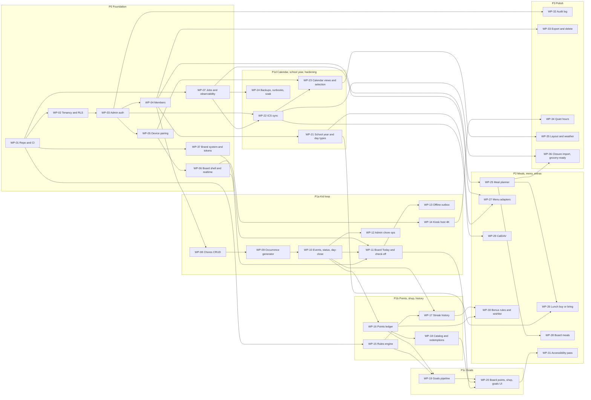

# 05 — Work Breakdown

> Version 0.3 · Status: draft for build
> Companions: `01-target-architecture.md` · `02-data-model.md` · `03-user-stories.md` · `04-requirements-traceability.md`
> Each work package (WP) is sized to be one pull request or a short chain of them for a Claude Code session working from this repo. Requirement links (`Reqs:`) are enforced by `check_traceability.py`; the Work packages column in `04` §B is generated from them.

---

## 1. How the work is chunked

- **By vertical slice, not by layer.** Each WP delivers something testable end to end (schema + API + UI + tests), except the foundation WPs.
- **Sizes:** S ≤ 2 days · M 3–5 days · L 1–2 weeks of focused builder time. No WP above L; split it instead.
- **Every WP ends with its tests:** pgTAP for schema, Vitest for pure logic, Playwright for flows. A WP is not done until its `Done when` list passes in CI.
- **Spikes first.** SPIKE-01 gates WP-05 and WP-06, SPIKE-03 gates WP-14, SPIKE-02 gates WP-22, SPIKE-05 gates WP-07, SPIKE-04 gates WP-27.
- **Phase gates** from `04` §E apply between sub-phases (P0, P1a … P1d, P2, P3).

### Suggested prompt pattern for Claude Code

> Implement WP-nn from `docs/05-work-breakdown.md`. Read the listed requirements in `04`, the related entities in `02`, and the components in `01`. Prefix commits and tests with requirement IDs. Do not widen scope; list anything you defer.

---

## 2. Dependency map

**Critical path to a usable kid loop:** WP-01 → 02 → 03 → 05 → 06 → 11, with 04 → 08 → 09 → 10 in parallel feeding 11. Everything in P1b–P1d can proceed in parallel after WP-10 and WP-11, subject to the arrows above.

**Parallelizable pairs** (different areas of the repo, low merge risk): WP-07 with WP-04/05; WP-15 with WP-10/11; WP-21 with WP-16/17; WP-22 with WP-18/19; WP-24 any time after WP-07.

---

## 3. Work packages

### Phase P0 — Foundation

### WP-01 — Repo, CI, and environments
**Phase:** P0 · **Size:** M · **Depends on:** — · **Reqs:** NFR-12, NFR-08
- Monorepo layout from `00-README.md` (`apps/web`, `packages/rules-engine`, `packages/adapters`, `supabase`, `e2e`, `docs`), TypeScript strict, lint, format.
- CI on every PR: typecheck, Vitest, `supabase db reset` + pgTAP, Playwright smoke, and `python docs/check_traceability.py --docs docs --tests .`.
- Vercel project with preview and production; Supabase local dev, staging and production projects; secrets via environment variables only.
- Written cost ceiling and plan choice (no auto-pausing database in production).
- **Done when:** a PR runs all gates green; preview deploys; the cost ceiling is written in `docs/`.

### WP-37 — Brand system and design tokens
**Phase:** P0 · **Size:** M · **Depends on:** WP-01 · **Reqs:** NFR-13
- `packages/ui`: import `brand/familywise-tokens.css` and `fonts.css`; typed `Icon` (from `icons/index.json`), `Avatar`, `ChoreTile` (all seven statuses), `PointsChip`, `GoalMeter`, `Banner`, `Button`; Day and Evening theme switching.
- App identity: favicon, touch icon, PWA icons, manifest and head tags from `brand/app-icons`; board boot splash; FamilyWise page titles; service-worker precache of fonts.
- Guards: lint or test that fails on raw hex outside the tokens file; Playwright snapshots of tile states in both themes; axe contrast check on shells.
- **Done when:** a `/dev/brand` page renders the specimen from real components, and the contrast and snapshot checks run in CI.

### WP-02 — Tenancy schema and RLS
**Phase:** P0 · **Size:** M · **Depends on:** WP-01 · **Reqs:** ACC-01, NFR-04, NFR-09, NFR-12
- Tables from `02` §3.1 (`household`, `household_user`, `member`, `invite`, `device`, `device_pairing`, `household_settings`, `job_run`) with `household_id` everywhere, RLS enabled, and the helpers in `02` §4.5.
- Migration lint that fails CI if a `public` table lacks RLS or `household_id`.
- pgTAP: cross-tenant read and write denied for admin and device; revoked device denied immediately.
- **Done when:** the isolation suite is green and the lint blocks a deliberately broken migration.

### WP-03 — Admin authentication and onboarding
**Phase:** P0 · **Size:** M · **Depends on:** WP-02 · **Reqs:** ACC-01, ACC-02, ACC-03, NFR-04
- Supabase Auth with Sign in with Apple, email magic link, and passkey enrollment; session handling in Next.js (server-side verification).
- Onboarding wizard creates the household (timezone, week start) and the owner link; invite flow for the second admin with hashed single-use tokens.
- **Done when:** two admins can sign in by different methods and see the same household; an expired or reused invite is rejected (E2E).

### WP-04 — Members UI
**Phase:** P0 · **Size:** S · **Depends on:** WP-03 · **Reqs:** ACC-04
- CRUD for child and adult members (name, avatar, color), archive instead of delete, multiple children supported by the schema.
- **Done when:** the single child profile exists and an adult profile can be linked to an admin.

### WP-05 — Device pairing and device auth
**Phase:** P0 · **Size:** L · **Depends on:** WP-03 (SPIKE-01 first) · **Reqs:** DEV-01, DEV-02, DEV-03, NFR-04
- Pairing code issue and redeem (single-use, 10-minute TTL, hashed), creating a Supabase Auth device user with `app_metadata` (`role=device`, `household_id`, `device_id`).
- Device list, rename, revoke, last seen. Revocation takes effect through `device.status` in the RLS helper.
- Device write scope limited to `/api/completions` and `/api/redemptions` (routes added later); reads through RLS.
- **Done when:** a second browser pairs with a code, reads board data, and loses access within seconds of revocation (E2E); SPIKE-01 findings are recorded in `docs/`.

### WP-06 — Board shell, snapshot, and realtime
**Phase:** P0 · **Size:** M · **Depends on:** WP-05 · **Reqs:** DEV-05
- `/board` route, PWA scaffolding, `board_snapshot` function (shape from `02` §4.6, initially members only), Realtime subscription with notify-then-refetch.
- Measure admin-change-to-board latency in an E2E budget test (p95 under 3 s).
- **Done when:** renaming a member in the admin portal shows on the paired board within the budget.

### WP-07 — Job framework and observability
**Phase:** P0 · **Size:** M · **Depends on:** WP-01 (SPIKE-05 first) · **Reqs:** NFR-07
- `pg_cron` + `pg_net` calling signed Vercel job endpoints; `job_run` records; idempotent job wrapper with catch-up semantics.
- Structured logs, error tracking, and a health page listing job status.
- **Done when:** a sample hourly job runs on staging, a forced failure shows on the health page, and replaying it is harmless.

### Phase P1a — Kid loop

### WP-08 — Chores CRUD
**Phase:** P1 · **Size:** M · **Depends on:** WP-04 · **Reqs:** CHR-01
- `chore` and `chore_assignee` tables; admin UI to create, edit, archive chores and one-off tasks (title, icon, assignees, points, approval flag, tags, schedule, day types).
- Zod validation of `schedule jsonb`.
- **Done when:** a parent can create the six seed chores on a phone in under five minutes.

### WP-09 — Occurrence generator
**Phase:** P1 · **Size:** M · **Depends on:** WP-08 · **Reqs:** CHR-02, CHR-03
- `chore_occurrence` (with `status` default `scheduled`), rolling-window generation per assignee, regeneration of only future `scheduled` occurrences on edit, snapshots of points and approval flag.
- Calls `resolve_day_type`; until WP-21 ships, a stub treats every weekday as `school_day`.
- **Done when:** property tests show generation is idempotent and edits never touch past occurrences; DST fixtures pass.

### WP-10 — Completion events, status projection, and day-close
**Phase:** P1 · **Size:** L · **Depends on:** WP-09, WP-07 · **Reqs:** CHR-04, CHR-07, NFR-06
- `chore_completion_event` (append-only, client-generated ids, `batch_id`), `private.fold_occurrence_status`, `apply_completion_event` trigger, `close_past_due`, and `rebuild_occurrence_status` (`02` §4.2).
- `POST /api/completions` accepting batches, idempotent on `id`, deriving `credit_date` server-side.
- `day_close` job (hourly, idempotent, catch-up) writing `missed` and `finalized_at`.
- **Done when:** pgTAP proves immutability, replay idempotency, and that rebuild equals the stored projection after random event sequences; a closed day has no `scheduled` rows.

### WP-11 — Board Today screen and check-off
**Phase:** P1 · **Size:** L · **Depends on:** WP-06, WP-10 · **Reqs:** BRD-01, BRD-02, BRD-03, CHR-04, NFR-03
- Today screen with the child's chores, tap to check off with optimistic UI (feedback under 100 ms), time-boxed undo, child selector.
- Debounce and confirm for destructive actions; icon-first layout using the 1920×1080 logical grid with 56 px minimum targets.
- **Done when:** the Playwright check-off flow passes including a rapid double tap resulting in one effective completion.

### WP-12 — Admin chore operations
**Phase:** P1 · **Size:** M · **Depends on:** WP-10 · **Reqs:** CHR-05, CHR-06, CHR-08
- Admin day view: complete, uncomplete, skip any occurrence; approval queue (approve, reject); household approval on/off switch and per-chore override that re-resolve open occurrences.
- Multi-select "Not actually done" producing one `batch_id`; undo of a batch.
- **Done when:** a parent unchecks four of five items in one action and the child sees them open again on the board.

### WP-13 — Offline outbox and stale indicator
**Phase:** P1 · **Size:** M · **Depends on:** WP-11 · **Reqs:** DEV-06, DEV-08, NFR-01
- Service worker (Serwist), IndexedDB snapshot and outbox (Dexie), ordered replay with idempotent ids, projected points marked as provisional.
- Stale-data indicator driven by snapshot age and `job_run`.
- **Done when:** an E2E test goes offline, checks off three chores, reconnects, and finds exactly three events; a 24-hour offline soak passes on cached data.

### WP-14 — Kiosk host and 4K display
**Phase:** P1 · **Size:** M · **Depends on:** WP-06 (SPIKE-03 first) · **Reqs:** DEV-04, BRD-06, NFR-02
- Pi 5 image/provisioning notes: Chromium kiosk flags, route lockdown to `/board`, watchdog restart, SSD boot, screen power control.
- Logical 1920×1080 layout at device scale factor 2 for the 3840×2160 panel; idle-return to Today after 60 seconds (deferred during a celebration).
- Hardware acceptance checklist from `04` §F.
- **Done when:** the Pi boots to the board unattended, survives a power pull, and the animation budget from SPIKE-03 is met or the 1080p fallback is adopted and documented.

### Phase P1b — Points, shop, streak history

### WP-15 — Rules engine package
**Phase:** P1 · **Size:** L · **Depends on:** WP-01 · **Reqs:** RWD-02, RWD-03, RWD-05, RWD-11, NFR-12
- `packages/rules-engine`: `evaluateGoal` and `evaluateHistory` per `02` §5; pure, no clock or I/O.
- Property tests with `fast-check` (event orderings, DST, replay) and at least 90% coverage.
- **Done when:** the coverage gate is green and the documented edge cases in `02` §5 each have a named test.

### WP-16 — Points ledger
**Phase:** P1 · **Size:** M · **Depends on:** WP-10 · **Reqs:** PTS-01, PTS-02
- `points_ledger`, `post_points` trigger, `v_points_balance`, manual adjustment endpoint with reason, snapshot inclusion of balance.
- **Done when:** random complete/undo/approve sequences always leave the ledger balance equal to the sum of done occurrences' points plus adjustments (pgTAP/property test).

### WP-17 — Streak history and insights
**Phase:** P1 · **Size:** M · **Depends on:** WP-10, WP-15 · **Reqs:** RWD-11, RWD-12
- `member_daily_summary` and `streak_segment` written by day-close using `evaluateHistory`; late completions re-derive the affected day.
- Admin Insights page: current and best good streak, longest bad streak, completion rate, heatmap, most-missed chores, trust panel (reversal/rejection rate, time to verify); board streak flame.
- **Done when:** after 14 seeded days the insights match a hand-computed table and a rebuild produces identical rows.

### WP-18 — Reward catalog and redemptions
**Phase:** P1 · **Size:** M · **Depends on:** WP-16 · **Reqs:** PTS-03, PTS-04
- `reward_catalog_item`, `redemption`; admin catalog editor; `POST /api/redemptions` with the available-balance check; approve (posts `spend`), deny, cancel, fulfil.
- **Done when:** a redemption flows requested → approved → fulfilled and two concurrent requests cannot overspend (pgTAP/integration).

### Phase P1c — Goals

### WP-19 — Goals admin and progress pipeline
**Phase:** P1 · **Size:** L · **Depends on:** WP-15, WP-16 · **Reqs:** RWD-01, RWD-04, RWD-06, RWD-09, RWD-10, RWD-13
- Goal CRUD with rules, lifecycle jobs (scheduled → active → expired), dirty flag trigger, reconcile within 5 minutes, reversible achievement (un-achieve on reversal, payout reversal, review flag when already fulfilled), redeem history, payout execution (custom, points, catalog item) exactly once per achievement, rule-change preview.
- **Done when:** a goal with a points payout posts one bonus on achievement even if the job runs twice; unchecking the deciding chore returns the goal to active and reverses the bonus; reconcile heals a deliberately dirtied goal.

### WP-20 — Board points, shop, and goals UI
**Phase:** P1 · **Size:** L · **Depends on:** WP-11, WP-18, WP-19 · **Reqs:** RWD-07, RWD-08, PTS-02, PTS-04
- Points balance, Shop screen, request flow with pending state, goal progress meters and nudges, chore celebration and one-time goal celebration (reduced motion honored).
- **Done when:** a child can earn points, request a reward, and see it approved, end to end on the real panel.

### Phase P1d — Calendar, school year, hardening

### WP-21 — School year and day types
**Phase:** P1 · **Size:** M · **Depends on:** WP-04 · **Reqs:** SCH-01, SCH-02, SCH-03
- `school_year`, `school_term`, `school_closure`, `member_school_profile`, `resolve_day_type` (`02` §4.4), admin UI; generator and board use it.
- **Done when:** pgTAP covers weekend, break, no_school, school_day, summer precedence; a break week produces no school-only chores.

### WP-22 — ICS calendar sync
**Phase:** P1 · **Size:** L · **Depends on:** WP-07, WP-03 (SPIKE-02 first) · **Reqs:** CAL-01, CAL-02, CAL-03, CAL-06, CAL-07
- Calendar source CRUD with URL in Vault; sync job (one source per invocation, conditional fetch), parse with `ical.js`, expansion window, last-good retention, sync health surface.
- Fixtures for recurrence across DST, all-day, cancelled and moved instances.
- **Done when:** a real iCloud published calendar syncs and matches the phone for a week; a broken URL leaves old data and shows an error.

### WP-23 — Calendar views and per-device selection
**Phase:** P1 · **Size:** M · **Depends on:** WP-22, WP-05 · **Reqs:** CAL-04, CAL-05
- Day, week, month views scrollable by touch; color and member association; `device_calendar` selection UI per board with defaults for new calendars.
- **Done when:** unticking a calendar in the admin portal removes its events from the board within 3 seconds.

### WP-24 — Backups, runbooks, and soak
**Phase:** P1 · **Size:** S · **Depends on:** WP-07 · **Reqs:** NFR-10
- Daily backups, a rehearsed restore into staging, runbooks (device re-pair, stuck sync, day-close catch-up), 7-day soak checklist.
- **Done when:** a restore drill is completed and recorded.

### Phase P2 — Meals, menu, extras

### WP-25 — Meal library and weekly planner
**Phase:** P2 · **Size:** M · **Depends on:** WP-04 · **Reqs:** MEAL-01, MEAL-02, MEAL-03, MEAL-08
- `meal`, `meal_plan_entry`; weekly grid for breakfast, snack, lunch, dinner; multiple ordered entries per slot; copy last week with skip or overwrite.
- **Done when:** a full week can be planned in under 10 minutes (timed with the family).

### WP-26 — Lunch buy or bring
**Phase:** P2 · **Size:** S · **Depends on:** WP-21, WP-25 · **Reqs:** MEAL-04
- `lunch_override`, weekday defaults per child, per-date overrides, only on school days.
- **Done when:** the effective mode resolves correctly across a break week (pgTAP).

### WP-27 — School menu adapters and import
**Phase:** P2 · **Size:** L · **Depends on:** WP-21, WP-07 (SPIKE-04 first) · **Reqs:** MENU-01, MENU-02, MENU-03, MENU-04, MENU-05, MEAL-05
- `menu_source`, `school_menu_day`; adapter interface with CSV and manual first, then the platform the admin selects; overrides never overwritten; 28-day daily refresh; failure surfacing; menu shown on buy days.
- **Done when:** four weeks load via CSV, and a failing adapter leaves cached menus and a visible warning.

### WP-28 — Board meals panel
**Phase:** P2 · **Size:** S · **Depends on:** WP-25, WP-06 · **Reqs:** MEAL-06
- Today's meals and a weekly read-only view on the board.
- **Done when:** the Today screen shows the day's four slots and the lunch mode.

### WP-29 — CalDAV (secondary account)
**Phase:** P2 · **Size:** M · **Depends on:** WP-22 · **Reqs:** CAL-08
- CalDAV with app-specific password in Vault, setup guidance for a secondary read-only Apple ID, ctag/sync-token handling.
- **Done when:** a CalDAV-backed calendar syncs alongside an ICS one.

### WP-30 — Bonus rules and wishlist
**Phase:** P2 · **Size:** M · **Depends on:** WP-16, WP-17 · **Reqs:** PTS-05, PTS-06
- `points_rule` evaluation (streak milestone, perfect day) with dedupe; wishlist pinning and savings meter on the board.
- **Done when:** a 7-day streak posts exactly one bonus and replay posts none.

### WP-31 — Accessibility pass
**Phase:** P2 · **Size:** S · **Depends on:** WP-20 · **Reqs:** NFR-11
- WCAG AA contrast, no color-only cues, reduced motion verified across celebrations and transitions.
- **Done when:** an automated contrast check and a manual checklist pass.

### Phase P3 — Polish

### WP-32 — Audit log
**Phase:** P3 · **Size:** S · **Depends on:** WP-03 · **Reqs:** ACC-05
- `audit_log` writes from API for admin and device actions; admin viewer with filters.
- **Done when:** every mutating API route is covered by a test asserting an audit row.

### WP-33 — Export and delete
**Phase:** P3 · **Size:** M · **Depends on:** WP-04 · **Reqs:** NFR-05
- JSON/CSV export of all household data; documented deletion procedure for a child profile and a household, anonymizing events.
- **Done when:** exported data re-imports into a fresh staging database in a smoke test.

### WP-34 — Quiet hours and burn-in mitigation
**Phase:** P3 · **Size:** S · **Depends on:** WP-14 · **Reqs:** DEV-07
- Scheduled dim/sleep, wake on touch, subtle pixel shifting.
- **Done when:** the panel sleeps and wakes on schedule over a 3-day hardware test.

### WP-35 — Board layout configuration and weather
**Phase:** P3 · **Size:** M · **Depends on:** WP-23 · **Reqs:** BRD-04, BRD-05
- Panel on/off and ordering; optional local weather widget.
- **Done when:** reordering panels updates the board within 3 seconds.

### WP-36 — Closure import and grocery-ready ingredients
**Phase:** P3 · **Size:** M · **Depends on:** WP-22, WP-25 · **Reqs:** SCH-04, MEAL-07
- Preview and import no-school days from a tagged calendar; structured ingredients on meals.
- **Done when:** importing a tagged calendar creates closures only after the admin confirms the preview.

---

## 4. Size summary

| Phase | WPs | Notes |
|---|---|---|
| P0 | WP-01 – WP-07, WP-37 | One L (device auth); spikes SPIKE-01 and SPIKE-05 sit inside it |
| P1a | WP-08 – WP-14 | Two L (events/status, board Today) |
| P1b | WP-15 – WP-18 | Rules engine is the long pole |
| P1c | WP-19 – WP-20 | Two L |
| P1d | WP-21 – WP-24 | ICS sync is the L |
| P2 | WP-25 – WP-31 | Menu adapters is the L |
| P3 | WP-32 – WP-36 | Backlog by value |

Sizes are relative effort for a single builder with Claude Code, not commitments; re-estimate at each phase gate.
