# 07 — User Guide and Manual

> Version 0.1 · Status: living document · Maintained by Claude Code
> v0.1: first version (D-68): Part A, the User Guide by task, and Part B, the User Manual, for everything built up to WP-35; screenshots from the made-up demo family; a check that every built story is covered.
> Companions: `03-user-stories.md` (the stories each section covers) · `05-backlog.md` (what is built) · `06-brand-and-style-guide.md` (the words the app uses)

FamilyWise is your family's board: a touchscreen on the wall that shows everyone's day, and an admin app for parents on a phone or laptop. Children check things off on the board and earn points. Parents set everything up, and keep the record honest, from the admin app.

This guide has two parts:

- **Part A, the User Guide**, follows the tasks people do: setting up, a parent's day, the family at the board, points and rewards, goals, calendars and the school year. Read it in order the first time.
- **Part B, the User Manual**, is the reference: every page and screen, what each control does, the rules and limits, troubleshooting, questions, and a glossary.

Button and label names are in **bold**, exactly as the app shows them. The pictures show the demo family: Maya and Leo (children), Alex and Sam (adults). They are made up, and so is everything they do.

## How this guide is kept current

- **One guide, kept in step with the app.** Any pull request that changes something a parent or child can see updates this guide in the same pull request, and bumps its version line (D-68).
- **Every built story is covered.** Each section names the user stories it covers. On GitHub that line is hidden; on the published page it shows as a small **Covers** line. `pnpm trace` fails when a story linked to a work package that is Done in `05` is covered by no section, unless it is listed, with a reason, in [Stories this guide covers](#b8-stories-this-guide-covers).
- **Pictures from made-up data only.** Every screenshot comes from a dev page that draws the demo family without a database. `pnpm guide:shots` takes them again (see `scripts/guide/shots.mjs`).
- **Published with the other docs.** `pnpm docs:build` turns this file into the **User guide** page. Edit this file, never the page.

## Contents

- [Part A — User Guide](#part-a--user-guide)
  - [A1 Getting started](#a1-getting-started)
  - [A2 A parent's day](#a2-a-parents-day)
  - [A3 Reminders on your phone](#a3-reminders-on-your-phone)
  - [A4 Setting up chores and tasks](#a4-setting-up-chores-and-tasks)
  - [A5 The family at the board](#a5-the-family-at-the-board)
  - [A6 Points, rewards, the shop and wishes](#a6-points-rewards-the-shop-and-wishes)
  - [A7 Goals and celebrations](#a7-goals-and-celebrations)
  - [A8 Streaks and insights](#a8-streaks-and-insights)
  - [A9 Calendars](#a9-calendars)
  - [A10 School year and day types](#a10-school-year-and-day-types)
  - [A11 The board's home screen layout](#a11-the-boards-home-screen-layout)
  - [A12 Day and Evening themes](#a12-day-and-evening-themes)
- [Part B — User Manual](#part-b--user-manual)
  - [B1 The admin app, page by page](#b1-the-admin-app-page-by-page)
  - [B2 The board, screen by screen](#b2-the-board-screen-by-screen)
  - [B3 Rules and limits](#b3-rules-and-limits)
  - [B4 Troubleshooting](#b4-troubleshooting)
  - [B5 Questions and answers](#b5-questions-and-answers)
  - [B6 Glossary](#b6-glossary)
  - [B7 Coming soon](#b7-coming-soon)
  - [B8 Stories this guide covers](#b8-stories-this-guide-covers)

## Part A — User Guide

### A1 Getting started
<!-- covers: US-101 US-102 US-103 US-104 US-201 US-1109 -->

**What this is.** The steps to go from nothing to a working board. **When.** Once, when your family starts. **How.** Do the steps below in order; each takes a few minutes.

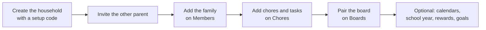
```mermaid
flowchart LR
  A[Create the household<br/>with a setup code] --> B[Invite the other parent]
  B --> C[Add the family<br/>on Members]
  C --> D[Add chores and tasks<br/>on Chores]
  D --> E[Pair the board<br/>on Boards]
  E --> F[Optional: calendars,<br/>school year, rewards, goals]
```

#### Create your household

You need a **setup code** from whoever installed FamilyWise for you. It works once, for 24 hours. FamilyWise has no public sign-up: every household starts from a setup code, and every other parent joins by invitation.

1. Open FamilyWise's setup page (the address ending in `/setup`).
2. Enter the **Setup code**.
3. If you are not signed in yet, enter **Your email** and **Choose a password** (at least 8 characters). If you already have an account, choose **Sign in first** instead.
4. Enter a **Household name**, for example "The Rivera family".
5. Check the **Timezone**. It starts as your device's. The board's day starts and ends in this timezone.
6. Choose when the **Week starts on**: Sunday, Monday or Saturday. Weekly limits in the shop and the Insights calendar follow it.
7. Choose **Create household**.

You land on the admin app's **Home** page as the household's owner, with "Your household is ready. Invite another admin below when you like."

#### Sign in

On the **Sign in** page, either:

- enter your **Email** and **Password** under **With your password**, then choose **Sign in**; or
- enter your **Email** under **With a link by email** and choose **Email me a link**. The link works once, for 1 hour, in the same browser.

**Forgot your password?** sends a reset link; then you **Choose a new password** and **Save password**.

> **Note:** FamilyWise doesn't have its own email service yet, so a sign-in or reset link by email may not reach you. Sign in with your password. Your password works from your very first sign-in.

> **Tip:** On an iPhone, add the admin app to your Home Screen: in Safari, tap **Share**, then **Add to Home Screen**. It opens full screen, and it is what makes reminders possible on an iPhone.

#### Invite another admin

Both parents can run FamilyWise. Each has their own sign-in.

1. On **Home**, under **Invite an admin**, enter **Their email**.
2. Choose **Create invite link**.
3. Choose **Copy link** (or **Share** on a phone) and send it to them yourself. No email is sent for you.

The link works once, for 7 days, and only for the email it names. Anyone with the link can use it, so share it only with them. While it waits it is listed under **Waiting to join**, where **Cancel invite** cancels it. A new invite to the same email replaces the open one.

**For the person invited:** open the link. It says **Join** and the household's name.

- Already have an account? **Sign in** with the email the invite names, come back to the link, and choose **Join household**.
- New to FamilyWise? **Choose a password** and choose **Create account and join**.
- Signed in with a different email? Choose **Sign out**, then sign in with the invited email.

#### Add the family

Everyone in the family is a **member**: children and adults. Chores, tasks, points and goals belong to members.

1. Go to **Members** and choose **Add a member**.
2. Enter a **Name** (a first name or nickname is enough, up to 40 characters).
3. Choose **Who they are**: **Child** or **Adult**. Children never sign in; they use the board.
4. Pick an **Avatar** (an animal, or **Initials**) and a **Color**. The board shows both, so each person is easy to spot.
5. Optionally, a **Birth year**.
6. Check **Earns rewards**. It starts on for a child and off for an adult. Members who earn rewards collect points, go through approval, and can have goals and streaks. You can change it for anyone, any time.
7. Choose **Add member**.

#### Link your own sign-in

FamilyWise needs to know which member you are, so **My tasks** and **Reminders** can find your own items. Do this once per parent.

- The quickest way: open **My tasks** or **Reminders**. If your sign-in isn't linked, it asks **Which one is you?** and lists the adults with no sign-in. Choose **I'm** and your name.
- Or open your own record on **Members**: an adult's page offers **This is me**.
- Or, as any admin, choose the parent's sign-in under **Their sign-in** on their member page.

Only an adult can have a sign-in. If your record says Child, open it on **Members** and choose **Adult** first.

#### Pair a board

A board is any screen showing FamilyWise's board page: normally the wall touchscreen. It doesn't sign in like a parent. Instead, you pair it once with a code.

1. On the board's screen, open FamilyWise's board page (the address ending in `/board`). It starts on **Pair this board**, with a keypad.
2. On your phone, go to **Boards**. Under **Add a board**, enter a **Board name** (for example "Kitchen") and choose **Get a pairing code**.
3. The code has 8 digits, shown as two groups of four. It works once, for 10 minutes.
4. Type the code on the board's keypad and choose **Pair this board**.

The board shows the family's day at once. From then on it keeps itself signed in, even after a power cut or a wifi drop. Nobody needs to touch it again.

> **Note:** If the board is a browser where a parent is signed in to the admin app, pairing signs that browser out of the admin app.

### A2 A parent's day
<!-- covers: US-306 US-307 US-309 US-310 US-316 -->

**What this is.** The admin app's **Today** and **My tasks** pages. **When.** Whenever you want to see how the day is going, settle what's waiting for you, or put something right. **How.** Open **Today** from the menu.

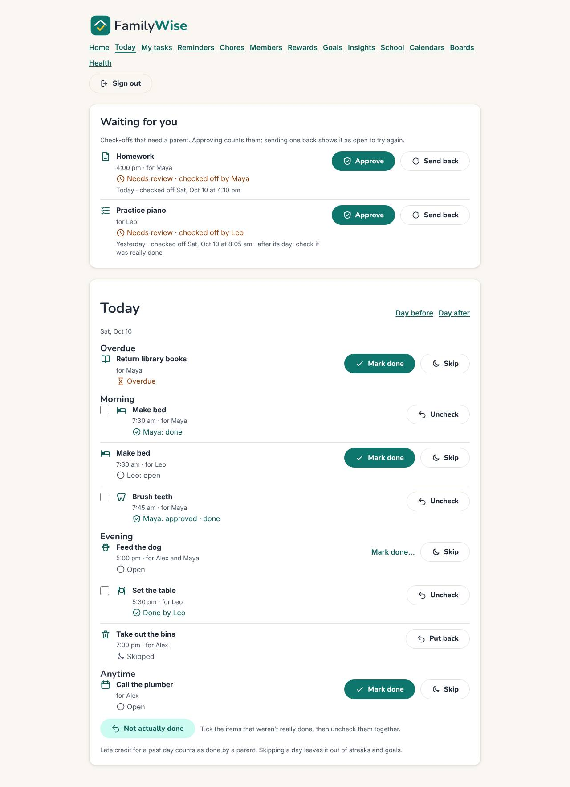

#### Check the day on Today

**Today** shows the whole family's day, grouped like the board: **Overdue**, **Morning**, **After school**, **Evening** and **Anytime**. Each item says who it is for and how it stands, with an icon and a word: **Open**, **Done**, **Approved**, **Needs review**, **Sent back**, **Skipped**, **Missed**, **Overdue** or **Covered**. For an item everyone does their own, each person's line starts with their name ("Maya: done").

Move between days with **Day before** and **Day after**; **Today** brings you back.

#### Approve or send back a check-off

If check-offs wait for a parent (see [Approval: on or off](#approval-on-or-off)), they appear at the top under **Waiting for you**, from any day.

- **Approve** counts it. The points are earned and it counts toward goals and streaks.
- **Send back** shows it as open again on the board ("Try again"), so your child can do it and check it off again.

A check-off marked "after its day: check it was really done" was made after the item's day had ended (for example, a board that was offline at midnight). It always waits for you, whatever the approval setting.

#### Approval: on or off

On **Home**, under **Check-offs**, choose what happens **When a child checks something off**:

- **It counts straight away; a parent can uncheck it later** (the default). Points arrive at once. You check in real life and use **Uncheck** or **Not actually done** if needed.
- **It waits for a parent to approve it.** The board shows **Waiting for a parent** and no points arrive until you approve.

Choose **Save**. Switching changes only what is still to do: check-offs already waiting stay in **Waiting for you**, and ones already done stay done.

Approval applies only to members who earn rewards. A check-off by someone who doesn't earn rewards, like most adults, always counts straight away. Each item can also be set to **Always needs a parent's OK** or **Never needs a parent's OK**, under **Approval** in **More options** on its page.

> **Tip:** **Insights** shows how often you uncheck or send back each child's check-offs. Few means check-offs can count straight away; many means they should wait for you.

#### Mark done, skip, uncheck

Each item on **Today** has the buttons that make sense for it:

| Button | What it does | Shown for |
|---|---|---|
| **Mark done** | Checks it off as a parent. It counts at once, as approved, and earns its points. | Open, sent back or missed items. A chore only once its day has come; a task any time. |
| **Mark done…** | Asks **Who did** it, then **Mark done**. Tick one or several people. | A shared item with several people. |
| **Skip** | Leaves it out for that day. "It won't count for or against anyone." | Open, sent back or missed items, on any day. |
| **Put back** | Undoes a skip. | Skipped items. |
| **Uncheck** | Makes it not done. Its points are taken back. | Done or approved items. |
| **Approve** / **Send back** | Decides a check-off that waits for a parent. | Items waiting for review. |

**Late credit.** Go back with **Day before** to a past day and use **Mark done** on a routine that was missed. It counts as done by a parent and earns its points; streaks and goals are worked out again. Only a parent can catch up a past day: the board shows today only.

**Skipping ahead.** Go forward with **Day after** to skip a day in advance, for example for a sick day or a trip.

#### "Not actually done"

When your child checked off things they didn't really do, uncheck them together:

1. On **Today**, tick the box beside each item that wasn't really done.
2. Choose **Not actually done**.

They go back to open (or to missed, if their day is over), and their points are taken back once each. The banner says "Unchecked 2 items. Their points are taken back." with an **Undo** button: if you unticked the wrong ones, **Undo** puts back each item that hasn't changed since, done by whoever had done it, with its points.

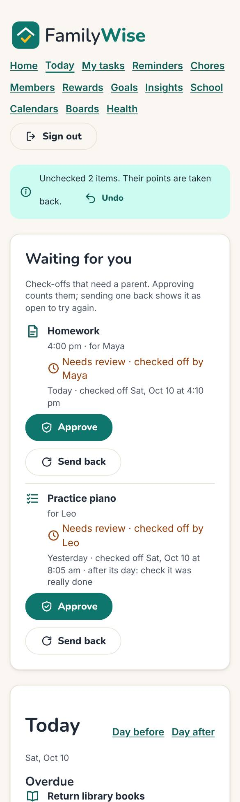

#### My tasks and quick add

**My tasks** is your own list, on your phone: everything you are on, including shared items.

- **Overdue**: your tasks from earlier days that are still open.
- **Today**: everything due today.
- **Coming up**: the next seven days.

**Mark done** credits only you. **Uncheck** takes it back. The **Bell on** / **Bell off** button beside each open item says whether it reminds you (see [A3](#a3-reminders-on-your-phone)).

**Quick add:** type under **Add a task for today** and choose **Add**. It becomes a task for you, due today, with no points, visible to the family. It shows on the board straight away.

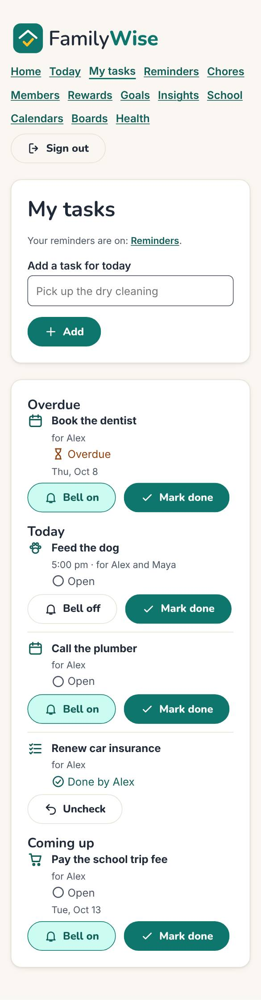

### A3 Reminders on your phone
<!-- covers: US-317 US-318 US-319 -->

**What this is.** Notifications on your phone or computer when one of your items comes due. **When.** If you want a nudge for your own tasks. Reminders are off until you turn them on, and they are yours alone: nobody else sees your settings. **How.** Open **Reminders**.

1. On an iPhone or iPad, first add FamilyWise to your Home Screen (**Share**, then **Add to Home Screen**) and open it from there.
2. On **Reminders**, choose **Turn on reminders**. Your browser asks to allow notifications: allow them.
3. Under **My devices**, choose **Send a test**. A notification should arrive in a moment.
4. Do the same on each phone or computer you want reminders on (the button then reads **Add this device**).

Then set **When to remind me** and choose **Save**:

| Setting | What it does |
|---|---|
| **Remind me about new items (each has its own bell)** | Whether a new item reminds you until you change its bell. On by default. |
| **Remind me** | **At the due time**, **15 minutes before** (default), **1 hour before** or **1 day before**. An item can say otherwise. |
| **Items with no due time remind me at** | The time of day for items without a due time (8:00 am by default). |
| **Daily digest** | **Send me a summary of my day** at a time you choose: what's overdue and due today. Nothing is sent on a day with nothing to do. |
| **Quiet hours** | **Hold reminders during quiet hours**, **From** and **To** (they may run past midnight). A reminder that falls inside them comes when they end. |
| **Hide the names of private items on my lock screen** | On by default: a private item reads "Private task" or "Private chore" instead of its name. |

A reminder shows the item's name and when it is due ("Due at 3:00 pm", "Due today", "Due tomorrow at 9:00 am"). Tapping it opens the item in **My tasks**. A digest reads "Your day: 3 to do, 1 overdue" and names up to three items.

**Choosing which items remind you.** In **My tasks**, each open item has a bell: **Bell on** or **Bell off**. Tap it to switch that item for you only. On an item's page, **Reminders** sets how early that item reminds everyone ("As each person chose", or a fixed time).

Reminders come only for items you are on, at most once each, and never after the item is done. **Turn off reminders** stops them all; your devices stay listed for when you **Turn reminders back on**.

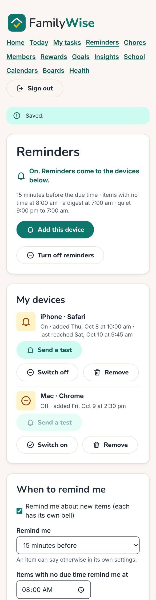

### A4 Setting up chores and tasks
<!-- covers: US-301 US-302 US-308 US-311 US-312 US-313 US-314 US-315 US-320 -->

**What this is.** The family list: everything anyone in the family does, adults included, on **Chores**. **When.** At the start, then whenever something changes. **How.** Go to **Chores** and choose **Add a chore** or **Add a task**.

**Chore or task?**

- A **chore** is a routine, like making your bed. If it isn't done on its day, it counts as **missed**.
- A **task** is a to-do, like returning library books. It stays open, and shows as **Overdue**, until it's done. It is never missed.

#### Add an item

1. Choose **What it is**: **Chore** or **Task**.
2. Enter its **Name** (up to 80 characters).
3. Tick **Who it's for**: anyone in the family, one or several people.
4. With two or more people, choose **With several people**:
   - **Everyone does their own**: each person has their own to check off, like making their own bed. Each person's check-off, points and miss are their own. New chores start like this.
   - **Any one of them**: done once, by whoever gets to it, like feeding the dog. New tasks start like this.
5. Choose **How often**: **Every day**, **Some days** (tick the days), **Monthly** (a **Day of the month**; the 31st falls on the last day of a shorter month) or **Once** (a date).
6. Optionally, a **Due time**. It orders the day into Morning (before noon), After school (noon to 5 pm) and Evening (from 5 pm); items without one are **Anytime**. It never changes points.
7. Pick an **Icon**. **More icons** has the rest.
8. Set **Points**: 5 for a new chore and 0 for a new task, until you change it. Only members who earn rewards collect points.
9. Optionally, tick **Tags** (see below).
10. Optionally, switch on **Private** (see below).
11. Under **More options**, optionally set **Approval** and **On these days** (for example, homework on **School days** only).
12. Choose **Save**, or **Save and add another** to enter the next one straight away.

> **Tip:** **Save and add another** keeps the same kind (chore or task), so you can enter the whole family list in a few minutes.

#### Change or archive an item

Choose **Edit** beside it. Its page shows the form, then **Coming up** (the next two weeks) and **Last 7 days** (what happened each day). The next two weeks are always planned ahead.

- A change applies from today. Today's item follows the change unless something has already happened to it, like a check-off or a skip; days already past keep what they were.
- **Archive** takes it off the list and the board; its history stays. **Restore** puts it back.

#### Shared items and who did it

An item for several people with **Any one of them** is one item a day, shared. Whoever checks it off is recorded as doing it, and it is done for everyone. For the others it counts as **Covered**: neither done nor missed. If several people did it together, pick them all: each one who earns rewards gets the points. If nobody does a shared chore, it is missed for everyone on it.

#### Tags

Tags group the list, like Morning or Kitchen. Use them to filter **Chores** and to set goals that count by category.

1. On **Chores**, choose **Tags** (the link under the list), or **Add or change tags** in an item's form.
2. Enter a **Name** (up to 30 characters), pick a **Color** and, optionally, an **Icon**, then **Add tag**.

Renaming a tag keeps every goal working. **Archive** a tag to stop offering it; goals and history that use it keep working, and **Restore** brings it back.

#### Private items

Switch on **Private** for a surprise or a personal item. A private item never shows on the board. Only you, and the people it's for who sign in, can see it. Only the person who created an item can make it private or family-visible again.

#### Find things on the list

At the top of **Chores**, filter by **Person**, **Tag**, **Kind**, **Time of day**, and **Show** (**Active** or **Archived**), then choose **Filter**. **Clear** shows everything again. Each line shows how often it happens, its due time, its points, when it is next due ("Next: Today"), and "Overdue since" for an open task.

### A5 The family at the board
<!-- covers: US-303 US-304 US-305 US-1001 US-1002 US-1005 US-1006 US-905 -->

**What this is.** The wall board: the family's day, for everyone. **When.** All day. **How.** Just tap. Every button on the board is big enough for a child's finger and answers at once.

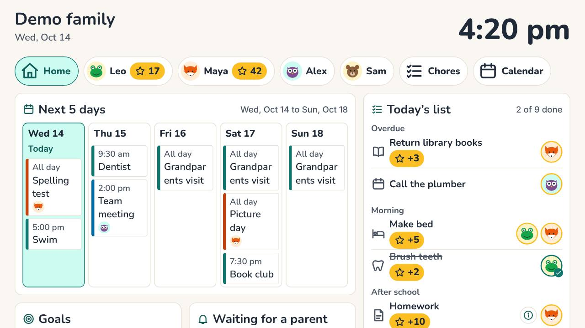

#### The home screen

The home screen has three parts:

- **The calendar** on the left: the next few days (5 by default) with each event in its calendar's color. Tap a day's heading to open it in **Calendar**.
- **Today's list** on the right: one list for the whole family, grouped into **Overdue**, **Morning**, **After school**, **Evening** and **Anytime**, with "2 of 9 done" at the top. Each row shows the item, its points, and a face for each person it is for.
- **Cards** under the calendar: **Goals**, **Waiting for a parent** and **Coming up** (all-day events in the next three weeks). A parent chooses which cards show, and in what order (see [A11](#a11-the-boards-home-screen-layout)).

The top bar stays in place while the screen scrolls: **Home**, a button for each person (with their points, if they earn rewards), **Chores** and **Calendar**.

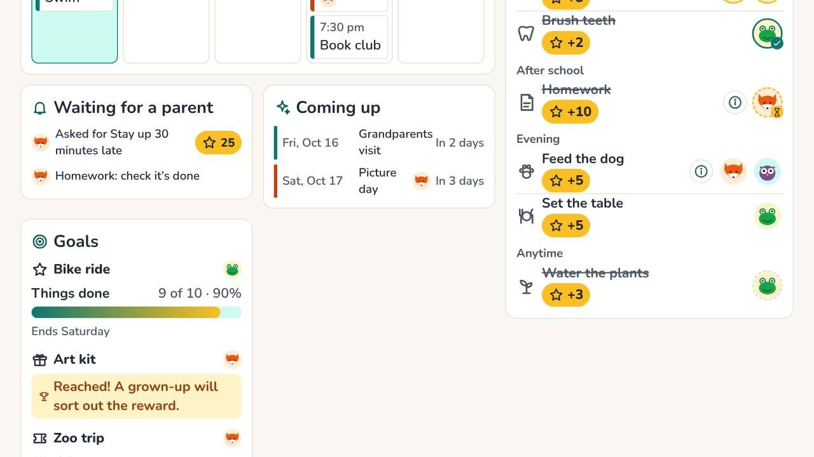

#### Check something off with a face

On **Today's list**, tap the face of the person who did it. The face gets a check mark straight away, and the points go to that person if they earn rewards. If the item waits for a parent, the face shows an hourglass instead, and the points come when a parent approves.

- An item **everyone does their own** is one row with a face each: tap your own face.
- A **shared** item shows the faces of its people: tap the one who did it.
- **Anyone** (a face with a family icon) appears on a shared item with nobody on it. Tapping it asks who did it.

How a face looks tells you how it stands:

| Face | Means |
|---|---|
| Plain | To do |
| Ring in the sun color | Past its time (today, after its due time) or overdue |
| Ring with a check | Done |
| Dashed ring with an hourglass | Waiting for a parent |
| Dashed grey ring | Done by someone else (covered), or skipped today |

When nobody on a row has anything left to do, its name is crossed through.

#### Undo a mistaken tap

Tapped the wrong thing? You have **2 minutes** from the check-off to undo it on the board.

- **On the home screen:** tap the done face again. It is outlined; tap it once more within 4 seconds to undo.
- **On a person's screen or Chores:** tap **Undo** under the tile. It changes to **Tap again to undo**; tap within 4 seconds.

After 2 minutes the **Undo** button goes away. A parent can still change it in the admin app.

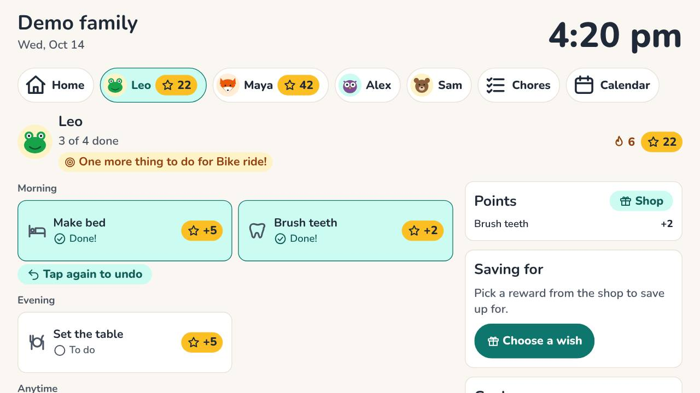

#### A person's screen

Tap a person in the top bar to see their own day: their name, "3 of 4 done", and their items as big tiles. A tap on a tile checks it off for them, even a shared one. When everything is done it says "All done today. Nice work!"

For someone who earns rewards (usually a child), the screen also shows:

- their **points**, and a **flame** with their run of good days (see [A8](#a8-streaks-and-insights));
- a **nudge** when a goal is nearly reached, like "One more thing to do for Bike ride!";
- a **Points** card with their five latest points and a **Shop** button;
- **Asked for** (their requests), **Saving for** (their wish) and **Goals**.

Anyone's screen also lists **Today**: today's events from their own calendars and the family's.

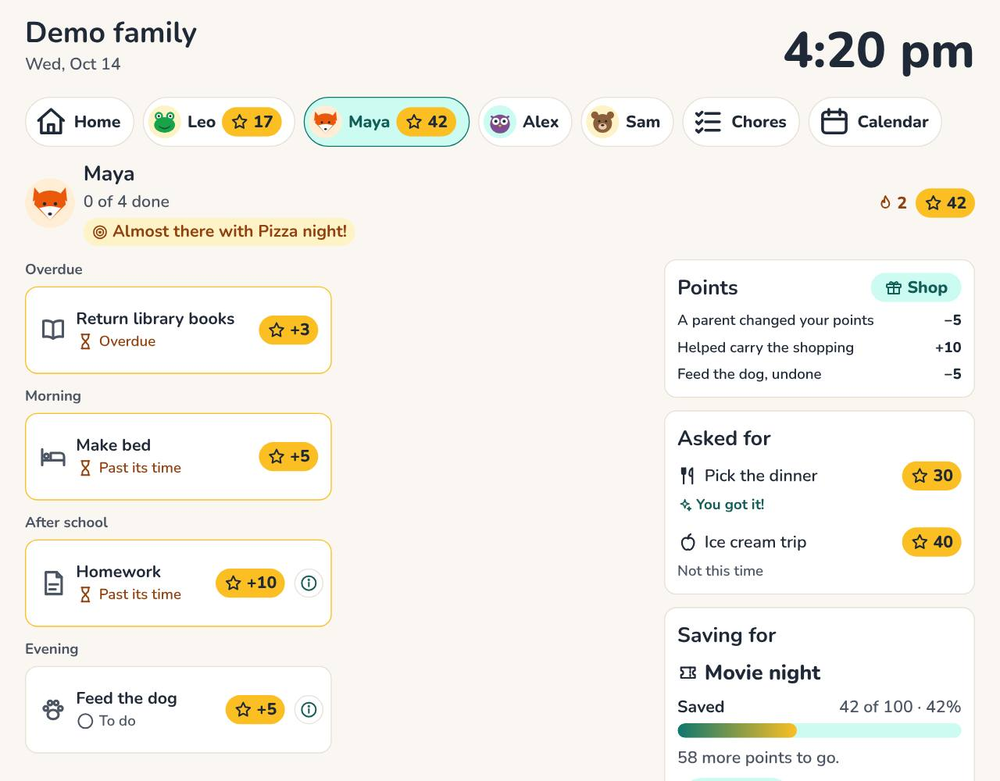

#### The Chores screen

**Chores** shows everyone's day side by side: a column per person, each with their items by part of the day, their flame and points. The family's goals sit underneath.

A tap on a tile credits that column's person when it is their own item or an item for one person. For a shared item with several people, the board asks **Who did** it: the item's people come first, then everyone else, and the column's person is already ticked. Tick one or several, then **Done** (or **Cancel**).

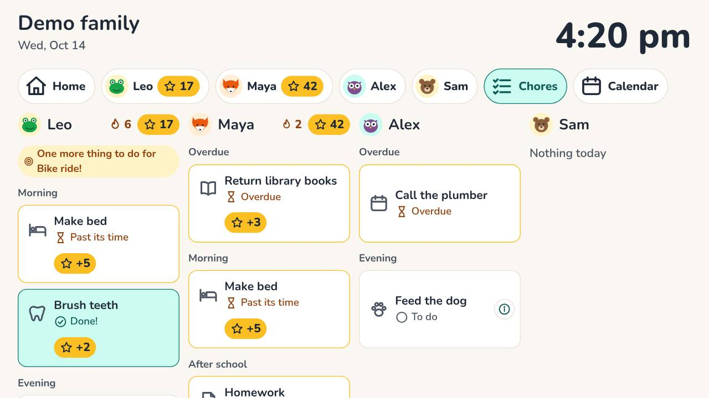

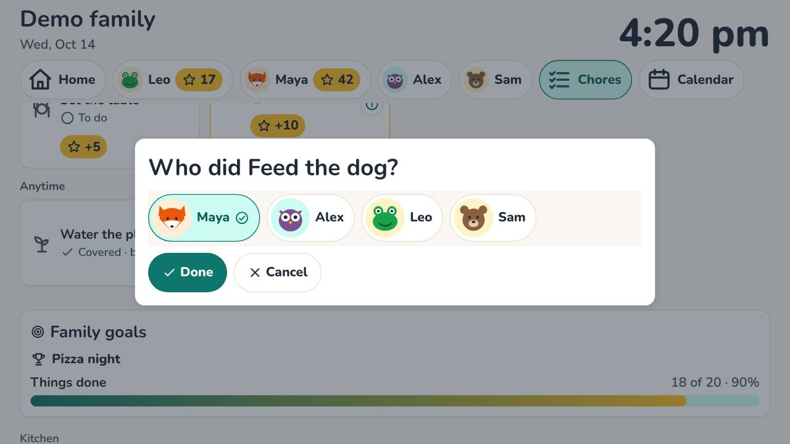

#### More info

Every tile is the same height and a name may be cut short. A row or tile whose name doesn't fit, or that has a description, has a small **i** button: **More info**. It opens the item in full: its description, **When** it's due, its **Points**, and **Who** it is for with how each person stands. **Close** shuts it.

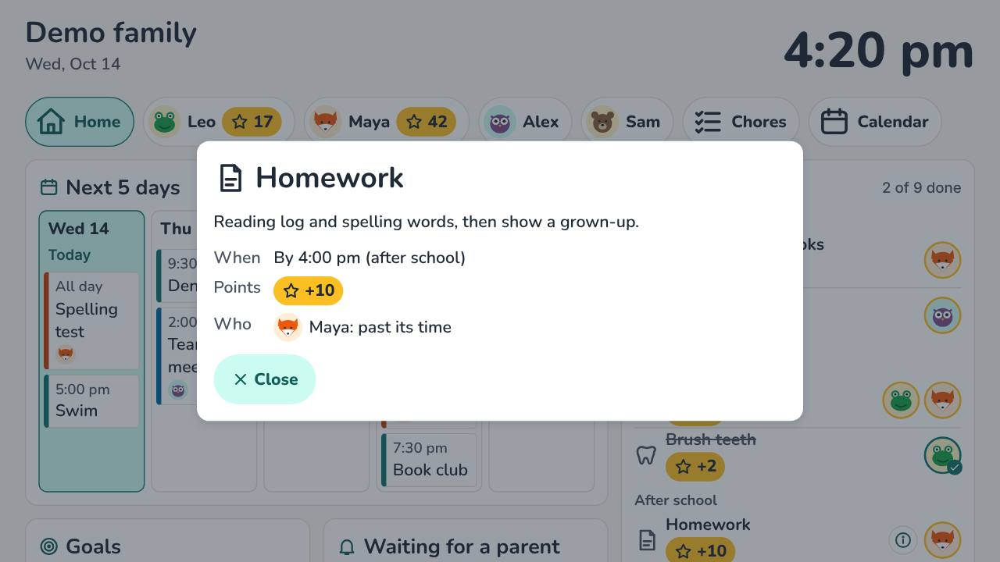

#### Back home on its own

After **90 seconds** with nobody touching it, the board goes back to the home screen, scrolled to the top, and closes the shop, the wish picker and More info. The next person always finds the whole family.

#### When the internet drops
<!-- covers: US-205 US-206 US-204 -->

The board keeps working without the internet. Check-offs and undos still work and show at once; the board saves them and sends them as soon as it can, each exactly once, even after a reload.

While it waits, the top bar says **Offline: your check-offs are saved**, and a balance that counts unsaved check-offs has a dashed ring and a no-wifi mark ("Not saved yet"). When the connection returns, everything is sent and the board shows what the server recorded.

Asking for a reward, calling a request off and choosing a wish need the internet. Offline, the board says so ("Asking needs the internet", "Choosing a wish needs the internet.") or greys the button out.

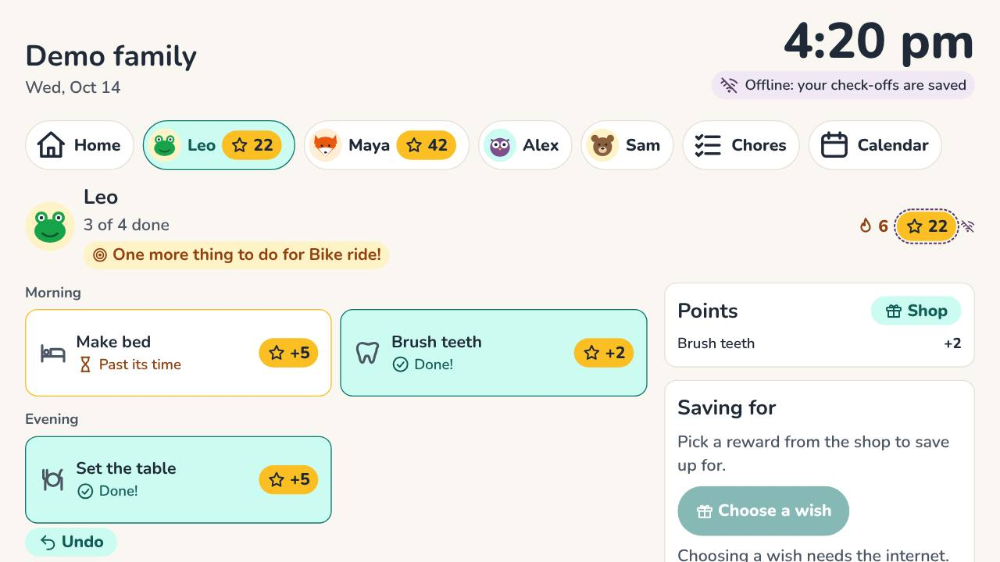

The board also tells you when what it shows may be old:

- **Updated 12 minutes ago** (or hours, or days): it hasn't been able to read the latest for over 5 minutes.
- **Today's list may be out of date**: the jobs that plan the days ahead or close the day are late or failing.

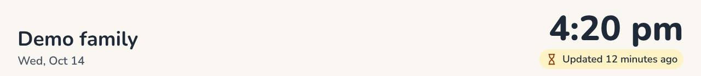

Changes a parent makes in the admin app reach the board within seconds while it is connected.

### A6 Points, rewards, the shop and wishes
<!-- covers: US-1101 US-1102 US-1103 US-1104 US-1105 US-1106 US-1107 US-1108 -->

**What this is.** A points economy for children: points for things done, spent in a shop of rewards a parent keeps. **When.** Once your children have chores. **How.** Set up the shop on **Rewards**; children ask on the board; you decide in the admin app.

#### How points work

- An item's points are earned when it is done (or approved) by someone who earns rewards. Items done together pay each person their points.
- Undoing or unchecking it takes those points back. A balance can go below zero; the board shows that calmly as points "to earn back".
- Nothing in the points history is ever edited or deleted. A mistake is put right with a new entry.

A child's check-off, from tap to points:

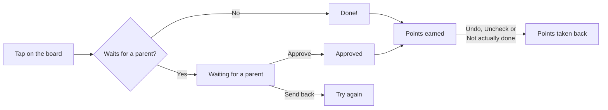
```mermaid
flowchart LR
  T[Tap on the board] --> Q{Waits for a parent?}
  Q -- No --> D[Done!] --> P[Points earned]
  Q -- Yes --> W[Waiting for a parent]
  W -- Approve --> A[Approved] --> P
  W -- Send back --> R[Try again]
  P -- Undo, Uncheck or<br/>Not actually done --> X[Points taken back]
```

#### Give or take away points by hand

On **Members**, open a child and find **Points**:

1. Choose **Add** or **Take away**.
2. Enter the **Points** (1 to 10,000).
3. Say **Why** (up to 200 characters).
4. Choose **Add points** or **Take away points**.

The board's points list shows the reason for points added. Points taken away read only "A parent changed your points": the reason stays in the admin app, so the board never tells a child off.

#### Build the shop

1. On **Rewards**, choose **Add a reward**.
2. Enter a **Name** and a **Cost in points**.
3. Optionally: a **Description**, an **Icon**, a **Photo** (JPEG, PNG or WebP, up to 2 MB), **How many there are**, and **Times each child may ask in a week**.
4. Keep **In the shop now** ticked, and choose **Add reward**.

A reward with none left shows "All gone for now" on the board. **Archive** takes a reward out of the shop; requests already made keep the cost they had.

#### A child asks for a reward

On their own screen, a child taps **Shop**. The shop shows what they have **to spend** (their points, less what they have already asked for) and every reward:

- **Ask for this**, then **Yes, ask** to be sure (or **Not now**). A stray tap never spends anything.
- Or a line saying why not yet: "58 more points to go", "All gone for now", "Asked for this week. Try next week!" or "Asking needs the internet".

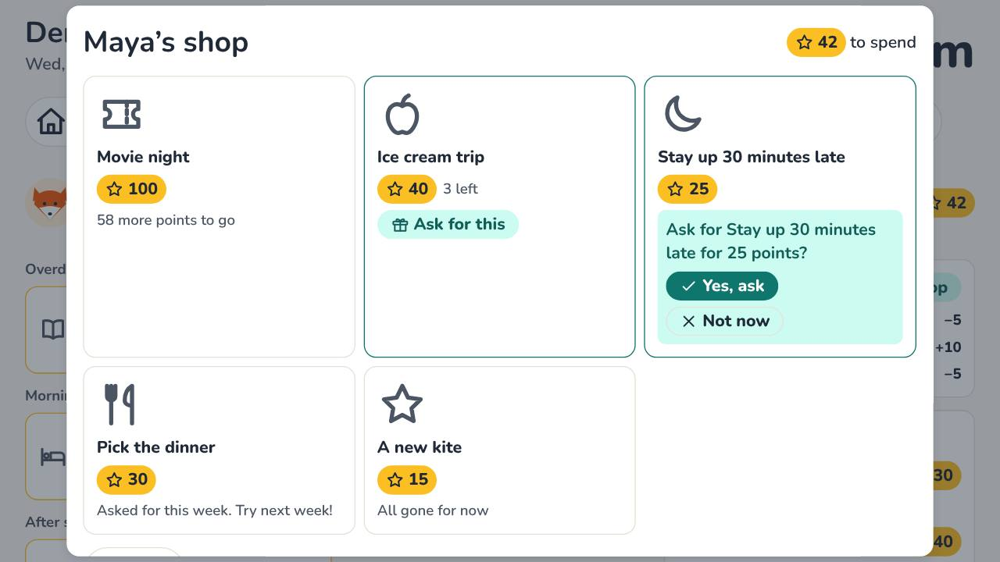

The request shows at once under **Asked for** as "Waiting for a grown-up". While it waits, the child can call it off with **Call off**. The points it holds show as "waiting for a grown-up" on the **Points** card.

#### Decide a request

On **Rewards**, under **Asked for**, each request shows the child, the reward, its cost and the child's points:

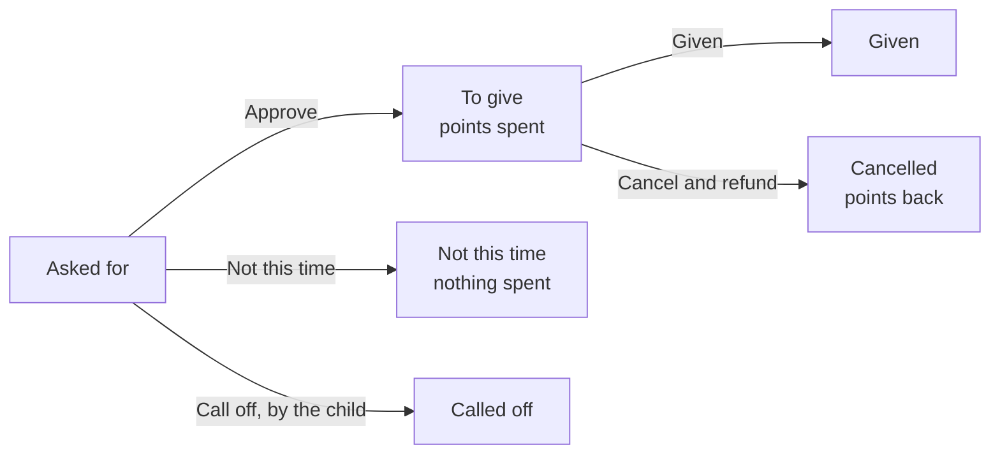
```mermaid
flowchart LR
  A[Asked for] -- Approve --> B[To give<br/>points spent]
  A -- Not this time --> C[Not this time<br/>nothing spent]
  A -- Call off, by the child --> D[Called off]
  B -- Given --> E[Given]
  B -- Cancel and refund --> F[Cancelled<br/>points back]
```

- **Approve** spends the points and moves it to **To give**. The board says "Yes! It's coming".
- **Not this time** spends nothing. The board says "Not this time".
- Under **To give**: **Given** once it has happened ("You got it!"), or **Cancel and refund** to give the points back. A reward already given can't be cancelled.

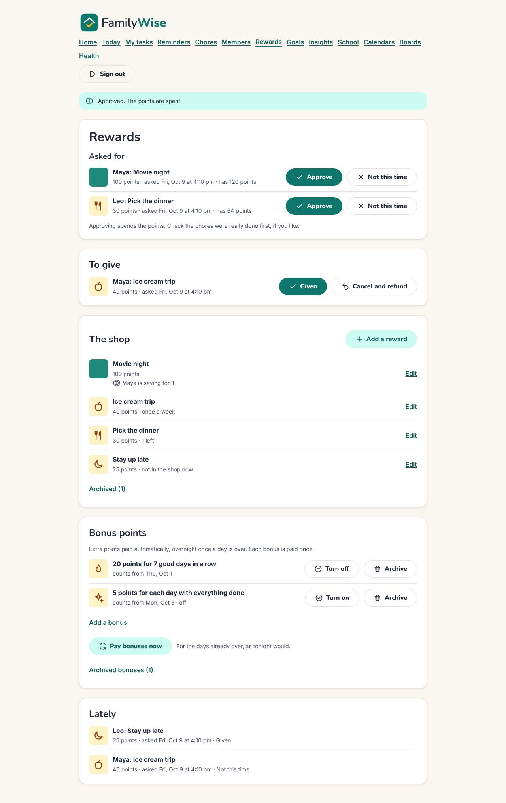

#### Bonus points

Bonuses pay extra points automatically, overnight once a day is over. On **Rewards**, under **Bonus points**, open **Add a bonus**:

- **A streak**: points once for each run of **Good days in a row** (2 to 365) that reaches the length. A run that goes on pays nothing more; a new run pays again.
- **A perfect day**: points for each day with everything on the list done.

Set the **Bonus points** (1 to 1,000) and **Counts from** (days before it never pay), then **Add bonus**. **Turn off** pauses a bonus; **Turn on** counts again from that day, so a pause never pays a backlog. **Archive** retires it; bonuses it paid stay. **Pay bonuses now** pays, for the days already over, what tonight would. A bonus once paid is never taken back.

#### Wishes: saving up

A child can pin one reward as their wish. On their screen, **Saving for** shows it with a meter, "42 more points to go." or "You have enough!", and **Ask for it** once they can.

- **Choose a wish** (or **Change**) opens **What is** (name) **saving for?**: tap a reward, or **No wish** to clear it.
- If the reward leaves the shop, the wish isn't shown until it comes back or the child chooses again.

On **Rewards**, a reward someone is saving for says so ("Maya is saving for it").

### A7 Goals and celebrations
<!-- covers: US-401 US-402 US-403 US-404 US-405 US-406 US-407 -->

**What this is.** Something to work toward, for one child or the whole family, with rules that check-offs fill in. **When.** Whenever you want a target: a movie night after 20 things done, a trip after a week of good days. **How.** On **Goals**, choose **Set a goal**.

#### Set a goal

1. Enter a **Name** and, optionally, a **Description**.
2. Choose **Who it's for**: someone who earns rewards, or **The whole family** (which counts what everyone does).
3. Set when it **Starts** and, optionally, when it **Ends**.
4. Set the **Rule**: what it **Counts** and its **Target**:
   - **Things done**: items done within the goal's dates.
   - **Days with everything done**: days when every routine was done.
   - **Good days in a row**: a streak, with **Misses forgiven a week** (0 to 3, 1 by default).
   - **Points earned**: points from items done.
5. Choose **What counts**: **Everything**, **Some tags** or **Some items**.
6. Optionally, **Add a rule** (up to 5), and choose whether **It's reached when** **Every rule is met** or **Any one rule is met**.
7. Pick an **Icon**, or add a **Photo**, then choose **Set goal**.

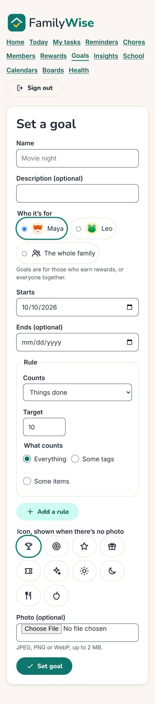

#### Follow a goal

**Goals** lists the goals in play, each with a meter per rule and its state: **Starts later**, **Going**, **Achieved** (or **Achieved again**). Progress follows the check-offs: if one is undone, the goal follows it, and an achieved goal can go back to going. Progress is worked out again within about five minutes of any change, and every time you open **Goals**.

On the board, goals show as meters on the home screen's **Goals** card and on a child's own screen; the family's goals also sit under **Chores**. A nudge names a goal that is nearly there: one thing or one day to go, a few points to go, or "Almost there with" the goal at 90%.

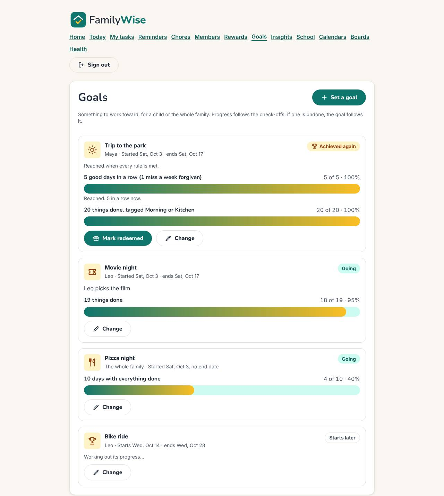

#### When a goal is reached

The board celebrates it full-screen, once, on whichever board shows it first: "Leo reached Bike ride! Well done! A grown-up will sort out the reward." Tap **Yay!** to close it (it closes by itself after 10 seconds). With reduced motion turned on, nothing moves; the words are the same.

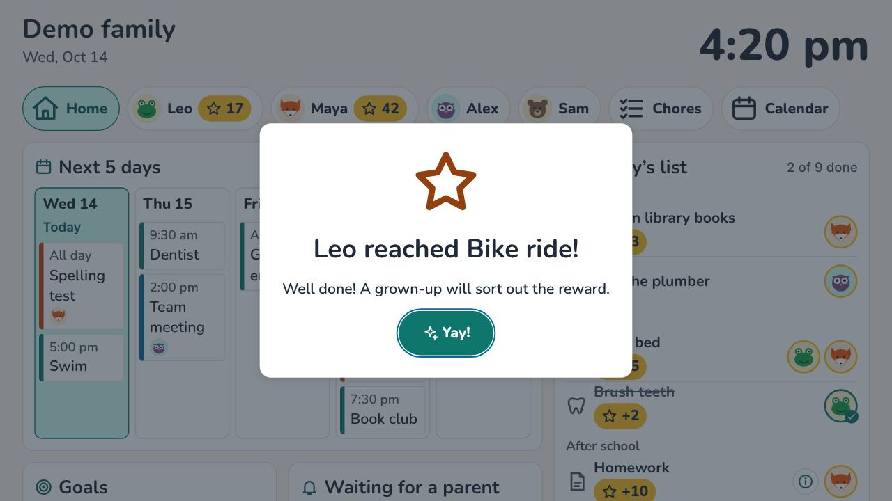

Then, on **Goals**, give the reward in real life and choose **Mark redeemed**. The goal moves to **History**.

A child's own check-offs celebrate too, in a small way: when a check-off earns points, the check pops and the points count up. A check-off by someone who doesn't earn rewards doesn't celebrate.

#### Change or cancel a goal

Choose **Change** to open a goal. Before it starts, everything can change. Once it has started, who it's for and its start date stay as they are; changing its rules or end date works its progress out again from every check-off. Once it is redeemed, ended or cancelled, its rules and dates stay as they are.

The goal's page lists **What happened** to it, with when and who. **Cancel** (the goal's name) stops it counting and moves it to **History**. Goals are never deleted.

A goal marked **Needs a look** was redeemed and then a check-off it needed was undone. Have a look, then choose **Clear**.

### A8 Streaks and insights
<!-- covers: US-408 -->

**What this is.** How a child's days go over time: runs of good days on the board, and the full picture for parents on **Insights**. **When.** The flame is always on the board; open **Insights** when you want to see patterns.

**A good day** is a day when every routine that counts was done. Skipped routines, and shared ones someone else did, don't count either way. Tasks never make a day good or bad. A day with nothing that counted, or one still waiting for a parent, neither adds to a run nor breaks it. Today counts as soon as it's good, and is never a bad day while it's still going.

**The flame.** A child's run of good days shows as a flame and a number beside their name. It grows bigger at 3, 7, 14 and 30 days, and glows once when it reaches one of them while the board is open.

**Insights.** Choose a member and **Last 7 days**, **Last 30 days** or **Last 90 days**. It covers the days up to yesterday ("Today is added once it closes"):

| Section | Shows |
|---|---|
| **Streaks** | **Good run now**, **Best good run** and **Longest bad streak**, over all their history. |
| **Done** | The share of routines that counted that were done. |
| **Day by day** | A calendar of the days: **Good day**, **Bad day**, **Waiting for a parent**, **Nothing that counted**. |
| **Missed most** | The routines missed most often. |
| **By tag** | How much was done, tag by tag. |
| **Checking** | Their **Check-offs**, how many were **Unchecked by a parent** or **Sent back**, and the **Time to check**. |
| **History** | **Rebuild from history** reads every check-off again. It is kept up to date each hour, so you rarely need it. |

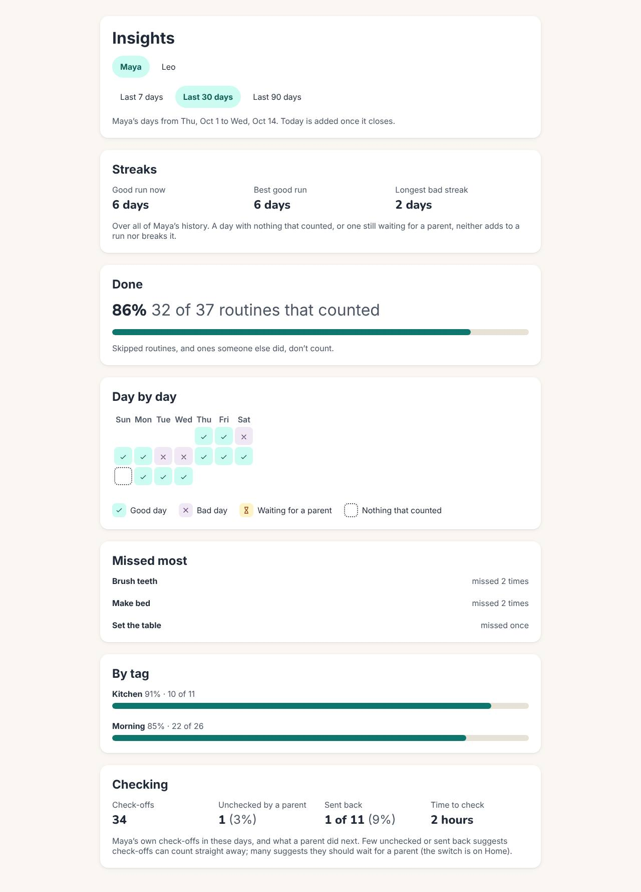

### A9 Calendars
<!-- covers: US-501 US-502 US-503 US-504 US-505 US-507 -->

**What this is.** The family's Apple calendars on the board, read only. Events still live in Apple Calendar: add and change them there. **When.** Once per calendar. **How.** On **Calendars**, add each one by its public link.

#### Connect a calendar

1. In Apple Calendar, open the calendar's settings, turn on **Public Calendar** and copy the link (it starts with `webcal://`).
2. In FamilyWise, go to **Calendars**. Under **Add a calendar**, enter a **Name** and paste the **Public link**.
3. Pick a **Color**, and choose **Whose calendar** it is (or leave **The whole family**). The board shows that person's avatar on its events.
4. Keep **Show on the boards** ticked, and choose **Add calendar**.

FamilyWise syncs it straight away and says "Added Family and synced it.", then lists what's coming up. If the link doesn't work, it says what went wrong and what to do. The link is kept privately and never shown again; to change it, open **Edit** and fill in **Replace the link (optional)**.

")

#### Keep calendars healthy

Each calendar shows how its sync went: **Synced** (with when), **Not synced yet**, or **Can't sync** with the reason and the last good sync. Calendars sync every 15 minutes, so a new event in Apple Calendar shows within 15 minutes. A calendar that can't sync keeps its last good events on the board, and **Health** names it too.

**Remove** (the calendar's name) takes its events off FamilyWise and the boards. The calendar itself stays in Apple Calendar.

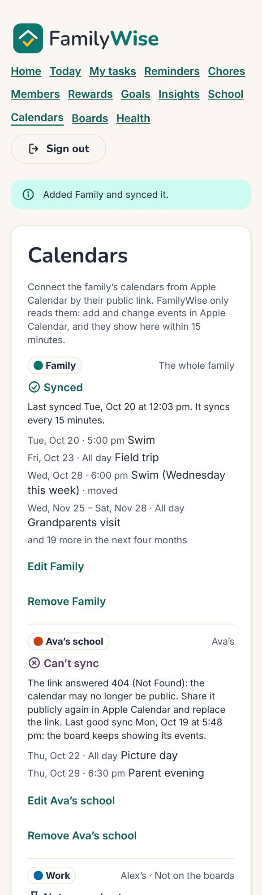

#### The calendar on the board

On the board, **Calendar** opens the **Week**; **Day** and **Month** are a tap away. Move with the arrows, by swiping sideways, or back to **Today**. Each event is in its calendar's color, with the avatar of whose calendar it is. A month's day shows three events and "+N more"; tap it to see the day. Tapping a day on the home screen's calendar opens that day here.

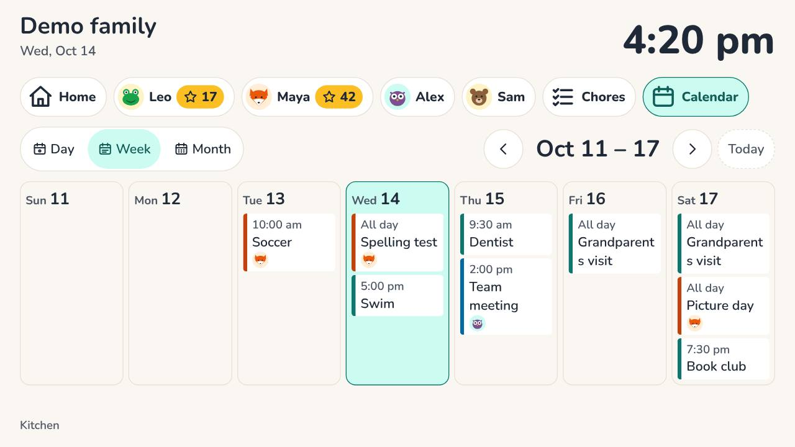

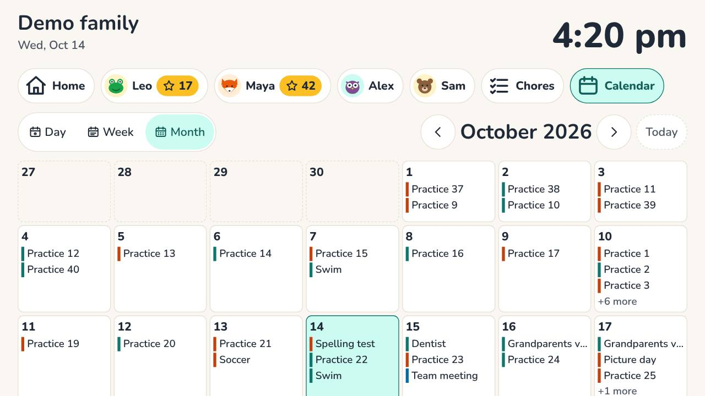

#### Choose the calendars for each board

By default, every board shows the calendars with **Show on the boards** ticked. To choose for one board, go to **Boards**, open **Calendars on** (the board's name), tick the ones it should show, and choose **Save calendars**. From then on that board shows exactly those: a calendar you connect later stays off it until you tick it there. Other boards are not affected. The board changes within seconds.

### A10 School year and day types
<!-- covers: US-601 US-602 -->

**What this is.** Your school calendar, so chores can follow school days, breaks, weekends and summer. **When.** At the start of each school year. **How.** On **School**, add the year, then its breaks and days off.

Every date is one **day type** for each person:

| Day type | When |
|---|---|
| **Weekend** | Every Saturday and Sunday. |
| **Break** | A weekday inside a break you added. |
| **Day off school** | A weekday inside any other day off (holiday, teacher day, snow day, other). |
| **School day** | Any other weekday inside the school year. |
| **Summer** | A weekday outside every school year. |

An item's **On these days** (under **More options**) says which day types it happens on; all are ticked to start. Untick to make, for example, homework happen on **School days** only.

1. On **School**, under **Add a school year**, enter a **Name** (like "2026–27"), optionally the **School**, the **First day** and **Last day**. Keep **Default** ticked, and choose **Add school year**.
2. Choose **Open** on the year. Under **Breaks and days off**, add each one: a **Name**, its **Kind**, **From** and optionally **To**, then **Add day off**. A break makes its weekdays "Break"; any other kind makes them "Day off school".
3. Optionally, add **Terms** for reference.

The top of **School** shows what kind of day today is for each person. A year's page shows a timeline of its days.

> **Note:** Until you add a school year, every weekday counts as summer, so items set to school days only don't appear.

**Next year's calendar.** Add it whenever it is published, as a **Default** too. Default years can't overlap, so next year simply starts on its first day; nobody switches anything.

**A child at another school.** Add that school's year without **Default**, open it, tick the child under **Who follows it** and choose **Save who follows it**. Everyone else follows the default.

Changes to the school year start tomorrow: today stays as it was planned. Days already past never change.

### A11 The board's home screen layout
<!-- covers: US-1004 -->

**What this is.** What the home screen's calendar shows, and which cards appear under it, in which order. **When.** Whenever the board's home screen should fit your routine better. **How.** On **Boards**.

**Home screen for every board.** Under **Home screen** on **Boards**:

1. Choose what **The calendar shows**: **3 days**, **5 days** (the default), **7 days** or **Month**. In the month, a colored dot marks each calendar with something on a day.
2. Under **Under the calendar, in this order**, tick the cards to show: **Dinner and lunch** (it stays hidden until meal planning arrives, see [Coming soon](#b7-coming-soon)), **Goals**, **Waiting for a parent** and **Coming up**.
3. Move a card with **Up** or **Down**. Each move saves at once.
4. Choose **Save layout**.

The boards change within seconds.

**A board's own layout.** A board can have its own layout instead, for example a month on the kitchen board and three days in the hall. On **Boards**, open **Home screen on** (the board's name), tick **Give** (the board) **its own layout** and choose **Save**. It starts as a copy of the household's; then change it in the form that appears. Untick and **Save** to follow the household's layout again.

> **Note:** Saving with **Give … its own layout** ticked always starts the board's own layout again from a copy of the household's. To change a board's own layout, use the form under it and **Save layout**.

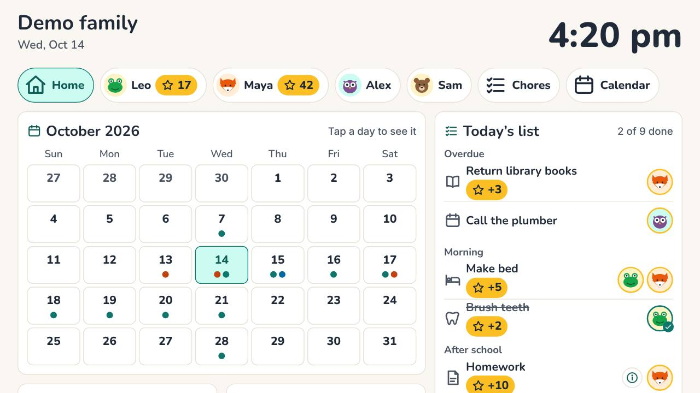

### A12 Day and Evening themes
<!-- covers: US-910 -->

**What this is.** Two looks: **Day** (light) and **Evening** (dark, easier on the eyes at night). **When.** Automatic. **How.**

- **The board** follows the household's clock: Day from 6:30 am, Evening from 7:00 pm. To hold a board on one, go to **Boards**, choose **Always Day** or **Always Evening** for it, and choose **Set theme**. **Automatic, by time of day** goes back to the clock. The board switches at once.
- **The admin app** follows your phone's or computer's dark mode: Evening when dark mode is on.

Both looks use the same colors for the same things, never color alone: every state also has an icon and a word.

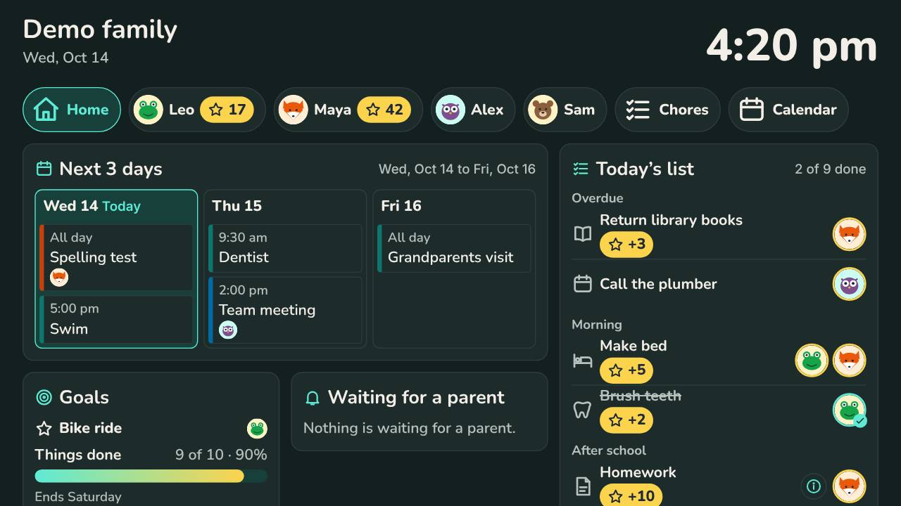

## Part B — User Manual

### B1 The admin app, page by page

The admin app is for parents, on a phone or a laptop. The menu at the top has every page; **Sign out** signs this browser out.

| Menu | Page | For |
|---|---|---|
| **Home** | The household | Approval switch, admins, invites |
| **Today** | A parent's day | Approve, mark done, skip, uncheck, Not actually done |
| **My tasks** | Your own list | Your items, quick add, reminder bells |
| **Reminders** | Your reminders | Devices and when to remind you |
| **Chores** | The family list | Chores, tasks and tags |
| **Members** | The family | People, sign-ins, points |
| **Rewards** | The shop | Rewards, requests, bonuses |
| **Goals** | Goals | Goals in play and history |
| **Insights** | Patterns | Streaks and checking, per member |
| **School** | School years | Day types, breaks, who follows which year |
| **Calendars** | Calendars | Connecting Apple calendars |
| **Boards** | Boards | Pairing, themes, calendars and layout per board |
| **Health** | System health | Background jobs, errors, usage |

#### B1.1 Home
<!-- covers: US-310 US-103 -->

| Part | What it shows or does |
|---|---|
| Household | Its name, timezone, the day the week starts, and who you are signed in as. |
| **Check-offs** | **When a child checks something off**: **It counts straight away; a parent can uncheck it later** or **It waits for a parent to approve it**. **Save** applies it to what's still to do. |
| **Admins** | Everyone who can manage the household, as **Owner** or **Admin**. |
| **Invite an admin** | **Their email**, **Create invite link**, then **Copy link** or **Share**. **Waiting to join** lists open invites with when they expire, and **Cancel invite**. |

#### B1.2 Today
<!-- covers: US-306 US-307 US-309 -->

| Part | What it shows or does |
|---|---|
| **Waiting for you** | Check-offs that need a parent, from any day: **Approve** or **Send back**. Shown only when something waits. |
| The day | The day's name and date, **Day before**, **Today**, **Day after**. Items by **Overdue**, **Morning**, **After school**, **Evening**, **Anytime**, each with who it is for, its status, and its buttons. |
| Buttons per item | **Mark done** (or **Mark done…** with **Who did** it), **Skip**, **Put back**, **Uncheck**, **Approve**, **Send back**. See [Mark done, skip, uncheck](#mark-done-skip-uncheck). |
| **Not actually done** | Unchecks every ticked done item together, then offers **Undo** in the banner. |

Messages: "Marked Make bed done.", "Unchecked … Its points are taken back.", "Skipped … It won't count for or against anyone.", "… is back on the list.", "Approved …", "Sent … back. It shows as open to try again." If something changed meanwhile: "That item changed: it was taken off the list."

#### B1.3 My tasks
<!-- covers: US-316 US-318 -->

| Part | What it shows or does |
|---|---|
| Reminders line | "Your reminders are on" or "off", with a link to **Reminders**. |
| **Add a task for today** | Type a name, **Add**: a task for you today, no points, visible to the family. |
| **Overdue**, **Today**, **Coming up** | Your items: open tasks from before today, today's items, the next seven days. |
| Per item | **Mark done** (credits only you), **Uncheck**, and **Bell on** / **Bell off** on items still to do. |
| **Which one is you?** | Shown instead when your sign-in isn't linked to a member: choose **I'm** (name). |

#### B1.4 Reminders
<!-- covers: US-317 US-319 -->

| Part | What it shows or does |
|---|---|
| State | "On. Reminders come to the devices below.", "On, but no device is switched on: nothing comes yet." or "Off. Nothing is sent to you." |
| Buttons | **Turn on reminders** (first time, on this device), **Add this device**, **Turn reminders back on**, **Turn off reminders**. |
| **My devices** | Each phone or computer: on or off, when added, when last reached. **Send a test**, **Switch off** / **Switch on**, **Remove**. |
| **When to remind me** | The settings in [A3](#a3-reminders-on-your-phone), then **Save**. |

If a device can no longer get notifications, it is removed and the page says so: turn reminders on there again.

#### B1.5 Chores
<!-- covers: US-301 US-312 US-315 -->

| Part | What it shows or does |
|---|---|
| **Add a chore** / **Add a task** | Opens the form for a new item. |
| Filters | **Person**, **Tag**, **Kind**, **Time of day**, **Show** (**Active** / **Archived**), **Filter**, **Clear**. |
| The list | Chores first, then tasks, by due time. Each line: icon, name, a **Private** badge if private, kind, schedule, due time, points, **Next:** when, "Overdue since" for an open task, the people (", each their own" when everyone does their own) and tags. **Edit** opens it. |
| **Tags** | The tags page: add, edit, archive, restore. |

**The item form** (also on an item's page):

| Field | Choices and limits |
|---|---|
| **What it is** | **Chore** (a routine; missed if not done on its day) or **Task** (a to-do; stays open and overdue until done). |
| **Name** | Up to 80 characters. |
| **Who it's for** | Anyone in the family; at least one. |
| **With several people** | **Everyone does their own** or **Any one of them**. Asked only with two or more people. |
| **How often** | **Every day**, **Some days** (weekdays ticked to start), **Monthly** (**Day of the month** 1 to 31), **Once** (**Date**, or **Due date** for a task; today to start). |
| **Due time (optional)** | Sets the part of the day. Never changes points. |
| **Reminders** | **As each person chose**, or **At the due time**, **15 minutes before**, **1 hour before**, **1 day before**. |
| **Icon** | The chore icons; **More icons** for the rest. |
| **Points** | 0 to 1,000. 5 for a new chore, 0 for a new task. |
| **Tags** | Any active tags. |
| **Private** | Only for the item's creator. Off the board; seen only by its creator and the people it's for who sign in. |
| **More options**: **Approval** | **Family setting** (shows whether approval is on or off), **Always needs a parent's OK**, **Never needs a parent's OK**. |
| **More options**: **On these days** | **School days**, **Days off school**, **School breaks**, **Weekends**, **Summer**. At least one; all to start. |
| Buttons | **Save**, **Save and add another**, **Cancel**; **Save changes** when editing. |

**An item's page** also shows **Coming up** (the next two weeks, with who), **Last 7 days** (each day's result and who did it), and **Archive** / **Restore**.

**Tags page:** **Name** (up to 30), **Color**, **Icon (optional)**, **Add tag**; **Our tags** with how many items use each (a link to them); **Edit**, **Save tag**, **Archive**; **Archived** with **Restore**.

#### B1.6 Members
<!-- covers: US-104 US-1106 US-1109 -->

| Part | What it shows or does |
|---|---|
| **Members** | Everyone still here: avatar, name, **Child** or **Adult**, "Earns rewards" with their points or "No rewards", and "Signs in as" for a linked adult. **Edit** opens them. **Add a member** adds one. |
| **Archived** | Members archived, with **Restore**. |

**A member's page:**

| Part | What it shows or does |
|---|---|
| The form | **Name** (up to 40), **Who they are**, **Avatar**, **Color**, **Birth year (optional)**, **Earns rewards**, and for an adult **Their sign-in** (**Not linked**, or an admin's email). **Save changes**. |
| **Is this you?** | **This is me**: links your own sign-in to this adult. Shown when your sign-in isn't on anyone still here. |
| **Points** | The balance, **Change points** (**Add** / **Take away**, **Points**, **Why**), and the history: day, what it was for (and who, for a change by hand), amount. |
| **Archive** | **Archive** (name): off the board, chores and goals stop showing, history kept. |

A member who doesn't earn rewards can't be given points; what they earned before stays.

#### B1.7 Rewards
<!-- covers: US-1103 US-1105 US-1107 US-1108 -->

| Part | What it shows or does |
|---|---|
| **Asked for** | Waiting requests: child, reward, cost, when, the child's points. **Approve** (spends the points) or **Not this time**. |
| **To give** | Approved rewards: **Given** or **Cancel and refund**. |
| **The shop** | Rewards with cost, how many are left, the weekly limit, "not in the shop now", and who is saving for it. **Add a reward**, **Edit**, **Archived**. |
| **Bonus points** | Each bonus with when it counts from; **Turn off** / **Turn on**, **Archive**; **Add a bonus**; **Pay bonuses now**; **Archived bonuses**. |
| **Lately** | The last ten settled requests: given, not this time, or cancelled. |

**The reward form:** **Name** (up to 80), **Cost in points** (1 to 100,000), **Description (optional)** (up to 300), **Icon, shown when there's no photo**, **Photo (optional)** (JPEG, PNG or WebP, up to 2 MB), **How many there are (optional)** (blank for as many as are asked for), **Times each child may ask in a week (optional)** (1 to 100), **In the shop now**. **Add reward** or **Save changes**. A reward's page also has **Remove photo** and **Archive** / **Put back**.

#### B1.8 Goals
<!-- covers: US-401 US-405 US-406 -->

| Part | What it shows or does |
|---|---|
| **Set a goal** | Opens the goal form. |
| Goals in play | Each goal: picture, name, who and dates, state (**Starts later**, **Going**, **Achieved**, **Achieved again**), a meter per rule, **Mark redeemed** when achieved, **Change**. "Working out its progress…" before its first evaluation. |
| **History** | Goals **Redeemed** (when and by whom), **Ended**, or **Cancelled**; **Needs a look** if flagged; **Details**. |

**The goal form:** **Name** (up to 80), **Description (optional)** (up to 300), **Who it's for**, **Starts**, **Ends (optional)**, one to five rules (**Counts**, **Target** 1 to 100,000, **Misses forgiven a week** for a streak, **What counts**), **Add a rule**, **It's reached when**, an icon, **Photo (optional)**. **Set goal** or **Save changes**.

**A goal's page:** who, state and "% there"; **Clear** for a **Needs a look** flag; **Remove photo**; the form (locked as the goal progresses, see [A7](#change-or-cancel-a-goal)); **What happened** (set up, started, rules or dates changed, progress worked out again with the old and new %, achieved, back to going, redeemed, ended, cancelled); **Cancel**.

#### B1.9 Insights
<!-- covers: US-408 -->

One member at a time, children first; **Last 7 days**, **Last 30 days** (default) or **Last 90 days**, up to yesterday. Sections: **Streaks**, **Done**, **Day by day**, **Missed most**, **By tag**, **Checking**, **History** with **Rebuild from history**. See [A8](#a8-streaks-and-insights).

#### B1.10 School
<!-- covers: US-601 US-602 -->

| Part | What it shows or does |
|---|---|
| Today | Each person's day type today, and which school year they follow. |
| **School years** | Each year: name, **Default** badge, dates, school; **Open**. |
| **Add a school year** | **Name**, **School (optional)**, **First day**, **Last day**, **Default**, **Add school year**. |
| **Archived** | Archived years, with **Open**. |

**A school year's page:** a timeline of its days; **Breaks and days off** (each with **Remove**; **Name**, **Kind**: **Break**, **Holiday**, **Teacher day**, **Snow day**, **Other day off**; **From**, **To (optional)**, **Add day off**); **Terms** (**Add term**, **Remove**); **Who follows it** (**Save who follows it**); **Dates and name** (**Save changes**); **Archive** / **Restore**. Archiving stops it applying (anyone following it goes back to the default); its days off stay as a record.

#### B1.11 Calendars
<!-- covers: US-501 US-504 US-505 -->

| Part | What it shows or does |
|---|---|
| Each calendar | Its color and name, whose it is ("The whole family" or a person's), "Not on the boards" if hidden, its sync (**Synced**, **Can't sync**, **Not synced yet**) with details, and what's coming up ("· moved" for a moved event; "and N more in the next four months"). |
| **Edit** (name) | **Name**, **Replace the link (optional)**, **Color**, **Whose calendar (optional)**, **Show on the boards**, **Save calendar**. A new link syncs at once. |
| **Remove** (name) | Takes its events off FamilyWise and the boards. It stays in Apple Calendar; you can add it again. |
| **Add a calendar** | **Name** (up to 40), **Public link**, **Color**, **Whose calendar (optional)**, **Show on the boards**, **Add calendar** ("Adding and syncing…"). |

#### B1.12 Boards
<!-- covers: US-201 US-202 US-507 US-1004 -->

| Part | What it shows or does |
|---|---|
| Each board | Name and "Last seen" (or "Not seen yet"). |
| **Rename** | A new name (up to 60 characters). |
| Theme and **Set theme** | **Automatic, by time of day**, **Always Day** or **Always Evening**. |
| **Disconnect** (name) | Disconnects the board for good, at once, with no second question. It reads nothing more and can't sign in again; pair it again for a new start. |
| **Calendars on** (name) | Which calendars it shows; **Save calendars** makes it choose its own. |
| **Home screen on** (name) | "its own layout" or "the household's layout"; **Give** (name) **its own layout**, **Save**; then its own layout form. |
| **Home screen** | The household's layout: **The calendar shows**, **Under the calendar, in this order** with **Up** / **Down**, **Save layout**. |
| **Add a board** | **Board name**, **Get a pairing code**: 8 digits, once, for 10 minutes. |
| **Disconnected** | Boards disconnected, with when. |

#### B1.13 Health
<!-- covers: US-904 US-909 -->

**System health** says whether everything behind the scenes is working: "Everything is running normally.", or which background jobs need attention, which calendars can't sync, and whether usage is near a free-plan limit.

| Part | What it shows |
|---|---|
| **Background jobs** | Each job (**Day close**, **Occurrence gen**, **Calendar sync**, **Reminders**, **Progress reconcile**, **Status check**, **Heartbeat**, **Purge history**) with when it last worked and its state: **Running fine**, **Running now**, **Late**, **Failing** or **Not run yet**. |
| **Server errors** | Your household's server errors in the last 30 days, newest first. |
| **Usage** | Use against the free plans' monthly limits, with FamilyWise's own share. Vercel's figures are read once a day. |

The jobs that matter most to the family: **Occurrence gen** plans the next two weeks, **Day close** closes each day, **Calendar sync** reads calendars, **Reminders** sends reminders, **Progress reconcile** works out goals.

#### B1.14 Sign-in, setup and invite pages
<!-- covers: US-102 US-101 -->

| Page | Controls |
|---|---|
| **Sign in** | **With your password** (**Email**, **Password**, **Sign in**, **Forgot your password?**); **With a link by email** (**Email**, **Email me a link**). A wrong password says only that the email and password don't match an account. |
| Reset password | **Email**, **Email me a reset link**, **Back to sign in**; then **New password**, **Save password**. |
| **Set up your household** | **Setup code**, (**Your email**, **Choose a password**), **Household name**, **Timezone**, **Week starts on**, **Create household**. |
| Invite | **Join** (household): **Join household**, or **Create account and join**, or **Sign out** to switch account. |

### B2 The board, screen by screen

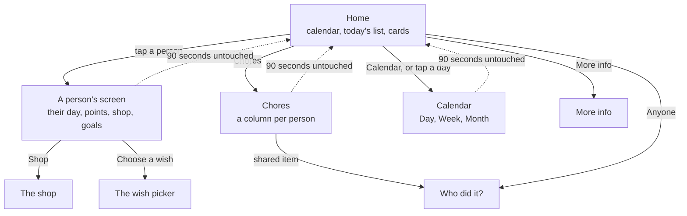
```mermaid
flowchart TD
  H[Home<br/>calendar, today's list, cards]
  P[A person's screen<br/>their day, points, shop, goals]
  C[Chores<br/>a column per person]
  K[Calendar<br/>Day, Week, Month]
  H -- tap a person --> P
  H -- Chores --> C
  H -- Calendar, or tap a day --> K
  P -- Shop --> S[The shop]
  P -- Choose a wish --> W[The wish picker]
  C -- shared item --> Q[Who did it?]
  H -- Anyone --> Q
  H -- More info --> M[More info]
  P -. 90 seconds untouched .-> H
  C -. 90 seconds untouched .-> H
  K -. 90 seconds untouched .-> H
```

#### B2.1 The top bar
<!-- covers: US-1002 US-204 -->

| Part | What it shows or does |
|---|---|
| Household name and date | Always shown. |
| Clock | In the household's timezone. |
| Connection | **Live** (changes arrive within seconds), **Connecting…**, or **Reconnecting…** (the board reads everything again when it reconnects). |
| Health lines | **Offline: your check-offs are saved**; **Updated N minutes ago**; **Today's list may be out of date**. |
| **Home** | The family dashboard. |
| A button per person | Children first, then adults, each by name. Someone who earns rewards has their points on their button. Opens their screen. |
| **Chores** | Everyone's day, a column each. |
| **Calendar** | The family's calendar. |

The board's name is at the bottom of every screen.

#### B2.2 Home
<!-- covers: US-1001 US-1006 -->

| Part | What it shows or does |
|---|---|
| Calendar | "Next 5 days" (or 3 or 7) from today with the dates, a column per day with its events (time or "All day", the event, whose avatar). Or the month ("Tap a day to see it") with a dot per calendar on each day with events, up to four. Tapping a day opens it in **Calendar**. |
| **Today's list** | "N of M done", then **Overdue**, **Morning**, **After school**, **Evening**, **Anytime**. A row per item: icon, name, points, **More info** when needed, and faces. |
| Faces | Tap an open face: done for that person. Tap a done face twice (within 4 seconds, inside the undo window): undone. **Anyone**: asks who. |
| **Goals** card | Every goal in play, whose (an avatar or **Family**), a meter per rule, when it ends; "Reached! A grown-up will sort out the reward." |
| **Waiting for a parent** card | "Asked for" rewards with their cost, and check-offs to approve ("Homework: check it's done"). Parents decide them in the admin app. |
| **Coming up** card | Up to five all-day events in the next three weeks, with "Tomorrow" or "In N days". |
| **Dinner and lunch** card | Not shown yet: it appears once meals can be planned. |

#### B2.3 A person's screen
<!-- covers: US-1002 US-1102 US-1108 US-403 -->

| Part | What it shows or does |
|---|---|
| Header | Avatar, name, "N of M done" (or "Nothing on the list today"), a goal nudge, the flame, and points counting up after a check-off. |
| Tiles | Their items by part of the day. Tap: done for this person. **Undo**, then **Tap again to undo**, for 2 minutes. **More info** when needed. "All done today. Nice work!" when finished. |
| **Points** | **Shop** (when the shop has rewards); "N to spend · M waiting for a grown-up" when something is asked for; the five latest points ("Make bed", "Feed the dog, undone", a parent's reason for points added, "A parent changed your points"); or "Points arrive as chores get done." |
| **Asked for** | Each request: "Waiting for a grown-up" (with **Call off**), "Yes! It's coming", "Not this time", "You got it!" or "Called off". Settled ones stay two days. |
| **Saving for** | The wish with a **Saved** meter, "N more points to go." or "You have enough!", **Ask for it**, **Choose a wish** or **Change**. |
| **Goals** | Their goals, then the family's: a meter per rule, "All of these:" or "Any one of these:", "Ends Saturday". |
| **Today** | Today's events from their calendars and the family's. |

Points, the shop, wishes, goals and the flame appear only for someone who earns rewards. On anyone's screen, a tap credits that person.

#### B2.4 Chores
<!-- covers: US-1006 US-311 -->

A column per person: avatar, name, flame and points (for those who earn rewards), a nudge for their own goals, and their tiles by part of the day ("Nothing today" if none). **Family goals** sit below. A tap credits the column's person for their own item or a one-person item; a shared item with several people asks **Who did** it.

#### B2.5 Calendar
<!-- covers: US-503 US-504 US-507 US-505 -->

| Part | What it shows or does |
|---|---|
| **Day** / **Week** / **Month** | The view. It opens on **Week** (or on a day tapped on Home). |
| Arrows | Previous and next day, week or month. A sideways swipe does the same. |
| **Today** | Back to today. Greyed out when today is showing. |
| Events | In their calendar's color, with the time ("All day", or "Until" a time for an event that started the day before) and whose avatar. |
| Month | Three events a day and "+N more"; tap a day to open it. Weeks start on the household's week start. |
| Notes | "(Calendar) hasn't updated since …. Showing its last good events." when a calendar can't sync or hasn't for 45 minutes; "Showing what this board has for these dates." offline, beyond the weeks the board keeps; "No calendars on this board yet. A parent adds them on Calendars in the admin portal." |

#### B2.6 The shop and the board's windows
<!-- covers: US-1104 US-1108 US-404 -->

| Window | What it shows or does |
|---|---|
| The shop ((name)'s shop) | What they have **to spend**; each reward with its picture, cost and how many are left; **Ask for this** then **Yes, ask** or **Not now**; or why not ("N more points to go", "All gone for now", "Asked for this week. Try next week!", "Asking needs the internet"). **Close**. |
| **Who did** (item)? | The item's people first, then everyone; tap to tick one or several; **Done** or **Cancel**. |
| More info | The item's description, **When**, **Points**, **Who** with each person's state; **Close**. |
| **What is** (name) **saving for?** | The shop's rewards; tap one; **No wish**; **Cancel**. |
| Celebration | "(Name) reached (goal)!" or "The family reached (goal)!", "Well done! A grown-up will sort out the reward.", **Yay!**. Closes after 10 seconds. |

Short messages appear under the top bar for 6 seconds: "Asked for Movie night. A grown-up will say yes or not this time.", "Called off … Those points are free again.", "Too late to undo here. Ask a parent.", "That one changed. A parent took it off today.", "Ask a parent for that one.", "That didn't save. Try again."

#### B2.7 Pairing and other screens
<!-- covers: US-201 US-202 -->

| Screen | What it shows or does |
|---|---|
| **Pair this board** | **Pairing code from the admin app**, a keypad (**Clear**, **0**, **Back**), **Pair this board** (once all 8 digits are in). |
| Disconnected | "This board was disconnected. Ask an admin for a new code to pair it again." |
| **Can't reach FamilyWise** | "Trying again in 30 seconds." It reloads by itself. |

Pairing messages: "Enter all 8 digits from the admin app.", "That code didn't match. Codes work once, for 10 minutes. …", "Too many codes were tried. Wait 10 minutes, then try again."

#### B2.8 How items look
<!-- covers: US-910 US-313 US-314 -->

Every state is an icon, a word and a color together, in both themes. The board uses short, positive words; the admin app uses plain ones.

| Board says | Admin says | Means |
|---|---|---|
| **To do** | Open | Not done yet. |
| **Done!** | Done | Checked off. |
| **Waiting for a parent** | Needs review | Checked off; a parent approves it. |
| **Approved** | Approved | A parent approved it, or marked it done. |
| **Try again** | Sent back | A parent sent it back. |
| **Skipped today** | Skipped | A parent skipped it; it counts neither way. |
| **Missed** | Missed | A routine not done by the end of its day (history only). |
| **Overdue** | Overdue | A task still open after its date. |
| **Past its time** | Past its time | Still open today, after its due time. |
| **Covered** · by (name) | Covered | A shared item someone else did. |
| **Done!** · by (name) | Done by (name) | Done by someone else for a shared item, or by several people. |

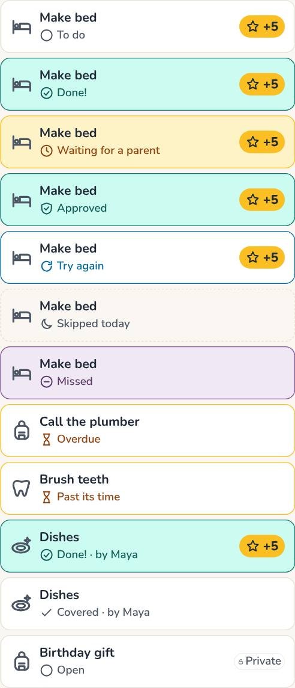

### B3 Rules and limits
<!-- covers: US-907 US-1101 US-320 US-311 US-315 US-1109 -->

#### Timing on the board

| Rule | Value |
|---|---|
| Undo on the board | Within **2 minutes** of the check-off (the household's undo window), judged by when the tap happened. Then only a parent can change it. |
| Second tap to undo | Within **4 seconds**. |
| Double taps | A second tap on the same tile within half a second is ignored; a check-off sent twice counts once. |
| Back to Home | After **90 seconds** untouched, on any screen. |
| A tap's answer | At once; the board shows it before the server answers. |
| Changes from the admin app | Within about **3 seconds** while connected. |
| "Updated … ago" | When the board's information is over **5 minutes** old. A board reads everything again every 4 minutes. |
| "Last seen" on **Boards** | The board reports in every 5 minutes while open. |
| Sending saved check-offs | Retried after 1, 2, 5 and 10 seconds, then every 30 seconds, and at once when the network returns. |
| Goal celebration | Once per achievement, on one board; up to 10 seconds. |
| A new day | At the household's midnight, the board reads the new day by itself. |

#### Approval

| Setting | A child's check-off | Points |
|---|---|---|
| Approval off (default) | **Done!** at once | Earned at once; a parent can uncheck later. |
| Approval on | **Waiting for a parent** | Earned when approved; none if sent back. |
| Item: **Always needs a parent's OK** | Waits, whatever the family setting. | When approved. |
| Item: **Never needs a parent's OK** | Done at once, whatever the family setting. | At once. |
| Anyone who doesn't earn rewards | Done at once, always. | None. |

Switching approval changes only what is still to do. Check-offs already waiting stay waiting; done ones stay done.

#### Everyone does their own, or any one of them

| | **Everyone does their own** | **Any one of them** |
|---|---|---|
| Items a day | One per person. | One, shared. |
| Who checks it off | Each person their own. | Whoever does it, or several together. |
| Points | Each person's own. | Each person who did it and earns rewards. |
| For the others | Their own is still to do. | **Covered**: neither done nor missed. |
| If nobody does it | Missed for each person who didn't. | Missed for everyone on it. |
| Day types | Each person's own day type decides whether it's due for them. | It's due if the day type allows it for any one of its people. |
| Default | New chores. | New tasks. |

Changing between the two takes effect today unless someone already checked off today's item; past days keep what they were.

#### Visibility

| | Family-visible (default) | **Private** |
|---|---|---|
| On the board | Yes | Never |
| Both parents see it | Yes | Only its creator, and the people it's for who sign in |
| Who can change who sees it | Only its creator | Only its creator |
| Points on the board | Shown with the item's name | Counted, shown as "A chore" |
| Reminders | Item's name | "Private task" or "Private chore" if you hide private names |

#### Points

| Entry | When | On the board |
|---|---|---|
| Earned | An item is done or approved, for each person credited who earns rewards. | The item's name |
| Taken back | It is undone, unchecked or not actually done. | "(item), undone" |
| Bonus | A bonus rule pays, overnight or with **Pay bonuses now**. | The bonus |
| Spent | A parent approves a request. | The reward |
| Back | A parent cancels an approved request. | The reward |
| Changed by a parent | **Add points** or **Take away points**. | The reason if added; "A parent changed your points" if taken away |

Nothing in the points history is edited or deleted; every check-off, undo and parent decision is kept, so a day's result can always be worked out again. A balance below zero shows as "to earn back".

#### Day close and missed

At the household's midnight, each day closes (within the hour):

| Item | Still to do or sent back at midnight |
|---|---|
| Chore (routine) | Becomes **Missed**. |
| Task (to-do) | Stays open, shown as **Overdue** on the following days, until done. |

A parent can still mark a missed chore done later (late credit). Waiting check-offs stay waiting.

#### Planning ahead

- Each item is planned for today and the next 14 days. A change applies from today; past days never change.
- A change to an item reaches today's item unless someone already acted on it. An item archived in the morning leaves today, so it is never missed.
- School-year changes start tomorrow.
- A one-off task entered after its date is open on that date and shows as overdue.

#### Limits

| Thing | Limit |
|---|---|
| Names | Member 40 · item 80 · reward 80 · goal 80 · tag 30 · board 60 · calendar 40 characters |
| Item points | 0 to 1,000 |
| Points by hand | 1 to 10,000, with a reason of up to 200 characters |
| Reward cost | 1 to 100,000 points; weekly limit 1 to 100 |
| Bonus | 1 to 1,000 points; a streak of 2 to 365 days |
| Goal | 1 to 5 rules; target 1 to 100,000; 0 to 3 misses forgiven a week |
| Photos | JPEG, PNG or WebP, up to 2 MB |
| Password | At least 8 characters |
| Setup code · invite link · pairing code | Once, for 24 hours · once, for 7 days · once, for 10 minutes |
| Wrong pairing codes | 20 in 10 minutes pauses pairing for 10 minutes |
| Calendar | Synced every 15 minutes, from a week back to four months ahead; up to 5 MB and 5,000 events |
| Board, offline | Keeps today, its saved check-offs, and the calendar from yesterday to three weeks ahead |
| Reminders | Checked every 5 minutes; at most once each; never more than two hours late |
| Layout | Calendar of 3, 5 or 7 days, or the month; four cards, each shown or not, in any order |

### B4 Troubleshooting
<!-- covers: US-206 US-505 US-904 -->

| What you see | What it means | What to do |
|---|---|---|
| Board: **Offline: your check-offs are saved** | The board has no network, or can't reach FamilyWise. Check-offs are kept. | Check the wifi. Nothing is lost: it sends them when it's back. |
| Board: points with a dashed ring | Points counting check-offs not yet saved. | Wait for the connection; the server's figure replaces it. |
| Board: **Updated 12 minutes ago** | It couldn't read the latest for a while. | Check the wifi. If it stays, reload the board's page. |
| Board: **Reconnecting…** | The live connection dropped. | Usually fixes itself; it reads everything again when back. |
| Board: **Today's list may be out of date** | Planning or day closing is late or failing. | Open **Health** in the admin app. |
| Board: **Can't reach FamilyWise** | The page couldn't load. | It tries again every 30 seconds. Check the wifi. |
| Board: **Pair this board** with "This board was disconnected" | Someone disconnected it on **Boards**. | Get a new code on **Boards**, **Add a board**, and pair it again. |
| Board: a chore isn't there | It isn't due today for that person, it's private, its person is archived, or it doesn't happen on today's day type. | Check the item on **Chores** (**Coming up**, **How often**, **On these days**) and **School**. |
| Board: a child's tap shows **Waiting for a parent** | Approval is on, or the item always needs a parent. | Approve it on **Today**. |
| Board: "Too late to undo here. Ask a parent." | The 2-minute undo window has passed. | Uncheck it on **Today**. |
| Board: a calendar note "hasn't updated since" | That calendar can't sync. | Open **Calendars**: its line says why and what to do. |
| Calendars: **Can't sync**, "may no longer be public" | The link stopped working. | In Apple Calendar, share it publicly again; **Edit** and **Replace the link**. |
| Calendars: "didn't return a calendar" | The link isn't a public calendar link. | Copy the public link (it starts with `webcal://`). |
| Calendars: "took more than 15 seconds" | The calendar's server was slow. | Nothing: it tries again in 15 minutes. |
| An event isn't on the board yet | Calendars sync every 15 minutes. | Wait up to 15 minutes. Check **Show on the boards** and the board's **Calendars on**. |
| Reminders: none arrive | Reminders are off, no device is switched on, the bell is off, quiet hours hold them, or the item is done or not yours. | On **Reminders**: check the state, **Send a test**. In **My tasks**: check the item's bell. |
| Reminders: "On an iPhone or iPad, add FamilyWise to your Home Screen first" | iPhone notifications need the Home Screen app. | **Share**, **Add to Home Screen**, open it from there, then **Turn on reminders**. |
| Reminders: "Notifications are blocked" | The browser was told not to allow them. | Allow notifications for FamilyWise in the browser's or phone's settings. |
| Reminders: "Reminders aren't set up on this site yet." | Sending isn't switched on for this installation. | Ask whoever runs FamilyWise for you. |
| **My tasks** or **Reminders**: **Which one is you?** | Your sign-in isn't linked to a member. | Choose **I'm** (your name). See [Link your own sign-in](#link-your-own-sign-in). |
| Sign in: a link by email never arrives | FamilyWise has no email service of its own yet. | Use your password. |
| Points didn't arrive | The person doesn't earn rewards, the check-off waits for a parent, or it was undone. | Check **Members** (**Earns rewards**) and **Today**. |
| Health: a job **Late** or **Failing** | A background job is behind. | It usually recovers by itself; if it stays, tell whoever runs FamilyWise. |

### B5 Questions and answers

**Can my child undo something after two minutes?** Not on the board. A parent can uncheck it on **Today**.

**Can I give credit for yesterday?** Yes. On **Today**, choose **Day before** and **Mark done**. It counts as done by a parent, with its points, and streaks and goals catch up.

**What happens to a chore nobody did?** At midnight a chore becomes missed. A task stays open as overdue until it's done.

**Why do weekdays count as summer?** No school year covers them. Add one on **School**.

**Can both parents manage everything?** Yes. Invite the other parent on **Home**. Only an item's creator can make it private, or family-visible again.

**Does the board show private items?** Never.

**Why does the board say "A parent changed your points"?** That's how points taken away by hand show, so the board never tells a child off. The reason is on the child's page in the admin app.

**Can a child spend points they don't have?** No. A request is accepted only if their points, less what they've already asked for, cover the cost.

**Can I add or edit events on the board?** No. Calendars are read only: change events in Apple Calendar.

**We have two boards. Do they differ?** Each board can have its own calendars, its own home screen layout and its own theme. A reached goal is celebrated on one board only.

**A goal was reached. Where's the reward?** You give it in real life, then choose **Mark redeemed** on **Goals**. Goals don't pay out points or rewards by themselves yet.

**Does an adult earn points?** Only with **Earns rewards** switched on, for example for a family challenge.

**Why is there no description in More info?** The admin app can't add descriptions to items yet, so **More info** mostly appears for names too long for a tile.

**How do I replace or move a board?** Pair the new screen on **Boards**, then **Disconnect** the old one.

**What if the internet is down all day?** The board keeps working with what it has and sends the day's check-offs when it's back.

### B6 Glossary

| Word | Meaning |
|---|---|
| **Admin** | A parent who manages FamilyWise in the admin app. The first is the **Owner**. |
| **Admin app** | FamilyWise on a parent's phone or laptop. |
| **Board** | A screen paired to the household, usually the wall touchscreen. |
| **Member** | Anyone in the family, child or adult. |
| **Earns rewards** | A member who collects points, goes through approval, and has goals and streaks. |
| **Chore** | A routine. Missed if not done on its day. |
| **Task** | A to-do. Stays open, and overdue, until done. |
| **Item** | A chore or a task. |
| **Due time** | An optional time that places an item in the day and marks it past its time. |
| **Part of the day** | Morning (before noon), After school (noon to 5 pm), Evening (from 5 pm), Anytime (no due time). |
| **Everyone does their own** | Each person on an item has their own to do. |
| **Any one of them** | One shared item, done by whoever gets to it. |
| **Covered** | A shared item someone else did: neither done nor missed. |
| **Private** | An item only its creator and its people who sign in can see. Never on the board. |
| **Tag** | A household label for items, like Kitchen. |
| **Approval** | Check-offs that wait for a parent before they count. |
| **Late credit** | A parent marking a past day's item done. |
| **Skip** | A day left out for an item: it counts neither way. |
| **Undo window** | The 2 minutes in which the board can undo its own check-off. |
| **Day close** | Midnight, when unfinished chores become missed. |
| **Day type** | School day, day off school, break, weekend or summer. |
| **School year** | Dates, breaks and days off; the **default** one is followed by everyone not assigned another. |
| **Points** | Earned for items done; spent in the shop. |
| **To spend** | Points less what's already asked for. |
| **To earn back** | A balance below zero. |
| **Reward** | Something in the shop, with a cost. |
| **Request** | A child asking for a reward; a parent decides. |
| **Wish** | The reward a child is saving for. |
| **Bonus** | Extra points for a streak or a perfect day. |
| **Goal** | Something to work toward, with rules. |
| **Rule** | What a goal counts and its target. |
| **Good day** | A day with every routine that counted done. |
| **Streak**, **run** | Good days in a row. Shown as a flame. |
| **Nudge** | A line on the board when a goal is nearly reached. |
| **Layout** | The board's home screen: the calendar's span and the cards. |
| **Card** | A panel under the home screen's calendar. |
| **Theme** | Day or Evening. |
| **Pairing code** | 8 digits that connect a new board. |
| **Demo family** | Made-up people used in previews and in this guide's pictures. |

### B7 Coming soon

These are planned but not built yet. This guide will cover each as it arrives.

- **Meals:** a weekly meal plan, lunch bought or brought, the school lunch menu, and the **Dinner and lunch** card on the board.
- **Weather** on the board.
- **Goal payouts:** a goal that pays points or a reward by itself, and a preview before changing a goal's rules.
- **Audit log:** a page showing who changed what, and when.
- **Export and delete** your household's data.
- **Sign in with Apple** and passkeys.
- **Private calendars** through a separate read-only Apple account (CalDAV), and importing days off from a school calendar.
- **The kiosk:** the board locked full-screen on its own device, quiet hours overnight and burn-in protection.
- **Goal meters offline** that move with check-offs not yet saved.

### B8 Stories this guide covers

Every user story linked to a work package that is Done (`05`) is covered by at least one section above, through the hidden `covers` line under its heading, or is listed here with a reason. `pnpm trace` checks this.

**Stories with no user-facing surface yet**

<!-- guide-exclusions -->
| Story | Why the guide leaves it out |
|---|---|
| US-105 | Changes are recorded in an audit trail, but there is no page to read it yet; the viewer comes with WP-32 (see [Coming soon](#b7-coming-soon)). |
| US-901 | Data isolation and secret storage happen in the database and the server; there is nothing for the family to see or do. |
| US-908 | Automated tests are for the people building FamilyWise. |
| US-911 | The delivery pipeline (checks, previews and the owner's approval before anything ships) is how FamilyWise is built and released, not part of using it. |
<!-- /guide-exclusions -->
